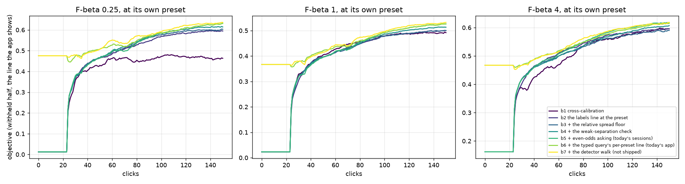
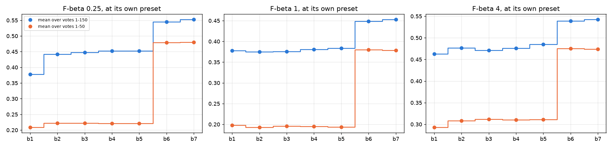

# What did each step of the F-beta era buy, in the score the user sets? (issue #4668)

**Two steps carry the F-beta era. Of the other four, three add a little and one adds nothing at the precision-minded
preset.** Each step is scored by **its mean objective over the session**, votes 1–150: the area under the curve,
divided by the votes. The owner (2026-10-09): "If you have to use one number to measure 'improvement' (instead of using
the whole curve) I'd use area under FBeta." Most users stop well before vote 150, so a single vote is never the
headline. The bench is COCO Better with the user's pool at 1%, 720 paired runs per rung, each preset on its own
sessions and scored at its own beta. Session means at beta 1/4 / 1 / 4:

- **The typed query's line at the preset (#4603) is the biggest step: +0.092 / +0.065 / +0.054.** It is almost all
  in the short session: +0.26 / +0.19 / +0.16 over votes 1–50. Before a detector shows, the user's set scores
  0.48 / 0.37 / 0.47 instead of 0.01 / 0.02 / 0.16.
- **The labels line at the preset (#4452) carries the precision-minded user: +0.064 / −0.003 / +0.014.** At beta 1
  it is a small, resolvable loss over the session.
- **The weak check (#4496): +0.005 at every preset.** Its gain is late, +0.008 over votes 51–150.
- **Even-odds asking (#3546): +0.000 / +0.003 / +0.009.** Nothing at beta 1/4.
- **The relative floor (#4492): +0.005 / +0.001 / −0.005.** Its priced gain at votes 5–10 was on detectors the app
  does not show (#4605). In the short session it is −0.000 / +0.003 / +0.003.
- **The detector walk (#4637, not shipped): +0.008 / +0.004 / +0.003.**

Over the session, cross-calibration averages 0.38 / 0.38 / 0.46 and today's app 0.54 / 0.45 / 0.54. The deck's slide
("Up and Up") draws the two big steps at beta 1/4, and its notes name the rest.

## The question

The owner (2026-10-08) asked for the slide that shows how the work improved the app, redrawn in F-beta curves on COCO
Better, with the takeaway "the score they care about improved over and over". Cherry-picking a beta or a prevalence was
allowed. "If this slide isn't easy to draw, I want to know why. (It might mean that steps which we thought improved
the app actually didn't?)" And: "If we have steps that we thought were better than the state before them, I want you
to tell me now."

## Why the deck's own ladder cannot be drawn

The deck's Calibration section is a sequence of line rules, each presented as a repair of the one before. Each step
is scored against the one before it by the F-beta session mean, votes 1–150, paired over 720 runs. The numbers are
#4582's re-score of #4184's cells at 0.44% (`tables/paired.csv`, window `clicks 1-150`). #4519's 1% run has the same
shape: −0.32 / −0.30 / −0.20 at the first step.

| step (slide) | Δ F-beta 1/4 / 1 / 4 over the session | verdict |
|---|---|---|
| mixture midpoint (Oops! All Haystack, Great Expectations), against cross-calibration | **−0.36 / −0.36 / −0.28** | bad |
| blend (Cross Examination) | +0.010 / +0.014 / +0.036 | better than the midpoint, still 0.25–0.35 under cross-calibration |
| fused cut, raw mean (Above Average, Vote of Confidence) | +0.039 / +0.055 / +0.11 | better than the blend, still 0.14–0.31 under cross-calibration |
| rank transfer (No Mean Feat) | **−0.052 / −0.075 / −0.16** | bad: the raw-mean strawman beats it |
| 70/30 split (Train More, Check Less) | +0.001 / +0.002 / +0.005; ≤ 0.006 under the labels line (#4583) | null |
| Second Cut, line − 4, under the labels line, against asking at the line (#3546) | **−0.000 / −0.004 / −0.009** | slightly worse than asking at the line |

Every one of those rules estimated the line that minimises FPR + FNR, and at low prevalence that line returns 25 times
too much. None of them is on today's path. The labels line (#4452) reads the folds' held-out scores and its own fits of
the corpus. So the deck's ladder falls off a cliff at its first step and recovers only at the labels line. #4679 moved
those slides past the end of the deck.

Other ideas that measured bad or null in F-beta: the Smart light as a stop signal (#4359, #3560), the Binary opening
hand-off (#4604, −0.055 / −0.044 / −0.054 over votes 1–50 after #4603), half-argmax acquisition (#4409, reverted),
and band picks mixed into Autopilot (#4482). Two have never been priced in F-beta: the Coverage Atlas walk and the
dry-stop opening (#4671).

## What ran: the F-beta era as a cumulative build-up

The owner picked a build-up of what the app does today, at all three presets. Each rung adds one shipped change to
the rung before it, so two adjacent rungs differ in exactly that change.

| rung | adds | knobs, against today's app |
|---|---|---|
| b1 | cross-calibration on today's folds, asking at its own line, no check | `CALIB_BETA=off CALIB_LIVE_THRESHOLD=xcal_mincost CALIB_ACQ_INCLUSION_OFFSET=0 CALIB_SPOT_CHECK=off`; one set of sessions, scored at each beta |
| b2 | the labels line at the preset (#4452), with its absolute spread floor; asking at line − 4, as the app did 10-02 to 10-07; no check | `CALIB_BETA=<b> CALIB_SIGMA_FLOOR=absolute CALIB_ACQ_TARGET_P=off CALIB_SPOT_CHECK=off` |
| b3 | + the relative spread floor (#4492) | drop `SIGMA_FLOOR` |
| b4 | + the weak-separation check (#4496) | drop `SPOT_CHECK` |
| b5 | + even-odds asking (#3546, #4632): today's sessions | drop `ACQ_TARGET_P` |
| b6 | + the typed query's line at the preset (#4136, #4603): **today's app** | b5's sessions, scored before the hand-over at today's line |
| b7 | + the More walk on the detector's top (#4637), **priced, not shipped** | `CALIB_MORE_WALK=detector`, scored with the typed query on screen until Hard |

- **Bench:** `coco_better`, binary SigLIP, 144 class@band cells × 5 seeds, 150 votes. The user's pool is thinned to 1%
  positive (`CALIB_HAYSTACK_PREVALENCE=0.01`); the withheld half Find searches stays at 0.44%.
- **Code:** one frozen commit for every rung (`vts-buildup-4668-run` @ 2624dbad1), launched by
  `scripts/experiments/calibration/launch_buildup_4668.sh`. The new knob `CALIB_SIGMA_FLOOR=absolute`
  (`live_threshold_rules.sigma_floor`) restores the floor before #4492.
- **Reproduction check:** b1 at the old 50/50 split reproduces #4519's `r1_xcal` cell vote for vote (all 147 steps).
  `CALIB_BETA=off` is therefore the path `CALIB_MIN_PRECISION=off` took before #4421 removed it.
- **Score:** the objective, F-beta at the run's own preset of the withheld half above the line the app shows (#4427).
  Until a run shows a detector it scores the typed query's set: at the mixture midpoint for b1–b5 (the display line
  until #4590) and at today's per-preset line for b6–b7 (#4603). Both come from `text_baseline.py` rebuilt at 1%, which
  also settles #4625. A step is the paired mean over runs, by (category, seed), of the difference in each run's
  session mean.
- **Analysis:** `scripts/experiments/calibration/analyze_buildup_4668.py`.

## Result

*Each line is the mean of 720 runs at that preset's own beta. Read a step as the gap between a line and the one
before it. b2–b5 lie within 0.04 of each other everywhere (widest at vote 150), so they overlap. b6 and b7 start at
today's typed-query line, and the rest start at the old midpoint.*

The objective's mean over the session (votes 1–150) and over a short session (votes 1–50), with the point at vote 150
last:

| rung | beta 1/4: 1–150 | 1–50 | @150 | beta 1: 1–150 | 1–50 | @150 | beta 4: 1–150 | 1–50 | @150 |
|---|---:|---:|---:|---:|---:|---:|---:|---:|---:|
| b1 cross-calibration | 0.38 | 0.21 | 0.46 | 0.38 | 0.20 | 0.49 | 0.46 | 0.29 | 0.60 |
| b2 + the labels line at the preset | 0.44 | 0.22 | 0.59 | 0.37 | 0.19 | 0.50 | 0.48 | 0.31 | 0.60 |
| b3 + the relative floor | 0.45 | 0.22 | 0.60 | 0.38 | 0.20 | 0.50 | 0.47 | 0.31 | 0.59 |
| b4 + the weak check | 0.45 | 0.22 | 0.61 | 0.38 | 0.19 | 0.51 | 0.48 | 0.31 | 0.61 |
| b5 + even-odds asking | 0.45 | 0.22 | 0.63 | 0.38 | 0.19 | 0.53 | 0.48 | 0.31 | 0.62 |
| **b6 + the typed query's line: today's app** | **0.54** | **0.48** | **0.63** | **0.45** | **0.38** | **0.53** | **0.54** | **0.48** | **0.61** |
| b7 + the detector walk (not shipped) | 0.55 | 0.48 | 0.64 | 0.45 | 0.38 | 0.53 | 0.54 | 0.47 | 0.62 |

**Each step against the one before**, paired by (category, seed). Bold means more than 2 SE from zero:

| step | beta 1/4: 1–150 | 1–50 | beta 1: 1–150 | 1–50 | beta 4: 1–150 | 1–50 |
|---|---|---|---|---|---|---|
| b1 → b2 the labels line | **+0.064** ± 0.003 | **+0.014** ± 0.001 | **−0.003** ± 0.001 | **−0.005** ± 0.001 | **+0.014** ± 0.002 | **+0.016** ± 0.001 |
| b2 → b3 the relative floor | **+0.005** ± 0.001 | −0.000 ± 0.001 | +0.001 ± 0.001 | **+0.003** ± 0.001 | **−0.005** ± 0.001 | **+0.003** ± 0.001 |
| b3 → b4 the weak check | **+0.005** ± 0.001 | **−0.001** ± 0.000 | **+0.005** ± 0.001 | **−0.001** ± 0.000 | **+0.005** ± 0.001 | **−0.001** ± 0.000 |
| b4 → b5 even-odds asking | −0.000 ± 0.001 | +0.000 ± 0.001 | **+0.003** ± 0.001 | −0.001 ± 0.001 | **+0.009** ± 0.001 | +0.001 ± 0.001 |
| b5 → b6 the typed query's line | **+0.092** ± 0.003 | **+0.258** ± 0.007 | **+0.065** ± 0.002 | **+0.186** ± 0.005 | **+0.054** ± 0.002 | **+0.164** ± 0.006 |
| b6 → b7 the detector walk | **+0.008** ± 0.002 | +0.001 ± 0.002 | **+0.004** ± 0.001 | −0.001 ± 0.001 | **+0.003** ± 0.001 | −0.001 ± 0.001 |

The full table, with the windows 1–25 and 51–150, the points at votes 10, 25, 50, 100 and 150, and the share of runs
better or worse by more than 0.05, is `paired.csv`.

*Blue: the mean over votes 1–150. Orange: the mean over votes 1–50. The orange jump at b6 is the typed query's line,
and the blue jump at b2 (beta 1/4) is the labels line. Everything else moves by less than 0.01.*

**What the user gets at vote 150** (the 685 runs per rung showing a detector by then; `returned.csv` also has votes 25
and 50, but over the runs showing a detector at that vote, a subset that differs by rung, so the curves above are the
early-vote read):

| | beta 1/4: precision / recall / returned, median / over 200 | beta 1 | beta 4 |
|---|---|---|---|
| b1 cross-calibration | 0.48 / 0.69 / 69 / 25% | 0.48 / 0.69 / 69 / 25% | 0.48 / 0.69 / 69 / 25% |
| b2 the labels line | 0.67 / 0.47 / 36 / 5% | 0.53 / 0.63 / 54 / 20% | 0.37 / 0.80 / 125 / 42% |
| b6 today's app | 0.76 / 0.40 / 24 / 0% | 0.59 / 0.58 / 48 / 7% | 0.37 / 0.75 / 126 / 37% |

Cross-calibration returns the same set whatever the user wants. Today's app returns a third as many at beta 1/4, at
precision 0.76, and nearly twice as many at beta 4, at recall 0.75. The weak check is what shrank the beta 1 tail
(over 200: 20% → 11%).

## Readings

- **The typed query's line is the largest single step of the F-beta era**, and almost all of it is in the first 50
  votes, which is where most sessions are. It also makes the hand-over visible: where today's app first shows a
  detector (from vote 23), that detector's set is briefly worse than the typed query's. At beta 1/4 the dip is
  0.48 → 0.45, deepest at vote 26 (37% of runs have handed over by vote 25), and gone by vote 31. At beta 1 and 4 it is
  0.01 deep and gone by vote 28. #4508 and #4604 own the hand-over.
- **The labels line is a beta 1/4 win.** Cross-calibration's line is long and recall-heavy, which already suits a beta 4
  user (+0.014 over the session). At beta 1 the labels line is a small loss over the session, −0.003 ± 0.001, though
  it ends +0.008 ahead at vote 150. This is Follow Suit's finding (#4548), now on today's harness.
- **The relative floor is not the win it was priced as.** #4492 measured +0.25 to +0.39 at votes 5–10, on detectors
  scored from the first vote. The app shows the typed query's set until Hard (#4605), so a user never sees those
  detectors. In what the user sees, the floor is +0.005 / +0.001 / −0.005 over the session. The beta 4 loss is small
  but resolvable. It is not owed a revert on this evidence, but its priced gain did not reach the user.
- **The weak check and even-odds asking are late and small.** The check is +0.005 over the session at every preset,
  all of it after vote 50. Even-odds asking is +0.000 / +0.003 / +0.009. Both look larger at vote 150 (+0.011 to
  +0.017), which is the trap of reading one point.
- **The detector walk (#4637, not shipped)** adds +0.008 / +0.004 / +0.003 over the session, all of it after vote 50,
  in line with #4637's own +0.011 / +0.008 / +0.004.

## The slide

`slides/fragments/up-and-up.md` ("Up and Up", Section VI, before Photo Finish). The figure is
`slides/figs/src/make-up-and-up-fig.py`, from this study's `buildup_curve.csv`. It shows one panel at beta 1/4, built
in three pages: cross-calibration (b1), then the labels line (b2), then today's app (b6). The owner picked it over a
staircase of every rung and over three rows of every rung: the floor, the check and even-odds asking each move the
curve's session mean by 0.005 or less, which no line on the slide can show.

## Ops

- **The cluster's MaxJobCount (10,000) counts every array task.** Sixteen whole 720-task arrays would have needed
  11,520 job records. The first twelve took 85% of the cluster's records, the last four were refused, and other
  users' arrays would have been too. The run was finished by a driver (`/expscratch/sgreenberg/buildup-4668/drive.sh`)
  that submits 48-task chunks per rung, at most 6 running per rung, and stays under ~800 records. Its log, `drive.log`,
  shows nothing retried and nothing given up. #4701 adds the preflight check.
- **Cells:** ~4.5–5 min and 1.5 GB each; 11,520 runs between 14:55 on 10-08 and 01:36 on 10-09.

## Files

- `buildup_curve.csv`: per preset, rung and vote, the objective's filled mean and SE, the share of runs showing a
  detector, and AP.
- `paired.csv`: each rung against the one before, and against b1, per preset: the session means over votes 1–25,
  1–50, 51–150 and 1–150, and the points.
- `returned.csv`: precision, recall and the returned set's size at votes 25, 50 and 150.
- `REPORT_buildup.md`: the analyzer's machine summary, including what each arm ran with, read back off its rows and
  its run logs.
- `provenance.json`: the files read per arm.
- `figures/`: the two figures above, and the mandatory AP-over-clicks figure (`average_precision_vs_clicks.png`).
- The interactive viewer (14 MB) and the per-run AP figure (4 MB) are too large to commit. They stay at
  `/expscratch/sgreenberg/buildup-4668/analysis/`, as do the cells.

Follow-ups: #4670 (the deck's claims, done in #4679), #4671 (the atlas walk and the dry-stop opening, never priced in
F-beta), #4701 (MaxJobCount preflight). Refs #4519, #4548, #4582, #4625.
