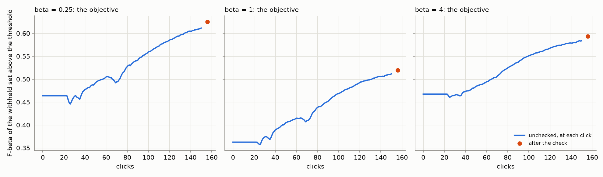
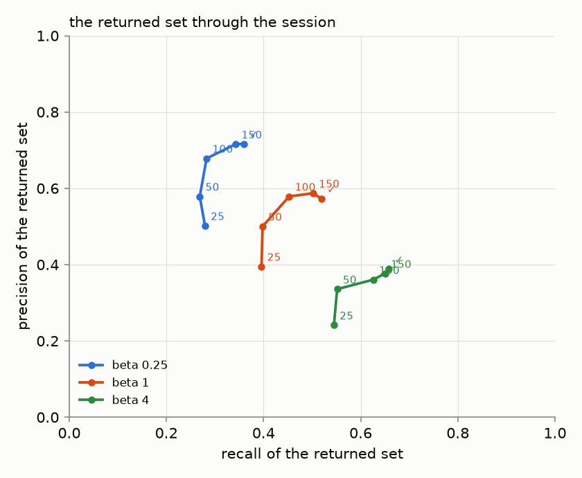
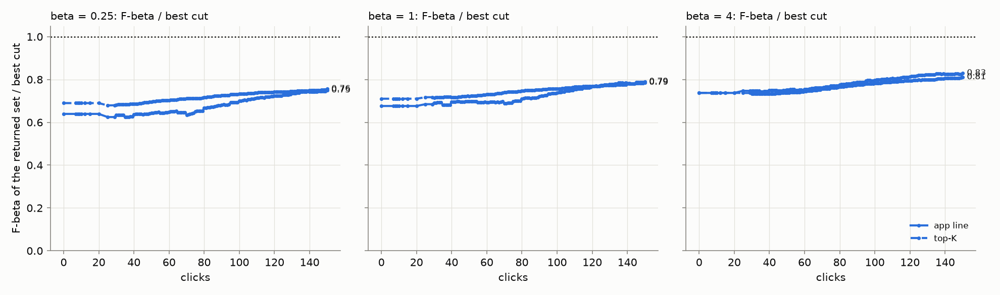
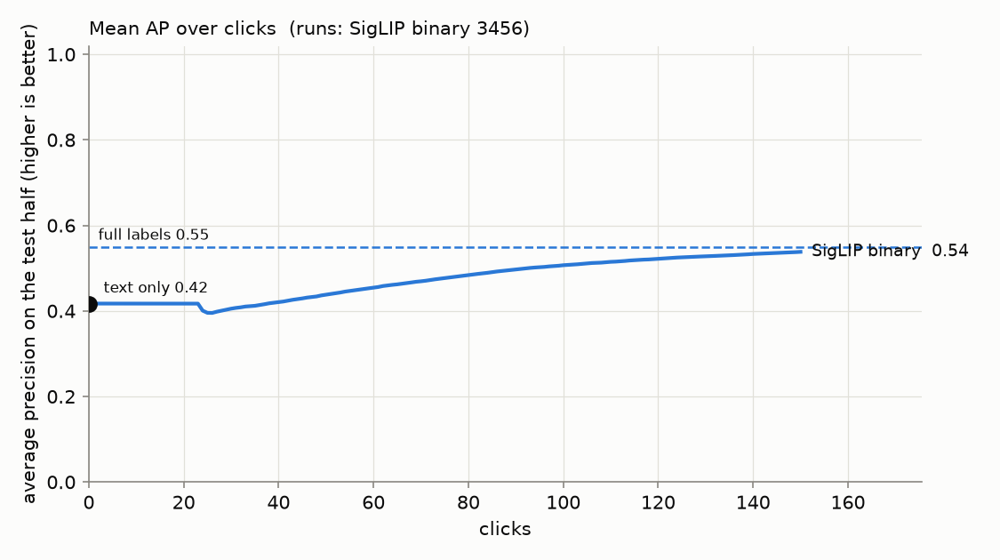
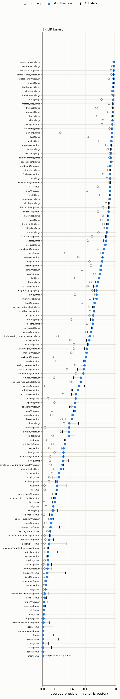
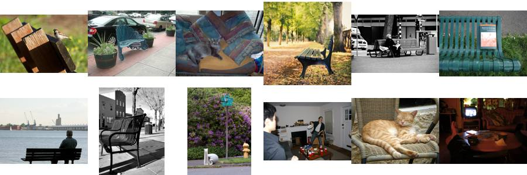
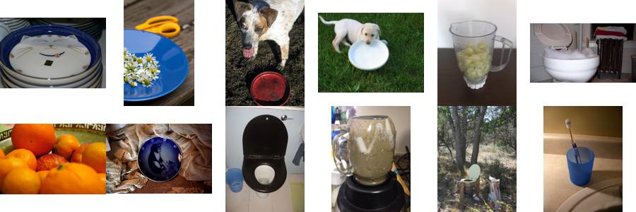
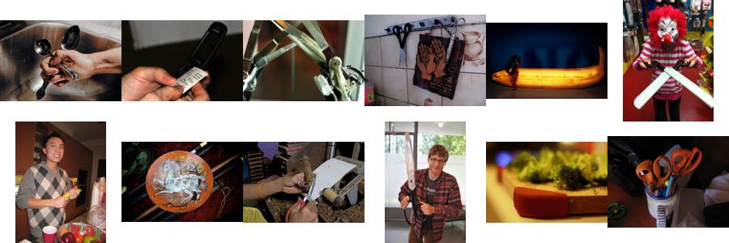
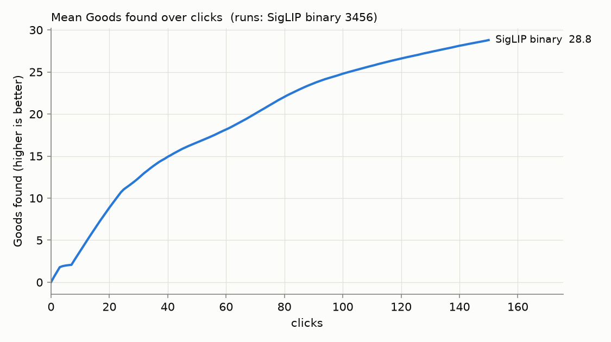

# State of the App: Binary Photo — 2026-10-08

**Issue:** #4651. **Recipe:** `.claude/skills/state-of-the-app/SKILL.md`.
**Interactive viewer:** [`viewer.html`](viewer.html), with all three session sets on one page and a chip per preset
(#4636), each averaged over all 24 seeds.
- **No per-seed lines.** The page leaves them out: 24 seeds × 3 sets came to 4.67 MB even at the coarsest per-seed
  grid, over the repo's 4,000 KB cap, and the average is the point.
- **The opening.** The viewer draws what the saved labels give, opening included (#4640). The report is the session:
  until the app shows a run's detector, it reads the typed query's set. The two therefore differ through the
  opening.
**App:** `dev` at 6e45530b6. Since the last Binary review (#4510, 19ed74aaa), the changes that move a session, or
what it shows, are:
- the typed query's line follows the preset (#4603);
- Hard and New sample at a target pick precision of 0.5 (#4632);
- the app shows the text sort through Autopilot's opening (#4605);
- below the label quota (3 Goods and 4 Bads), Test's detector is the Goods' centroid, not a head fitted to too few
  labels (#4643);
- with every label known, Find's line models the negatives with the Bads' own density (#4490's build, #4628).

#4652 (the More walk's arm for #4637) merged during the run. It is an experiment arm, off by default, and changes no
session.

**Path:** SigLIP whole-image embedding, binary (Good/Bad) votes, Autopilot's shipped opening.
**Bench:** `coco_better`, all 49 classes at every size they have: 144 cells.
**Seeds:** 24. **Sessions:** one set per preset (`SOTA_BETA=0.25|1|4`), 3,456 runs each and 10,368 in all. One
full-label ceiling pass at beta 1 is shared by the three.
**Runs:** `/expscratch/sgreenberg/state-of-the-app/2026-10-08-b025`, `-b1` and `-b4`, with the ceiling in
`-b1/ceiling`. Every cell ran from one frozen worktree at 6e45530b6, overnight from 22:52 to 06:55.
- **Seeds 0 to 17** ran on the cpu partition as arrays, at the per-user cap of 240 CPUs, a mean of 6.7 minutes a run.
- **Seeds 18 to 23** ran beside them, from 03:51, on four V100 nodes (`launch.sh pack`, 36 cells to a node, 16 for
  the ceiling). The GPU was hidden and BLAS pinned to the same kernel, so a cell computes what an array task does.

**Analysis:** `analyze.sh` per run, then `perp.py --kind balance` and `by_click.py`, all with #4653's fix (below).

A **review**, not an experiment: the app as it ships, the way a user meets it.
- **The session.** The user types a query and sees the text sort, then votes for 150 clicks while Autopilot picks
  what to show. When the labels separate weakly, Autopilot stops to run a spot check. At the end the user runs the
  check once more.
- **Presets.** Each preset is read off its own sessions.
- **The objective** (#4427) is the F-beta, at the preset's beta, of the withheld test half above the threshold the
  app holds. The test half is the 10,900 images Find would search, and the threshold is the labels line Find
  draws there.
- **The share of the best cut** separates the line from the ranking. **AP** measures the ranking alone.

**#4653, found by this review's first read (2 seeds, 00:05).**
- **The problem.** A session that never leaves Autopilot's opening still runs the end-of-session check. Since #4643
  the detector it checks is the Goods' centroid, cut at its midpoint, about half the corpus. The analyzer scored such
  a run at that detector after the check: 132 to 145 runs per preset returned 1,000 to 9,700 images.
- **The fix.** The app shows those sessions the typed query, so they now keep its set after the check, as #4631's
  rule says. The check's effect on them is 0.
- **Its effect** on the 299 runs per preset concerned:
  - the objective after the check moves by under 0.01;
  - the check's measured effect falls by 30 to 45% (+0.020/+0.013/+0.018 to +0.014/+0.008/+0.010);
  - runs returning more than 200 images after the check fall from 4/7/31% to 0/2/29%.
- No other column moves.

## Headline

**The objective, each preset off its own sessions.** Every run counts. A run that never trains, or never leaves the
opening, scores its typed query's set.

| preset | 25 clicks | 50 clicks | 150 clicks, unchecked | **after the check** | returned, median (unchecked / after) | returned > 200 (unchecked / after) |
|---:|---:|---:|---:|---:|---:|---:|
| 1/4 | 0.45 | 0.49 | 0.61 | **0.63** | 18 / 20 | 1% / 0% |
| 1 | 0.36 | 0.40 | 0.51 | **0.52** | 43 / 44 | 4% / 2% |
| 4 | 0.46 | 0.48 | 0.58 | **0.59** | 101 / 101 | 28% / 29% |

1. **The presets return what they promise.** After the check:
   - the 1/4 preset returns a median of 20 images at precision 0.72 and recall 0.36;
   - the balanced preset returns 44 at 0.57 and 0.52;
   - the recall preset returns 101 at 0.39 and 0.66.
2. **The early session is the typed query's set (#4605).** Until the Hard phase, the user has the typed query's own
   set at the line the preset draws (#4603): a median of 19, 49 and 205 images, at F-beta 0.46, 0.36 and 0.47.
   - **When the detector appears.** No session hands over before click 23. 29% have by click 25, 51% by 40, 60% by
     50 and 89% by 150. The other 11% never leave the opening ([below](#known-regimes-to-flag-not-to-fix)).
   - **What the hand-over costs.** At most 0.018, at 1/4 around click 26. The three presets are back above the typed
     query by clicks 31, 27 and 37.
3. **The Hard phase harvests, and the ranking nearly reaches full labels.** Sessions find 29 Goods in 150 clicks: 11
   by click 25, 17 by 50 and 25 by 100. The final AP is 0.54 against a full-label ceiling of 0.55, so 150 clicks
   close 92% of the gap from the typed query. One run in eighteen finds every positive in its half before click
   150 ([below](#known-regimes-to-flag-not-to-fix)).
4. **The end-of-session check adds little.** It adds +0.014 ± 0.001, +0.008 ± 0.001 and +0.010 ± 0.001 per session,
   for about 20 votes (30 at beta 4). Mid-session, Autopilot runs it in 62 to 63% of sessions
   ([below](#the-spot-check)).
5. **With every label known, Find's line no longer goes too deep (#4490).** The ceiling's own line scores
   0.62/0.52/0.65, against the 150-click session's 0.61/0.51/0.58. At beta 1 it returns a mean of 104 images at
   precision 0.50. The last review's ceiling line returned 297 at 0.37.

### The returned set through the session

Per preset, the returned set's precision against its recall from the typed query through 25, 50, 100 and 150
clicks to after the check (#4519). The values are means over every run; the returned size is a median.

| preset | point | precision | recall | F-beta | returned, median |
|---:|---|---:|---:|---:|---:|
| 1/4 | typed query | 0.52 | 0.25 | 0.46 | 19 |
| 1/4 | 25 | 0.50 | 0.28 | 0.45 | 19 |
| 1/4 | 50 | 0.58 | 0.27 | 0.49 | 16 |
| 1/4 | 100 | 0.68 | 0.28 | 0.56 | 15 |
| 1/4 | 150 | 0.72 | 0.34 | 0.61 | 18 |
| 1/4 | after the check | 0.72 | 0.36 | 0.63 | 20 |
| 1 | typed query | 0.36 | 0.44 | 0.36 | 49 |
| 1 | 25 | 0.39 | 0.40 | 0.36 | 43 |
| 1 | 50 | 0.50 | 0.40 | 0.40 | 37 |
| 1 | 100 | 0.58 | 0.45 | 0.47 | 39 |
| 1 | 150 | 0.59 | 0.50 | 0.51 | 43 |
| 1 | after the check | 0.57 | 0.52 | 0.52 | 44 |
| 4 | typed query | 0.16 | 0.58 | 0.47 | 205 |
| 4 | 25 | 0.24 | 0.54 | 0.46 | 178 |
| 4 | 50 | 0.34 | 0.55 | 0.48 | 104 |
| 4 | 100 | 0.36 | 0.63 | 0.55 | 98 |
| 4 | 150 | 0.38 | 0.65 | 0.58 | 101 |
| 4 | after the check | 0.39 | 0.66 | 0.59 | 101 |

**Until click 100 the clicks mostly buy precision; after it, recall.**
- From the typed query to click 100, precision rises 0.16, 0.22 and 0.20 at the three presets, while recall rises
  0.03, 0.02 and 0.04.
- From click 100 to 150 the objective still climbs, by +0.052, +0.043 and +0.033, now mostly through recall.
- The check buys recall (+0.016, +0.017 and +0.008) more than precision.

### The returned set, one rule per row

Two rules, and only rows under the same rule compare:
- **"App line"** is what each sort's own line returns: the text sort's line at the preset (#4603), the detector's
  labels line, and for the full-label ceiling, Find's labels line from every training label (#4486, #4490).
- **"Top-K"** is set-constant at the old cap on every sort: 32 at beta ≤ 1 and 128 at beta 4.

The values are F-beta at the preset. The detector columns are the last click before the check.

| preset | rule | text sort | 25 clicks | 50 clicks | 150 clicks | full labels |
|---:|---|---:|---:|---:|---:|---:|
| 1/4 | app line | 0.46 | 0.45 | 0.49 | **0.61** | 0.62 |
| 1/4 | top 32 | 0.47 | 0.46 | 0.50 | **0.60** | 0.61 |
| 1 | app line | 0.36 | 0.36 | 0.41 | **0.51** | 0.52 |
| 1 | top 32 | 0.38 | 0.37 | 0.40 | **0.48** | 0.49 |
| 4 | app line | 0.47 | 0.46 | 0.48 | **0.58** | 0.65 |
| 4 | top 128 | 0.48 | 0.47 | 0.48 | **0.57** | 0.62 |

At 150 clicks and for full labels, the app's own lines match or beat top-K at every preset. On the typed query, the app's line
sits 0.01 to 0.02 under top-K.

### The ranking

The ranking barely depends on the preset (the beta-1 sessions):

| | text only | 25 clicks | 50 clicks | 150 clicks | full labels |
|---|---:|---:|---:|---:|---:|
| **AP** | 0.42 | 0.40 | 0.44 | **0.54** | 0.55 |
| **Goods found** | — | 11 | 17 | **29** | — |

AP still dips as sessions leave the opening: 0.42 → 0.40 at click 25, when 29% have handed over (#4384). It is back
above the text level by click 50.

**Against the last review (#4510, 2026-10-05), one note.** On its seeds 0 and 1, harvest is unchanged through the
opening (11 Goods at click 25). After that it pulls away: 17 against 15 Goods at click 50, 25 against 18 at 100, and
29 against 21 at 150. That is #4632's Hard and New acquisition. AP at 150 rose from 0.52 to 0.54. The objective after
the check is within 0.01 of the last review's at every preset.

## The spot check

The check walks bands of the unvoted ranking, about 5 picks a band. It never moves the line; its picks are votes
the next retrain learns from.

- **At the end of the session**, every run with a detector checks once: 3,369 of 3,456 per preset. The 87 that never
  train have nothing to check.
  - Its precision range runs from about 0.05 to 0.63, 0.58 to 0.61 wide (#4483), and it held the truth in every run.
  - The 299 runs per preset that check a detector the app never shows (#4653) are in these numbers. Without them, the
    range's ends move by under 0.003.
- **Mid-session, Autopilot runs it when the labels separate weakly** (#4496), once it has left its text-sort
  opening.

| preset | sessions prompted | first prompt, median click (quartiles) | checks per prompted session | clicks spent checking, median | Goods among those picks |
|---:|---:|---|---|---:|---:|
| 1/4 | 63% | 62 (41, 87) | 1: 874, 2: 1,028, 3: 273 | 40 (24%) | 15% |
| 1 | 63% | 61 (41, 86) | 1: 871, 2: 1,055, 3: 260 | 40 (24%) | 15% |
| 4 | 62% | 58 (40, 83) | 1: 1,252, 2: 906 | 30 (29%) | 12% |

Most first prompts come in Autopilot's `hard` phase (63%, 69% and 76%), the rest in `new` or `done`. The last review
prompted 43 to 45% of sessions.

## Where the app said stop (#3560)

The app announces *All quality indicators are green* the first time Smart, Stable and Span are all green. A user
may stop there; the simulated session clicks on to 150 either way. A session's **stop** is that first click. The KM
median keeps the sessions that never fired, censored at click 150. Every column after it covers only the sessions
that fired. The gain is Fβ at click 150 minus at the stop, paired within session, with its SE over the 49 class
means. From `stopping_by_preset.csv` (`stops_by_preset.py` over each run's `stops.csv`).

| preset | fired | stop, KM median | Fβ at stop (median) | gain to 150, mean ± SE | ended ≥0.02 better | ended ≥0.02 worse | short of own best (median) | clicks past own best (median) |
|---:|---:|---:|---:|---|---:|---:|---:|---:|
| 1/4 | 83% | 81 | 0.73 | +0.075 ± 0.005 | 60% | 15% | 0.10 | −18 |
| 1 | 82% | 83 | 0.55 | +0.076 ± 0.005 | 69% | 9% | 0.09 | −33 |
| 4 | 79% | 93 | 0.69 | +0.046 ± 0.003 | 58% | 10% | 0.06 | −27 |

**The stop comes early.** Clicking on past it raises Fβ at every preset, by far more than the SE, and the median
session stops before its own best (64%, 81% and 78% of fired sessions do).

**By band, it is the small objects that never fire.** Fired: large 98–100%, medium 86–91%, small 51–57%. In the
small band the KM median stop is 132, 142 and 150. Every band gains after the stop (+0.040 to +0.089).

**Span is the binding light.** It is not green on every held click of every session, and its margin sits at −35
nodes. Smart is not green on 62–63% of held clicks, Stable on 44–60%. The full blocks, with each gate's margin, are in
each run's `analysis-binary/summary.md`. This agrees with #4647: the stop fires with Fβ still to come.

## Where the app does well and where it does poorly

**By size band** (beta 1, every run; the objective after the check, AP of the ranking):

| band (cells) | objective | returned, median | text AP | AP at 150 | full-label AP | Goods found |
|---|---:|---:|---:|---:|---:|---:|
| large (49) | 0.78 | 46 | 0.70 | 0.82 | 0.82 | 41 |
| medium (49) | 0.50 | 46 | 0.38 | 0.52 | 0.51 | 29 |
| small (46) | 0.26 | 38 | 0.16 | 0.26 | 0.30 | 15 |

At large and medium, 150 clicks reach the full-label AP. Small is the only band with headroom left.

**Well:** sports equipment and other things a scene is *about* (beta 1, every run, objective after the check):

| class | objective | text AP | AP at 150 | full-label AP |
|---|---:|---:|---:|---:|
| tennis racket | 0.97 | 0.96 | 0.99 | 0.99 |
| skateboard | 0.91 | 0.86 | 0.95 | 0.95 |
| kite | 0.90 | 0.81 | 0.96 | 0.96 |
| airplane | 0.89 | 0.84 | 0.92 | 0.91 |
| surfboard | 0.88 | 0.87 | 0.94 | 0.93 |
| baseball bat | 0.88 | 0.91 | 0.94 | 0.93 |

**Poorly:** furniture, tableware and cutlery, things that fill a scene rather than define it. Each class has 72 runs
at beta 1; the last column counts the runs that never train, and the runs that never leave the opening (the never
trained included).

| class | objective | returned, median | text AP | AP at 150 | full-label AP | never trained / never leave the opening | why (below) |
|---|---:|---:|---:|---:|---:|---|---|
| chair | 0.07 | 28 | 0.06 | 0.06 | 0.13 | 24 / 35 | clicks buy nothing |
| bowl | 0.14 | 26 | 0.04 | 0.12 | 0.19 | 16 / 28 | loop |
| knife | 0.15 | 23 | 0.06 | 0.15 | 0.26 | 17 / 24 | loop |
| spoon | 0.19 | 40 | 0.07 | 0.20 | 0.28 | 4 / 24 | loop |
| dining table | 0.20 | 95 | 0.11 | 0.16 | 0.19 | 0 / 3 | embedding |
| enclosed road vehicle | 0.20 | 57 | 0.15 | 0.22 | 0.23 | 1 / 7 | embedding |
| bench | 0.26 | 29 | 0.23 | 0.26 | 0.26 | 5 / 24 | embedding |
| bottle | 0.26 | 42 | 0.15 | 0.26 | 0.29 | 5 / 20 | embedding |
| book | 0.27 | 34 | 0.24 | 0.28 | 0.33 | 2 / 21 | mixed |
| fork | 0.30 | 62 | 0.16 | 0.27 | 0.33 | 0 / 0 | mixed |

**Why.** The ceiling separates two cases.
- When the ceiling is also low, the embedding can't separate the class.
- When the ceiling is high but the final AP is not, the loop failed to collect the labels.

The confusers are the images Autopilot most often showed as Bad (`why.py`, `why/why.csv`), ranked by lift over the
corpus. They are the same confusions as in the last reviews: the data has not changed, and neither has the
embedding.

- **chair: 150 clicks buy nothing (AP 0.06 → 0.06), against a ceiling of 0.13.** Bad clicks most often hold a
  **couch (18%, 9× the corpus rate) or a bench (15%, 10×)**, then a toilet (9%). The sheet below is mostly park and
  street benches. Whole-image SigLIP sees "a seat" and cannot tell which kind. A third of chair's runs (24 of 72, all
  at small) never surface a Good.
  
- **bowl: the loop.** The ceiling is 0.19 against a final 0.12. A quarter of its Bad clicks hold a **toilet (24%,
  12×)**, and broccoli (7%, 15×): round white things, and food.
  
- **knife: the loop.** The ceiling is 0.26 against a final 0.15. Bad clicks hold **scissors (10%, 45×)**, then
  pizza: the head learns "blade-shaped metal" before it learns "knife".
  
- **spoon: the loop.** Its confusers are toothbrushes (32×) and knives (30×): long thin things held in a hand.
- **dining table: the embedding.** The ceiling is 0.19, close to the final 0.16. Its Bad clicks hold couches (13%,
  7×) and chairs (12%, 9×): "a room with furniture", whichever kind.
- **enclosed road vehicle: the embedding.** 21% of its Bad clicks hold none of COCO's 80 categories. Buses and trains
  make up another 23%: the vehicles this class's boundary excludes.
- **bench and bottle: the embedding.** Bench's Bads are other street furniture: parking meters (10×) and fire
  hydrants (5×). Bottle's are toothbrushes (42×), cups (15×) and parking meters (14×).
- **book and fork: mixed.** Book's confusers are scissors (13×), keyboards (10×) and teddy bears (8×), and an eighth
  hold a bed. Fork's are knives (26×) and broccoli (13×).

## Headroom (full labels minus 150 clicks)

The mean is 0.01 (0.55 − 0.54).
- **Where it concentrates:** tableware and person. Knife has 0.11, person 0.10, spoon 0.08, and bowl, keyboard, chair
  and microwave 0.07 each.
- **At or above the ceiling:** twenty-seven classes, with remote (−0.05), bus and clock (−0.04) the furthest above.
  A head trained on 150 chosen labels can beat one trained on every label when the extra labels are noisy.

## What the clicks bought (150 clicks minus text only)

The mean is +0.12 AP (0.42 → 0.54).
- **Most:** person gains +0.40 (0.10 → 0.50): the typed query ranks it badly and clicks rescue it. Skis gains +0.32,
  remote +0.27, sink +0.26 and dog +0.25.
- **Least:** chair gains nothing. Baseball bat, tennis racket, bag or luggage and bench gain +0.03 each: for these,
  typing the query is as good as clicking.

## Images: no per-image claims this time (#4658)

The per-image influence flags 1,010 helpful and 1,175 harmful images past |z| > 3, against a shuffled null of about
85 and 83. That does not mean what it did in the last reviews, for two reasons:
- **The credit rule.** Since #4605, influence reads the AP the app shows. Every click before the hand-over shares one
  split of the change at the hand-over. In the 11% of sessions that never hand over, every click scores exactly 0.
- **The test.** A (cell, label, phase) bucket then mixes zero-credit clicks with hand-over credit. 686 of the flagged
  images move AP by under 0.001 a click, and the top "harmful" one scores z = −45 on a credit of exactly 0.

#4658 asks which rule the owner wants. Re-reading these runs needs only `analyze.py`. `images.md` stays in the run
directory, uncommitted.

## Known regimes to flag, not to fix

- **Detectors that never train:** 87 of 3,456 runs per preset (2.5%), all at the small band. They are chair (24),
  knife (17), bowl (16), bottle and bench (5 each), laptop and spoon (4 each), vase or potted plant and person (3
  each), tv and book (2 each), and one each of bag or luggage and enclosed road vehicle. 150 clicks never surface a
  positive.
- **Sessions that never leave the opening:** 299 more runs per preset (8.7%), 281 of them at small, find a Good or two
  but never reach the Hard phase in 150 clicks. They see the typed query throughout and score it (#4653). The most
  are tv (23), person and bag or luggage (22 each), and laptop, spoon and vase or potted plant (20 each).
- **Runs that exhaust their positives:** 191 of the 3,369 runs that train at beta 1 (5.7%) find every positive in
  their click half before click 150, at a median of click 120: 116 at large, 61 at medium and 14 at small. This is
  #4121's regime. The last review saw it once in 1,440 runs; #4632's harvest makes it common on the big cells. The
  rest of those sessions vote on negatives only.
- **Weak sessions still over-return at beta 4:** 29% of runs return more than 200 images after the check. At 1/4 and
  1 it is 0% and 2%.

## What to A/B next

- **The end-of-session check now adds +0.008 to +0.014.** The Hard phase harvests, and the mid-session prompt fires
  in 62 to 63% of sessions. The end check's 20 to 30 votes buy little: price them against more clicks.
- **#4384 / #4604: the opening.** The median hand-over is click 34, and 11% of sessions never leave the opening.
  #4604 would show a detector from the end of the Bad phase.
- **#4121: a session that has found every positive.** One run in eighteen spends its last ~30 clicks on negatives.
  Autopilot's stop could fire there.
- **#4483: a tighter check range.** The current one is honest but about 0.6 wide.
- **#4404: correct early Bad votes that share a cue with the class.** Re-read once #4658 settles the image credit.

## Files

- `perbeta_summary.md`: every per-preset table above, from `perp.py --kind balance`.
- `precision_recall_path.csv`: each preset's returned set at 25, 50, 100 and 150 clicks and after the check.
- `objective_by_click.csv`: each preset's objective at every click (`by_click.py`).
- `stopping_by_preset.csv`: where the app said stop, per preset and band (`stops_by_preset.py`).
- `figures/`: the objective, the returned set and its path, per preset; AP and Goods over clicks; every cell.
- `why/`: the confuser sheets and `why.csv`.
- **Runs and full analyses:**
  - `/expscratch/sgreenberg/state-of-the-app/2026-10-08-b025|b1|b4/analysis-binary/` holds the analyses with #4653.
    Beside it, `analysis-binary-runwt/` holds the run worktree's analyzer, from before #4653.
  - `perp.py` and `by_click.py` over them are in `2026-10-08-perp/` (and `-perp-runwt/`).
  - The viewer is `2026-10-08-betas/`.
- **Scripts** are in `/expscratch/sgreenberg/sota-1008/`: the driver and the governor that shared the CPU cap
  (`drive.sh`, `drive2.sh`), the V100 pack job ids (`pack_jobs.txt`), and the tables script (`report_tables.py`,
  output `tables-final.md`).
