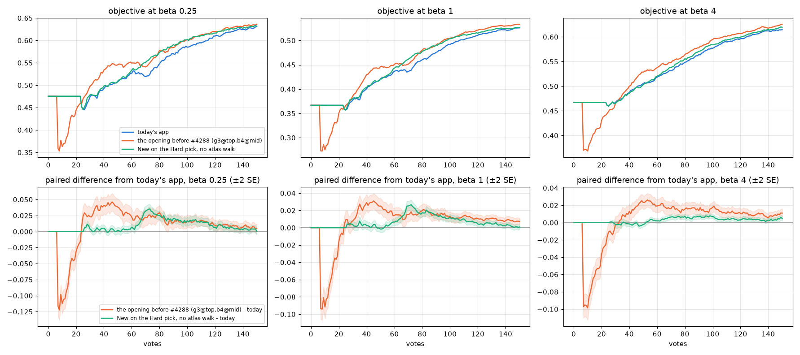
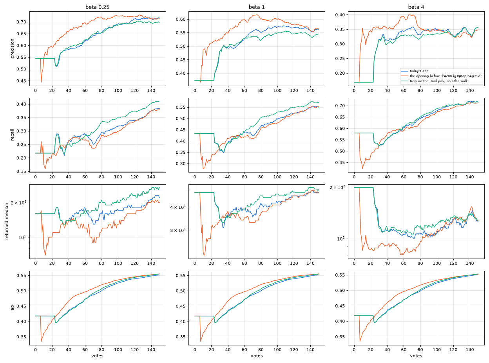

# What do the dry-stop opening and the Coverage Atlas walk buy, in F-beta? (issue #4671)

**Neither pays its way on this bench.** Each piece is set against today's app at each preset, in 720 paired runs.
The single number is the session mean of the objective over votes 1–150, the area under the curve divided by the
votes (owner, 2026-10-09). Every run counts at every vote. At beta 1/4 / 1 / 4:

- **Taking the Hard pick where New would walk the Coverage Atlas gains +0.009 / +0.007 / +0.003** over the session,
  all of it after vote 50. AP gains +0.002 / +0.002 / +0.001, and the runs find 1.2 more Goods by vote 150. So the
  atlas walk's picks cost a little, everywhere. This is the first time they have been priced (#4668's audit).
- **The opening before #4288 (`g3@top,b4@mid`) gains +0.009 / +0.006 / +0.003 over the session, but loses
  −0.046 / −0.035 / −0.044 over votes 1–25.** It hands over at vote 8 to a detector worse than the typed query's line
  (#4603). It is ahead at every vote from vote 24 (vote 33 at beta 4), with AP +0.009 / +0.010 / +0.008 over the
  session. Today's dry-stop opening (#4222) finds 2.7 more Goods by vote 25, which is what it was built to do, yet
  its detector has the lower AP from vote 24 to the end of the session.

So each piece was shipped on a reading that does not hold on today's app scored this way. The atlas walk was
shipped by reasoning, and the dry-stop opening on AP at vote 150 under the old acquisition rule. What to change is
the owner's call. The early cost of reverting the opening is where its trade sits; see "What this means".

## The question

#4668 audited every step of the deck against the one before it, in F-beta, and found no F-beta number for two pieces
of Autopilot:

- the Coverage Atlas walk (the New phase, Section IV), shipped by reasoning;
- the dry-stop opening `g3@top,b4@mid,g20+dry1/16@top` (#4222, #4288), shipped on AP: +0.052 at vote 150 at the
  bench's 0.44%, with an early cost of −0.074 at vote 25.

Both decide what Autopilot asks, so both need trajectories.

## What ran

| arm | what it changes, against today's app | knob |
|---|---|---|
| `ctl` | nothing: today's app | — |
| `open` | the opening before #4288: 3 Goods off the top of the typed query's sort, 4 Bads at its line, then Hard; no More walk | `CALIB_STARTUP_SCHEDULE=g3@top,b4@mid` |
| `nowalk` | New takes the Hard pick instead of the atlas's next under-explored item. The phase machine is unchanged, so Span still gates Done | `CALIB_NEW_WALK=hard` (new: `ALContext.new_walk`) |

- **Each arm runs at beta 1/4, 1 and 4**, on its own sessions, scored at its own beta.
- **Bench (#4668's):** COCO Better, binary SigLIP, 144 cells × 5 seeds, 150 votes. The user's pool is thinned to 1%
  positive; the withheld half Find searches stays at 0.44%. That is 6,480 runs, all on one frozen commit
  (`vts-4671-run` @ 44e4423c5), launched by `launch_autopilot_4671.sh` through `drive_chunks.sh`. Nothing was lost,
  and the same 3 cells per arm have no positive to find.
- **Checks on the arms:**
  - `nowalk` picks identically to `ctl` until the first New pick (vote 27 in the timing cell).
  - `open` runs 3 + 4 opening picks, then Hard from vote 8.
  - Each arm's run logs name its knobs, and the analyzer refuses an arm whose logs or rows disagree. None did.
- **Score:** the objective, F-beta at the run's preset of the withheld half above the line the app shows (#4427).
  - Every run counts at every vote (#4631). Until it shows a detector, a run scores the typed query's own set at
    today's per-preset line (#4603).
  - After the hand-over it scores the last line shown, and the shown share is cumulative.
  - Steps are paired by (category, seed). `analyze_autopilot_4671.py` does the scoring; `goods_4671.py` counts the
    Goods.

## Result

*Top: the objective at each preset, the mean of 720 runs per arm at every vote. Bottom: each arm minus today's app,
paired, with ±2 SE. The orange dip at votes 7–20 is the old opening showing its 3-Good, 4-Bad detector, where today's
app still shows the typed query's set. The orange lead from vote 24 is that opening's detector.*

**Each arm minus today's app**, paired over 720 runs (bold means more than 2 SE from zero):

| arm | | beta 1/4 | beta 1 | beta 4 |
|---|---|---|---|---|
| the opening before #4288 | objective, votes 1–150 | **+0.009** ± 0.003 | **+0.006** ± 0.002 | +0.003 ± 0.002 |
| | votes 1–25 | **−0.046** ± 0.005 | **−0.035** ± 0.004 | **−0.044** ± 0.004 |
| | votes 1–50 | −0.005 ± 0.004 | **−0.007** ± 0.003 | **−0.018** ± 0.003 |
| | votes 51–150 | **+0.016** ± 0.003 | **+0.013** ± 0.002 | **+0.014** ± 0.002 |
| | AP, votes 1–150 | **+0.009** ± 0.002 | **+0.010** ± 0.002 | **+0.008** ± 0.002 |
| New on the Hard pick (no atlas walk) | objective, votes 1–150 | **+0.009** ± 0.001 | **+0.007** ± 0.001 | **+0.003** ± 0.000 |
| | votes 1–25 | 0.000 | 0.000 | 0.000 |
| | votes 1–50 | **+0.002** ± 0.001 | +0.001 ± 0.001 | −0.001 ± 0.000 |
| | votes 51–150 | **+0.013** ± 0.001 | **+0.009** ± 0.001 | **+0.004** ± 0.001 |
| | AP, votes 1–150 | **+0.002** ± 0.000 | **+0.002** ± 0.000 | **+0.001** ± 0.000 |

The session means behind them, and the per-vote reads, are in `REPORT_autopilot.md`, `curves.csv` and
`paired_curve.csv`.

**Goods found** (`goods.csv`; arm minus today's app):

| | by vote 25 | by vote 50 | by vote 150 |
|---|---|---|---|
| today's app (beta 1) | 12.3 | 18.8 | 31.9 |
| the opening before #4288 | −2.7 | −2.2 to −3.3 | −0.4 to −1.5 |
| New on the Hard pick | 0.0 | +1.4 to +1.5 | +1.2 to +1.3 |

*Every run at every vote. The old opening's sets are more precise from vote 8–10 on, and its AP is higher from vote
24; it returns fewer images. Without the atlas walk, the app returns a few more images, at higher recall.*

## Readings

- **The atlas walk's picks are worth less than Hard picks, on this objective.**
  - In New, a Hard pick finds more Goods than the atlas's under-explored item (+1.5 by vote 50). The arm is
    resolvably ahead from vote 26 (vote 55 at beta 4), and at 75–89% of the votes from 60 to 150.
  - What the atlas walk is for, finding a detector's blind spots, would show on a corpus unlike the training one,
    and this bench does not test that. Its p-values already fail (A Likely Story).
  - Without the walk, Span never goes green on these runs, so the arm never reaches Done. Its stop signal is not
    comparable, which #3560 owns.
- **The dry-stop opening trades the late session for the first 25 votes.**
  - Its More walk keeps the typed query's set on screen until Hard, about vote 23. Since #4603, that set is better
    than a detector trained on 3 Goods and 4 Bads, and the opening owes all of its lead over votes 1–25 to it.
  - The walk takes the top of the text sort. It finds Goods (+2.7 by vote 25) that teach the detector less than the
    old opening's boundary picks from vote 8. From vote 24 (vote 33 at beta 4) the old opening is ahead at every
    vote. AP agrees, which reverses #4222's +0.052 AP. That was measured at vote 150 at 0.44% under the line − 4
    acquisition, before even-odds asking (#3546) made the Hard picks better.
- **Neither piece moves AP or the objective by much over a whole session**: 0.009 at most. That is comparable to the
  weak check, and smaller than the typed query's line (+0.09 at beta 1/4, #4668).

## What this means

These are the owner's calls; nothing changes in the app here.

1. **The atlas walk.** Its picks cost a little F-beta on this bench, everywhere. Options:
   - take the Hard pick in New (this arm), which loses the coverage the atlas exists for;
   - keep the walk for what it may buy off this bench;
   - price it on a cross-corpus Find first. A run that trains on one dataset and finds on another is the test of
     a blind-spot finder.
2. **The opening.** Reverting to `g3@top,b4@mid` would cost about −0.04 over votes 1–25 and gain about +0.014 over
   votes 51–150. The better design may be both:
   - the old opening's picks (Hard from vote 8);
   - with the typed query's set kept on screen until the detector beats it.

   That needs the background retrain of #4508 and a hand-over rule, which #4604 priced. Filed as #4736.

## Files

- `curves.csv`: per preset, arm and vote, every run filled. The objective (with SE), AP, precision, recall, the
  median returned size, the shares returning more than 200 and nothing, and the share showing a detector.
- `paired.csv`: each test arm minus today's app at its preset, for the objective and AP. Session means over votes
  1–150, 1–50, 51–150 and 1–25, the points at votes 10, 25, 50, 100 and 150, and the shares of runs better or worse
  by more than 0.05.
- `paired_curve.csv`: the paired difference in the objective at every vote, with its SE.
- `goods.csv`: Goods found by votes 25, 50 and 150, per arm, and paired against today's app.
- `REPORT_autopilot.md`: the analyzer's machine summary; `provenance.json`: the files read per arm.
- `figures/`: the two figures above. The cells stay at `/expscratch/sgreenberg/autopilot-4671/`.

Refs #4668, #4222, #4288, #4603, #4604, #4508, #3560
