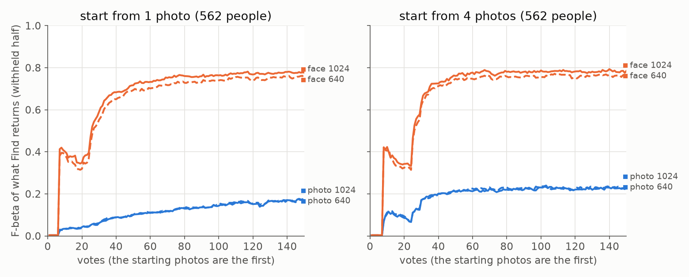

# On FHIBE, face crops find a person and whole photos do not; starting from 4 photos instead of 1 barely helps the face arm (#4699)

**2026-10-09.** The first baseline of the FHIBE face benchmark. Each cell is one person: the session
starts from photos of them (the app's example sort), votes through Autopilot for 150 votes, and is
scored on what Find returns from the withheld half of the corpus. Four arms run the same 562 people:
SigLIP on the whole one-person photo and FaceNet on its `image2face` crop, each stored at a 1024 px
and a 640 px long side. They run twice, starting from 1 photo and from 4 (the owner's two arms).

**The representation is the whole story.** FaceNet on the face crop beats SigLIP on the whole photo
by **+0.55** session-mean F-beta when the session starts from one photo, and by **+0.49** from four
(Figure 1). Whole-photo SigLIP barely tells people apart: from one photo, the median person scores
**0.007**, and **44%** of sessions never leave Autopilot's Good phase, so no detector is ever shown.
FaceNet's median person scores **0.74**, and its sessions reach the full-label ceiling's ranking
(AP 0.88 against 0.89).

**Four starting photos instead of one help the photo arm (+0.08) and barely move the face arm
(+0.015 to +0.021).** FaceNet finds the person's other voting-half photos from one example anyway
(3.1 found, of about 3 to find), so being handed them adds little.

**640 px against 1024 px costs nothing on photos and 0.02-0.03 on face crops**, among the people the
crop arm can run at all. The larger cost of 640 is that fewer people are runnable: whether a face is
found at all, which the supply census measured (#4709). There, the loss at 640 was faces pushed
below MTCNN's 24 px floor, so this arm's extra difficulty is mostly a pixel floor, not finding a face
in context.



*Figure 1. Mean over 562 people of the F-beta (beta 1) of what Find returns on the withheld half, at
every vote. Blue is SigLIP on the whole photo, orange FaceNet on the face crop; solid is 1024 px,
dashed 640 px. The starting photos are the first votes.*

## The numbers

Every run is scored at every vote: what a Find at that vote returns. Under the label quota (#4643)
that is the Goods' centroid until 3 Goods and 4 Bads, then the trained head. The session mean is the
mean over votes 1-150 (the owner's single number, #4668); the short session is votes 1-50.

| start | arm | session mean F-beta (1-150) | short session (1-50) | F-beta at vote 150 | after the end check | AP at 150 | ceiling AP | never shown a detector | median person |
|---|---|---|---|---|---|---|---|---|---|
| 1 photo | photo 1024 (SigLIP) | 0.11 | 0.05 | 0.17 | 0.19 | 0.29 | 0.36 | 44% | 0.007 |
| 1 photo | photo 640 (SigLIP) | 0.11 | 0.05 | 0.17 | 0.19 | 0.29 | 0.37 | 44% | 0.006 |
| 1 photo | face 1024 (FaceNet) | 0.67 | 0.47 | 0.78 | 0.79 | 0.88 | 0.89 | 4.3% | 0.74 |
| 1 photo | face 640 (FaceNet) | 0.64 | 0.45 | 0.74 | 0.76 | 0.86 | 0.87 | 4.3% | 0.69 |
| 4 photos | photo 1024 (SigLIP) | 0.19 | 0.13 | 0.23 | 0.22 | 0.36 | 0.36 | 0% | 0.15 |
| 4 photos | photo 640 (SigLIP) | 0.19 | 0.13 | 0.23 | 0.22 | 0.37 | 0.37 | 0% | 0.15 |
| 4 photos | face 1024 (FaceNet) | 0.68 | 0.48 | 0.79 | 0.78 | 0.89 | 0.89 | 0% | 0.73 |
| 4 photos | face 640 (FaceNet) | 0.66 | 0.47 | 0.76 | 0.75 | 0.88 | 0.87 | 0% | 0.69 |

Paired over the same 562 people, on the session mean (95% bootstrap intervals over people):

| contrast | from 1 photo | from 4 photos |
|---|---|---|
| face crop − whole photo, 1024 | +0.55 [+0.53, +0.58] | +0.49 [+0.47, +0.51] |
| face crop − whole photo, 640 | +0.53 [+0.50, +0.55] | +0.47 [+0.45, +0.49] |
| 640 − 1024, whole photo | +0.001 [−0.002, +0.004] | +0.003 [−0.000, +0.007] |
| 640 − 1024, face crop | −0.026 [−0.037, −0.015] | −0.019 [−0.029, −0.010] |

| 4 photos − 1 photo | difference |
|---|---|
| photo 1024 | +0.078 [+0.067, +0.089] |
| photo 640 | +0.080 [+0.069, +0.091] |
| face 1024 | +0.015 [+0.004, +0.026] |
| face 640 | +0.021 [+0.010, +0.033] |

**Votes, not clicks.** The starting photos are votes 1 to K, so at vote 10 a 4-photo session has made
6 clicks and a 1-photo session 9. Read against clicks, the 4-photo curves shift 3 votes left, which
is small next to these differences.

## What the curve says about the app

The shape is the same in every arm (Figure 1):

* **Votes 1 to ~7: near zero, even after four photos of the person.** Until the label quota is met,
  Find returns the Goods' centroid at its midpoint line, which keeps about half the corpus. On a face
  cell whose centroid already ranks every withheld photo first, that is still a precision of 0.002.
  Filed as #4732.
* **~vote 7: the jump** to 0.42 on face crops, when the first trained head replaces the centroid.
* **Votes 10-25: a dip** to ~0.33 while the opening's walk adds Bads, then **~vote 25: the second
  rise**, at the median vote Autopilot first shows a detector (24).
* **From one photo, 44% of whole-photo sessions never leave the Good phase.** Autopilot waits for 3
  Goods, and SigLIP often cannot find two more photos of the person (it finds 1.9 on average), so
  those sessions walk the example sort for all 150 votes and never show a detector. Filed as
  #4731. On face crops, 4.3% do the same.

## Caveats

* **The population is FHIBE's most-photographed people.** The 562 are everyone who can start from 4
  photos on every arm: at least 7 one-person photos (4 to start, the rest split), with faces MTCNN
  finds often enough at both sizes. The 640 px face arm excluded 159 people the photo arms admit, and
  the 1024 px one excluded 99. A 1-photo run on everyone who can start from one would cover 1,705
  people.
* **The face arm scores identity given the face was found.** A photo whose face MTCNN missed has no
  crop, so it is neither a query nor a positive there. End to end is this times the census's hit rate:
  95% at 1024 px and 91% at 640 px of subject crops (#4712).
* **One seed, beta 1.** The paired intervals are over people, not seeds; the other two presets
  (beta 1/4 and 4) are not run.
* **The ceiling is AP only.** The full-label ceiling's rows carry no line, so there is no ceiling
  F-beta.

## Provenance

| | |
|---|---|
| FHIBE release | `fhibe-full-resolution-674a7dcf` (internal `20260909`); cells built by #4712 |
| Harness | `01c97caf8` (PR #4730): example opening, stratified split, `scripts/experiments/fhibe/launch.sh` |
| Analysis | `e6a0fb4da`: `scripts/experiments/fhibe/analyze.py`, `figures.py` |
| Runs | K=4 job 939837, K=1 job 939874: 2,248 cells each, all completed, none empty; analysis job 945001 |
| Results | owner-only, beside the release: `<release>-derived/runs/2026-10-09-{k1,k4,analysis}` |
| Session | 150 votes, end-of-run spot check, label quota on, safe thresholds, beta 1, `CALIB_STRATIFY_TARGET=1` |

The per-person tables carry FHIBE subject ids and stay with the release. Only aggregates are here.

```bash
# on the GRID, from a worktree at the harness commit
cd scripts/experiments/fhibe
FHIBE_RUN=2026-10-09 FHIBE_EXAMPLES=4 bash launch.sh identities   # admits people at the largest K
FHIBE_RUN=2026-10-09 FHIBE_EXAMPLES=4 bash launch.sh prepare
FHIBE_RUN=2026-10-09 FHIBE_EXAMPLES=1 FHIBE_MAX_EXAMPLES=4 \
  FHIBE_IDENTITIES=<runs>/2026-10-09-k4/identities.txt bash launch.sh prepare
srun --ntasks=1 bash -c 'FHIBE_RUN=2026-10-09 FHIBE_EXAMPLES=4 bash launch.sh cells'   # preflight runs python
srun --ntasks=1 bash -c 'FHIBE_RUN=2026-10-09 FHIBE_EXAMPLES=1 FHIBE_MAX_EXAMPLES=4 \
  FHIBE_IDENTITIES=<runs>/2026-10-09-k4/identities.txt bash launch.sh cells'
python analyze.py --run k1=<runs>/2026-10-09-k1 --run k4=<runs>/2026-10-09-k4 --out <runs>/2026-10-09-analysis
python figures.py --curves <runs>/2026-10-09-analysis/curves.csv --out <runs>/2026-10-09-analysis
```
