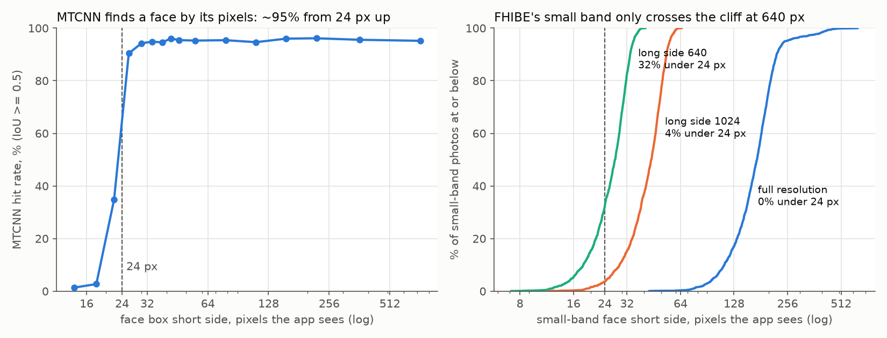

# FHIBE supplies identity queries, but finding the face is only hard below 24 px (#4699)

**2026-10-09.** #4699 wants a face benchmark that tests *finding* the face as hard
as *matching* the person, built on Sony's FHIBE. This is the supply census that
comes first, in the shape of #3983: how many usable photos each subject has once
two-person photos are excluded, how the face boxes fall into the pile's size bands,
and how often the app's MTCNN finds the annotated face in each band.

**Identity supply is fine. A hard localization band is not there at FHIBE's own
resolution.** 1,735 subjects have at least two one-person photos (median 6), so a
query with positives exists for almost everyone. MTCNN finds the annotated face in
**95%** of photos at full resolution, and in **95%** of the small band too: FHIBE's
"small" faces are small *relative to the frame*, but its frames are 12–32 MP phone
photos, so the median small-band face is still **172 px** across. Recall depends on
the face's size in pixels, not on its band. It is flat at ~95% from 24 px up and falls
off a cliff below that (Figure 1). The small band becomes a real localization test
only if the benchmark stores downscaled copies: at a long side of **640 px**, 32% of
small-band faces drop under 24 px, and MTCNN finds **70%** of them.



*Figure 1. Left: MTCNN's hit rate against the face box's short side, in the pixels the
app sees, pooled over three resolutions (30,834 photo-resolution pairs). Right: the
small band's face sizes at each resolution; only the 640 px copy puts a third of
them past the 24 px cliff.*

```bash
# on the GRID; --out sits beside the FHIBE release so both are deleted together.
# Fetching the release itself: scripts/experiments/pile/fhibe/download.sbatch (needs the
# owner's MDC API key in ~/.config/mdc/api_key and the dataset terms accepted on MDC).
python scripts/experiments/pile/fhibe_supply.py annotations --root <dir with filepaths.csv> --out <census dir>
(cd scripts/experiments/pile/fhibe && FHIBE_DATA=<dir with filepaths.csv> FHIBE_CENSUS=<census dir> \
  sbatch --array=0-39%4 --output=<census dir>/logs/detect-%A_%a.log census_detect.sbatch 40)  # 4 V100s, 78 min
python scripts/experiments/pile/fhibe_supply.py report --out <census dir>
python scripts/experiments/pile/fhibe_figures_4699.py --out <census dir> --outdir docs/experiments/2026-10-09-fhibe-supply-4699
```

| | |
|---|---:|
| FHIBE release | `fhibe-full-resolution-674a7dcf` (internal `20260909`), from Mozilla Data Collective |
| images / subjects | **10,901 / 2,056** (the paper's 10,318 / 1,981 is an older release) |
| one-person photos (two-person photos excluded, as Sony recommends) | **10,278** (623 excluded) |
| subjects usable as a query (>= 2 one-person photos) | **1,735**, median **6** photos |
| small / medium / large band photos | **1,658 / 8,199 / 421** |
| subjects with >= 2 small-band photos | **431** |
| MTCNN hit rate, all photos: full / 1024 / 640 px | **95% / 95% / 91%** |
| MTCNN hit rate, small band: full / 1024 / 640 px | **95% / 93% / 70%** |

## Method

**Supply** comes from the JSON annotations alone. One row per (image, consenting
subject): the subject id, the people per photo, the frame, the annotated face box
(FHIBE stores `[x, y, w, h]`) and the camera-distance label. The band is the
shipped `pilebuild.scale_core.band_for` applied to the face box, so a FHIBE "small"
is a COCO Better "small": under 1/196 of the frame, then under 1/12, then the rest.
Non-consenting bystanders are anonymised in the pixels and carry no annotation, so
they never enter a row. Nothing demographic is read: the census needs the face box,
the camera distance and the subject id, and stops there.

**Detection** runs the app's own `FaceLocalizer` (MTCNN, keep-all, the same
construction `image2face` uses) on every image three ways: the original PNG, and a
bicubic downscale to a long side of 1,024 and of 640 px, re-encoded as JPEG q90. The
two downscales stand in for a benchmark that reads smaller copies. A pile cell keeps
vectors and no pixels, but `build_pile.py` holds every image's bytes in RAM before it
embeds (`coco_better` peaks at 20.9 GB), and FHIBE's originals are 140 GB, so the
build has to read a smaller copy in any case. A detection
counts only if the app would keep it: confidence >= 0.5 (`FaceLocalizer`'s default)
and a padded crop >= 32 px (`image2face`'s `min_size` after its 0.25 padding). A
**hit** is a kept detection at IoU >= 0.5 with the annotated box.

## Supply

One-person photos per subject (1,776 subjects have one; the other 280 appear only in
two-person photos, most of them as the secondary subject):

| photos | 1 | 2 | 3 | 4 | 5 | 6 | 7 | 8 | 9 | 10 |
|---|---|---|---|---|---|---|---|---|---|---|
| subjects | 41 | 92 | 170 | 240 | 256 | 248 | 281 | 261 | 110 | 77 |

One-person photos by band and camera-distance label:

| band | CD I | CD II | CD III | CD IV | CD V | all |
|---|---:|---:|---:|---:|---:|---:|
| small | 1 | 1,467 | 182 | 2 | 6 | **1,658** |
| medium | 2 | 643 | 7,023 | 470 | 61 | **8,199** |
| large | 0 | 0 | 3 | 210 | 208 | **421** |

**The camera-distance labels are not ordered the way their numerals suggest.** CD II
holds 88% of the small faces and CD IV–V hold all but three of the large ones, so CD
II is the far setting and CD V the close one, with CD I nearly unused (3 photos).
Anything that bands by camera distance has to read it in that order. The face box is
the more direct measure anyway: as a fraction of the frame its p5 / median / p95 are
0.0025 / 0.012 / 0.070, against the small band's edge at 0.0051.

The small band's depth is per subject, not per photo. 867 subjects have at least one
small-band photo, but only **431** have two or more, so a query whose positives must
*all* be small-band faces has 431 identities and few positives each.

## MTCNN against the annotated face box

| band | full: hit | full: median face px | 1024: hit | 1024: face px | 640: hit | 640: face px |
|---|---:|---:|---:|---:|---:|---:|
| small | 95% | 172 | 93% | 44 | **70%** | 27 |
| medium | 95% | 344 | 95% | 87 | 95% | 54 |
| large | 98% | 1,095 | 98% | 278 | 98% | 174 |
| all | 95% | 323 | 95% | 82 | 91% | 51 |

Median best IoU is 0.84 at full resolution, 0.83 at 1024 and 0.82 at 640. **The
subject is almost always face index 0.** The top-confidence kept detection is the
hit in every row to within a point (e.g. 69% vs 70% at 640 small). `image2face`
orders crops by confidence, so it would hand the subject's face over first.

**Recall is a function of pixels, not band.** Pooled over all three resolutions:

| face short side (px) | 0–15 | 16–23 | 24–31 | 32–47 | 48–63 | 64–95 | 96–127 | >= 128 |
|---|---:|---:|---:|---:|---:|---:|---:|---:|
| photos | 91 | 504 | 1,094 | 3,973 | 4,370 | 5,993 | 2,623 | 12,186 |
| hit | 1% | 23% | 93% | 95% | 95% | 95% | 95% | 96% |

The cliff is the app's pipeline more than MTCNN's skill. MTCNN's pyramid stops at a
20 px face, and `image2face` drops a crop under 32 px after 0.25 padding, i.e. a box
under 21 px. A localization test built on the 640 px small band would therefore
mostly measure whether a face clears that floor, not whether it can be found in
context.

**What a miss is.** At full resolution, 465 photos miss:

| resolution | misses | no kept detection | best detection off the face (IoU 0.1–0.5) | detections only elsewhere |
|---|---:|---:|---:|---:|
| full | 465 | 239 | 78 | 148 |
| 1024 | 516 | 397 | 75 | 44 |
| 640 | 910 | 800 | 64 | 46 |

Head pose accounts for part of the full-resolution floor: FHIBE's "typical" head pose
hits 97% (7,439 photos) and "atypical" 93% (2,839).

**Full resolution brings in many extra faces.** Kept detections that are not the
subject number 8,755 at full resolution, on 38% of photos, against 1,204 (10%) at
1,024 and 738 (7%) at 640. At full resolution their median is 37 px and their median
confidence 0.82, with only 10% at >= 0.95. They look like texture false positives
from running a 20 px pyramid over a 32 MP frame, plus any bystander faces. This
census cannot tell those apart, because the bystanders carry no annotation, and
their pixels may not go in the repo to be shown here. In an `image2face` arm each
extra becomes a face crop in the pool with no identity: a negative for every query,
so harmless to the labels, but it inflates the haystack at full resolution.

## What this means for the cell design

- **The identity half is supplied.** 1,735 queries with a median of 5 positives each
  (6 photos less the query) is the per-identity shape #4699 anticipated. It looks
  nothing like COCO Better's 100-positive cells, and the cell design has to be built
  around that.
- **The localization half is a choice of storage resolution, not a property of
  FHIBE.** At 1,024 px, localization is ~95% everywhere and the benchmark measures
  identity. At 640 px, the small band loses 30% of its faces, but to a pixel floor.
  To test *finding* rather than *resolving*, a band would need faces above 24 px
  that MTCNN still misses. At 1,024 px there are few: 5% of photos.
- **A size has to be picked anyway.** The originals average 14 MB as PNG (140 GB in
  all), too much for a build that holds every image's bytes in RAM. Measured on 30 random photos, a 1,024 px JPEG q90 averages 224 KB (1/61; ~2.4 GB
  for the set) and a 640 px one 93 KB.

## Limits

- One detector: the app's MTCNN at its shipped defaults. A detector with a smaller
  minimum face would move the cliff, not remove it.
- Downscales are bicubic + JPEG q90 from the original. A build that resizes
  differently could shift the 16–31 px rows by a few points.
- No example images: FHIBE may not be redistributed, so this report shows statistics
  only. The per-photo tables live beside the release on the GRID
  (`/expscratch/sgreenberg/fhibe/census-674a7dcf/`, owner-only) and are deleted with it.
