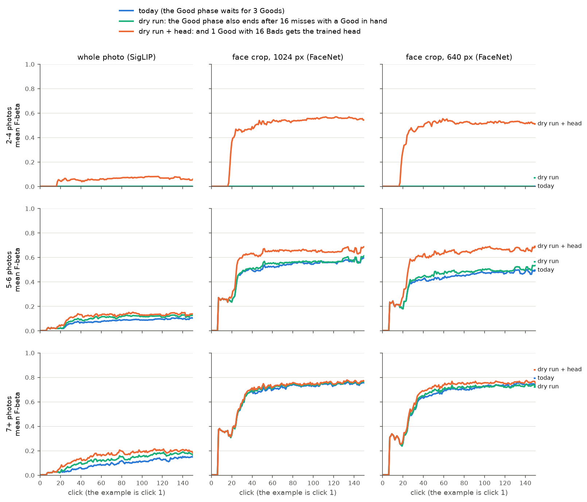
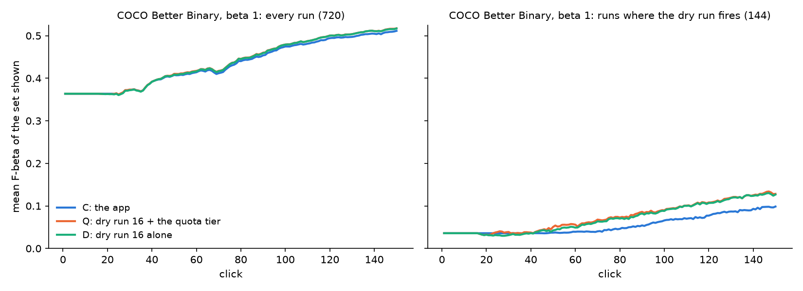

# A Good phase that runs dry gets a few-photo person to a detector, but only with a trained head (#4731)

**2026-10-09.** Autopilot's Good phase ends only at its third Good. A target with fewer than three
Goods the sort can reach walks the seed sort for the whole session and never shows a detector. On
FHIBE (#4699), with one example photo, that is everyone with 2–4 one-person photos, and it is a
fifth to a third of the people with 5–6 photos on the face crops.

**Ending the Good phase on a dry run is not enough by itself.** Below the label quota (#4643: 3 Goods
and 4 Bads) the detector a session shows is the Goods' centroid, cut at its GMM midpoint. On a
rare target that keeps about 2,300 images (#4732). So the session reaches the Hard phase at click
17 and its F-beta does not move.

**With the trained head as well, it works.** The arm ends the Good phase after 16 misses in a row
with a Good in hand. It also gives a labelset of one Good and 16 Bads the trained head. On the face
crops, mean F-beta over clicks 1–150 for people with 2–4 photos goes from **0.001 to 0.47**
(1024 px) and **0.45** (640 px). For people with 5 or more photos it never drops. It rises by
**+0.015 to +0.17** on the face crops, and **+0.040 to +0.063** on whole photos (Figure 1).

**COCO does not object.** The exit fires in a fifth of the State of the App's Binary sessions
(144 of 720, at beta 1). With the trained head, mean F-beta over clicks 1–150 gains **+0.0038 ±
0.0011** over every session. Over clicks 1–50 it is flat (+0.0003 ± 0.0005), and no band goes
down. Where the exit fires it gains +0.019 ± 0.006, with 88 sessions better and 54 worse. The
exit alone gains about as much on COCO (+0.0033), so there the head adds little. For FHIBE's
few-photo people the head is the whole gain.

**Recommendation: ship the pair at 16.** The owner rules. The trade is a few sessions that
leave a slow walk too early: 3–4 per 100 face sessions at 5 or more photos, and 54 of 144 fired
COCO sessions. The worst lose 0.22 and 0.11.



*Figure 1. Mean F-beta (beta 1) of the set Test gives at each click, over 100 people per row, one
example photo each. Click 1 is the example. Today (blue), the dry run alone (green) and the dry run
with the trained head (orange). The green and blue lines overlap in the top row.*

## What was run

- **FHIBE.** 300 identities, drawn 100 each from three bands of one-person photo counts. The bands
  are 2–4 (of 473 that every cell admits), 5–6 (of 503) and 7 or more (of 729).
- **Datasets.** Each person runs on three datasets:
  - the whole photo at 1024 px (SigLIP);
  - the face crop at 1024 px (FaceNet);
  - the face crop at 640 px (FaceNet).
  The 640 px whole photo was left out because in #4699's smoke grid it followed the 1024 px one
  phase for phase.
- **Sessions.** One example photo (`CALIB_SEED_EXAMPLES=1`), the stratified split (#4699: ceil(n/2)
  photos to vote on, floor(n/2) withheld), 150 clicks and the app's default balance.
- **Arms**, on one identity file and one commit, paired session for session:
  - **today**, the app;
  - **dry run** (`CALIB_GOOD_DRY_RUN=16`): the Good phase also ends once 16 picks in a row held no
    positive, with at least one Good in hand. The More walk down the same sort is then spent.
    16 is the app's own `moreDryRun`, the walk's dry run since #4282.
  - **dry run + head** (`CALIB_GOOD_DRY_RUN=16 CALIB_QUOTA_DRY_BADS=16`): the same exit, plus one
    change to the label quota. A labelset with a Good and 16 Bads gets the trained head instead of
    the centroid. The rule is counts-only, as the quota is, so it travels with the labelset.
- **Scoring.** F-beta of the set Test gives at each click, on the withheld half, with every session
  filled at every click. Before the exit, at one Good, Test's centroid is the example sort's own
  ranking and cut, so this is also what the session shows. The new quota tier can make Test's
  answer the trained head a few clicks before the session shows it, when a walk holding 2 Goods
  reaches 16 Bads before it runs dry. That happened at 559 of 135,000 clicks, and moves no
  stratum's mean by more than 0.0002. The headline is the mean over clicks
  1–150, the area under the curve, with 1–50 for short sessions. Gains are paired per person, with
  one SE over people.
- **Pairing check.** The dry run fired in 575 of the 900 control sessions. In all 575, both arms
  picked the same media as the control up to the click where it fired.

## FHIBE results

Mean F-beta over clicks 1–150 (1–50 in brackets), and the gain over today with one SE.

| photos | dataset | today | dry run | dry run + head | gain, dry run | gain, dry run + head |
|---|---|---|---|---|---|---|
| 2–4 | whole photo | 0.001 (0.001) | 0.001 (0.001) | 0.058 (0.036) | 0.000 | **+0.057** ± 0.015 |
| 2–4 | face 1024 | 0.001 (0.001) | 0.001 (0.001) | 0.47 (0.30) | 0.000 | **+0.46** ± 0.036 |
| 2–4 | face 640 | 0.001 (0.001) | 0.001 (0.001) | 0.45 (0.30) | 0.000 | **+0.45** ± 0.035 |
| 5–6 | whole photo | 0.074 (0.042) | 0.097 (0.053) | 0.11 (0.073) | +0.022 ± 0.007 | **+0.040** ± 0.010 |
| 5–6 | face 1024 | 0.49 (0.35) | 0.50 (0.35) | 0.58 (0.42) | +0.011 ± 0.006 | **+0.092** ± 0.020 |
| 5–6 | face 640 | 0.41 (0.29) | 0.43 (0.30) | 0.57 (0.40) | +0.022 ± 0.008 | **+0.17** ± 0.027 |
| 7+ | whole photo | 0.088 (0.036) | 0.12 (0.057) | 0.15 (0.078) | +0.033 ± 0.010 | **+0.063** ± 0.012 |
| 7+ | face 1024 | 0.64 (0.46) | 0.65 (0.47) | 0.66 (0.47) | +0.008 ± 0.005 | +0.015 ± 0.007 |
| 7+ | face 640 | 0.62 (0.42) | 0.62 (0.43) | 0.65 (0.45) | +0.004 ± 0.004 | +0.031 ± 0.013 |

Share of sessions that show a trained detector by click 150:

| photos | dataset | today | dry run | dry run + head |
|---|---|---|---|---|
| 2–4 | all three | 0% | 0% (Hard from click 17–18, centroid) | 100% (from click 17–18) |
| 5–6 | whole photo / face 1024 / face 640 | 36% / 78% / 66% | 51% / 81% / 72% | 100% |
| 7+ | whole photo / face 1024 / face 640 | 54% / 94% / 93% | 66% / 95% / 91% | 100% |

**People with 2–4 photos.** Today every one of them walks the example sort for all 150 clicks. The
set Test gives is the centroid's, which keeps a median of 2,150–2,370 images for 1–2 withheld
photos. The dry run alone takes them to the Hard phase at click 17–18 but leaves that set as it was.
With the trained head, the set shrinks to a median of **1 image**. It holds a withheld photo at
click 150 in 73% of the 1024 px face sessions and 71% of the 640 px ones. The gain holds at every
photo count in the band. On 1024 px faces the mean is 0.42 at 2 photos, 0.50 at 3 and 0.46 at 4.
On the whole photo, SigLIP does not encode who someone is, so the head finds the other photo only
when the scene or clothes give it away (31% of sessions hold one at click 150).

**People with 5 or more photos.** Both arms gain on average in all six stratum × dataset cells, so
#4731's guard holds. The dry run alone gains because its exit reaches a learned sort sooner, and
that finds the third Good earlier than the example sort's walk does. The trained head adds the
sessions that never find a third Good. That is about a fifth (1024 px) and a third (640 px) of
5–6-photo face sessions, and 6–7% at 7 or more.

**Where it costs.** Per session, on the face crops at 5 or more photos, dry run + head is better in
8–38 sessions per 100 and worse in 3–4. The worst loses 0.22 of mean F-beta. Every large loss
has the same shape:
- today's walk went on to find the person's other photos deep in the example sort, at clicks 72–102;
- the arm left that walk at click 17 with one or two Goods;
- its Hard-phase picks, at the trained head's line, never reached those photos.

This is #4222's lesson in a milder form: a dry stop gives up the positives a long walk would have
found. On the whole photos the losses are many but tiny. The worst is 0.020 at 5–6 photos and
0.072 at 7 or more, and they are usually 0.002–0.003. That is a centroid set of about 0.002 F-beta
traded for a trained set of about zero.

**How long a dry run.** Read off today's walks, which every arm shares until it fires (table
below). A longer dry run ends fewer walks that would still have found a third Good. At 7 or more
photos on the 640 px faces that share is 11% at 16 and 7% at 32. But it holds people with 2–4
photos on the centroid's 2,000-image set for 16 more clicks. Only 16, the app's existing
`moreDryRun`, was run.

| photos | dataset | ends the walk, at 8 / 16 / 32 misses | ends a walk that would still find a 3rd Good |
|---|---|---|---|
| 5–6 | face 1024 | 38% / 35% / 31% | 17% / 14% / 10% |
| 5–6 | face 640 | 49% / 44% / 40% | 16% / 11% / 7% |
| 7+ | face 1024 | 17% / 12% / 8% | 11% / 6% / 2% |
| 7+ | face 640 | 23% / 18% / 14% | 16% / 11% / 7% |

## COCO guard

The exit is not a FHIBE rule. Any session whose Good walk runs 16 picks dry with a Good in hand
takes it, and on the State of the App's Binary photo path that is 19% of sessions (2026-10-08's
3,456 at beta 1). #4222 had found a dry stop in the Good phase costly there, though that was a
bare stop that could hand over with 0 or 1 Goods. So the guard is a paired State of the App run:
- 144 class@band cells × 5 seeds, Binary (SigLIP), beta 1, on the 2026-10-08 grid;
- three arms at one commit: C, the app; Q, the dry run + head; D, the dry run alone.

Each run is read as the app shows it: the typed query's set until the session shows a detector,
then that detector's line (`handoff_price_4604.py`). Gains are paired per run, with one SE over
classes.

| runs | sessions | C: mean F-beta 1–150 (1–50) | Q gain 1–150 | Q gain 1–50 | D gain 1–150 | D gain 1–50 |
|---|---|---|---|---|---|---|
| all | 720 | 0.434 (0.374) | **+0.0038** ± 0.0011 | +0.0003 ± 0.0005 | +0.0033 ± 0.0010 | −0.0002 ± 0.0004 |
| the exit fires | 144 | 0.055 (0.036) | **+0.019** ± 0.006 | +0.0016 ± 0.0029 | +0.016 ± 0.006 | −0.0009 ± 0.0025 |
| it never fires | 576 | 0.529 (0.459) | 0 | 0 | 0 | 0 |
| small | 230 | 0.194 (0.160) | +0.011 ± 0.003 | +0.0021 ± 0.0014 | +0.0096 ± 0.0030 | +0.0009 ± 0.0010 |
| medium | 245 | 0.409 (0.350) | +0.0012 ± 0.0012 | −0.0010 ± 0.0008 | +0.0006 ± 0.0013 | −0.0013 ± 0.0009 |
| large | 245 | 0.685 (0.600) | 0 | 0 | 0 | 0 |



*Figure 2. COCO Better Binary photo, beta 1. Left: all 720 runs. Right: the 144 where the Good walk
runs 16 picks dry with a Good in hand. Q and D pick the same media; they differ only in what Test
gives at one or two Goods.*

- **Where it never fires, nothing moves.** The 576 runs are identical to C at every click.
- **The sessions it fires on are today's worst.** Their mean F-beta is 0.055 against 0.53 for the
  rest. The exit reaches a learned sort a median of 56 clicks sooner (quartiles 33–86). In 57
  of the 144 runs, today's app never shows a detector by click 150. The curves part around click
  45.
- **Its losses look like FHIBE's.** sink@small seed 4 loses 0.11. Today its walk goes on to a
  detector at click 84. The exit leaves at click 38 with fewer Goods, and the Hard phase never
  catches up. The 54 losers have a median loss of 0.013; the 88 winners a median gain of 0.025.
  Of the 34 classes the exit fires on, 10 are net negative (bicycle worst, −0.024).
- **Early clicks are flat.** Over 1–50 no band moves by as much as 2 SE under either arm. The
  largest moves are small objects at +0.0021 ± 0.0014 under Q, and medium objects at −0.0010 ±
  0.0008 under Q and −0.0013 ± 0.0009 under D.
- **On COCO the head adds little.** Q and D differ by +0.0005. On COCO a labelset with one or two
  Goods trains a head barely better than their centroid. On FHIBE's face crops it finds the
  person.

Only the Binary path at beta 1 was run. Region voting and beta 1/4 and 4 were not; at 1/4 and 4 the
Good walk and the line both move.

## What shipping would change

Two rules change together, and the harness's default arm moves with them, so every later study's
control changes (as #4282's did):

1. **Autopilot's Good phase** (`autopilot-state.service.ts`, `checkPhaseTransition`) also ends once
   `moreDryRun` (16) of its picks in a row held no Good, with a Good in hand. The More walk is then
   spent. The harness port is `AutopilotFlow(good_dry_run=)`, and its default would become
   `MORE_DRY_RUN`.
2. **The label quota** (`vtscore/detectors/label_quota.py`) gives a labelset with a Good and 16 Bads
   the trained head. Today that needs 3 Goods and 4 Bads. It is counts-only like the rest of the
   quota, so it also reaches manual labeling and imports: 1 Good and 16 Bads labeled by hand would
   Test as a trained head. The harness's `quota_dry_bads` default would become that constant.

Neither alone does the job. The exit without the head leaves a few-photo person on the centroid's
2,000-plus-image set (FHIBE row 1). The head without the exit reaches Test, Find and export but not the
session, which would keep walking the example sort. Shipping the pair needs:
- the app and its spec;
- the quota and its tests;
- re-pinned eval–app mirrors;
- the Autopilot panel's Good-phase progress, counted against `goodToStart`
  (`autopilot-panel.component.ts`);
- the quota's "too few labels for a trained detector" copy in the left panel, AutoFind's results
  and export;
- `make-autopilot-figs.py`.

Things this does not settle:
- **A longer dry run.** 32 would leave fewer slow walks early (table above). It would also hold
  2–4-photo people 16 clicks longer, and 2–4-photo people are the point.
- **Region voting and the other presets.** The COCO guard is Binary at beta 1 only.
- **The centroid's line (#4732).** It is independent of this. If the centroid kept a
  rare-target-sized set, the exit alone would help FHIBE's few-photo people too, and the head would
  matter less.

## Rerun

```bash
# GRID. Arms share one identity file; each arm is one directory under the FHIBE release's runs/.
W=/expscratch/$USER/worktrees/vts-4731-run          # a FROZEN worktree at the branch commit
cd $W/scripts/experiments/fhibe
FHIBE_RUN=2026-10-09-4731-ctl FHIBE_EXAMPLES=1 FHIBE_N_IDENTITIES=100 FHIBE_STRATA=2-4,5-6,7- \
  bash launch.sh identities                         # 100 per band, + identities.txt.strata.tsv
# then per arm (ctl; CALIB_GOOD_DRY_RUN=16; CALIB_GOOD_DRY_RUN=16 CALIB_QUOTA_DRY_BADS=16), with
# FHIBE_RUN=2026-10-09-4731-<arm>, FHIBE_IDENTITIES=<the ctl run's identities.txt> and
# FHIBE_DATASETS=fhibe_1024,fhibe_faces_1024,fhibe_faces_640:
bash launch.sh prepare && bash launch.sh cells      # 900 cells per arm, ~1-4 min each
python analyze_good_dry_4731.py --runs ctl=<dir> dry16=<dir> dry16q16=<dir> \
  --strata <ctl dir>/identities.txt.strata.tsv --out <analysis dir>
python figures_good_dry_4731.py --analysis <analysis dir> --out docs/experiments/2026-10-09-good-dry-4731

# COCO guard (State of the App Binary, beta 1, 5 seeds), from a frozen worktree:
cd $W/scripts/experiments/state_of_app
bash good_dry_4731.sh dirs 5
for arm in C Q D; do bash good_dry_4731.sh launch $arm 5; done   # GOODDRY_PACK=1 when the cpu cap is full
```

The cpu partition's cap was held by other arrays, so both studies ran as pack jobs on V100 nodes,
30 cells at a time with the GPU hidden. The FHIBE arms took 55–90 min, the COCO arms ~2 h each.
COCO pricing: `handoff_extract_4604.py` and `handoff_price_4604.py` per arm (tags `C/Q/D_binary_b1`,
text baseline `2026-10-08-b1/text_baseline.csv`), then `compare_good_dry_4731.py --dir <priced>
--picks-c <priced>/picks_C_binary_b1.csv.gz --docs <this dir>`. Tables: `fhibe_summary.csv`,
`fhibe_dry_run_lengths.csv`, `coco_guard.csv`. The analysis directory holds
per-person rows, so it stays owner-only beside the FHIBE release
(`<release>-derived/runs/2026-10-09-4731-*`). This report holds aggregates only.
