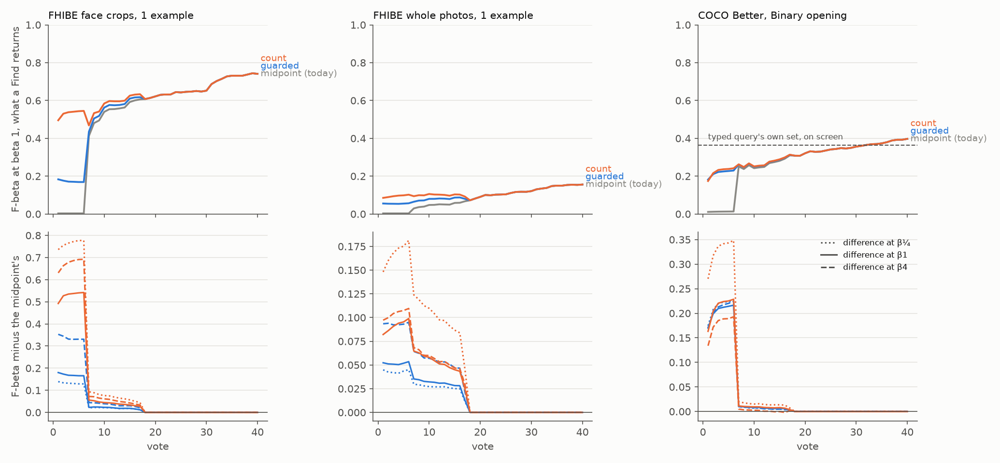

# The Goods' centroid keeps what stands out, not half the corpus (#4732)

**2026-10-10.** Below the label quota (#4643: 3 Goods and 4 Bads, or a Good and 16 Bads, #4731),
Test, Find and AutoFind give the Goods' centroid. Its line was the two-Gaussian midpoint of the
corpus cosines. On a rare target that midpoint splits the negatives' own bulk. On FHIBE's face crops
the centroid ranked a person's withheld photos at the top of 5,439 crops, and its line still kept a
median of **2,338** of them. Precision was 0.002, so a Find there returned half the corpus. The same
line is what an example sort draws.

**The typed query's count line fixes it on every bench, at every balance.** The count line (#4603)
keeps `beta ** 0.708` times the number of images standing out of the cosines' bulk. On the face crops
it keeps **1 to 3** images, at precision 0.84. Mean F-beta of what a Find returns over votes 1–10 goes
up by:

- FHIBE face crops: **+0.34 to +0.49** with one example photo, **+0.38 to +0.58** with four;
- FHIBE whole photos: **+0.08 to +0.16**;
- COCO Better's Binary opening: **+0.11 to +0.20**.

**It also beats the typed query's other line.** The guarded line (#3826) is what a typed query draws
at beta 4. On the face crops its separated branch falls back to the same midpoint, and count beats it
by **+0.21 to +0.48** at every balance. Guarded wins in one place, COCO at beta 4, by **0.020 ±
0.002**.

**Shipped: the count line at every balance**, for the centroid head and for the example sort's
display line. Autopilot's Hard select still samples an example sort at the midpoint, so no session
picks differently. The one place this departs from the typed query's own rule is beta 4. There count
gives up 0.020 on COCO's opening, where the session shows the typed query anyway, to gain 0.21 to
0.27 on face crops, where the centroid *is* the opening. `CENTROID_LINE_RULE = "text"` would take the
typed query's rule instead, and is one line to change.



*Figure 1. Top row: mean F-beta (beta 1) of what a Find returns at each vote, over every run, for
three lines on the same sessions. The midpoint is grey, guarded blue and count orange. Bottom row:
each line's difference to the midpoint at beta ¼ (dotted), 1 (solid) and 4 (dashed). It is zero
wherever the centroid is not what Find gives. On FHIBE, vote 1 is the example photo. The tier ends
near vote 7 when the walk finds two more photos, and near vote 17, its dry run, when it does not. On
COCO, Find gives the centroid until the quota, about vote 7. The dashed line is the typed query's
own set at the app's line, which is what the session shows through the opening.*

## What was run

- **Benches**, all from one frozen commit (`0f1679937` + `a4ea52d74`), at the app's default balance
  (beta 1):
  - **FHIBE** (#4699): the baseline's 562 people × 4 datasets (whole photos with SigLIP and face
    crops with FaceNet, each stored at 1024 and 640 px). The example opening has K = 1 photo in one
    run and K = 4 in the other. The split is stratified, the shipped #4731 rules are on, and runs
    stop at 40 votes. Each K has 2,248 runs.
  - **COCO Better Binary Photo**: the State of the App's 144 cells (2026-10-08 grid) × 5 seeds,
    with the text opening, run to 40 votes. 720 runs.
- **The lines are tagged rows, not arms.** `CALIB_CENTROID_LINE_VARIANTS` adds a row at every click
  where Find gives the centroid, one per `<rule>@<beta>`. The row holds the same centroid on the same
  withheld half, with its line drawn by *rule* at *beta* and F-beta weighted at *beta*. The rules
  are `midpoint` (the line until now), `guarded` and `count`, each at beta ¼, 1 and 4. `text`, the
  typed query's own rule, is count at beta ≤ 1 and guarded above it, so it is read off those rows.
  The pairing is exact for two reasons. The centroid never picks a click. And Autopilot's opening
  reads no balance: in 60 cells of the 2026-10-08 runs the b¼/b1/b4 sessions agree pick for pick
  until vote 26 or later, past almost every centroid click here. So two lines differ only on the
  centroid's clicks, and only in what they keep.
- **The read.** Every run is in every average (#4631). A run whose first Good never came by vote 40
  gets Find's nothing under every line, so its difference is 0. That is 69 of 720 COCO runs, small
  bands such as `bag or luggage@small`. Runs whose first Good came with the quota already met (a
  Good and 16 Bads) also never show the centroid and count as 0. The tier ended inside 40 votes in
  every run, so the differences over votes 1–50 and 1–150 are exact: the curves agree from the
  tier's end on. Paired standard errors cluster on the category, which on FHIBE is the person.
- **Cost.** Four V100 pack jobs (the cpu cap was full): FHIBE about a minute a run, COCO about two
  minutes. 1 h 20 min for K = 1, 1 h for K = 4, 47 min for COCO.

## Results

### Every line beats the midpoint; count by the most

Difference to the midpoint in mean F-beta over votes 1–10 (paired, every run; SEs ≤ 0.016, in
`summary.csv`):

| bench | runs | count β¼ | count β1 | count β4 | guarded β¼ | guarded β1 | guarded β4 |
|---|---|---|---|---|---|---|---|
| FHIBE faces 1024, K=1 | 562 | +0.49 | +0.34 | +0.43 | +0.09 | +0.11 | +0.22 |
| FHIBE faces 640, K=1 | 562 | +0.49 | +0.33 | +0.42 | +0.09 | +0.11 | +0.21 |
| FHIBE photos 1024, K=1 | 562 | +0.15 | +0.08 | +0.09 | +0.04 | +0.04 | +0.08 |
| FHIBE photos 640, K=1 | 562 | +0.14 | +0.08 | +0.09 | +0.04 | +0.04 | +0.08 |
| FHIBE faces 1024, K=4 | 562 | +0.58 | +0.40 | +0.51 | +0.09 | +0.12 | +0.24 |
| FHIBE faces 640, K=4 | 562 | +0.57 | +0.38 | +0.49 | +0.09 | +0.12 | +0.23 |
| FHIBE photos 1024, K=4 | 562 | +0.16 | +0.09 | +0.10 | +0.04 | +0.05 | +0.08 |
| FHIBE photos 640, K=4 | 562 | +0.16 | +0.09 | +0.10 | +0.04 | +0.04 | +0.08 |
| COCO Better Binary, 5 seeds | 720 | +0.20 | +0.13 | +0.11 | +0.13 | +0.13 | +0.13 |

Over the owner's single number, mean F-beta over votes 1–150, the count line adds **+0.024 to +0.038**
on the face crops, **+0.006 to +0.014** on whole photos and **+0.007 to +0.014** on COCO, all at
least 7 SE from zero. It is a short-session gain: the tier lasts 5.6 votes on average on COCO, 7.0 on
FHIBE at K = 4 and 11.2 at K = 1.

### Count against guarded

Count minus guarded over votes 1–10, paired per run:

| bench | β¼ | β1 | β4 |
|---|---|---|---|
| FHIBE faces 1024, K=1 | +0.404 ± 0.009 | +0.226 ± 0.008 | +0.212 ± 0.010 |
| FHIBE faces 640, K=1 | +0.405 ± 0.009 | +0.220 ± 0.008 | +0.211 ± 0.010 |
| FHIBE photos 1024, K=1 | +0.110 ± 0.011 | +0.035 ± 0.005 | +0.008 ± 0.006 |
| FHIBE photos 640, K=1 | +0.105 ± 0.011 | +0.033 ± 0.005 | +0.005 ± 0.006 |
| FHIBE faces 1024, K=4 | +0.483 ± 0.007 | +0.277 ± 0.008 | +0.270 ± 0.010 |
| FHIBE faces 640, K=4 | +0.475 ± 0.007 | +0.261 ± 0.007 | +0.263 ± 0.010 |
| FHIBE photos 1024, K=4 | +0.123 ± 0.009 | +0.043 ± 0.005 | +0.026 ± 0.005 |
| FHIBE photos 640, K=4 | +0.124 ± 0.009 | +0.044 ± 0.005 | +0.027 ± 0.005 |
| COCO Better Binary, 5 seeds | +0.072 ± 0.011 | +0.005 ± 0.006 | −0.020 ± 0.002 |

Count wins or ties everywhere except COCO at beta 4. Why guarded fails on faces: a face centroid's
few true matches sit far from everything else. So the two-Gaussian fit counts as *separated*
(Ashman's D ≥ 2), and the guarded rule then takes the converged midpoint. After the second Good,
that keeps about 2,000 faces again. In the face 640, K=4 row, guarded keeps a median of 996.

### What each line keeps

On the centroid's own clicks (median kept; count's precision and recall at beta 1; the absolute
mean F-beta of what a Find returns over votes 1–10 at beta 1):

| bench | midpoint kept | count kept β¼/β1/β4 | guarded kept | count precision β1 | count recall β1 | midpoint F 1-10 | count F 1-10 |
|---|---|---|---|---|---|---|---|
| FHIBE faces 1024, K=1 | 2,338 | 1 / 1 / 3 | 76 | 0.84 | 0.47 | 0.195 | 0.532 |
| FHIBE faces 640, K=1 | 2,183 | 1 / 1 / 3 | 84 | 0.83 | 0.45 | 0.182 | 0.512 |
| FHIBE photos 1024, K=1 | 2,376 | 1 / 1 / 3 | 48 | 0.19 | 0.09 | 0.017 | 0.096 |
| FHIBE photos 640, K=1 | 2,368 | 1 / 1 / 3 | 50 | 0.19 | 0.09 | 0.016 | 0.094 |
| FHIBE faces 1024, K=4 | 2,300 | 1 / 1 / 3 | 110 | 0.89 | 0.50 | 0.151 | 0.546 |
| FHIBE faces 640, K=4 | 2,142 | 1 / 1 / 3 | 996 | 0.89 | 0.47 | 0.147 | 0.529 |
| FHIBE photos 1024, K=4 | 2,416 | 1 / 1 / 3 | 32 | 0.26 | 0.10 | 0.033 | 0.122 |
| FHIBE photos 640, K=4 | 2,430 | 1 / 1 / 3 | 30 | 0.26 | 0.10 | 0.034 | 0.122 |
| COCO Better Binary, 5 seeds | 5,578 | 6 / 17 / 44 | 96 | 0.55 | 0.27 | 0.106 | 0.237 |

**The count line undercounts a person.** A FHIBE person has about three photos withheld, and the
count line keeps one at beta 1. Recall is 0.47, against a ranking whose top is nearly all the person.
#4603's estimator counts the excess above the median plus 4 bulk-sigmas. On FaceNet cosines, some of
a person's photos fall under that bar. The guarded line keeps 76 and recovers nine photos in ten
(recall 0.91), at precision 0.14. A count tuned for a centroid could take more of that; it is #4759.

### COCO: Find in the opening is worse than the screen, whatever the line

The State of the App's session shows the typed query's own set until the Hard phase (#4605). That
set scores **0.36** at beta 1 (0.46 and 0.47 at beta ¼ and 4). On the centroid's clicks, Find's set
scores 0.017 with the midpoint and **0.28** with the count line. So the line no longer makes a Find
in the opening return half the corpus. But Find still returns something worse than the sort on
screen. Whether Find should give the typed query's set there is #4758. The State of the App report
reads the session, not Find, so its headline numbers do not move with this change. Its viewer draws
Test, so its first clicks will rise.

## What shipped

- `vtscore/detectors/centroid_head.py`:
  - `centroid_cut(cosines, rule=, beta=)` draws one of `CENTROID_LINE_RULES`, and the app's
    `CENTROID_LINE_RULE` is `count`;
  - `fit_centroid` returns the head, its threshold and a `CentroidLine` (the corpus cosines the line
    was drawn on);
  - the cut sits in the middle of the gap the line falls in. A count line sits exactly on an image's
    cosine, and the float32 head dropped that image: count@1 kept 0 on a sizing cell.
- **The app** draws the line at the detector's own balance (`install_centroid_head`, `_centroid_beta`),
  as a trained head's line is drawn:
  - a balance change redraws it on the same cosines (`_recut_balance` through
    `CentroidLine.threshold_at`);
  - Autopilot's Hard select samples at the cosines' midpoint, as before
    (`detector_acquisition_threshold` through `CentroidLine.acquisition_threshold`).
- **Example sorts** (`cosine_sort_cuts`, `example_sort_cuts_from_paths`) draw the same display line.
  Every example-sort route now sends `acq_threshold` (the midpoint) beside it, so the Hard select's
  position on an example sort does not move. That covers `/api/example-sort` and the `-server`,
  `-origin` and `-by-id` routes, and the OpenAPI snapshot gains the field.
- **The Test view's note** says the centroid keeps the images that stand out and that the Threshold
  moves it. The CHANGELOG, `vtscore/CHANGELOG.md`, `ML.md`, `EVAL.md` and the user guide say the same.
- **The harness** takes the app's rule by default (`fit_centroid_head` at the run's balance), so
  every study's centroid rows move. `CALIB_CENTROID_LINE=midpoint` is the line before #4732.
  `CALIB_CENTROID_LINE_VARIANTS` stays, for pricing the next line. Preflight declares the first and
  refuses a bad value of either. The eval/app sync gate is re-pinned after reading both sides.

## Caveats

- **COCO's typed-query reference** is `text_baseline.csv` from the 2026-10-08 grid. It has the same
  cells, seeds and withheld halves, but it was scored before #4625 and #4740. It is a reference, not
  an arm.
- **Beta ¼ and 4 off the run's balance.** Their differences are exact, because the opening reads no
  balance. Their absolute curves are not drawn, because the trained head's rows are at beta 1.
- **One balance per study.** FHIBE's runs used the app's default (beta 1) for the trained phase, as
  #4699's baseline did.

## Follow-ups

- #4758: Find under the quota during a typed-query opening is worse than the typed query's own set
  (COCO 0.28 vs 0.36 at beta 1). Should a Find there give the typed query's set?
- #4759: the count line keeps one of a FHIBE person's ~3 withheld photos at beta 1 (recall 0.47).
  Price a count tuned for the centroid, such as a lower z or a mirror-excess estimator.
- #4760: a typed query's and an example sort's display lines are drawn at the balance when the sort
  runs, and a balance change does not redraw them (`afterBalanceChange` returns unless the sort is
  learned). Only a re-sort moves them.

## Reproduce

```bash
# from a frozen worktree at the pricing commit
bash scripts/experiments/fhibe/centroid_line_4732.sh dirs 1 && CALIB_PACK_PAR=38 bash scripts/experiments/fhibe/centroid_line_4732.sh pack 1
bash scripts/experiments/fhibe/centroid_line_4732.sh dirs 4 && CALIB_PACK_PAR=38 bash scripts/experiments/fhibe/centroid_line_4732.sh pack 4
bash scripts/experiments/state_of_app/centroid_line_4732.sh dirs 5
CL4732_PACK=1 CALIB_PACK_PAR=38 CALIB_MEM=4G bash scripts/experiments/state_of_app/centroid_line_4732.sh launch 5
python scripts/experiments/calibration/analyze_centroid_line_4732.py \
  --run fhibe-k1=<runs>/2026-10-10-4732-k1 --run fhibe-k4=<runs>/2026-10-10-4732-k4 \
  --run coco-b1=<sota>/2026-10-10-centroid4732-b1 \
  --text-baseline coco-b1=<sota>/2026-10-08-b1/text_baseline.csv --out <analysis>
python scripts/experiments/calibration/figures_centroid_line_4732.py --curves <analysis>/curves.csv --out <dir> \
  --panel "fhibe-k1/fhibe_faces_1024=FHIBE face crops, 1 example" \
  --panel "fhibe-k1/fhibe_1024=FHIBE whole photos, 1 example" \
  --panel "coco-b1/coco_better=COCO Better, Binary opening" \
  --ref "coco-b1/coco_better=0.364:typed query's own set, on screen"
```

After this change the harness's default rule is `count`, so a rerun of the pricing sets
`CALIB_CENTROID_LINE=midpoint` to get today's untagged rows back. The tagged rows are the same
either way.

Files here: `summary.csv` (per bench × rule × balance: runs, the tier's size and quality, the
differences over votes 1–10/1–50/1–150 with SEs, the absolute means at beta 1) and
`count_vs_guarded.csv`. FHIBE's per-run rows name people, so they stay owner-only in the release's
`runs/2026-10-10-4732-analysis` and are never committed.
