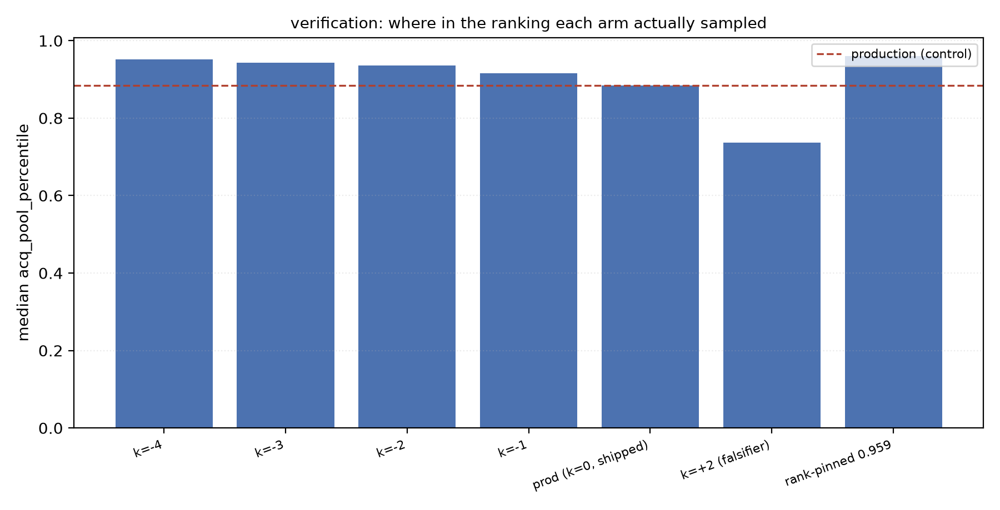
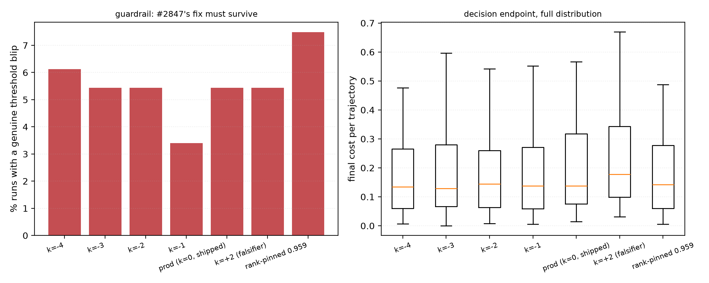

# Decoupling the acquisition threshold from the reporting threshold — the result

**Plan: `docs/plans/acquisition-inclusion-decoupling.md` (deleted on ship; the design now lives in
[`docs/ML.md`](../../ML.md#threshold-calibration)) ·
follow-up to #2847 / PR #2873 · base dev `e9b8ecde` · branch
`claude/acq-inclusion-decoupling` · GRID worktree
`/exp/sgreenberg/projects/vts-acq-incl` · experiment `/exp/sgreenberg/acq-incl` ·
SLURM 473253 / 473255 / 473272 / 473274 / 473276 / 473278 / 473367 ·
1064/1064 cells, 0 failures, 23 min, zero GPU**

## BLUF

**It works, and it is better than free.** Cutting the *selector's* threshold at
inclusion **−3** while reporting stays at 0 takes positives found from a median
of **4 to 18 per 100 votes (4.5×)** and *lowers* final cost from 0.137 to
**0.129** (paired median −0.011, 95% CI [−0.025, −0.005], p=8e-5), with
deep-spike incidence unchanged at 5.4%. Every pre-registered ship criterion
passes.

**The plan's central uncertainty is resolved, and not in the direction the
cautious reading suggested.** H2 asked whether more positives would just be
redundant labels — buying yield by sampling where the model is already
confident. They are not: the **ranking itself improves**. Average precision
rises 0.696 → **0.817** and oracle cost falls 0.113 → **0.101** (p=1e-5). Since
oracle cost is the best any threshold could do on that ranking, this is a
statement about the detector, not the cut. Positive starvation was the binding
constraint, exactly as #2790 and #2825 suspected.

**One recommendation reverses the plan's guess.** The plan proposed that if the
rank-pinned arm matched the best inclusion arm we should prefer it as the
simpler parameterisation. It does not match — 6 positives against 18 — and the
reason is the finding worth keeping (see *Why pinning the rank fails*).

## The mechanism is confirmed, not assumed

Two things had to hold before any arm could be read.

**The lever moved, and by how much.** Every arm emits where its cut actually sat
in the pool distribution the selector ranks:

| arm | median `acq_pool_percentile` | shift vs control | steps where acq ≠ reporting |
|---|---:|---:|---:|
| `acq_m4` (k=−4) | 0.9518 | +0.0676 | 98% |
| `acq_m3` (k=−3) | 0.9426 | +0.0583 | 98% |
| `acq_m2` (k=−2) | 0.9357 | +0.0515 | 98% |
| `acq_m1` (k=−1) | 0.9154 | +0.0311 | 98% |
| `prod` (k=0) | 0.8842 | — | 0% |
| `acq_p2` (k=+2) | 0.7364 | **−0.1478** | 99% |
| `rank_pin` (0.959) | 0.9600 | +0.0758 | 100% |

**The falsification arm falsified.** `acq_p2` (k=+2, the wrong direction) moved
the cut *down* the ranking and made everything worse: positives 4 → **3**
(p<1e-5), final cost 0.137 → **0.178**, oracle cost 0.113 → 0.154. Had it not,
no other arm here would have been interpretable.

## Result

| arm | positives @100 | positives @50 | final cost | final AP | oracle cost | genuine blips |
|---|---:|---:|---:|---:|---:|---:|
| `acq_m4` (k=−4) | **19** | 6 | 0.134 | 0.802 | 0.101 | 6.1% |
| **`acq_m3` (k=−3)** | **18** | 5 | **0.129** | **0.817** | **0.101** | 5.4% |
| `acq_m2` (k=−2) | 11 | 4 | 0.144 | 0.808 | 0.115 | 5.4% |
| `acq_m1` (k=−1) | 6 | 4 | 0.138 | 0.772 | 0.113 | 3.4% |
| `prod` (k=0, shipped) | 4 | 3 | 0.137 | 0.696 | 0.113 | 5.4% |
| `acq_p2` (k=+2) | 3 | 3 | 0.178 | 0.635 | 0.154 | 5.4% |
| `rank_pin` (0.959) | 6 | 5 | 0.142 | 0.815 | 0.110 | 7.5% |

Paired at the `(category, seed)` cell against `prod`, 147 cells:

| arm | positives Δ | final cost Δ | 95% CI on mean cost Δ | oracle cost Δ | p (cost) |
|---|---:|---:|---:|---:|---:|
| `acq_m4` | **+11** | −0.009 | [−0.0236, −0.0067] | −0.009 | 7e-4 |
| **`acq_m3`** | **+10** | **−0.011** | **[−0.0254, −0.0045]** | −0.011 | 8e-5 |
| `acq_m2` | +4 | −0.009 | [−0.0243, −0.0094] | −0.006 | 3e-5 |
| `acq_m1` | +2 | −0.007 | [−0.0191, −0.0033] | −0.004 | 1e-2 |
| `rank_pin` | +2 | −0.011 | [−0.0217, −0.0042] | −0.009 | 3e-3 |
| `acq_p2` | **−1** | **+0.021** | [+0.0198, +0.0398] | +0.013 | <1e-5 |

**The optimum is interior at k=−3.** k=−4 buys one more positive but costs
0.005 more and nudges deep-spike incidence up (5.4% → 6.1%). The curve is steep
between 0 and −3 and flat-to-worsening past it.

### Ship rule (pre-registered)

Adopt iff positives rise (p<0.05) **and** the 95% upper bound on the final-cost
delta is below +0.01 **and** deep-spike incidence does not rise **and** the
lever moved. `acq_m1`, `acq_m2`, `acq_m3`, `acq_m4` and `rank_pin` all pass;
**`acq_m3` is the recommendation** on magnitude and on the reading below.

## A reading caveat that picks the winner

For `acq_m2` and `rank_pin` the *paired* delta is negative while the arm's own
marginal median is **higher** than the control's (0.144 and 0.142 vs 0.137).
That is not a contradiction: 63% and 59% of cells respectively improve, but a
minority get much worse (worst cell deltas +0.12 and +0.11), which drags the
marginal median up. The paired test is the correct one — it is what controls for
category and seed, and it is what the ship rule reads.

**`acq_m3` is the only arm where both readings agree**: its marginal median
(0.129) *and* its paired delta (−0.011) both improve. That is an additional and
independent reason to prefer it over `acq_m2`, and it is not visible in the
paired table alone.

## Why pinning the rank fails — the finding to keep

`rank_pin` sits at the *highest* sampling position of any arm (0.9600, above
even k=−4) and yet returns 6 positives against `acq_m3`'s 18. The two arms are
**tied at t=50** (5 positives each); `rank_pin` then stalls while `acq_m3`
triples.

The difference is that a pinned quantile is **constant** and an inclusion cut is
**adaptive**:

| arm | acq percentile, t≤20 | t 21–60 | t 61+ | std |
|---|---:|---:|---:|---:|
| `prod` | 0.7247 | 0.8660 | 0.9105 | — |
| `acq_m3` | 0.8403 | 0.9320 | 0.9608 | 0.0547 |
| `rank_pin` | 0.9599 | 0.9600 | 0.9607 | **0.0026** |

`acq_m3` starts conservative and *ramps*: early on the anchored mixture is wide
and uncertain, so the tilt has little leverage and the cut stays near the
reporting line; as the fit sharpens, the cut climbs. `rank_pin` is maximally
aggressive from step 1 — it samples the top of a ranking produced by a model
trained on almost nothing, which spends votes without informing the model, so
the flywheel never starts.

**The ramp is not a parameter anyone chose; it falls out of the estimator's own
uncertainty.** That is a good argument for keeping the inclusion
parameterisation rather than the "simpler" pinned one, and it is the same shape
#2841 found for the blend schedule: what a knob does early matters more than
where it ends up. It also means the plan's H4 (a schedule beats a constant) is
supported without needing its own arm — the inclusion arms *are* the schedule,
and they beat the constant 18 to 6.

## Guardrails

- **#2847's fix survives.** Genuine threshold blips (a deep spike on a ranking
  that was not already hopeless): `prod` 5.4% → `acq_m3` 5.4%. Unchanged.
  `acq_m1` is nominally best at 3.4%; `rank_pin` is worst at 7.5%, consistent
  with its early aggression.
- **Nothing regressed on the reporting side by construction** — every arm's
  metrics are cut at inclusion 0, verified by the `acq_threshold` /
  `threshold` split on 98% of steps.
- The same 5 of 152 cells found **zero positives in 100 votes** in every arm,
  as in #2847. They are excluded from all 147-trajectory counts.

## Recommendation

1. **Ship `acq_inclusion = −3` for the acquisition path**, reporting unchanged
   at inclusion 0. It is the interior optimum, it is the only arm that improves
   on both the paired and marginal readings, and it recovers *twice* the
   positives the conformal path found before the fused threshold landed (18 vs
   the 9 measured in PR #2873) while also lowering cost.
2. **Do not ship the rank-pinned form**, despite its appealing simplicity — the
   adaptive ramp is doing the work.
3. **Settle the product question before shipping**, not after. Autopilot will
   serve items from a position the visible decision line no longer marks. That
   is probably an improvement for the user, but it is a change to what the
   interface implies, and the #2847 regression this run fixes got in precisely
   as an unnoticed side effect of a change made for another reason.
4. ~~**Run the generalisation check.**~~ **Done — and it did not transfer.
   See [`REPORT_REGION_VOTING.md`](REPORT_REGION_VOTING.md) (issue #2877).** On
   `visual_genome_m × siglip` region voting the *mechanism* reproduces exactly:
   the lever moves further (+0.121 vs +0.058), positives go 6 → 12, the
   falsifier falsifies, and the adaptive ramp is identical. But `-3` **fails
   this ship rule there** — cost CI [+0.003, +0.022] against a +0.01 tolerance —
   because aggressive acquisition sharpens the *top* of the ranking (AP +0.012,
   p<1e-5) while degrading its *global* separability (oracle cost +0.015), and
   reported cost follows the second. Only `k=-1` passes. #2861's warning was
   right; the recommendation is now to gate the offset by voting mode rather
   than ship one global value.

## Figures






## Reproducing

```bash
cd /exp/$USER/projects/vts-acq-incl/scripts/experiments/calibration
python selftest_analyze_acq.py            # planted-answer test; run first
CALIB_N_SEEDS=8 bash launch_acq_incl.sh   # 7 arms x 152 cells, ~23 min, no GPU
python analyze_acq.py                     # once all seven drain
```

16 unit tests in `tests_lib/detectors/test_acq_inclusion.py` pin the direction
in both directions, the nesting contract, the blend-fallback behaviour and the
argument guards. The analyzer's self-test plants a stuck lever (must be reported
as having measured nothing) and a failed falsification arm (must withhold the
verdict).
