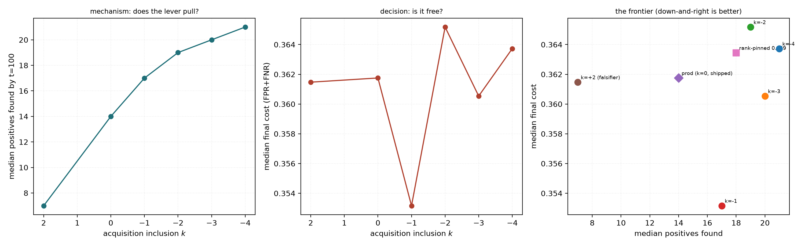
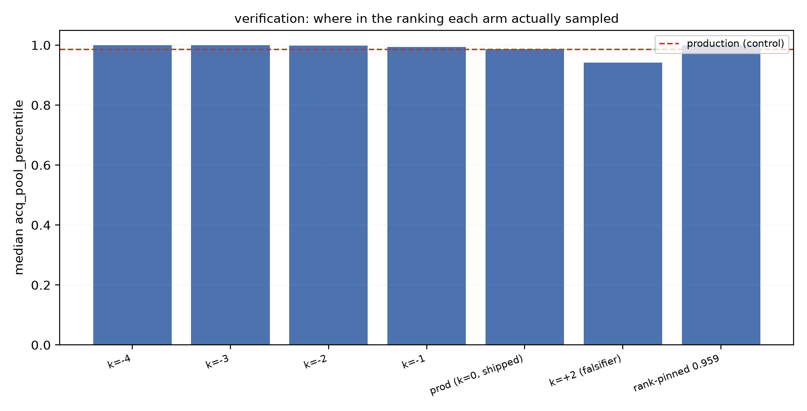
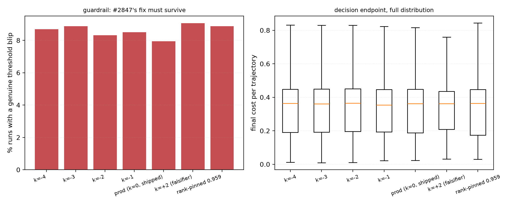

# The acquisition offset under real region voting — and why the voting-mode gate should not be built

**Issue #2905 · third environment for `ACQUISITION_INCLUSION_OFFSET` · follow-up to
#2876 (COCO), #2877/PR #2891 (VG binary) and #2878 (which shipped `-3`) ·
base dev `84789040` · branch `run/acq-region-2905` · GRID worktree
`/exp/sgreenberg/projects/vts-acq-region` · experiment
`/home/hltcoe/sgreenberg/experiments/acq-region-2905` ·
SLURM 481775–481781 · 3864/3864 cells, 0 failures, 0 zero-byte, ~5h, zero GPU**

## The premise, verified before the run rather than after it

`visual_genome_m × dinov3_patch × max_patch` carries **`patch_grid` on 4193/4193
medias**. The dragged ground-truth box is genuinely pooled over patches, scoring
genuinely max-pools over region nodes, and the run blends under **`slow_cap50`**,
the region schedule #2849 shipped. **This is the first real region-voting
measurement of the offset.**

For contrast, checked in the same pass: `visual_genome_m × siglip` — the arm
#2877 believed was region voting — has `patch_grid` on **0/4193**.

The check is now a gate, not a habit: `preflight.sh --require-region-voting
visual_genome_m:dinov3_patch` opens the pickle and refuses to submit without the
geometry. No fallback warning fired in any of 3864 cells.

## BLUF

**Do not build the voting-mode gate. Ship `-1` globally and revert `-3`.**

Under real region voting the shipped `-3` **passes its pre-registered ship
rule** — positives 14 → 20 per 100 votes, final-cost CI [−0.0034, +0.0095]
against a +0.01 tolerance, spikes flat. Taken alone that reads as a third
endorsement.

It should not be taken alone, for two reasons.

**1. The three environments split by environment, not by mode.** `-3` ships on
`coco_val × siglip2` (binary), *fails* on `visual_genome_m × siglip` (binary),
and passes here (region). The largest disagreement is *within* binary voting, so
a mode gate cannot resolve it — it would harden a split along an axis that
doesn't carry it. **`-1` is the only value that passes in all three.**

**2. The mechanism `-3` was sold on is absent here.** #2876 justified the offset
by the ranking improving (AP 0.696 → 0.817). Paired on the same 536 cells,
`k=-3` moves AP **+0.0283 under binary voting and +0.0003 under region voting**
(difference-in-differences −0.0281, CI [−0.0361, −0.0202]). Meanwhile the *cost*
side of the mechanism — oracle cost rising, the ranking's tail blurring — is
present in **both** modes. Region voting pays the bill and receives none of the
goods; what it gets is more positives the model learns nothing from.

So `-3` passes here on an endpoint that barely moves, while the endpoint the
recommendation was built on says the effect is gone.

## Lever verification

| arm | median `acq_pool_percentile` | shift vs control | steps where acq ≠ reporting |
|---|---:|---:|---:|
| `acq_m4` (k=−4) | 0.9995 | +0.0127 | 97% |
| `acq_m3` (k=−3, shipped) | 0.9990 | +0.0122 | 97% |
| `acq_m2` (k=−2) | 0.9975 | +0.0107 | 97% |
| `acq_m1` (k=−1) | 0.9940 | +0.0071 | 97% |
| `prod` (k=0) | 0.9869 | — | 0% |
| `acq_p2` (k=+2, falsifier) | 0.9410 | **−0.0458** | 97% |
| `rank_pin` (0.959) | 0.9995 | +0.0126 | 100% |

**The lever moved, but it has almost no room to move.** Production already
samples at the **98.7th percentile** here; the whole span from `prod` to `k=-4`
is **+0.0127**, against **+0.1213** for the same k in #2877's binary
environment — ten times less headroom. Region voting's cut already sits where
the offset wants to push it.

**The falsifier falsified**, on the endpoints that are live here: positives
14 → 7 (mean Δ −4.73, p<1e-20) and AP −0.0153 (p<1e-5).

**The ramp reproduces**, as in both prior environments — the cut climbs with
votes, and the pinned arm doesn't:

| arm | t≤20 | 21–60 | 61+ | std |
|---|---:|---:|---:|---:|
| `prod` | 0.9783 | 0.9848 | 0.9890 | 0.0238 |
| `acq_m3` | 0.9928 | 0.9985 | 0.9995 | 0.0195 |
| `rank_pin` | 0.9986 | 0.9990 | 0.9995 | **0.0055** |

## Result

541 trajectories per arm (11 of 552 cells never found a positive in 100 votes —
the *same* 11 in every arm, so no arm is advantaged).

| arm | positives @100 | @50 | final cost | final AP | oracle cost | blips |
|---|---:|---:|---:|---:|---:|---:|
| `acq_m4` (k=−4) | **21** | 12 | 0.364 | 0.443 | 0.321 | 8.7% |
| `acq_m3` (k=−3) | 20 | 11 | 0.361 | 0.443 | 0.314 | 8.9% |
| `acq_m2` (k=−2) | 19 | 10 | 0.365 | 0.444 | 0.312 | 8.3% |
| `acq_m1` (k=−1) | 17 | 9 | **0.353** | **0.449** | 0.315 | 8.5% |
| `prod` (k=0) | 14 | 7 | 0.362 | 0.447 | **0.310** | **7.9%** |
| `acq_p2` (k=+2) | 7 | 4 | 0.361 | 0.442 | 0.326 | 9.1% |
| `rank_pin` | 18 | 10 | 0.363 | 0.440 | 0.314 | 8.9% |

Paired at the `(category, seed)` cell against `prod`, n=541:

| arm | positives Δ | cost Δ | 95% CI on cost | p | oracle Δ | p | AP Δ | p |
|---|---:|---:|---:|---:|---:|---:|---:|---:|
| `acq_m4` | +5.48 | +0.0039 | [−0.0028, **+0.0107**] | 0.46 | **+0.0055** | 1e-4 | −0.0006 | 0.17 |
| `acq_m3` | +4.92 | +0.0029 | [−0.0034, +0.0095] | 0.80 | **+0.0039** | 0.004 | +0.0003 | 0.62 |
| `acq_m2` | +4.06 | +0.0024 | [−0.0028, +0.0079] | 0.49 | **+0.0026** | 0.005 | +0.0003 | 0.34 |
| **`acq_m1`** | +2.23 | **−0.0026** | [−0.0085, +0.0035] | 0.19 | −0.0017 | 0.72 | +0.0019 | 0.42 |
| `rank_pin` | +2.94 | −0.0004 | [−0.0064, +0.0056] | 0.75 | +0.0028 | 0.042 | +0.0002 | 0.23 |
| `acq_p2` | **−4.73** | +0.0026 | [−0.0063, +0.0110] | 0.11 | +0.0046 | 0.20 | **−0.0153** | <1e-5 |

### Ship rule (pre-registered)

**ADOPT: `acq_m3`, `acq_m2`, `acq_m1`, `rank_pin`.** Only `acq_m4` fails, on
cost (CI upper bound +0.0107 against a +0.01 tolerance).

`acq_m1` is the only aggressive arm whose cost point estimate is *negative* and
whose oracle cost does not degrade significantly.

## The decomposition: which half of the mechanism transferred

Splitting final cost into `oracle_cost` (how separable the learned ranking is)
and `regret = cost − oracle_cost` (how well the cut sits on it):

| arm | Δ oracle cost | p | Δ regret | p |
|---|---:|---:|---:|---:|
| `acq_m4` | +0.0055 | **1e-4** | −0.0016 | 0.06 |
| `acq_m3` | +0.0039 | **0.004** | −0.0010 | 0.11 |
| `acq_m2` | +0.0026 | **0.005** | −0.0002 | 0.30 |
| `acq_m1` | −0.0017 | 0.72 | −0.0009 | 0.38 |

**Regret is flat** — the cut estimator is blameless, exactly as #2877 found. The
cost pressure is the *ranking* degrading. What is new is that it degrades
**without the compensating gain at the head**.

### The controlled mode contrast

#2877 and this run share the dataset, the **same 23 categories**, the same 24
seeds and the same seven arms, so they pair cell-for-cell — the only controlled
voting-mode contrast available for this knob.

Response to `k=-3`, paired on 536 shared cells:

| endpoint | binary (#2877) | region (#2905) | region − binary |
|---|---:|---:|---:|
| **AP (head)** | **+0.0283** | +0.0003 | **−0.0281** [−0.0361, −0.0202] |
| **oracle cost (tail)** | +0.0084 | +0.0039 | −0.0047 [−0.0122, +0.0028] |
| positives | +7.01 | +4.92 | **−2.13** [−2.98, −1.30] |
| final cost | +0.0123 | +0.0029 | −0.0096 [−0.0200, +0.0007] |

> **The tail-blurring is mode-invariant. The head-sharpening is binary-only.**

And the levels differ enormously at `prod`: region voting starts with **14
positives against binary's 6**, AP **0.448 against 0.347**, oracle cost **0.309
against 0.395**. Region voting is simply a much better detector on this data —
which is the obvious candidate explanation for why the offset has nothing left
to fix.

**Confound, stated plainly:** region voting is only reachable with a patch
embedder, so "region vs binary" here is inseparably "`dinov3_patch` vs
`siglip`". Nothing can separate them — a single-vector embedder cannot
region-vote by construction. The pairing removes category, seed, prevalence and
exemplar draw, which is what makes the *response* comparable; it does not make
the levels comparable.

## A correction I had to make to my own analysis

The obvious unifying story is that the offset is a **starvation remedy**: it
pays where the detector has few positives, and region voting simply sits at the
well-supplied end of one shared curve. Binning cells by how many positives
`prod` found produced exactly that curve, in both modes.

**In region voting that curve was an artefact.** Binning on `prod`'s own
positives and then reading a delta measured *against that same `prod` run* lets
mean reversion manufacture the decline. Re-cut on two axes measured
independently of either arm — the category's `realized_prevalence`, and a
leave-one-out baseline (the mean `prod` positives of the category's *other*
seeds) — the slope of the AP response:

| mode | axis | slope | 95% CI |
|---|---|---:|---:|
| binary | log prevalence | −0.0207 | [−0.0259, −0.0159] |
| binary | log1p LOO baseline | −0.0402 | [−0.0491, −0.0319] |
| binary | log1p **own** baseline | −0.0362 | [−0.0448, −0.0289] |
| region | log prevalence | −0.0010 | [−0.0052, +0.0028] |
| region | log1p LOO baseline | −0.0034 | [−0.0089, +0.0017] |
| region | log1p **own** baseline | −0.0074 | [−0.0117, −0.0036] |

**Under binary voting the starvation law is real** — it survives both clean
axes, and at comparable strength. The crossover is sharp: at the most starved
LOO quintile, `k=-3` moves AP **+0.0814** and oracle cost **−0.0253** (it helps
*globally*); at the richest, AP +0.000 and oracle cost **+0.0356**.

**Under region voting it is not there.** Significant on the contaminated axis
and gone on both clean ones — the signature of mean reversion, not mechanism.

This matters for the decision, because the two readings recommend opposite
things. **The prevalence bins are identical across the two studies** (prevalence
is a property of the category, and the categories are the same 23). So the modes
can be compared at *matched* starvation — and at the most starved bin
(prevalence 0.006–0.014) binary gains **+0.0391** while region gains **+0.0091
(n.s.)**. Region voting is therefore **not** merely sitting at the rich end of a
shared curve: at equal starvation it still does not benefit.

The mode difference is real and is not reducible to supply.

## Why the gate still should not be built

That last result is the strongest argument *for* a gate, so it deserves the
direct answer: a gate would be the right shape only if voting mode were the axis
the disagreement runs along. It is not.

- Within **binary voting**, `-3` ships on COCO and fails on VG. A mode gate
  leaves that disagreement exactly where it is, and it is the larger one
  (cost CI [+0.0033, +0.0215] against a +0.01 tolerance).
- Under **region voting**, the finding is not "a different value is better" but
  "the ranking benefit is absent at every value tested". Region voting is not
  asking for its own constant; it is asking for a conservative one.
- `-1` satisfies both: it is the only value passing in all three environments,
  and here it is the *only* aggressive arm with a negative cost estimate and no
  significant oracle-cost damage — while still buying positives (14 → 17,
  p<1e-20).

A gate would also add a second mode-derived decision, and the two would not
agree — see below.

## Recommendation

1. **Set `ACQUISITION_INCLUSION_OFFSET = -1`** (from `-3`), globally, ungated.
2. **Do not add `ACQUISITION_INCLUSION_OFFSET_BY_MODE`.**
3. **Record the asymmetry with `PRODUCTION_SCHEDULE_BY_MODE` as intended, not as
   a bug.** #2841/#2849 measured the blend schedule to differ by mode; this run
   measured the offset *not* to. Two knobs re-cutting the same mixture may
   legitimately disagree about whether the mode matters, because they were each
   measured.

**The cost of this recommendation, stated honestly:** on a starved COCO-like
environment, `-1` finds 6 positives per 100 votes where `-3` finds 18. That is a
real loss and it is the strongest case against this change. It is outweighed
because `-3`'s advantage rests on **one** environment, a second binary
environment rejects it outright, and the mechanism it was justified by is absent
in the third. `-1` is the value with no measured harm anywhere.

**The better fix is not a mode gate — it is a supply-dependent offset.** Under
binary voting the benefit is sharply concentrated in starved cells and turns
*negative* in well-supplied ones, on arm-independent axes. The detector knows
its own positive count at run time. An offset that is aggressive while starved
and relaxes as positives accumulate would capture COCO's 4.5× gain without
charging VG's tail — and it subsumes the mode question, since mode only ever
entered through supply. Filed as **#2910**.

## If the gate is built anyway — the implementation the issue proposed is wrong

The issue suggests keying on `ctx.embedder_type == "patch_semantic"` and
checking it agrees with `_patch_embedder_for_snap`. **They do not agree.**

- `_patch_embedder_for_snap(snap)` reads the **dataset's** patch slot, and is
  what `_blend_schedule_for_snap` already gates the schedule on.
- `ctx.embedder_type` is the detector's **locked** type, and is `""` for a
  legacy detector — deliberately: that empty value *is* the pre-type migration
  path (`vtscore/embedding/binding.py`, `detector_dataset_compatible`).

A legacy detector on a patch dataset therefore gets `slow_cap50` (region) from
the schedule gate and would get **binary** from an `embedder_type`-derived
offset gate — reintroducing, in a new place, the exact inconsistency #2905
exists to close.

The right shape is not a read-time derivation at all. `_fused_threshold` already
holds `clips_dict` when it parks the estimator on `det_ctx.anchored_cut_cache`
(`vtscore/detectors/training.py:201`). Stamping the resolved mode **there**
makes it travel with the estimator it applies to, resolved from the same snap in
the same call as the schedule, so the two cannot drift.

## Guardrails and caveats

- **The decision endpoint is well measured here, and it genuinely barely
  moves.** Paired SD on `final_cost` is **0.0709** — n=541 gives a half-width of
  **±0.0060**, tighter than either prior environment (#2877 needed 24 seeds to
  reach ±0.0091). Median cost across all seven arms spans **0.012**. Even the
  falsifier, which halves positives and moves AP by −0.015, moves cost by
  +0.0026 (p=0.11). Cost is insensitive to acquisition under region voting; that
  is a result, not a power failure.
- **Deep-spike thresholds are absolute and COCO-calibrated.** Base incidence
  here is 7.9% (COCO 5.4%, VG binary 23.7%) — cost sits near 0.36 and
  `SPIKE_DEEP_COST` is 0.25. Read the paired McNemar, not the base rate. No arm
  rises significantly (worst: `acq_p2`, 7.9% → 9.1%, p=0.39).
- **Cost deltas are tail effects.** Median paired delta is exactly 0.000 for
  every negative-k arm; the mean is carried by an asymmetric tail (14.4% of
  cells >0.05 worse at `k=-3` against 12.4% better).
- **`rank_pin` passes here, having failed in both prior environments** — and for
  a third distinct reason. It stalled on COCO (6 positives against 18) and
  regressed cost on VG binary (+0.0299); here it is simply unremarkable (+2.94
  positives, cost flat). Note its nominal 0.959 realizes at pool percentile
  **0.9995** here against 0.9633 in #2877 — the pinned quantile is taken on the
  simulation set and read out on the pool, and the two map very differently
  under max-pooling. That is an observation, not a verified mechanism; it is
  worth a look if the pinned form is ever revisited. Three environments, three
  different failure modes, no case for shipping it.
- **11 of 552 cells never found a positive** and drop out of every paired test,
  identically in all arms.
- Seeds were **declared at 48 and 24 run**, so a top-up is `--seeds 24-47` with
  every existing cell keeping its index. Not needed: the realized half-width is
  inside the ship rule's tolerance by 40%.

## Reproducing

```bash
source /home/hltcoe/sgreenberg/experiments/acq-region-2905/env.sh
bash scripts/experiments/calibration/launch_acq_region_2905.sh --seeds 24
bash /home/hltcoe/sgreenberg/experiments/acq-region-2905/status_2905.sh 24
python scripts/experiments/calibration/analyze_acq.py     # -> analysis/REPORT_acq.md
```

Mechanism analyses (`deep.py`, `modes.py`, `starve.py`, `starve2.py`) live
beside the experiment; `starve.py` is retained deliberately as the contaminated
version `starve2.py` corrects.

Raw analyzer output is `GENERATED_TABLES_REGION_VOTING.md` beside this file.






