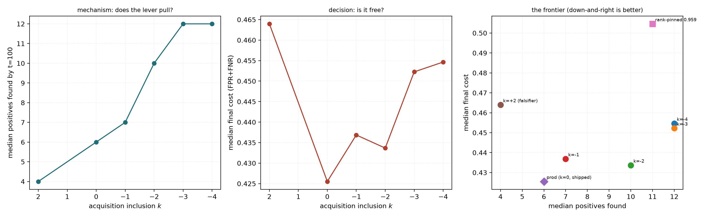
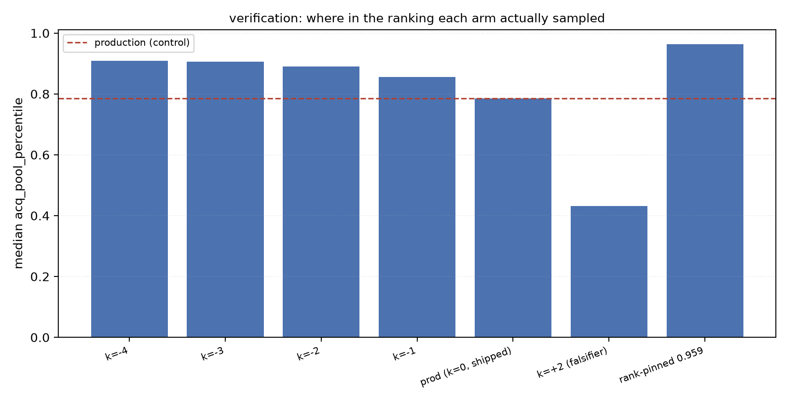
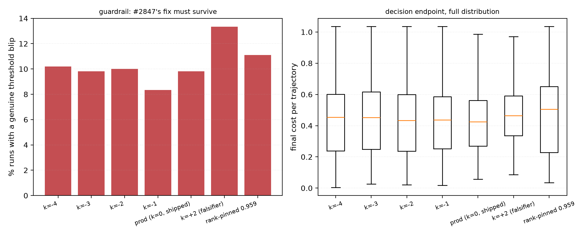

# The acquisition cut in a second environment — and the region-voting check that still has not been run

**Issue #2877 · follow-up to #2876 (the COCO result) and #2878 (which shipped `-3`) ·
base dev `c83b0e08` · branch `claude/acq-incl-vg-2877` · GRID worktree
`/exp/sgreenberg/projects/vts-acq-vg` · experiment `/exp/sgreenberg/acq-vg` ·
SLURM 476552 / 476554 / 476587 / 476589 / 476591 / 476593 / 476595 ·
3864/3864 cells, 0 failures, 86 min, zero GPU**

> ## Read this first — the environment is not what #2877 asked for
>
> #2877 pre-registered `visual_genome_m × siglip` as a **region-voting**
> environment, and justified the whole check on region voting's scoring
> geometry: *"a media's score is a max over ~24 region-node scores, so the Bad
> mode is an extreme-value statistic."*
>
> **That premise is false for that arm, and I ran it before checking.**
> `region_voting=True` is a *request*, not a guarantee. `_good_training_vec`
> pools the dragged box only when a media carries a stored `patch_grid`, and
> falls back to the whole-image embedding otherwise. `visual_genome_m__siglip`
> has **no `patch_grid` and no `patch_regions`** — verified directly: the
> region-voting training vector is byte-identical to the whole-image vector on
> 200/200 medias carrying a box. So this run:
>
> - trained on **whole-image** Good-vote vectors (the box was never pooled),
> - scored **whole-image** (`region_aware=False`, no max-pool over regions),
> - and blended under **`cap50`** — the *binary*-mode production schedule.
>
> **This is a second BINARY-voting environment.** Every number below stands;
> what changes is what it is evidence *about*. Region voting needs a patch
> embedder (`dinov3_patch`), and **that check has still not been run.**
>
> The harness invited the mistake — `experiment_config.py` labelled the whole VG
> block "region voting" — and both are now fixed: the docstring is corrected and
> `simulate_voting_iterations` warns when `region_voting=True` is requested
> without a patch grid.

## BLUF

**The mechanism generalises. The `-3` operating point does not — and it fails in
another *binary* environment, which is worse news than a voting-mode split.**

On `visual_genome_m × siglip` the lever pulls *harder* than on COCO (+0.121 pool
percentile against +0.058, on 96% of steps) and still buys real positives: **6 →
12 per 100 votes** at `k = -3`. But the payoff inverts. Cost degrades roughly
monotonically in `|k|`, and **the shipped `-3` fails the pre-registered ship
rule**: 95% CI on the mean final-cost delta **[+0.003, +0.022]** against a
tolerance of +0.01.

**`k = -1` is the only arm that passes.** It is not an interior optimum in the
sense COCO had one — the lowest-cost arm here is `prod` itself. It is a
*constrained* optimum: the most aggressive offset whose penalty is certifiable.

**Since both measured environments are binary voting, `-3` is not "over-fitted
to binary voting" — it is over-fitted to `coco_val × siglip2`.** A voting-mode
gate is *not* supported by this run. What is supported is that one environment
is not enough to set this constant.

## The mechanism is confirmed, not assumed

**The lever moved, further than on COCO:**

| arm | median `acq_pool_percentile` | shift vs control | steps where acq ≠ reporting |
|---|---:|---:|---:|
| `acq_m4` (k=−4) | 0.9088 | +0.1242 | 96% |
| `acq_m3` (k=−3) | 0.9059 | +0.1213 | 96% |
| `acq_m2` (k=−2) | 0.8904 | +0.1058 | 96% |
| `acq_m1` (k=−1) | 0.8550 | +0.0704 | 96% |
| `prod` (k=0) | 0.7846 | — | 0% |
| `acq_p2` (k=+2) | 0.4315 | **−0.3531** | 97% |
| `rank_pin` (0.959) | 0.9633 | +0.1787 | 100% |

**The falsification arm falsified, on every endpoint.** `acq_p2` (k=+2):
positives 6 → **4** (p<1e-5), final cost +0.033 (p<1e-5), oracle cost +0.016
(p<1e-5), AP −0.018 (p<1e-5), and it is the one arm whose deep-spike incidence
rises significantly (23.7% → 28.5%, p=0.010).

## Result

| arm | positives @100 | positives @50 | final cost | final AP | oracle cost | deep spikes |
|---|---:|---:|---:|---:|---:|---:|
| `acq_m4` (k=−4) | **12** | 7 | 0.455 | 0.370 | 0.414 | 26.7% |
| `acq_m3` (k=−3, shipped) | **12** | 6 | 0.452 | **0.371** | 0.410 | 26.9% |
| `acq_m2` (k=−2) | 10 | 5 | 0.434 | 0.362 | 0.407 | 25.0% |
| **`acq_m1` (k=−1)** | 7 | 4 | 0.437 | 0.350 | 0.401 | 23.5% |
| `prod` (k=0) | 6 | 4 | **0.426** | 0.349 | **0.395** | 23.7% |
| `acq_p2` (k=+2) | 4 | 3 | 0.464 | 0.313 | 0.410 | 28.5% |
| `rank_pin` (0.959) | 11 | 6 | 0.505 | 0.362 | 0.449 | 27.0% |

Paired at the `(category, seed)` cell against `prod`, 540 cells:

| arm | positives Δ | final cost Δ | 95% CI on mean cost Δ | p (cost) | AP Δ | p (AP) |
|---|---:|---:|---:|---:|---:|---:|
| `acq_m4` | **+5** | +0.000 | [−0.0003, +0.0183] | 0.32 | +0.012 | <1e-5 |
| `acq_m3` | **+4** | +0.000 | **[+0.0033, +0.0215]** | 0.25 | +0.012 | <1e-5 |
| `acq_m2` | +3 | +0.000 | [−0.0070, **+0.0109**] | 0.48 | +0.012 | <1e-5 |
| **`acq_m1`** | +1 | −0.002 | **[−0.0095, +0.0075]** | 0.23 | +0.004 | 1e-4 |
| `rank_pin` | +5 | +0.015 | [+0.0196, +0.0401] | <1e-5 | +0.007 | <1e-5 |
| `acq_p2` | **−1** | +0.033 | [+0.0281, +0.0458] | <1e-5 | −0.018 | <1e-5 |

### Ship rule (pre-registered)

Only **`acq_m1`** passes. `acq_m3` and `acq_m4` fail on cost; `rank_pin` fails
outright. **`acq_m2` fails by 0.0009** — CI upper bound +0.0109 against a +0.01
tolerance, inside the bootstrap's own resampling noise. Read it as "on the
boundary", not as a decision. It matters because k=−2 is where the ranking
benefit saturates.

## Why it fails — and it is not the threshold estimator

Decomposing final cost into `oracle_cost` (how good the ranking is) and
`regret = cost − oracle_cost` (how well the cut sits on it):

| arm | Δ oracle cost | Δ regret | p (regret) |
|---|---:|---:|---:|
| `acq_m1` | +0.000 | −0.000 | 0.23 |
| `acq_m2` | −0.002 | +0.000 | 0.58 |
| `acq_m3` | +0.000 | +0.000 | 0.59 |
| `acq_m4` | +0.001 | −0.000 | 0.28 |
| `acq_p2` | +0.016 | **+0.007** | **8e-10** |

**Regret is flat in every negative-`k` arm.** The cut estimator does its job
equally well wherever acquisition samples; only the falsifier degrades it. The
cost penalty is not a calibration failure — **the learned ranking itself gets
slightly worse** (oracle cost 0.395 → 0.410 at k=−3).

And yet **average precision rises** (0.349 → 0.371, median Δ +0.012, p<1e-5).
Together those are the finding:

> Aggressive acquisition **sharpens the top of the ranking and blurs the rest.**
> AP is dominated by the head of the list, so it improves. `oracle_cost` is
> `min_θ (FPR+FNR)`, a statement about *global* separability, so it degrades.
> Reported cost is a global cut, so it follows `oracle_cost`, not AP.

COCO did not show this because it was starved hard enough that any positive
helped everywhere: there oracle cost *fell* 0.113 → 0.101 (p=1e-5) and AP rose
0.696 → 0.817. This environment starts less starved — `prod` already finds 6
positives per 100 votes against COCO's 4 — so the marginal positive is worth
less while the sampling bias that buys it costs the same.

**The ranking benefit saturates before the cost penalty does.** Median AP Δ is
+0.004 at k=−1, +0.012 at k=−2, and unchanged at −3 and −4. Oracle cost only
starts drifting at −3. Everything −3 and −4 buy over −2 is extra *positives*
with no further ranking gain and a rising bill.

## What did transfer, unchanged

**The adaptive ramp.** The signature finding of #2876 reproduces exactly:

| arm | acq percentile, t≤20 | t 21–60 | t 61+ | std |
|---|---:|---:|---:|---:|
| `prod` | 0.6471 | 0.7745 | 0.7912 | 0.0671 |
| `acq_m3` | 0.7320 | 0.8882 | 0.9122 | 0.0897 |
| `rank_pin` | 0.9602 | 0.9622 | 0.9659 | **0.0024** |

**`rank_pin` is now worse in two environments for two different reasons** — on
COCO it stalled (6 positives against 18); here it finds them (11) and pays,
regressing cost (+0.015, p<1e-5), oracle cost (+0.008, p<1e-5) *and* posting the
second-worst deep-spike rate. #2876's "do not ship the pinned form" is
reinforced, and that conclusion does not depend on the voting-mode confusion.

## Guardrails and caveats

- **The deep-spike thresholds do not transfer.** `SPIKE_DEEP_COST=0.25` /
  `DEEP_EXCESS=0.20` were calibrated to COCO, where cost sits near 0.137; here
  cost sits near 0.43, so base incidence is **23.7% against COCO's 5.4%**. The
  *paired* McNemar contrast is still meaningful and is what the ship rule reads;
  the absolute rate is not comparable across the two reports. `acq_m3` is
  nominally +3.2 pp (p=0.093) — not significant, but pointing the same way as
  the falsifier's +4.8 pp (p=0.010).
- **The paired test is biased *against* the offset, and it still lost.** 12 of
  552 cells never found a positive in 100 votes and drop out — the *same 12 in
  every arm*, so no arm is advantaged, but any cell where `prod` never gets off
  the ground and a treatment arm does would also be dropped.
- **Cost deltas are tail effects, not shifts.** For k=−2/−3/−4 the *median*
  paired delta is exactly 0.000: most cells are unchanged. The k=−3 mean penalty
  (+0.012) comes from an asymmetric tail — 25.6% of cells more than 0.05 worse
  against 20.9% at k=−1. What the offset risks here is variance, not a uniform
  tax.
- **Marginal and paired readings agree here**, unlike COCO, so the reading
  caveat that picked COCO's winner does not arise.

## A sizing note worth keeping

This run is 24 seeds, not #2876's 8. The 8-seed pilot (kept at `results_8seed/`)
reproduced every qualitative finding but put a 95% CI of **[−0.014, +0.019]** on
the k=−3 cost delta — a null too wide to certify, spanning two *opposite*
decisions. Sizing does not travel with an arm table: this environment's costs
are ~3× COCO's and correspondingly noisier, and the observed paired SD of 0.111
implies **n≈473** for a ±0.010 half-width against the 180 that 8 seeds
delivered. The *positives* endpoint was over-powered at 8 seeds in both
environments, which is exactly how this hides.

## Recommendation

1. **Do not treat `-3` as settled.** It fails its own pre-registered ship rule
   in the second environment measured, and the failure has a mechanism rather
   than being noise.
2. **Do not gate on voting mode on the strength of this run.** Both environments
   measured are binary voting, so this run says nothing about region voting. My
   first draft of this report recommended that gate; it was wrong.
3. **Run the region-voting check that #2877 intended** —
   `visual_genome_m × dinov3_patch × max_patch`, the only VG arm that carries a
   `patch_grid` and `patch_regions` and therefore actually region-votes, scores
   by max-pooling, and blends under `slow_cap50`. Note the cost: those cells run
   ~75 min each against these ~2 min, so size deliberately.
4. **`-1` is the best-supported single global value** — the only one passing in
   both environments (on COCO it bought +2 positives at −0.007 cost). It leaves
   most of COCO's win on the table, which is the price of one number covering
   environments that disagree.
5. **Consider `-2`** if a +0.0009 tolerance breach reads as noise: it captures
   the *entire* ranking benefit for roughly half the cost exposure. Not
   recommended as written, because the rule should not be relaxed after seeing
   the number.
6. **Do not widen this grid.** Cost degrades monotonically past −4 and AP has
   already saturated.

## Reproducing

```bash
cd /exp/$USER/projects/vts-acq-vg/scripts/experiments/calibration
python selftest_analyze_acq.py               # planted-answer test; run first
bash launch_acq_incl_vg.sh                   # 7 arms x 552 cells, ~86 min, no GPU
python analyze_acq.py                        # once all seven drain
CALIB_N_SEEDS=8 RESULTS_ROOT=$CALIB_EXP/results_8seed bash launch_acq_incl_vg.sh   # the pilot
```

Raw analyzer output is in
[`GENERATED_TABLES_SECOND_ENVIRONMENT.md`](GENERATED_TABLES_SECOND_ENVIRONMENT.md).

## Figures






