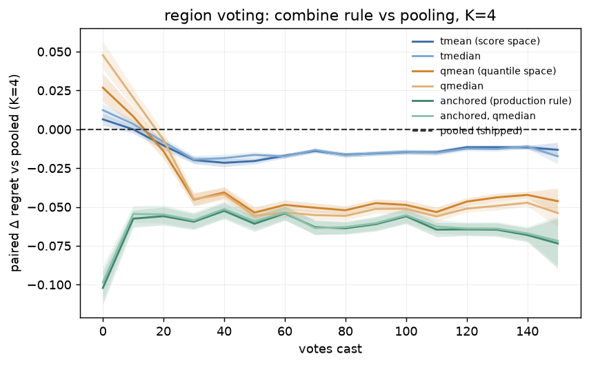
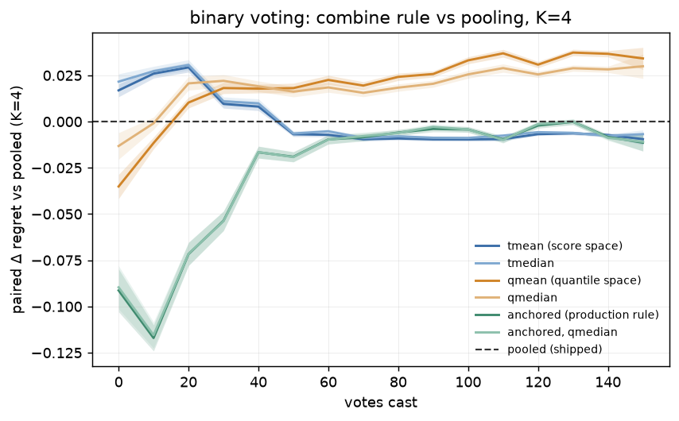
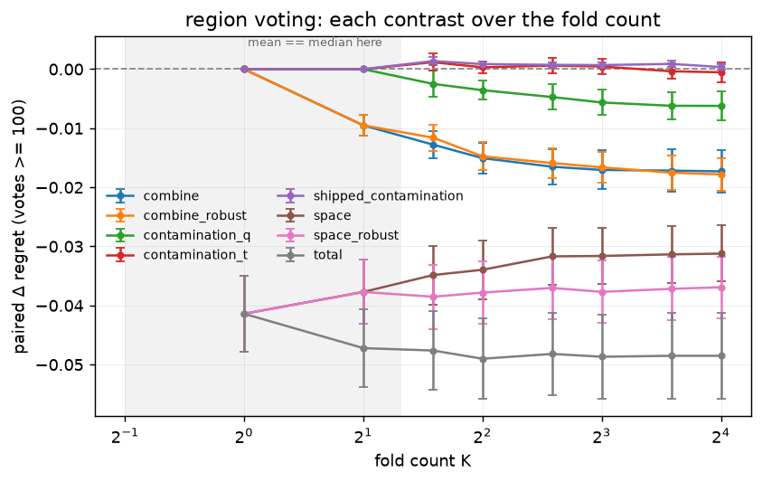

# Pooled or averaged? Which of two contradictory docstrings is right

**Issues [#3115](https://github.com/samggreenberg/VTSearch/issues/3115) (the
combine rule) and [#3116](https://github.com/samggreenberg/VTSearch/issues/3116)
(the instruments) · one run, by construction · harness PR pending · Refs #2897**

> **Status: complete, 2026-08-25.** Everything under *Design* was written before
> any cell existed and lives as module constants in
> `scripts/experiments/calibration/folds_combine_3115.py`, which applies it
> mechanically. Nothing in *Design* was edited after seeing a number — including
> the caveat about contamination exposure, which the run then confirmed.

## The question

Two functions in this repo disagree about the same empirical fact.

`threshold_from_fold_orderings` — the cross-calibration path the live app calls
— **pools** every fold's held-out scores into one bag and takes a single
conformal quantile. Its docstring justifies this:

> *"All folds' scores live on the same sigmoid scale, so the pool is
> exchangeable enough for the quantile rule."*

`FoldAnchoredCut._combined_fold_quantile` does the opposite — one cut per fold,
each converted to **that fold's own** quantile, then averaged — and says it
keeps each fold's haystack specifically *"to read a cut's quantile in the scale
it was measured on"*, i.e. it is built on the premise that fold scores are
**not** directly comparable.

One of those premises is wrong. Nobody has measured which.

## Design

### Arms

Every arm re-cuts the **same already-trained fold prefix**, so the whole table
costs arithmetic on cached arrays and no extra fits. Per fold count `K`:

| Arm | Rule |
|---|---|
| `folds_k{K}_xcal` | **the pooled control** — `threshold_from_fold_orderings` verbatim, i.e. today's behaviour |
| `folds_k{K}_tmean` / `_tmedian` | per-fold conformal cuts, averaged in **score** space |
| `folds_k{K}_qmean` / `_qmedian` | per-fold cuts carried to the final model as quantiles of **their own fold's haystack**, averaged, realized on the final scores |
| `folds_k{K}_anchored` | production's fold-anchored rule (`FOLD_ANCHOR_COMBINE` = `qmean`) |
| `folds_k{K}_anchored_qmedian` | the **same fit**, re-cut under the robust combine |
| `folds_k{K}_blend` | the retired `cap50` mix-in, kept for continuity with #2897 |

There is deliberately no `qpooled`: a pooled cut has no single fold haystack to
read a quantile in, so that cell of the 2×2 does not exist.

### The contrast is factored, not lumped

`qmean` vs pooled is what #3115 literally asks for, but it moves two things at
once. It is reported as its legs first:

| Contrast | Isolates |
|---|---|
| `tmean − pooled` | pooling vs **averaging**, space held fixed |
| `qmean − tmean` | score space vs **quantile** space, combine held fixed — the comparability premise itself |
| `*median − *mean` | **contamination** — a degenerate fold is silently *inside* a pooled quantile, weighted 1/K by a mean, and ~ignored by a median |
| `anchored_qmedian − anchored` | the same contamination question on the **shipped** rule rather than the retired one |
| `qmean − pooled` | the total |

### Acceptance checks (identities, not results)

Two properties hold by construction, so a failure means the harness is
mis-wired rather than that a rule performed badly. A study whose only checks are
its own headline columns cannot tell those apart.

- **`k1_score_space_is_pooled`** — averaging one number is the identity, so at
  `K=1` the score-space arm must reproduce the pooled threshold **exactly**, on
  every step. This is independent of everything the run measures.
- **`median_collapses_below_k3`** — the mean and median of at most two numbers
  coincide, so every median contrast must be identically zero below `K=3`.

The second is also *why this has never been asked*: production ships
`calibrate_count = 2`, exactly where the question is structurally invisible.

### Decision rules

Fixed before the run, in `folds_combine_3115.py`:

- **Deep regime** is ≥ 100 votes; the verdict reads `K ≥ 3` only.
- A contrast is **called for a side** only when its paired mean over cells
  exceeds *both* twice its own standard error **and** the pre-registered
  `MARGIN = 0.005`. Both halves are load-bearing: these runs pool hundreds of
  autocorrelated steps per cell, so the standard error gets small enough to
  resolve differences four orders of magnitude below the margin — real, and no
  reason to change a shipped rule.
- Otherwise the contrast is reported **unresolved**, which on this question is a
  genuinely useful answer: *"the two docstrings' premises make no difference
  worth acting on"* settles the disagreement as decisively as either winning.
- **Exposure is reported beside every robustness claim.** `any_dropped_rate` is
  the fraction of steps where at least one fold was too degenerate to contribute
  a cut. A near-zero rate means the median arms were tested against a hazard
  this grid never presented, and their result must be read that way.

### What this run structurally cannot see, and the gate that follows from it

Every arm is a **counterfactual re-cut** of a trajectory that lived under
production's rule, so the votes are held fixed. But the threshold is the rank
position Autopilot's Hard pick samples around: a different combine rule would
have collected *different votes*, and no screen holding the trajectory fixed can
see that. This is the same limit #2897's screen had, and there its live A/B
effect sank below the ship margin — a screen result is a **reason to book an
A/B, not a substitute for one**.

Pre-registered gate: **an A/B is booked only if the screen resolves a contrast
above `MARGIN` in the deep regime.** If the screen comes back unresolved, the
answer is "the disagreement does not matter enough to spend cluster time on",
and that is the finding.

### Grid

| | |
|---|---|
| Fold counts | K ∈ {1, 2, 3, 4, 6, 8, 12, 16} — same as #2897, so the fold-count axis stays comparable |
| Live count | `calibrate_count = 2` (the trajectory users get; every arm scored on the same votes) |
| Environment | **`vg_scale_any`** × {`siglip` → binary, `dinov3_patch`/`max_patch` → region} |
| Categories | all 12 classes; 300 positives each against one shared 3900-image negative pool |
| Prevalence | **7.1% in every cell**, by construction |
| Voting | derived **per cell** (boxes **and** a patch grid), never from the dataset name |
| Head | unset → `PRODUCTION_HEAD` (the linear SVM) |
| Sizing | 4 seeds × 150 steps → 96 cells |
| Inclusion | 0 |

#### Why not `visual_genome_m`

This study began on `visual_genome_m` + `caltech101_m`, the #2897 grid, and that
was the wrong instrument. Its selected categories run from **25** positives
(`banana`) to **1645** (`building`), and the thin end does not merely add noise:
the first two cells of the first attempt completed in seconds as **header-only
CSVs with zero rows** — `ball`, 51 positives in 4193 media, never reached a
trainable step. Such a file is non-empty, parses cleanly and passes
`find -size 0`, so it counts as a present cell while contributing nothing.

A threshold *is* a quantile of the calibration set. A grid whose calibration sets
differ 60-fold in size is confounding the axis the study reads, and a difference
between two combine rules could be a prevalence difference wearing a disguise.

`vg_scale_any` is #3156's hand-checked scale dataset with the box-size band
collapsed away (`class@band → class`), derived from the built `vg_scale` pickle
so it is provably the same images, boxes and label corrections. Its exclusion
semantics are preserved and are the part that matters: the 300 media that hold
one of the 12 classes at a size outside every band stay **evaluable on nothing**,
rather than becoming negatives — scoring them as negatives would penalise a
detector for finding a real bus, which is what #3156 exists to prevent.

Two further gains fall out. Both voting modes now come from **one** dataset, so
the mode contrast is no longer confounded with the dataset the way #2897's
caltech-vs-VG split was; and `caltech101_m` is dropped rather than kept as a
second binary environment, since a second *environment* is what the
pre-registered A/B gate below is for.

#### The cost of that choice, stated up front

Uniform 7.1% prevalence is what makes the combine and space legs clean, and it is
also the thing most likely to make the **contamination** legs read null: a
degenerate (single-class) fold is the hazard `qmedian` is robust to, and a
well-populated grid presents fewer of them. The exposure term is therefore
reported beside every robustness claim, and the cold-start windows — where even a
7.1% dataset yields folds with one or two positives — are where that exposure
lives. If `any_dropped_rate` comes back near zero in every window, the median
legs are untested rather than refuted, and the report must say so.

### Errata inherited from #2897, fixed here

- **The `voting` label was read from the dataset name.** Region voting needs
  boxes *and* a patch grid, so `visual_genome_m × siglip` runs whole-image and
  is a **binary** environment. #2897's report regrouped that cell into binary by
  hand while the analyzer's own column still called it region. It is now derived
  from `experiment_config.region_voting_for` — the same predicate the runner
  uses — so the next study does not have to know.
- **The launcher pinned `CALIB_HEAD=linear`**, which stopped being production at
  PR #3198. This run names no head.
- **Header-only cells were invisible.** A cell whose simulation never reached a
  trainable step writes its header and nothing else — non-empty, parseable, zero
  rows. The analyzer now counts and names them alongside zero-byte and
  unreadable cells, so "96/96 cells" cannot quietly mean something else.

## Results

**Run**: SLURM array 539811, **96/96 cells, 0 failures, 0 zero-byte, 0 unreadable,
0 header-only**, 1,342,324 rows. `vg_scale_any` × {`siglip`, `dinov3_patch`},
12 classes × 4 seeds, K ∈ {1,2,3,4,6,8,12,16}, `calibrate_count=2` live,
inclusion 0, `PRODUCTION_HEAD`. Analyzed at dev `e87c90956` + this branch.

> ### ⚠ Correction, 2026-08-25: the mode attribution is confounded
>
> This grid has exactly two cells — `vg_scale_any × siglip × whole_image`
> (labelled "binary") and `vg_scale_any × dinov3_patch × max_patch` (labelled
> "region"). **Voting mode and embedder are perfectly confounded.** Every claim
> below that attributes the `space` leg's sign flip to *voting mode* is equally
> consistent with attributing it to *the embedder* — e.g. "DINOv3's fold models
> have less comparable score scales than SigLIP's, so percentiles help." The data
> cannot separate the two.
>
> **What survives:** `combine` (averaging beats pooling) is measured *within*
> each cell, so the confound does not touch it. `tmean` remains the safe floor.
>
> **What does not:** every recommendation about *which* rule to use *where*. The
> sign flip is real; its attribution is not.
>
> The design was sold as removing a confound ("both voting modes from one
> dataset") — true of the **dataset**, while substituting the **embedder**.
> Preflight asserted that region voting genuinely *happens* on the DINOv3 cell;
> nothing asserted the contrast was *attributable* to it.
>
> The disambiguating run is cheap and is tracked in #3258: `dinov3_patch` can run
> `whole_image` alongside `max_patch` in the same cell, which fills the missing
> corner and decomposes mode from embedder. Read everything below as
> "cell A vs cell B", not "binary vs region", until that lands.
>
> **What that run can and cannot settle.** It makes one sharp prediction — if the
> `space` leg follows the *embedder*, `dinov3 × whole_image` should prefer
> percentiles like `dinov3 × max_patch` does; if it follows the *voting mode*, it
> should prefer raw scores like `siglip × whole_image` does. Those are
> distinguishable outcomes and one of them will be observed.
>
> It is still **one embedder for the mode contrast and one mode for the embedder
> contrast**, so it discriminates between two hypotheses rather than establishing
> either. A third outcome — the new cell landing between the two — would say the
> effect is neither cleanly, and would need a second patch embedder to take
> further.

### BLUF

**Both docstrings are wrong, and they are wrong in different places.**

- **Pooling loses to averaging in both voting modes.** The pooled path's stated
  reason — *"the pool is exchangeable enough for the quantile rule"* — does not
  survive contact: averaging the folds' own conformal cuts beats pooling their
  scores by **−0.0078 ± 0.0015** (binary) and **−0.016 ± 0.003** (region).
- **The comparability premise is mode-dependent, and that is the finding.** The
  anchored path keeps each fold's haystack *"to read a cut's quantile in the
  scale it was measured on"*. On **region** voting that is right and worth
  **−0.032 ± 0.005**; on **binary** voting it is wrong and costs
  **+0.036 ± 0.004**. Same rule, opposite sign, and one function serves both.
- **The contamination argument cannot fire at all** — not on this grid, and not
  on any grid. See *The third argument is prevented by construction*.
- **Nothing here indicts the shipped threshold.** Production's
  `fold_anchored_gmm_threshold` beats the pooled conformal cut in both modes
  (−0.0066 ± 0.0025 binary, **−0.063 ± 0.008** region), and swapping its combine
  to `qmedian` is a non-event (−0.0001 ± 0.0002, unresolved).

### The verdict table

Paired within the step, cell-mean ± SE over (class, seed, window), K ≥ 3, deep
windows (≥ 100 votes). Negative favours the first-named arm.

| leg | what it isolates | binary | region |
|---|---|---:|---:|
| `combine` — `tmean` vs pooled | pooling vs **averaging**, space fixed | **−0.0078 ± 0.0015** | **−0.016 ± 0.003** |
| `space` — `qmean` vs `tmean` | score vs **quantile** space, combine fixed | **+0.036 ± 0.004** | **−0.032 ± 0.005** |
| `total` — `qmean` vs pooled | what #3115 asked for | **+0.028 ± 0.004** | **−0.048 ± 0.007** |
| `anchored` vs pooled | production's rule vs the control | −0.0066 ± 0.0025 | **−0.063 ± 0.008** |
| `anchored_qmedian` vs `anchored` | the combine, on the **shipped** path | −0.0001 ± 0.0002 *(unresolved)* | +0.0008 ± 0.0002 *(below margin)* |

`moved_rate` is 0.97–1.00 on every leg: these rules genuinely disagree about
where to cut, so no row here is a no-exposure null.

**The factoring is what makes this readable.** Run as the issue literally asks —
`pooled → qmean` alone — binary reads *"pooling is right"* and region reads
*"pooling is wrong"*, and the study ends in a contradiction. Split into its legs,
the contradiction resolves: the combine axis agrees in both modes, and only the
*space* axis flips. A one-line change to the run design bought the difference
between a paradox and a mechanism.



*Region voting, K=4: paired Δregret against the pooled cut over the vote axis,
averaged over 48 runs with ±1 SE bands. Every combine rule beats pooling past
~20 votes; production's anchored rule (green) is best. Read the **shape**, not
the endpoint — the ordering before ~15 votes is reversed, and this figure does
not license the deep-regime numbers being applied to the cold start.*



*Binary voting, same axes. The sign of the quantile-space arms (orange) flips
relative to region: worse past ~20 votes, not better. The anchored rule's huge
cold-start advantage (−0.09 at 10 votes) is a different effect from the combine
question and is not what this study measures.*

### Both modes cross zero, in opposite directions

A single deep-regime mean hides a sign change in **both** modes:

| votes | binary `total` | region `total` |
|---|---:|---:|
| ≤ 20 | **−0.023** | **+0.020** |
| 21–50 | +0.014 | −0.034 |
| 51–100 | +0.023 | −0.051 |
| 101–200 | +0.035 | −0.047 |

So `qmean` is *better* than pooling for the first ~20 votes on binary and
*worse* on region, and both reverse thereafter. The deep window is the right
regime to ship on — it is where a real search spends its votes — but a
recommendation quoted without the band is wrong about the first twenty clicks in
both modes.

### Does the gap grow with K?

#3115 predicts it should: *"pooling estimates the quantile of the mixture of K
half-trained models … that mixture is wider than any single model's score
distribution, and the widening grows with K."*

**Partly.** The prediction holds for the combine leg on region voting and
nowhere else:

| leg | K=2 | K=4 | K=8 | K=16 |
|---|---:|---:|---:|---:|
| `combine`, region | −0.0095 | −0.015 | −0.017 | **−0.017** |
| `combine`, binary | −0.0069 | −0.0083 | −0.0079 | −0.0074 |
| `space`, binary | +0.039 | +0.037 | +0.035 | +0.035 |
| `space`, region | −0.038 | −0.034 | −0.032 | −0.031 |

Region's combine gap grows and saturates by K≈8; binary's is flat from K=2. The
*space* leg shrinks with K in both — the opposite of the predicted direction.
Since production ships K=2, none of this changes what a user gets today.



*Region voting: each contrast over the fold count, ±1 SE. The shaded band at
K<3 is where mean and median are the same rule by construction, so the median
legs are zero there by definition rather than by measurement.*

### The third argument is prevented by construction

#3115's third argument is that *"a degenerate fold (holdout with no positives)
injects its scores straight into a pooled quantile"*, which `qmedian` would
resist. **`any_dropped_rate` is 0.000 in every window, at every K, in both
modes** — no fold was ever unable to contribute a cut.

That is not a property of `vg_scale_any`. `compute_fold_orderings`:

- refuses outright unless there are **≥ 2 of each class**, returning *no*
  orderings rather than a degenerate one; and
- sizes each class's train side as `max(1, min(class_total - 1, target))`, so
  every class keeps **at least one item on each side of every split**.

A single-class holdout therefore cannot be produced, and `conformal_threshold`'s
0.5 single-class branch is unreachable from this path. The shipped stratified
splitter already prevents the hazard. This is pinned by tests
(`TestDegeneracyIsStructurallyImpossible`) so a future change that drops
stratification fails loudly rather than silently reviving it.

**The evidence the issue cites for this argument measures something else.** It
points at #2897's `degenerate_rate` rising 0.0 → 0.0031 with K as *"the
signature this predicts"*. That column is `is_degenerate(test_scores,
threshold)` — a **cut** that classifies every test item the same way. It carries
no information about a fold's holdout. Two different quantities sharing a word.

So the `*median − *mean` legs measure **aggregation robustness over
non-degenerate folds** — resistance to a fold whose cut *transfers* badly, not
to a fold that had no cut to give. That effect is real and grows with K
(`contamination_q`: −0.0045 at K=3 → −0.0093 at K=16 on binary), but it is a
different mechanism, and #3115's contamination hypothesis stands **untested
rather than refuted**.

### Which production path this is actually about

`threshold_from_fold_orderings` is **not** the main trained-detector threshold.
A freshly trained detector with a haystack gets `fold_anchored_gmm_threshold`,
which already combines in quantile space at `qmean` — the arm this study finds a
non-event to re-cut. The pooled conformal path reaches users in two narrower
places:

- **`vtscore/state/core.py:1367`** — the Inclusion slider's re-cut, for
  detectors with *no* anchored cut (a degenerate anchored fit that fell back to
  the blend).
- **`vtscore/detectors/training.py:1288`** — the **load-time** path that
  re-derives a detector from saved origins, where there is no haystack to fuse
  against and *"the conformal cut ships alone"*.

That second one is ordinary: every saved detector a user re-opens is thresholded
this way. On region-voting detectors it is currently **0.063 ± 0.008 worse than
what a freshly trained detector gets**, and roughly two-thirds of that gap
(−0.048 ± 0.007) is recoverable by changing nothing but the combine rule.

### The acquisition caveat does **not** apply here — measured, not assumed

The standing objection to a screen like this one is that it freezes the
acquisition loop: the threshold decides which item is offered next
(`_hard_pick_by_index` takes "the unlabeled item nearest the cutoff by rank"), so
a rule that cuts differently collects *different votes*, and a screen holding the
trajectory fixed cannot see it. That is what dissolved #2897's K=6 result.

**It does not bite on this contrast, and the run says so.** On every step where a
threshold is actually on screen driving the next pick (`app_trained == 1`), the
live threshold's provenance is `fold_anchored` — **100% in both voting modes**
(the 3–4% of steps that fall back to `gmm_blend` are all steps where the app
would have had no trained detector on screen at all):

| voting | `fold_anchored` | `gmm_blend` |
|---|---:|---:|
| binary, all steps | 96.1% | 3.9% |
| region, all steps | 97.1% | 2.9% |
| **binary, `app_trained` only** | **100 %** | 0 % |
| **region, `app_trained` only** | **100 %** | 0 % |

The conformal cut these arms contrast **never drives acquisition** under safe
thresholds. Switching it from pooled to `qmean` would leave both arms of a live
A/B collecting identical votes, so such an A/B is a null by construction rather
than a check. The screen answers this question completely.

The acquisition question is real for a *different* trajectory — see the
load-then-continue follow-up below.

### Label provenance: this run predates #3252's human review, by one label

`vg_scale_any` is derived from the pile's `vg_scale` pickle, **built
2026-08-18**. PR #3252 landed a human-review pipeline on 2026-08-25 whose
`corrections.json` (256 reviewed `(image, class)` verdicts) is a *build input* —
so it is not in the pickle this run read. Checked rather than assumed:

| | |
|---|---:|
| reviewed `(image, class)` pairs | 256 |
| images not in this run's cells at all | 124 |
| verdicts **agreeing** with the labels this run used | **131** |
| verdicts **disagreeing** — real flips | **1** |

One flip in 3549 labelled positives (**0.03%**): image 2344692 gains a `knife`.
Cell membership is unaffected — #3252 pins it with `vg_scale_roster.json`
precisely so a review survives a rebuild, and this run's pickle matches that
roster cell-for-cell at 100 positives each.

Two reasons this does not move the numbers above. The obvious one is size. The
structural one is that **every contrast here is paired within the step**: both
arms score against identical labels, so a corrected label moves every arm's
regret together and cancels in the difference. Levels are more exposed than
contrasts, and nothing in the verdict table is a level.

Still: `vg_scale_any` inherits whatever `vg_scale` holds, and `build_pile.py
--force` on `vg_scale` alone leaves it stale. That warning is now in
`pile_config.py` beside the dataset entry.

### What this study does not license
- **One dataset, and — the real limit — one embedder per voting mode.**
  `vg_scale_any` is 12 hand-checked classes at uniform prevalence, chosen to
  isolate the combine rule. Holding the dataset fixed removed the dataset/mode
  confound that #2897 had, but it left **mode perfectly confounded with the
  embedder**: SigLIP is the only binary cell and DINOv3 the only region one. See
  the correction at the top; this is the study's principal weakness and it was
  not caught before the run.
- **Uniform prevalence.** The grid deliberately holds prevalence fixed at 7.1%,
  so nothing here says how the combine rule behaves on a rare category.

## Follow-ups

- **~~Book the A/B~~ — withdrawn, and the reason is the useful part.** The
  pre-registered gate is met on both modes by effect size, but the gate was
  written against a hazard this contrast does not have: the conformal cut never
  drives acquisition (see above), so both arms would collect identical votes.
  The gate should be read as *"resolve above margin **and** the swept rule
  reaches the acquisition path"* — the second clause was implicit and should not
  have been.
- **#3257 — the trajectory that *is* worth measuring: load-then-continue.** The conformal
  cut is the **load-time** threshold, so a user who opens a saved detector and
  then keeps voting starts the session on it, and that first threshold steers
  everything after. This harness always trains fresh, so it never exercises that
  path. That is a different experiment from an A/B of the rule, and it is the one
  with real acquisition feedback in it.
- **#3258 — a mode-dependent combine for the conformal path.** The evidence points at
  quantile space for region and score space for binary. `threshold_from_fold_orderings`
  takes no voting-mode argument today, so this is a signature change, not a
  constant.
- **`tmean` is the cheap, safe half.** Averaging beats pooling in *both* modes
  and needs no haystack, no rank transfer, and no mode switch. It is the part of
  this result that could ship on its own.
- **#3115's contamination hypothesis needs a different instrument** — the
  splitter prevents it, so testing it at all would mean deliberately disabling
  stratification, which is not obviously worth doing.

## Reproducing

```bash
bash scripts/experiments/calibration/launch_folds_3115.sh prepare   # cpu; reads the pile in place
bash scripts/experiments/calibration/launch_folds_3115.sh size      # time ONE cell first
bash scripts/experiments/calibration/launch_folds_3115.sh arms      # array + analysis
python scripts/experiments/calibration/make_folds_3115_figs.py \
    --results "$CALIB_RESULTS" --out docs/experiments/calibration-fold-combine/figures
```

The run reads the shared pre-embedded pile (`scripts/experiments/pile/pile_env.sh`),
so no cell re-embeds and no stage needs a GPU. `size` exists because this run's
per-cell cost is **not** #2897's — Kmax fold fits now carry an anchored EM per
fold — and quoting a previous grid's seconds is exactly how #3129 produced a
90-minute overestimate.

Analysis code, all in-tree: `scripts/experiments/calibration/folds_combine_3115.py`
(the contrast), `scripts/experiments/calibration/analyze_folds_2897.py` (the
driver and the fold-count axis),
`scripts/experiments/calibration/make_folds_3115_figs.py` (figures), and
`scripts/experiments/calibration/selftest_analyze_folds_2897.py`, which plants a
known answer — including the two acceptance identities — and checks the analyzer
recovers exactly it.
