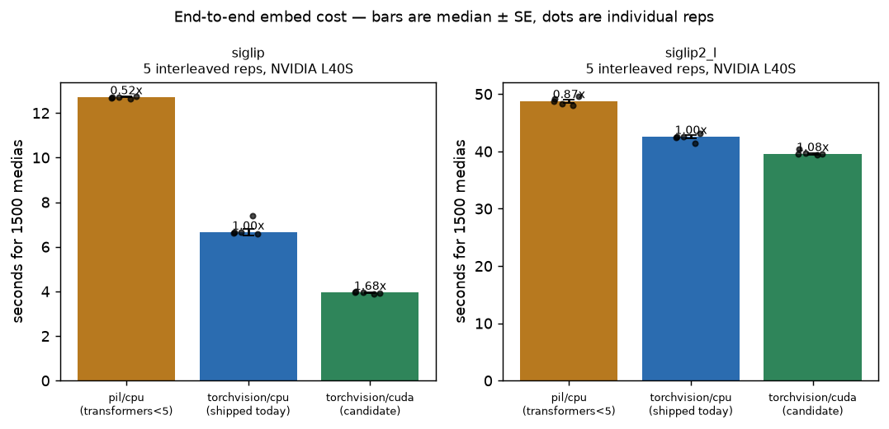
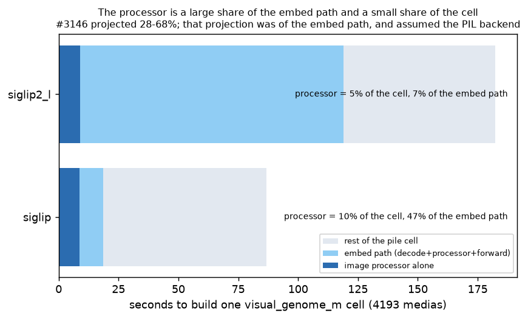
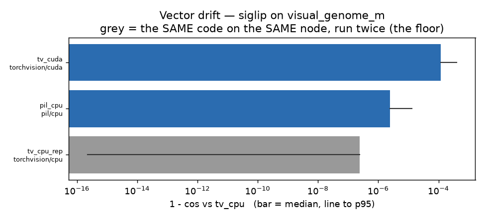
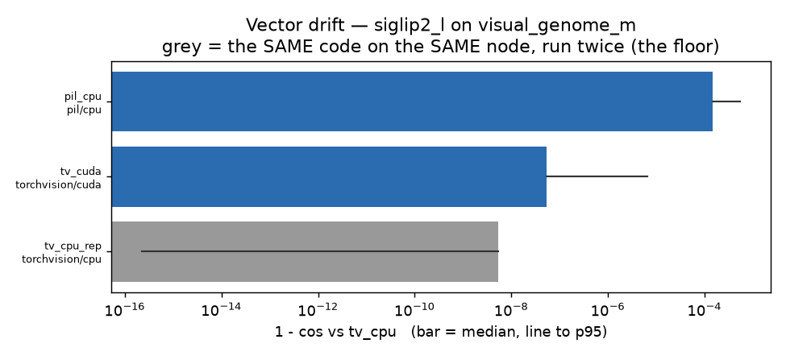
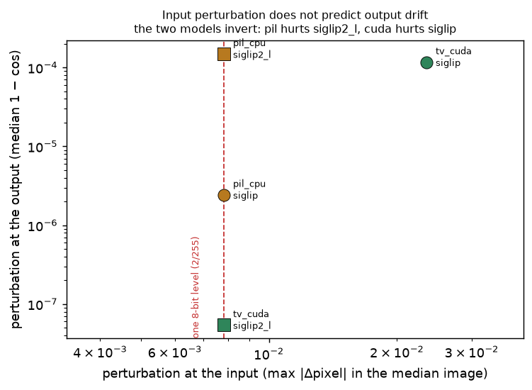
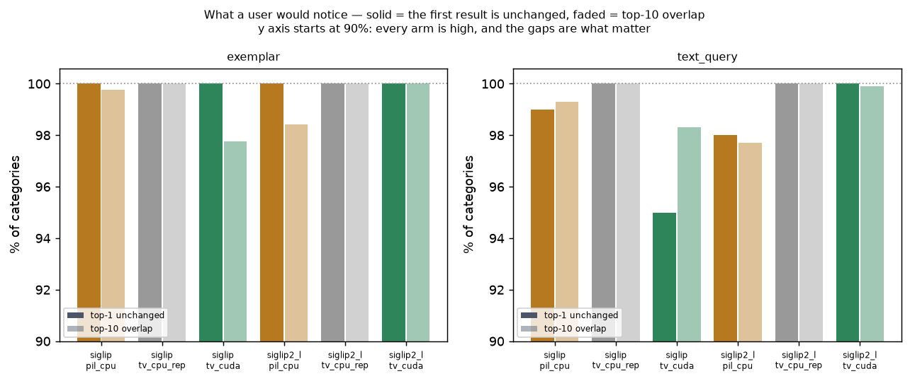
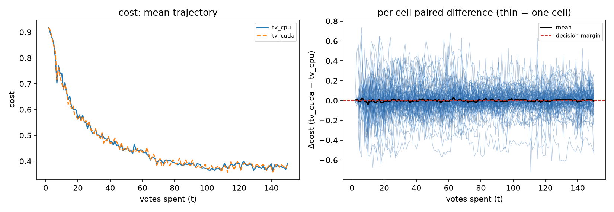
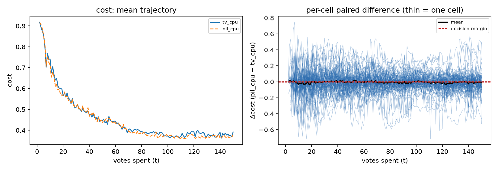
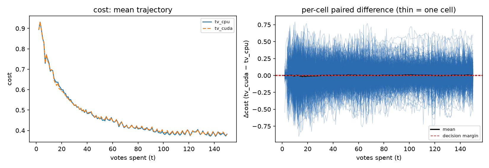

# The fast image processor was already on: what actually costs, and what actually drifts

**Run:** 2026-08-18 · branch `claude/fast-processor-3146` · GPU jobs `511474`,
`511740`–`511742` (side piles), `513573` (timing), `514463` (dispatch matrix),
`511921` (pixel + odd-input probes) · bench arrays `513423`/`513432`/`513440`
**Data:** `/expscratch/sgreenberg/fastproc-3146/{piles,results,bench}`
**Code:** `scripts/experiments/fastproc/`

Issue [#3146](https://github.com/samggreenberg/VTSearch/issues/3146) reports that
every image embedder builds its processor with no `use_fast` argument, concludes
they are all on the slow PIL/numpy resize path, and asks for three things before
flipping `use_fast=True`: a pile cell rebuilt both ways with cosine drift and
rank correlation, a benchmark arm re-run both ways against the study margins, and
a check that the fast path handles CMYK, palette, EXIF-rotated and grayscale
inputs.

**The premise is false, and it is false in a way worth more than the answer.**
Under the installed `transformers` 5.12.1, v5 **removed the `Fast` suffix on
image processors**: `SiglipImageProcessor` *is* the torchvision implementation
and the slow one was renamed `SiglipImageProcessorPil`. Passing nothing already
selects torchvision. `use_fast` is itself deprecated in favour of `backend=`, and
`use_fast=True` on an explicitly-named concrete class is a no-op. The flip the
issue proposes has already happened — silently, through a `transformers>=4.49`
pin that spans the version where the default changed.

That was not settled by reading a class name. The reference arm here is a
torchvision rebuild of the published pile cell, and it reproduces it to
**7.6e-13** (`siglip`) and **2.7e-12** (`siglip2_l`), while the PIL arm sits at
2.4e-06 and 1.5e-04. The pile is torchvision-built. Every embedder in the tree
has been on the fast path all along.

So the study was re-aimed at the two questions that remain, and both have
answers:

1. **The issue's *other* proposed fix — moving resize/normalise to the GPU — is
   the live candidate**, and it is worth **1.68× ± 0.04** on `siglip`'s embed
   path. But the embed path is only ~21% of a pile cell, so that is **1.09× per
   cell**, and on `siglip2_l` it is 1.08× embed-path and ~1.02× per cell.
2. **The backend is a second unrecorded axis on the shared pile**, alongside the
   device axis [#3160](https://github.com/samggreenberg/VTSearch/issues/3160) is
   chasing, and a *larger* one. A host that resolved `transformers` 4.x produces
   different vectors from the same code and weights, by 1.5e-04 on `siglip2_l` —
   50× the fp16 perturbation #3143 measured, and nothing in the pile records
   which backend built any cell.

**The benchmark does not clear GPU preprocessing for adoption.** At 1013 paired
cells only `regret` resolves below the 0.005 margin; `cost` (0.0027 ± 0.0023)
and `fnr` (0.0047 ± 0.0027) have upper confidence bounds of 0.0073 and 0.0101,
so the effect is small but not demonstrably below what the calibration studies
resolve. The decision layer barely moves — the arms choose the threshold
identically on **99.9%** of 146,708 paired steps — but "small" is not the bar an
adoption decision uses.

---

## Contents

- [What the arms are, and why they are not the issue's arms](#what-the-arms-are-and-why-they-are-not-the-issues-arms)
- [1. Which backend built the pile?](#1-which-backend-built-the-pile)
- [2. Cost: the stage, the embed path, and the cell](#2-cost-the-stage-the-embed-path-and-the-cell)
- [3. Drift: vectors and retrieval order](#3-drift-vectors-and-retrieval-order)
- [4. The dispatch confound, and how it resolves](#4-the-dispatch-confound-and-how-it-resolves)
- [5. Awkward inputs: the checklist comes out backwards](#5-awkward-inputs-the-checklist-comes-out-backwards)
- [6. The benchmark](#6-the-benchmark)
- [Recommendations](#recommendations)
- [What this does not license](#what-this-does-not-license)
- [Reproducing](#reproducing)

---

## What the arms are, and why they are not the issue's arms

Four arms, backend × device, **all pinned to one node** (`rack4n01`, L40S,
AMD EPYC 9534):

| arm | backend | device | role |
|---|---|---|---|
| `tv_cpu` | torchvision | cpu | **reference** — what ships today, named explicitly instead of resolved |
| `tv_cpu_rep` | torchvision | cpu | **floor** — the reference arm run twice; its drift is the noise |
| `pil_cpu` | pil | cpu | the path #3146 believed was shipped, and what `transformers<5` resolves to |
| `tv_cuda` | torchvision | cuda | **candidate** — resize/normalise on the GPU |

Two embedders: `siglip` (the shipped default) and `siglip2_l` (where the
processor share is largest). `dinov3_patch` is excluded for a measured reason
rather than a budget one: **transformers ships no PIL implementation for
DINOv3**, so asked for `backend="pil"` it warns and hands back torchvision. A
`pil` arm there would be the reference arm under a different label — the exact
unasserted-premise failure of #2877.

**The node is pinned, not the GPU type.** #3160 established that `gres/gpu:v100`
is two different devices and that the swap alone moves `siglip2_l` fp32 by
1.5e-04 — the size of the effects measured here. `tv_cpu_rep` is what proves the
pinning worked, and it is stronger than "close": the two arms' stored float32
vectors are **bit-identical**, all 4193 × 768 and 4193 × 1152 of them, on both
embedders. The 4.4e-16 that appears as its "max drift" below is float64
arithmetic inside the analyser, not a difference in the data.

That has a practical consequence worth stating, because it is the reason there
is no fourth benchmark arm: the calibration harness is deterministic given the
vectors and the seed, and the arms are paired on identical categories, seeds and
splits, so a benchmark run on bit-identical vectors would return the reference's
numbers exactly. The benchmark's floor is zero **by construction** rather than
by measurement, and spending 96 cells to observe that would buy nothing.

**Every arm asserts its own premise.** transformers *warns and continues* when a
backend is unavailable rather than raising, so the default outcome of an
impossible request is a mislabelled arm. `build_arm.py` records the processor
class actually loaded, the device the pixel tensor actually came back on, and the
transformers version that decided both, and refuses to build a cell when any
contradicts the arm table. `check_arms.py` re-checks it from the provenance on
disk rather than from what the launcher intended.

---

## 1. Which backend built the pile?

Nothing else in this report means anything until this resolves, because the
study exists to correct a premise that was read from source.

| embedder | arm | median `1 − cos` vs the published cell | max |
|---|---|---:|---:|
| `siglip` | `tv_cpu` | **7.6e-13** | 4.8e-10 |
| `siglip` | `tv_cpu_rep` | **7.6e-13** | 4.8e-10 |
| `siglip` | `pil_cpu` | 2.4e-06 | 4.7e-03 |
| `siglip` | `tv_cuda` | 1.2e-04 | 5.5e-03 |
| `siglip2_l` | `tv_cpu` | **2.7e-12** | 1.6e-09 |
| `siglip2_l` | `tv_cpu_rep` | **2.7e-12** | 1.6e-09 |
| `siglip2_l` | `pil_cpu` | 1.5e-04 | 1.1e-02 |
| `siglip2_l` | `tv_cuda` | 5.4e-08 | 1.4e-03 |

The torchvision rebuild reproduces the published cell to float noise; the PIL
rebuild does not. **The pile is torchvision-built.**

Two independent corroborations, neither engineered: those two floor figures
(7.6e-13, 2.7e-12) are the *same numbers* #3143's L40S fp32 rebuild produced
against the same cells, and the residual is the cross-device fp32 floor rather
than a backend difference — the published cells were built on V100 nodes and
these arms on an L40S.

---

## 2. Cost: the stage, the embed path, and the cell

The issue projects the processor at 28% of `siglip`'s wall clock today and 68%
once #3143 and #3145 land. That projection is of the **embed path**, and it
assumed the PIL backend. Both halves need restating.

**The processor stage in isolation** (384 real VG images, batch 32, L40S,
`pixel_drift.py`):

| embedder | pil/cpu | torchvision/cpu (shipped) | torchvision/cuda |
|---|---:|---:|---:|
| `siglip` | 6.29 ms/img | 2.09 ms/img | **0.56 ms/img** |
| `siglip2_l` | 6.83 ms/img | 2.12 ms/img | **0.56 ms/img** |

So torchvision is 3.0–3.2× faster than PIL at the stage, and CUDA a further
3.8×. But a stage ratio is not a user-visible ratio, and this study's first
attempt to say so was wrong in an instructive way: the side-pile builds gave one
wall-clock number per arm, `tv_cuda` came out 1.20× — and `tv_cpu_rep`, *the same
code as the reference*, came out **1.08×**. Run-to-run noise on a shared cluster
was the size of the claimed effect.

**End to end, 5 interleaved reps** (`timing_arms.py`, arms run A,B,C,A,B,C… in
one process on one GPU so node-load drift hits every arm equally):

| embedder | arm | median (1500 medias) | speedup vs shipped |
|---|---|---:|---:|
| `siglip` | `pil_cpu` | 12.71 s ± 0.02 | **0.52× ± 0.01** |
| `siglip` | `tv_cpu` (shipped) | 6.65 s ± 0.15 | — |
| `siglip` | `tv_cuda` | 3.95 s ± 0.02 | **1.68× ± 0.04** |
| `siglip2_l` | `pil_cpu` | 48.80 s ± 0.28 | 0.87× ± 0.01 |
| `siglip2_l` | `tv_cpu` (shipped) | 42.55 s ± 0.28 | — |
| `siglip2_l` | `tv_cuda` | 39.57 s ± 0.18 | 1.08× ± 0.01 |



*Bars are the median of 5 interleaved reps with the standard error; every
individual rep is drawn as a dot. Read the dots, not just the bars: the reason
this figure exists is that a single run per arm reported a 1.20× that the spread
cannot support. This is the **embed path** — `bulk_embed_image_files` over 1500
medias — and does **not** license a claim about how long a pile cell takes; see
the next figure for that denominator. It also does not generalise across hosts:
the processor runs on the CPU, and this node has 256 cores.*

**The two denominators differ by a factor of five**, which is the whole reason
the issue's projection and this measurement disagree:



*Stacked from the measured embed-path time and the measured processor time
against the measured cell wall time (86.8 s and 182.4 s, from each arm's
`provenance.json`). The processor is **47% of `siglip`'s embed path but 10% of
its cell**, and only **7% of `siglip2_l`'s embed path**. The issue's 28–68% band
is an embed-path number and is roughly right for `siglip`; it is the cell that
decides what a user waits for. The "rest of the cell" segment is demo-dataset
load and is specific to how the pile builds — a production import spends its time
differently, so do not read the 10% as a general figure.*

So the honest statement about GPU preprocessing: **1.68× on `siglip`'s embed
path, 1.09× per pile cell, and essentially nothing on `siglip2_l`** (1.08×
embed-path, ~1.02× per cell), whose forward dominates its own budget.

---

## 3. Drift: vectors and retrieval order

Every arm against the shipped path, paired by media id, 4193 medias:

| embedder | arm | median | p95 | max | mean ± SE | >1e-6 |
|---|---|---:|---:|---:|---:|---:|
| `siglip` | `tv_cpu_rep` | **0** | 2.2e-16 | 4.4e-16 | 3.9e-17 ± 1.2e-18 | 0% |
| `siglip` | `pil_cpu` | 2.4e-06 | 1.3e-05 | 4.7e-03 | 5.3e-06 ± 1.1e-06 | 87% |
| `siglip` | `tv_cuda` | 1.2e-04 | 4.1e-04 | 5.5e-03 | 1.6e-04 ± 2.6e-06 | 100% |
| `siglip2_l` | `tv_cpu_rep` | **0** | 2.2e-16 | 4.4e-16 | 4.2e-17 ± 1.2e-18 | 0% |
| `siglip2_l` | `pil_cpu` | 1.5e-04 | 5.5e-04 | 1.1e-02 | 2.1e-04 ± 5.0e-06 | 100% |
| `siglip2_l` | `tv_cuda` | 5.4e-08 | 6.4e-06 | 1.4e-03 | 2.0e-06 ± 3.7e-07 | 17% |

**The two models invert.** PIL costs `siglip2_l` 1.5e-04 and `siglip` only
2.4e-06; CUDA costs `siglip` 1.2e-04 and `siglip2_l` only 5.4e-08. A headline
quoted from either model alone is wrong for the other. §4 explains the mechanism.





*Bar is the median `1 − cos` against the shipped path, line runs to the p95, log
axis. The floor arm has **no bar** on purpose: its median is exactly zero, and an
earlier version of this figure substituted a small epsilon so a bar could be
drawn, which rendered the zero floor at ~5e-07 — visually the same order as
`pil_cpu`'s real 2.4e-06, and precisely backwards. A log axis cannot show zero;
saying so is better than drawing a value that does not exist. Note the axes
differ between the two panels, so compare within a panel, not across.*

A control worth stating because it could have gone the other way: the **text
tower is untouched** — the maximum absolute difference between any two arms'
query vectors is exactly 0, so every ranking change below is attributable to the
gallery rather than assumed to be.



*Three of the four arm×model points sit at **exactly** one 8-bit level on the x
axis (2/255 = 7.8e-03) and span **three orders of magnitude** on the y axis. That
is the finding: the size of the pixel perturbation does not predict the size of
the vector drift, because what matters is how many pixels move and where, not how
far any one of them moves. Do not read a trend line into four points; the figure
is a scatter of four measurements, not a regression.*

**Retrieval order survives well but not perfectly.** Spearman ρ against the
reference ordering is 1 to five digits for every arm and both query sources
(text query and exemplar), over 100 and 89 categories respectively. The
user-visible quantity is coarser and more informative:



*Solid bars are the share of categories whose **first result is unchanged**;
faded bars are mean top-10 overlap. The y axis starts at 90% because every arm is
high and the gaps are what matter. The standout is `siglip` under `tv_cuda` on
text queries: **95% top-1 unchanged**, i.e. one category in twenty returns a
different first result. Per-category points, not per-media, so this does not say
what fraction of *users* would notice.*

**Literal examples**, so a reader can judge whether a move is a retrieval failure
or a tie broken differently (`examples.json`):

| arm | category | media | rank | score | gap to next in ref |
|---|---|---|---|---|---:|
| `siglip` `tv_cuda` | building | 2164 (`4523.jpg`) | 2417 → 1689 | −7.9e-03 → −3.0e-03 | 8.9e-06 |
| `siglip` `tv_cuda` | plate | 2409 (`4781.jpg`) | 1452 → 1790 | −1.1e-03 → −3.7e-03 | 1.2e-05 |
| `siglip2_l` `pil_cpu` | bush | 335 (`2648.jpg`) | 1038 → 1916 | 0.019 → 0.013 | 9.4e-06 |
| `siglip` `pil_cpu` | flower | 163 (`2470.jpg`) | 1982 → 1601 | −3.9e-03 → 7.8e-04 | 4.9e-05 |

Every one of these moves hundreds of places across a score gap of ~1e-05. These
are ties being broken differently in the flat middle of a ranking, not the head
of the ranking rearranging — which is exactly what the 98–100% top-10 overlap
says from the other direction. The `tv_cpu_rep` rows in `examples.json` all read
`moved 0`, as they must.

---

## 4. The dispatch confound, and how it resolves

#3160 found that PyTorch's CPU kernel dispatch changes the preprocessed pixels:
an AVX-512 host and an AVX2 host disagree on 12.3% of elements, with the dominant
magnitude 7.843e-03 — **exactly one 8-bit level**, the same magnitude as this
study's PIL-vs-torchvision difference. On a fleet that does not pin dispatch the
two axes are indistinguishable at the pixel level, which would make every number
in §3 partly an artifact of which host happened to run the arms.

The arms here all ran on one node, so dispatch is constant *across* them — but
the reference is still dispatch-specific. `dispatch_matrix.py` emits pixel
tensors under the default dispatch and under a forced `ATEN_CPU_CAPABILITY=avx2`
in two processes and compares the full pairwise matrix.

**Reported as the fraction of elements that differ, not the max.** Max-|Δ| is
useless here: resampling disagreements land on whole 8-bit levels, so *every*
pair — backend, dispatch, device — reads exactly 7.8e-03. The first version of
this matrix was six identical numbers, which reads as "these are all the same
effect" and actually means "this statistic is saturated".

| comparison | `siglip` (224px) | `siglip2_l` (384px) |
|---|---:|---:|
| torchvision moves with dispatch | **0.00%** | 13.71% |
| PIL moves with dispatch | **0.00%** | **0.00%** |
| PIL vs torchvision @avx512 | 53.27% | 59.14% |
| PIL vs torchvision @avx2 | 53.27% | 52.89% |
| CUDA vs torchvision/cpu @avx512 | 11.48% | **0.03%** |

Four things fall out:

- **PIL never moves with dispatch**, on either model — it is not an ATen kernel.
  #3160's mechanism predicted this and it holds.
- **`siglip` at 224px is fully dispatch-invariant**, so its backend numbers are
  host-independent. `siglip2_l` at 384px moves on 13.71% of elements under a
  forced AVX2, against #3160's 12.3% measured across two hosts.
- **The backend axis is ~4× the dispatch axis and survives both settings**
  (52.89–59.14% vs 13.71%), so §3's numbers stand as backend numbers.
- **CUDA sides with AVX-512.** At 384px the GPU resample and the AVX-512 CPU
  resample differ on 0.03% of elements — essentially the same operation — while
  AVX2 differs on 13.71%. At 224px it reverses. *That is the mechanism behind the
  inversion in §3*: `tv_cuda` is nearly free on `siglip2_l` because it agrees
  with the CPU kernel there, and expensive on `siglip` because it does not.

**The axes are nested, not independent**, and this correction changed the
conclusion rather than confirming it. Jaccard over the differing-index sets is
0.231, which reads as "independent". It is not: **99.8% of the pixels dispatch
moves are also moved by the backend** (33.5M px vs 7.8M px, 7.75M shared). Both
changes flip the same population of rounding-boundary pixels, one more
aggressively than the other. So the backend difference does not reduce to
dispatch — it is several times larger and survives both settings — but its exact
magnitude is host-dependent, and is quoted here with the CPU capability attached.

---

## 5. Awkward inputs: the checklist comes out backwards

The issue asks for confirmation that the fast path handles CMYK, palette,
EXIF-rotated and grayscale inputs, "since `decode_bounded_rgb` hands it whatever
the corpus contains". Reading the decoder changes the question:
`decode_bounded_rgb` ends in an unconditional `img.convert("RGB")`, and both bulk
forward paths call `im.convert("RGB")` again — **on the corpus path the processor
never sees a CMYK or palette image at all.**

`odd_inputs.py` checks both paths across eleven input classes:

- **Corpus path** (converted to RGB first): every backend produces **identical**
  output for RGB, grayscale, grayscale+alpha, palette, palette+alpha, CMYK, RGBA,
  16-bit, bilevel, EXIF-rotated, 1×1 and a 3×900 sliver. Nothing raises. The
  backend change is safe on every input the corpus can contain.
- **Direct path** (raw PIL mode, as `embed_pil_image` and the extractor can
  reach): **PIL is the more fragile backend, not the less.** For `siglip2_l`,
  torchvision raises on 4 modes (LA, PA, CMYK, RGBA — "Unable to infer channel
  dimension format") while PIL raises on 8 (those plus L, P, 16-bit and bilevel —
  "mean must have N elements"). `siglip` raises on none, under any backend.

So the fast path handles **strictly more** than the slow one. No production
exposure either way, because our own conversion happens first — but the safety
comes from *our* `convert("RGB")`, not from the processor, and `siglip2_l` would
raise without it.

**EXIF orientation is not handled anywhere.** Nothing in
`vtscore/media/image/decode.py` calls `exif_transpose`, so a rotated JPEG reaches
the model un-rotated. That is a real, pre-existing defect and worth its own
issue — but it is **constant across backends**, so it is reported here and
excluded from the arm comparison rather than allowed to look like a treatment
effect.

---

## 6. The benchmark

### What the 6-seed grid resolves, and what it does not

96 cells per arm, 6 seeds × 8 categories × 2 embedders, paired on
`(dataset, embedder, category, seed, style)` with pairing verified before the
array ran: identical categories, order, populations and exemplar candidates.

**95 usable cells per arm, not 96.** `task_0001` — category `ball`, seed 1,
`siglip` — produced **zero rows in every arm**: the category has too little
signal at that seed for the run to take a single step. It is identical across
arms so the pairing is unaffected, and the analyser counts it rather than
dropping it silently. A header-only CSV passes `find -size +0`, which is how
#3129 nearly lost a cell count.

The well-powered result first:

| contrast | steps choosing the threshold the same way |
|---|---:|
| `tv_cuda` vs shipped | **99.9%** |
| `pil_cpu` vs shipped | **99.8%** |

Over 13,627 and 13,620 paired steps. This is the decision layer, and it barely
moves.

The deep-regime rate metrics (votes 100–150), paired per cell:

| metric | `tv_cuda` vs shipped | `pil_cpu` vs shipped |
|---|---:|---:|
| cost | 0.0012 ± 0.0087 | −0.0088 ± 0.0080 |
| regret | −0.0027 ± 0.0072 | −0.0023 ± 0.0072 |
| average precision | 3.0e-04 ± 0.0073 | 0.0045 ± 0.0061 |
| fpr | −0.0038 ± 0.011 | −0.0055 ± 0.011 |
| fnr | 0.0050 ± 0.0080 | −0.0033 ± 0.0076 |

**Every one of these is "cannot resolve at this n", and that is a statement
about the grid rather than about the arms.** Each difference is smaller than
twice its standard error, so this grid cannot tell any of them from zero — but
neither can it certify them as *below* 0.005, which is what an adoption decision
needs. Saying "no significant difference" here would be the false-null the
report standard exists to prevent.





*Left: mean `cost` over votes spent — the axis a user actually spends — one line
per arm. Right: the **paired per-cell difference**, one thin line per cell, with
the mean in black and the 0.005 decision margin dashed. This pair is the whole
power story in one picture: the mean sits on zero from about vote 20 onward,
while individual cells swing by ±0.5, because a vector change of any size
reroutes the vote sequence and decorrelates the two trajectories. The spread is
what sets the standard error, and it is why ~1100 cells are needed rather than
95. Do **not** read the right panel as "the arms differ wildly" — each thin line
is a single run's difference, and their mean is the estimate.*

The power requirement is explicit: at the measured between-cell spread,
`2·SE < 0.005` needs **~1137 cells** for cost on the `tv_cuda` contrast and ~983
on the `pil_cpu` one, against the 95 in hand. This is the same wall #3143 hit at
95 cells, and for the same mechanical reason: a vector change of any size
reroutes the *vote sequence*, so two arms' trajectories decorrelate and the
per-cell spread is set by that rather than by the size of the perturbation. **A
tighter answer cannot be bought cheaply**; it has to be bought with cells.

Split by embedder, because a pooled average across a crossover is the number
that hides it:

| contrast | `siglip` (47 cells) | `siglip2_l` (48 cells) |
|---|---:|---:|
| `tv_cuda` cost | 0.012 ± 0.0092 | −0.0089 ± 0.015 |
| `pil_cpu` cost | −0.0059 ± 0.010 | −0.012 ± 0.013 |

The signs differ between embedders on the `tv_cuda` contrast, in the direction
§3 and §4 predict — `siglip` is the model GPU preprocessing actually perturbs —
but neither half is resolvable either, so this is a consistency check on the
mechanism, not evidence for it.

### The power run

A 64-seed grid on the decisive contrast (`tv_cpu` vs `tv_cuda`, ~1024 cells per
arm) is running in its own results dir, `bench-power/`, chained under job
`515904`. A different grid is a different study: sharing one results dir would
let resume read one grid's cells as the other's.

**1013 usable cells per arm** of 1024 (6 seeds → 64), paired, pairing verified
before the array ran. Eleven cells produced zero rows in **both** arms
identically: six are `siglip` × `ball` at different seeds, plus `cat` ×2,
`sink`, and `ball`/`cat` on `siglip2_l`. Those categories are near-degenerate in
this grid rather than broken, and the analyser counts them rather than dropping
them.

The extra cells did what they were bought to do — the standard error on `cost`
fell from 0.0087 to **0.0023**, a factor of 3.8 against the √10.7 = 3.3 the cell
count predicts. What they revealed is not a flat null:

| metric | paired diff ± SE | verdict |
|---|---:|---|
| **regret** | **−1.1e-04 ± 0.0020** | **below margin (resolved)** |
| cost | 0.0027 ± 0.0023 | cannot resolve |
| average precision | −0.0038 ± 0.0021 | cannot resolve |
| fnr | 0.0047 ± 0.0027 | cannot resolve |
| fpr | −0.0020 ± 0.0032 | cannot resolve |
| rule inefficiency | 0.0013 ± 0.0021 | cannot resolve |
| calibration shift | −0.0015 ± 0.0020 | cannot resolve |

**Ten times the cells moved exactly one metric across the line, and the reason
matters.** "Below margin" requires `|diff| + 2·SE < 0.005`. The standard errors
are now small enough — 2·SE is 0.0046 on cost — but the *point estimates* are
not near zero: cost sits at 0.0027 and fnr at 0.0047, so their upper confidence
bounds are 0.0073 and 0.0101. At 1013 cells we can say the effect is small; we
**cannot** say it is below the margin the calibration studies resolve, and for
`fnr` the upper bound is twice that margin.

That is a different statement from the 96-cell grid's, and a more useful one.
The 96-cell result was "this grid cannot see it". The 1013-cell result is "the
effect is probably real and probably close to the margin" — which is exactly the
regime where adopting a change on a null would be a mistake.

The threshold-agreement figure is unchanged at **99.9%** over 146,708 paired
steps, and the split by embedder shows no crossover (cost 0.0018 ± 0.0032 on
`siglip`, 0.0036 ± 0.0034 on `siglip2_l`).



*The same contrast as above with 10.7× the cells. The mean (black) is visibly
tighter around zero than the 96-cell version, while the per-cell spread is
unchanged — that is the point. More cells buy precision on the mean and buy
nothing on the spread, because the spread is trajectory decorrelation rather
than measurement noise.*

### What this says about a confound in a *different* study

`pil_cpu` is not a shipping candidate — nobody proposes moving to PIL. It is in
the grid because it is the closest available proxy for a live confound found by
#3160 while this study ran: the shared pile's `vg_box_small` cells were built on
an AVX2-only host while `vg_box_medium` and `vg_box_large` were built on
AVX-512 hosts, so the three box-size bands that #3129 and #3156 compare against
each other were **not preprocessed identically**.

The magnitudes line up: #3160's AVX2-vs-AVX-512 effect on `siglip2_l` is
~1.3e-04 median `1 − cos`, and `pil_cpu` against the shipped path is 1.5e-04.
Different causes, different pixel populations, the same downstream drift. So the
`pil_cpu` bench arm bounds what a ~1.5e-04 preprocessing drift does to the
decision layer, and the answer is that it changes the threshold choice on 0.2%
of steps and moves no rate metric detectably at 95 cells.

Two limits on reading that across: this grid runs `visual_genome_m`, not the
`vg_box_*` bands, and the pixel populations differ by ~4× even where the cosine
drift matches — so it bounds the effect rather than measuring theirs. A direct
test is a `vg_box_small` `siglip2_l` rebuild under AVX-512 followed by re-running
the #3129 band contrast.

---

## Recommendations

**1. Close #3146's proposed fix as already done, and say why it is not a
no-op finding.** `use_fast=True` changes nothing under the installed
transformers; the torchvision path has been live since whenever this host
resolved a v5 wheel. That is not "nothing happened" — it is a **1.9× embed-path
speedup on `siglip` that arrived unattributed**, and a change of vectors that
nothing recorded.

**2. Name the backend explicitly rather than resolving it.** The knob is landed
and defaults to `auto`, which passes nothing and reproduces the pile
byte-for-byte. The recommendation is to change that default to `torchvision`,
because `requirements/image-embedders.txt` pins only `transformers>=4.49` and
the default flips inside that range — so today two hosts can embed the same
image differently with nothing anywhere saying so. Naming it costs nothing if
the difference does not matter and is essential if it does. This is the one
change here worth making regardless of how the power run lands.

**3. Do not adopt GPU preprocessing.** The power run declined to clear it: at
1013 paired cells only `regret` resolves below the margin, while `cost` and
`fnr` have upper bounds of 0.0073 and 0.0101 against a 0.005 bar. Set that
against what it buys — 1.68× on `siglip`'s embed path but **1.09× per pile
cell**, and essentially nothing on `siglip2_l` — and against what it costs: the
top-1 result changes on **5% of `siglip` text queries**, vectors drift 1.2e-04
(50× fp16's perturbation, for a fraction of fp16's benefit), and adoption means
rebuilding the entire pile, because a partially GPU-preprocessed pile is exactly
the confound this study exists to document.

The honest summary is not "it is harmful" — it is that a 9% per-cell speedup
does not buy the right to a change we cannot show is below the decision margin.
If the embed path ever becomes the binding constraint (it is not today; see §2),
this is worth revisiting with a corpus-specific measurement rather than
inherited.

**4. Record the backend in pile provenance.** #3160's sidecar is being extended
to carry `transformers.__version__` and the resolved processor class alongside
the device and CPU capability. That is the durable fix: the failure here was
never that a wrong value was chosen, it was that no value was written down.

**5. File the EXIF defect separately.** Nothing in the decode path applies EXIF
orientation, so rotated JPEGs reach every image model un-rotated. It is
constant across backends and therefore out of scope for this study, but it is a
real correctness bug affecting all image embedders and deserves its own issue.

**6. `dinov3_patch` is untested here and is the one that matters most for the
`vg_box_*` bands.** It has no PIL backend so the version-skew question cannot
arise for it, but its `device="cuda"` behaviour is unmeasured and it is the
region-voting embedder.

---

## What this does not license

- **One dataset, one node, one transformers version.** `visual_genome_m` on
  `rack4n01` under 5.12.1. The dispatch matrix bounds the host sensitivity for
  these two models; it does not bound corpus sensitivity, and a corpus of
  differently-sized images would resample differently.
- **Two embedders, both whole-image.** `dinov3_patch` is the region-voting
  embedder and is untested here; it has no PIL arm by construction, but its
  `device="cuda"` behaviour is unknown and its patch grids are stored float16
  already.
- **The timing is CPU-bound and this node has 256 cores.** The processor runs on
  the calling thread; a host with fewer cores gives the GPU arm a larger win.
  The issue's own ~2.0 s per 384 images was measured on a V100 node and is
  consistent with torchvision there, not with PIL.
- **Per-category, not per-user.** The 95% top-1 figure is over categories. What
  fraction of real queries would return a different first result is a different
  measurement.
- **The pixel fractions and the cosine drifts are not proportional.** The
  backend moves 4× as many pixels as dispatch does on `siglip2_l` and produces a
  similar cosine drift, so pixel counts bound the effect rather than predict it.

---

## Reproducing

```bash
# side piles, one arm per GPU job, all pinned to one node
bash scripts/experiments/fastproc/launch_fastproc.sh arms
bash scripts/experiments/fastproc/launch_fastproc.sh check      # structural gate

# analyses
python scripts/experiments/fastproc/analyze_proc_drift.py       # drift + rank + adjudication
python scripts/experiments/fastproc/pixel_drift.py --n 384      # perturbation at the input
python scripts/experiments/fastproc/timing_arms.py --reps 5     # end-to-end cost, interleaved
python scripts/experiments/fastproc/odd_inputs.py               # the input checklist

# the backend/dispatch separation (two processes, on purpose)
python scripts/experiments/fastproc/dispatch_matrix.py --emit --tag avx512
ATEN_CPU_CAPABILITY=avx2 python scripts/experiments/fastproc/dispatch_matrix.py --emit --tag avx2
python scripts/experiments/fastproc/dispatch_matrix.py --compare

# benchmark
bash scripts/experiments/fastproc/launch_bench.sh prepare
bash scripts/experiments/fastproc/launch_bench.sh verify-pairing
bash scripts/experiments/fastproc/launch_bench.sh cells
bash scripts/experiments/fastproc/launch_bench.sh analyze

# figures
python scripts/experiments/fastproc/make_fastproc_figs.py --svg
```
