# Good Mining: does a different Autopilot *opening* find better positives?

Issue [#3267](https://github.com/samggreenberg/VTSearch/issues/3267). Harness and
study scaffolding: [#3268](https://github.com/samggreenberg/VTSearch/pull/3268).
Run and analysis: [#3272](https://github.com/samggreenberg/VTSearch/pull/3272).

*Numbers are quoted to two significant digits. Every arm-vs-arm difference is
paired within `(dataset, embedder, category, seed)` and carries its interval; a
difference smaller than twice its standard error is reported as not resolvable,
which is a finding rather than a gap.*

## The question, and why the arms are shaped like this

Getting enough Goods looks like what separates a VTSearch run that works from
one that fails, and the **opening** is where Goods come from. Today it is fixed:
the top of the seed sort until three positives exist, then that sort's cutoff
until four negatives do, then the learned Hard sort ever after.

The issue's unifying observation is that those two phases are the *same
operation* — the app's rank-space `hard` select against a cut on the seed sort —
at two different cuts. The Good phase's `top` select is that select against a cut
placed above every score; the Bad phase's cut is the sort's own fitted GMM at the
production midpoint. So "Text-Good is Text-Hard(-100)" is literally true, and the
whole opening collapses to a list of rounds naming **how many clicks** and
**where on the sort** to spend them.

A consequence worth stating plainly, because it governs how the tables below
should be read: **a phase is an acquisition choice and nothing else.** Every
click labels an item and enters the training data whatever phase the autopilot
believes it is in — the phase decides which item is shown *next*, never whether
the answer counts. Arms differ in what their clicks are spent *on*, not in
whether they count.

### The arms

| arm | schedule | what it is for |
|---|---|---|
| `prod` | *(app default: `g3@top,b4@mid`)* | **control** — today's opening, so this arm is comparable to every prior study |
| `top_long` | `g8@top,b4@mid` | the simplest hypothesis: just mine more Goods before the Bad round |
| `easy_med_hard` | `n5@q0.02,n5@q0.10,n6@mid` | the issue's Easy/Medium/Hard bands, by rank position |
| `band_wide` | `n5@q0.05,n5@q0.25,n6@mid` | the same shape, spread wider |
| `incl_k` | `n5@k-6,n5@k-2,n6@k0` | the **shippable** lever: the seed sort's own GMM split at three Inclusions |
| `incl_k_wide` | `n5@k-10,n5@k-4,n6@k0` | the same, spread wider |
| `flat_mid` | `n16@mid` | **length-matched control** — the same 16 opening clicks, none of them mining |
| `deep_first` | `n10@q0.35,n6@mid` | **falsifier** — opens *below* the good mass; must mine fewer positives |

Two arms are load-bearing. If `deep_first` does *not* lose positives, depth is not
the mechanism and nothing else here is interpretable. And every banded arm spends
16 opening clicks against `prod`'s ~7, so without `flat_mid` a win could simply be
"spend more clicks before training".

## Is the Inclusion lever usable at all? — measured before the run

`k` is the arm that could ship: the app has an Inclusion knob and no rank-position
knob. But **how far a given `k` moves the pick is a property of the fitted
mixture, not of `k`**, so a grid that looks well spread in `k` can be nearly a
point in the space the picks live in. #3268 raised exactly this from a synthetic
check, where `k=0 → k=-10` moved the cut only from the 22.7th to the 19.2nd
percentile.

That is a property of *these* sorts, so it is measurable rather than arguable.
[`probe_startup_cuts.py`](../../../scripts/experiments/calibration/probe_startup_cuts.py)
builds each cell's real text seed sort — the same `embed_text_query` path the run
seeds from — and reports where every candidate cut lands as a rank percentile.

**The inertness worry does not reproduce.** `k0 → k-10` moves the cut by a median
**22.5 rank percent** (16 cells; min 10.8, max 45.2). Two things it *did* find:

- **The lever saturates.** By `k-10` the cut sits at rank percentile **0.000** —
  literally `@top` — on 10 of 16 cells, and `k-20`, `k-50` and `k-100` are 0.00
  everywhere. `k0 → k-100` adds only ~1.5 rank percent over `k0 → k-10`, so the
  usable range is roughly `k0 … k-10` and `incl_k_wide`'s first round is
  production's Good phase under another name on most cells.
- **The lever is unstable across cells.** At a *fixed* `k-2` the cut lands at the
  0.79th percentile on `man` and the 37.7th on `building` — a 47× spread — where
  `q0.02` is 2.0 everywhere by construction.

So `k` is not inert; it is **cell-dependent**, which is precisely what the `q`
family was added to control for. The arms were left exactly as pre-registered:
changing them after peeking would be worse than reporting the saturation.

## The grid

Sized from real cells on this grid rather than scaled from a previous study —
a 200-click cell is **4m19s–5m26s at 0.86 GB**, about a quarter of #3115's,
because this run carries no fold grid and no anchored arms.

| | |
|---|---|
| horizon | **200 clicks per run, with the opening inside that number** |
| embedder | `siglip` only, every cell seeded from a **typed query** |
| environments | 24 — 12 prevalence-spread categories × {`coco_val`, `visual_genome_m`} |
| prevalence span | 51 → 2693 positives (COCO), 51 → 1645 (VG) |
| arms × seeds | 8 × 42 |
| cells | 8064 |

**Why the horizon counts the opening.** `max_steps` bounds the whole voting loop;
the opening's clicks simply emit no *metric* row, because before one Good and one
Bad coexist there is no model to score. Counting them is what makes a 16-click
opening comparable to `prod`'s ~7: at a fixed 200 clicks, a win is a better use of
the same user effort rather than more of it.

**Why prevalence, not box scale.** Both datasets are boxed, so category selection
would default to stratifying on box size — but the mechanism here is how *rare*
positives are, and #3156 established that scatter is a property of an image rather
than of a class, which is what a per-class scale band claims to be.

## What had to be fixed before the run could answer the question

### The seed sort was not a seed sort on half the grid

Every arm names a **position on the seed sort**, and which seed sort a cell gets
was decided silently by whether a query text happened to exist for its
`(dataset, category)`. `coco_val` is an experiment fixture, not a demo dataset, so
it is absent from the app's `EVAL_DATASETS` query table — and that table is
*asserted* to hold only real demo datasets, so it cannot live there. Every one of
its cells would have taken the app's other documented start, three random
known-goods. A cut at "the 2nd rank percentile" of a text sort and the same cut on
a known-good sort are cuts on **different objects**.

`lessons/2026-08-26-the-harness-seeded-from-a-crop.md` names this exact gap and
leaves it as advice. A study *about* the text sort cannot run on advice. Three
controls now: a COCO-80 query table (typed queries, not raw labels — `mouse`,
`remote`, `orange` and `tv` rank a different concept as bare nouns),
`CALIB_REQUIRE_SEED_QUERY` filtering selection *before* the prevalence spread is
drawn, and `preflight --require-text-seed`, which checks both halves — the query
text *and* whether the embedder has a text tower at all.

### The run could not say how long its own opening was

A schedule deliberately will not finish while one vote class is still empty:
handing a learned Hard sort a one-class labelset would leave the selector picking
at random. Those clicks were counted in `StartupState.extended_clicks` — **which
lived only on the object and reached no frame.**

That is not cosmetic. `flat_mid` exists to be the length-matched control, and on
`coco_val / baseball glove / seed 0` it spends 16 clicks as written and **184
more** waiting for a first positive that never arrives. An arm compared against
*that* is not length-matched to anything. And the analyzer's own guard could not
fire: `_declared_clicks` subtracted `min(count_of_last_round, len(rounds))`, which
**is** `count_of_last_round`, so the overrun read identically zero for every arm
on every cell.

Every pick row now carries `startup_held` and `startup_extended_clicks`, and a log
predating the column reports `NaN` rather than a confident zero.

### Smaller, but each would have changed a number

- The launcher pointed `VTSEARCH_DATA_DIR` at a `$CALIB_EXP/datadir` that does not
  exist — every cell would have re-fetched and re-embedded instead of reading the
  pile.
- It carried `CALIB_HEAD=linear`, the logistic head that was production for
  #2790–#2865. Production has trained a linear SVM since #3198; carrying the pin
  forward would have measured an opening on a detector nobody has. This is the
  failure preflight check 12 exists for.
- `analyze_spikes.load_arm` filtered to base rows *after* concatenating every
  cell. Only ~1 row in 34 survives that filter, so peak memory was 34× the frame
  anyone wanted — fine at #2847's grid size, and fatal at this one *after* the
  cells had been paid for.

---

<!-- RESULTS BELOW ARE GENERATED — see analyse_good_mining.sh -->

## Results

**8064 cells, all COMPLETED, none unreadable, none zero-byte.** Every table below
is computed on the **balanced** grid — 1008 cells present in all eight arms, of
1008 seen, 0 dropped. Full machine output: [`REPORT_generated.md`](REPORT_generated.md).

### Verdict

> **CANDIDATE: `top_long` (`g8@top,b4@mid`).** Mine more Goods off the top of the
> text sort before the Bad round. +5.8 positives per 100 clicks against `prod`,
> final cost −0.018, and it beats the length-matched control by +11 positives, so
> the gain is **where** it clicks and not **how many** clicks it spends.

### Did each opening actually move?

An arm whose cut never left the control's rank position has *measured nothing*,
which is a different finding from "the lever does nothing". All seven moved.

| arm | landed depth | open yield | starved | final cost Δ vs `prod` |
|---|---:|---:|---:|---:|
| `top_long` | **0.003** | **0.67** | 0% | −0.018 [−0.021, −0.014] |
| `incl_k_wide` | 0.025 | 0.44 | 0% | −0.013 [−0.016, −0.0092] |
| `incl_k` | 0.078 | 0.25 | 0.5% | −0.0004 [−0.0045, 0.0036] *(not resolvable)* |
| `easy_med_hard` | 0.10 | 0.19 | 3.7% | +0.0049 [−0.0001, 0.010] *(not resolvable)* |
| `band_wide` | 0.25 | 0.062 | 22% | +0.045 [0.036, 0.054] |
| `deep_first` | 0.35 | 0.009 | 32% | +0.097 [0.083, 0.11] |
| `flat_mid` | 0.38 | 0.010 | 33% | +0.083 [0.070, 0.098] |
| `prod` | 0.32 † | 0.43 | 0% | — (control) |

Depth is a rank position in the seed sort, 0 = the top. **Read down this table:
yield falls monotonically as the opening samples deeper, and starvation rises
with it.** That is the mechanism, and it is the whole result in one column.

† **`prod`'s depth is the one number here that must not be read at face value.**
Its opening is *bimodal* by construction — three clicks at `@top` (depth ≈ 0) and
four at `@mid` (depth ≈ 0.4) — so the median of seven clicks lands in a region
`prod` never actually samples, and its healthy 0.43 yield comes entirely from the
three top clicks. This is exactly why the analyzer reports *aimed* and *landed*
depth separately, and why the `prod` row is excluded from the monotone reading.

### The falsifier fires

`deep_first` opens below the good mass and **must** mine fewer positives, or depth
is not the mechanism and nothing else here is interpretable. It does: −4.6
positives per 100 clicks [−5.0, −4.3], cost +0.097, AP −0.11, and 32% of its
cells never find a positive at all. The verdict is licensed.

### It is depth, not budget

Every banded arm spends 16 opening clicks against `prod`'s ~7, so a win over
`prod` could be "spend more clicks before training". `flat_mid` spends the same 16
with no mining round, and every arm is measured against it too:

| arm | positives@100 Δ vs `flat_mid` | [95% CI] | final cost Δ | [95% CI] |
|---|---:|---|---:|---|
| `top_long` | **+11** | [10, 11] | −0.099 | [−0.11, −0.085] |
| `incl_k_wide` | +8.4 | [8.0, 8.9] | −0.091 | [−0.11, −0.077] |
| `easy_med_hard` | +5.6 | [5.2, 6.1] | −0.075 | [−0.090, −0.062] |
| `incl_k` | +5.4 | [5.0, 5.8] | −0.081 | [−0.095, −0.067] |
| `band_wide` | +1.8 | [1.6, 2.1] | −0.035 | [−0.049, −0.021] |
| `deep_first` | +0.12 | [−0.056, 0.29] | +0.015 | [0.0066, 0.024] |

`top_long`'s edge survives the length-matched control at nearly twice its margin
over `prod`. `easy_med_hard` and `incl_k` are an instructive pair: both clearly
beat `flat_mid`, and **neither is resolvable against `prod`**. Spending 16 clicks
in bands is much better than spending 16 clicks at the cutoff, and no better than
spending 7 the way the app already does.

### The Inclusion lever: usable, but only because it saturates

`k` is the arm that could ship — the app has an Inclusion knob and no rank-position
knob. `incl_k_wide` (`k-10, k-4, k0`) gets **+3.7 positives and −0.013 cost**,
about 60–70% of `top_long`'s gain. `incl_k` (`k-6, k-2, k0`) gets +0.64 positives
and **no resolvable cost change**.

The pre-run probe explains the gap and deflates it. By `k-10` the cut sits at rank
percentile **0.000** — literally `@top` — on 10 of 16 cells. So `incl_k_wide` is
largely **`top_long` reached through the Inclusion knob**, and it does slightly
worse than `top_long` because on the other 6 cells the same `k` lands somewhere
else entirely. The honest reading is not "the Inclusion lever mines Goods" but
**"the Inclusion lever is a lossy way of asking for the top of the sort."**

If the goal is to ship the win, `top_long` says what it wants directly and does
not depend on a fitted mixture to interpret it.

### Is the issue's premise true?

The issue opens by asserting it — *"getting enough Goods is important to VTSearch
runs doing well. (Certainly being Good-starved seems related to failing.)"* —
and every table above takes it as given. [`premise_starvation_vs_cost.png`](figures/premise_starvation_vs_cost.png)
tests it directly, pooled over all arms because the claim is about trajectories
rather than openings.

It holds, and the arm ordering is downstream of it: the four arms that never
starve (`prod`, `top_long`, `incl_k_wide`, `incl_k`) occupy the top of the cost
table, and the three that starve on 22–33% of cells occupy the bottom, in the
same order as their starvation rate.

### Where the win lives: scarce categories

Pooling one number per arm averages across a 50× prevalence range and hides the
crossover. Banded into terciles of the 24 categories:

| arm | scarce (<2.6%) | mid (2.6–4.2%) | common (>4.2%) |
|---|---:|---:|---:|
| `top_long` | **+9.5** | +6.9 | +2.5 |
| `incl_k_wide` | +6.2 | +4.8 | ≈−0.5 |
| `incl_k` | +2.2 | ≈0 | −2.0 |
| `easy_med_hard` | −1.0 | +1.9 | −1.8 |
| `band_wide` | −6.7 | −6.6 | −1.8 |
| `flat_mid` | −7.7 | −9.0 | −0.8 |
| `deep_first` | −7.2 | −9.7 | −3.4 |

**The benefit is concentrated exactly where Goods are scarce and decays as
prevalence rises** — which is the mechanism the issue proposed, and which a single
pooled number would have flattened into "+5.8 positives" with no shape at all.

### What starvation costs

A held click is **not** an idle one. Every click labels an item and enters the
training data whatever phase the autopilot is in — the phase decides which item is
shown *next*, never whether the answer counts. A starved arm is accumulating
negatives at full rate. What it lacks is a **positive**, and one class cannot be
fitted, so no detector exists and no metric row is emitted.

The `labelset @200` column is the point: `top_long` hands the model **20 good /
180 bad**, `flat_mid` and `deep_first` hand it **4 / 196**. Same 200 votes, same
user effort, a completely different training set.

`flat_mid` overran its written schedule on **702 of 1008 cells** and `deep_first`
on 697; `top_long` and `incl_k_wide` on **none**.

## Figures

*Positives found against clicks spent, mean over cells with an inter-quartile
band. This is the "what do I get after 20 clicks?" figure. It averages across the
whole prevalence range, so read the banded table above before reading a level off
it.*

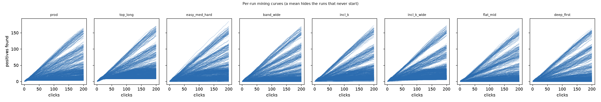

*The same, one line per run. A mean hides that some runs never leave the floor,
and the flat lines along the bottom of `flat_mid` and `deep_first` are the 33% and
32% of cells that never found a positive — the spread is the finding here, not
the mean.*

*Left: how often an opening finds no positive at all. Right: how much of the
horizon it then spends held on its last round. Two panels because they are two
different facts, and the right one is a distribution, not a level.*

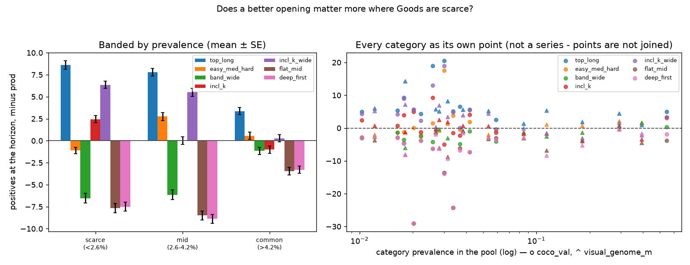

*Left: prevalence banded into terciles of the categories (equal categories, hence
equal seeds, hence equal weight), mean paired contrast ± SE. Right: every category
as its own point — deliberately **not** joined, because the x axis is a property
each category happens to have and not an axis anything moves along. Colours match
across panels.*

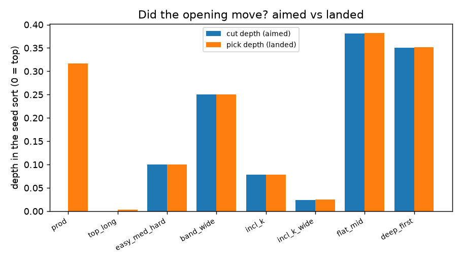

*Where each opening aimed against where its picks landed. The two coincide for
every arm except `prod`, whose bimodal opening makes a median meaningless (see
the † note above).*

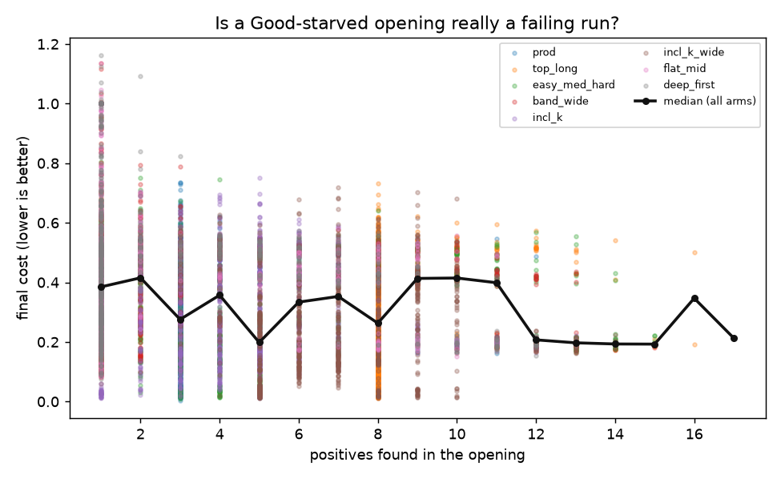

*Final cost against positives found in the opening, pooled over all arms, with
binned medians. This tests the issue's premise rather than assuming it.*

## The openings themselves — *why* it was best

The tables say *whether* an opening mined better. The issue also asks **why**, and
that is a question about the items, so here are the items: every click of each
arm's opening on one cell, in the order it was made, captioned with its round, its
rank in the seed sort, and whether it turned out to be a positive, with COCO's
ground-truth box drawn where it has one. A starved arm shows its written opening
in full plus a sample of the clicks it was held for; the caption says how many are
not shown. Rendered by
[`make_startup_sheets.py`](../../../scripts/experiments/calibration/make_startup_sheets.py).

### `coco_val / baseball glove / seed 5` — a scarce category (2.0% prevalence)

Put `top_long` and `flat_mid` side by side and the mechanism stops being a number.

`top_long` spends its eight Good clicks at **ranks 1, 2, 3, 4, 5, 10, 11 and 12**
of the text sort — the top 0.2% — and every one is a baseball scene with a glove
in it, boxed. Eight positives in eight clicks. It then spends four Bad clicks at
`@mid`, which land on a train, a park bench, a street and a skateboarder.

`flat_mid` spends all sixteen clicks at `@mid` and gets **zero** positives: a
train, a park bench, a street, a skateboarder, a cat, a man throwing a frisbee, a
clown, a kite, luggage, another skateboarder, a kitchen, a bench under an
umbrella, a dog catching a frisbee, a slice of cake, a train, people at a table, a
red chair sculpture, a street with a bus. Then 184 more clicks, still looking.

Two things are visible here that no aggregate reports:

1. **`top_long`'s Bad clicks are literally the same four images as `flat_mid`'s
   first four** — train at rank 1638, bench at 1635, street at 1640, skateboarder
   at 1632. Both arms use `@mid` for that round, so this is a direct confirmation
   that the arms differ *only* in where they point, on identical data.
2. **`flat_mid`'s sixteen clicks span ranks 1623–1651 — twenty-eight ranks out of
   ~2476.** The `hard` select walks outward from the cut, so an arm whose cut never
   moves re-samples a razor-thin slice of the ranking over and over. That is the
   real reason it starves: not merely *"it opens too deep"*, but **"it opens too
   deep and then does not go anywhere."** An opening's value is as much about the
   *range* it sweeps as the depth it starts at — which is a hypothesis for a
   follow-up, and one this study did not set out to test.

The near-misses are worth noting too. At the 33rd percentile the sort is returning
sports imagery — a frisbee thrower, a dog catching a frisbee, two skateboarders —
so the text query has not failed, it is simply being sampled where "sports-ish"
outnumbers "glove". These are model behaviour, not annotation error: none of them
contains a baseball glove.

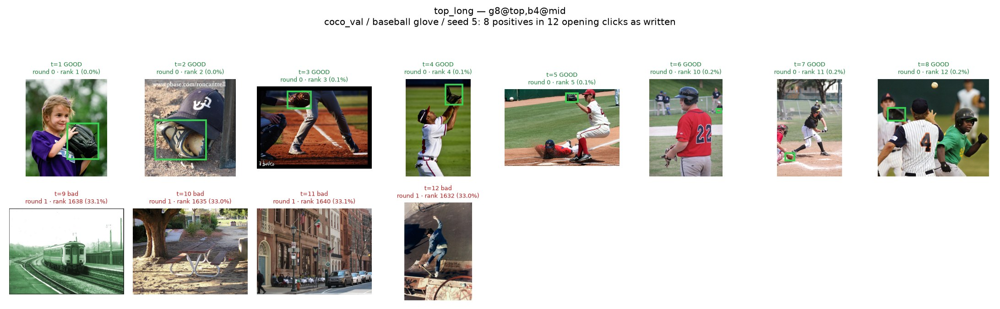

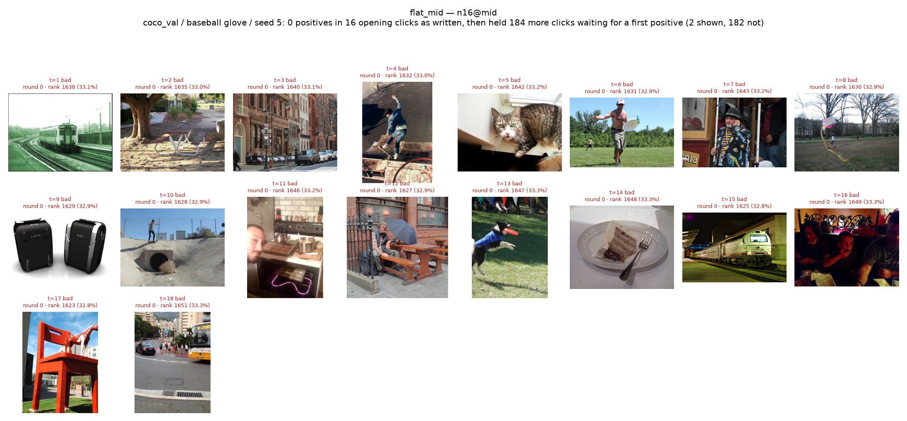

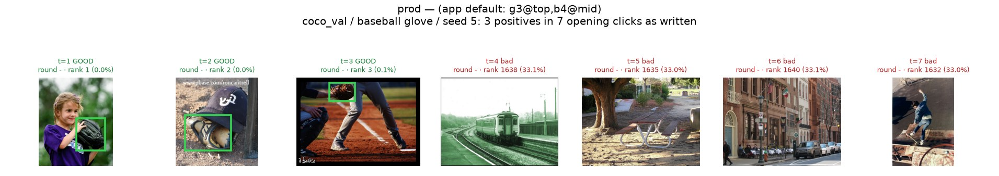

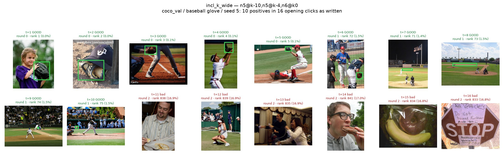

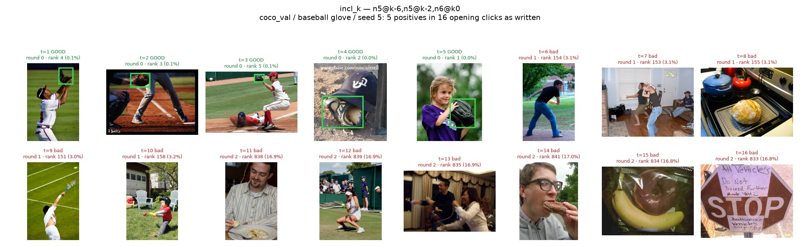

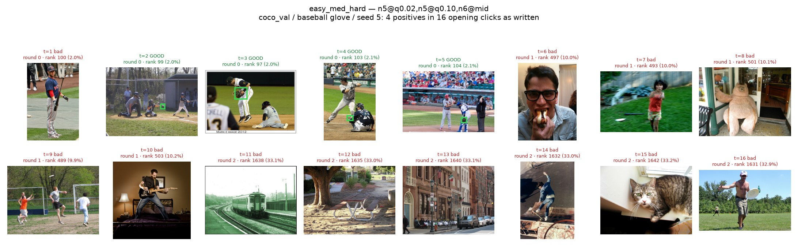

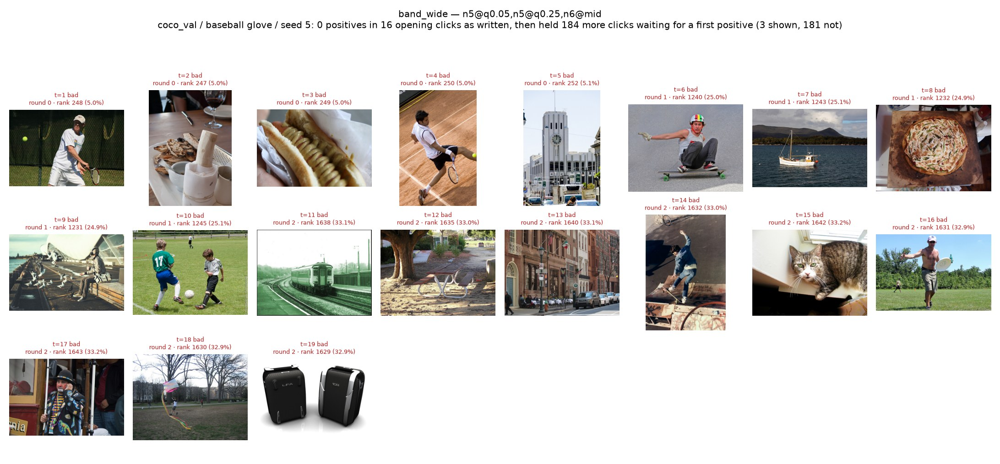

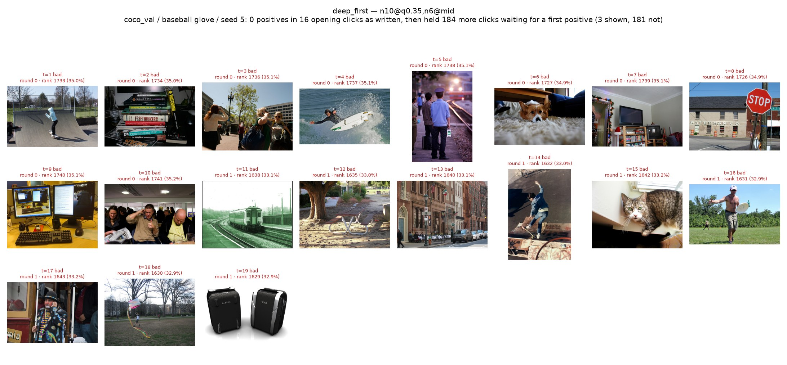

*The two arms that matter are first: `top_long` (eight positives off the top)
and `flat_mid` (zero, from a twenty-eight-rank sliver at the 33rd percentile).
`prod` is third for reference; the rest follow.*

### `coco_val / person / seed 0` — a common category (54% prevalence)

The contrast collapses, which is the banded table's story in pictures. Every arm
finds positives easily — `flat_mid` gets 7 in its 16 clicks and `deep_first` 10,
neither is held at all, and `incl_k_wide`'s 12 is barely ahead of them. When more
than half the pool is a positive, *where* you open stops mattering, and the
opening's job is already done by chance.

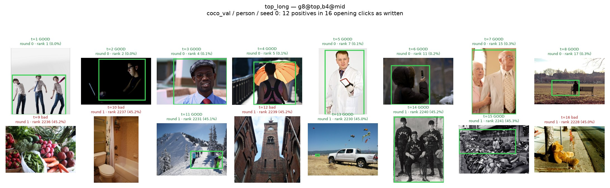

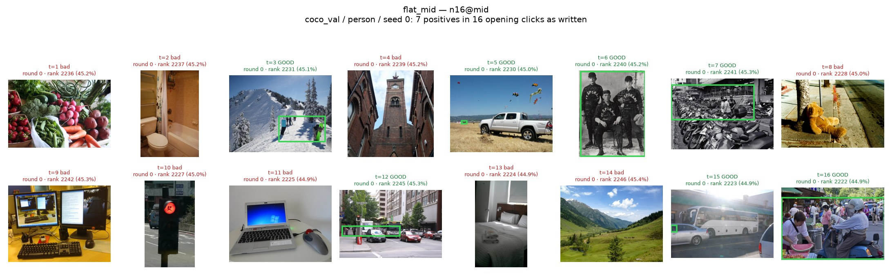

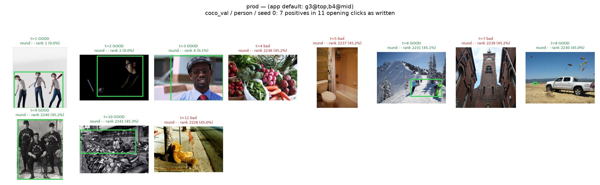

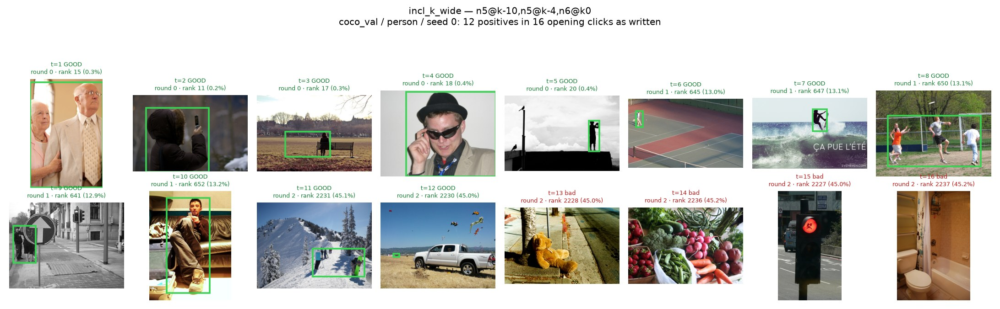

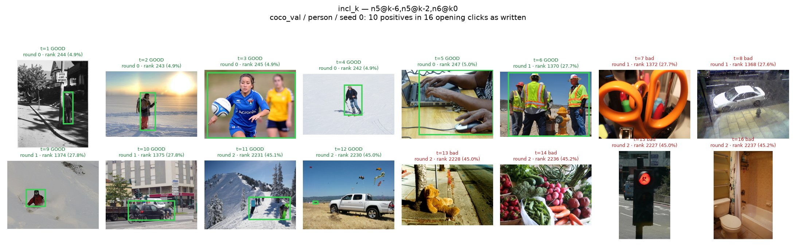

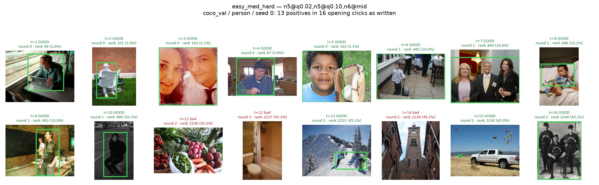

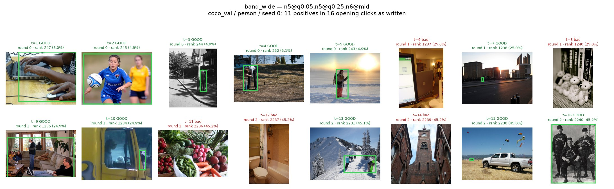

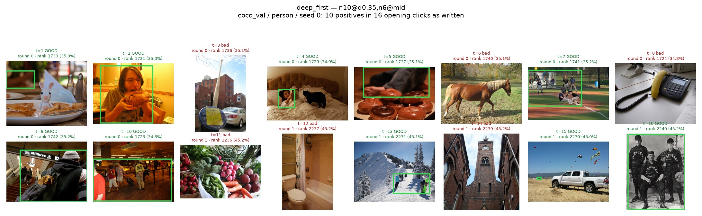
