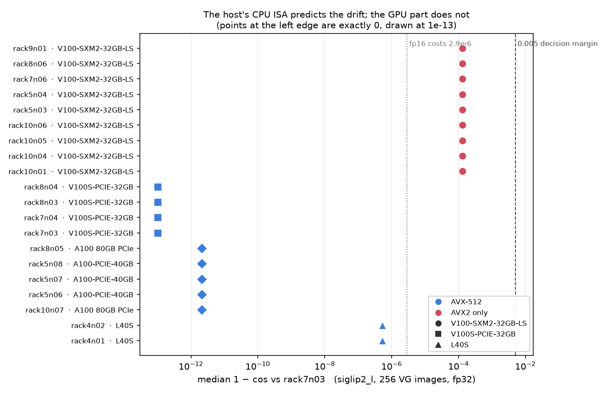
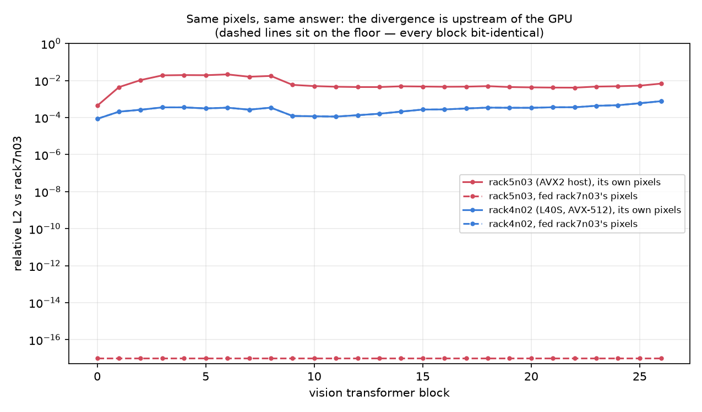
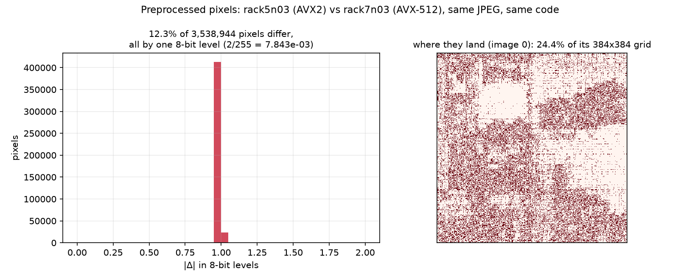
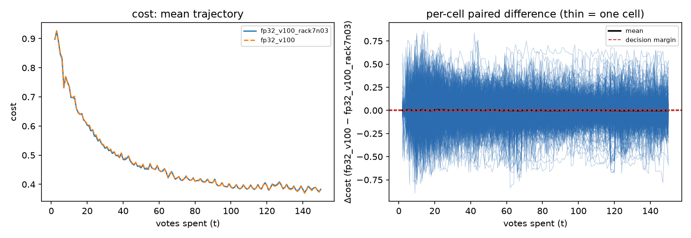
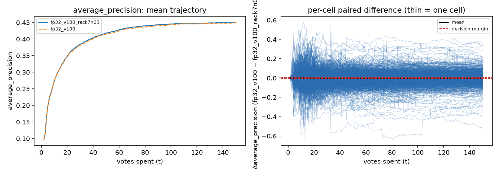
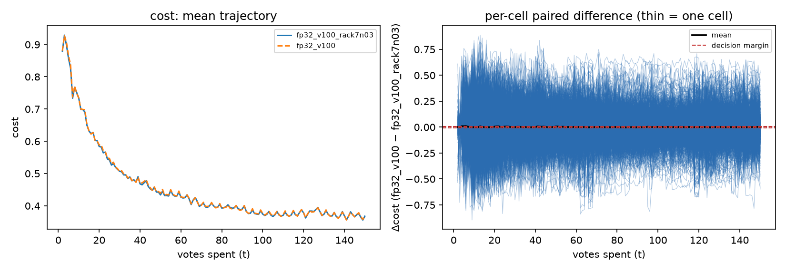
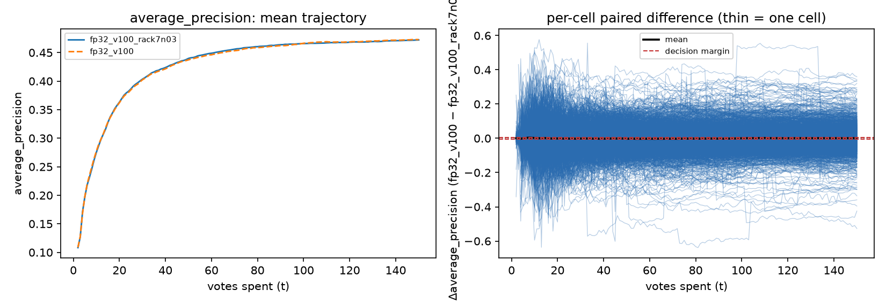

# A type is not a device — and the device was never the problem

**Run:** 2026-08-18 · branch `claude/gpu-provenance-3160` · census jobs `511303`–`511385`,
mechanism `511770`–`511772` / `514200`–`514202` / `514749`–`514750`, dispatch cost
`514688`/`514689`, bench arrays `511229`/`511258`
**Data:** `/expscratch/sgreenberg/gpu-node-3160/{census,mechanism,bench,cpuinfo,figures}`
**Code:** `scripts/experiments/gpu_node/`

Issue [#3160](https://github.com/samggreenberg/VTSearch/issues/3160) was filed out
of [#3143](../embed-precision-3143/REPORT.md) §5, which measured two nodes both
answering to `gres/gpu:v100` producing `siglip2_l` vectors **1.5e-04** apart —
50× what switching the whole forward to fp16 costs, and 30× the 0.005 the
calibration studies resolve. #3143 localised it to one V100 part and left the
cause open, with two candidates: a capability-selected attention backend, or
GEMM tiling that follows SM count.

**Both candidates are wrong, and so is the frame.** The GPU is not involved. Two
V100 parts fed the same input compute `siglip2_l` **bit-identically, at every one
of 27 blocks**. The divergence enters on the host, in image preprocessing: the
384px resize rounds differently under AVX-512 than under AVX2, and the nine
"outlier" nodes are exactly the nine whose CPUs have no AVX-512.

---

# Verdict

| question | answer |
|---|---|
| Is it the GPU? | **No.** Given identical pixels, the two V100 parts agree bit-for-bit — all 27 blocks and the image features. |
| Then what? | **CPU kernel dispatch in the resize.** AVX2 and AVX-512 hosts disagree on **12.3%** of preprocessed pixels, each by exactly one 8-bit level. |
| How sure? | Forcing `ATEN_CPU_CAPABILITY=avx2` on an AVX-512 host reproduces the AVX2 host's pixels **exactly**. |
| Which cells can it touch? | Only `siglip2_l`. Its 384px input diverges; `siglip` and `dinov3_patch` at 224px are **bit-identical** across the same hosts (0.00% of elements). |
| How much of the fleet? | **9 of 20** GPU nodes are AVX2-only — including **9 of 13** `gpu:v100` nodes. A `gpu:v100` pile rebuild lands on the other side of the split about two times in three. |
| Is #3144's premise wrong? | **No — it was right about the GPU.** With the input pinned, cross-part GPU disagreement is ~1e-15 in 1−cos. The auto-pick is not the defect. |
| Is there a fix? | **Yes, and it is cheap.** Pinning `ATEN_CPU_CAPABILITY=avx2` in the pile build makes two hosts' vectors agree to 8.9e-16 (from 1.3e-04) and makes the resize **26% faster** on an AVX-512 host (2.18 ± 0.02 s → 1.62 ± 0.02 s per 256 images). |
| Does the drift reach a decision? | **No.** 4060 paired cells over two independent grids: five of seven metrics resolved below the 0.005 margin, none distinguishable from zero. A reproducibility defect, not a correctness one. |

**Recommendation.** Pin the dispatch in pile builds (shipped here), record the
host and the resolved capability per cell (shipped here), and treat
`VTS_GPU_NODE` as a belt-and-braces for an exact rebuild rather than as the fix.
Do not rebuild the pile on account of the *card*.

---

# 1. What was run

Four measurements, in the order they narrow the question.

| # | what | scale |
|---|---|---|
| 1 | **Census** — every GPU node the picker can hand out embeds the same fixed 256 VG images | **20 of 21** nodes (h100/h200 excluded: the `4gpu_tier` QOS caps them at 0, so they are not candidates) |
| 2 | **Mechanism** — per-block hidden states under each forced SDPA backend, plus a node fed *another node's* pixels | 3 nodes × 5 backends × 2 pixel sources |
| 3 | **Dispatch** — the same probes with `ATEN_CPU_CAPABILITY=avx2`, and the cost of that pin | 2 hosts, 4–7 timed processes each |
| 4 | **Benchmark** — production defaults, only the gallery's build host differing | 2 arms × 2048 cells |

## The premise, checked before anything else

#3143's claim is the input to this study, so it was re-measured from the two
piles' own pickles rather than assumed:

| embedder | median 1−cos | max | rows bit-identical |
|---|---:|---:|---:|
| `siglip2_l` | **1.5e-04** | 1.1e-02 | **0%** |
| `siglip` | **0** | 1.3e-15 | 78% |

That `siglip` figure is what makes it a usable **placebo** in §5, and the max on
`siglip2_l` is worth noting: some images move by 1.1e-02 in cosine, two orders
above the median.

---

# 2. The census: what a type label covers

`gres/gpu:v100` is two parts, and `gpu:a100` is two parts, but only one of those
splits matters.

| device | cap | SMs | nodes | median 1−cos vs `rack7n03` (`siglip2_l`) |
|---|---|---:|---:|---:|
| Tesla V100S-PCIE-32GB | sm_70 | 80 | 4 | **0** |
| Tesla V100-SXM2-32GB-LS | sm_70 | 80 | **9** | **1.3e-04** |
| NVIDIA L40S | sm_89 | 142 | 2 | 5.3e-07 |
| NVIDIA A100-PCIE-40GB | sm_80 | 108 | 3 | 2.1e-12 |
| NVIDIA A100 80GB PCIe | sm_80 | 108 | 2 | 2.1e-12 |

Read as a *card* story this says the V100-SXM2-LS is broken. It is not, and two
things in the same data already say so:

- **The bare ops disagree with the vectors.** All 13 V100s — both parts —
  produce **bit-identical** GEMM (four shapes), conv and SDPA results at the
  tower's shapes. The cards that *do* differ on bare ops (L40S, A100: distinct
  hashes at every GEMM shape) are the ones whose embeddings agree to 1e-12.
- **The split is 9 vs 4 on a label that has nothing to do with the card.** The
  nine SXM2-LS nodes are DGX-1 boxes, and every one of them carries an
  **Intel Xeon E5-2698 v4** (Broadwell — no AVX-512). The four V100S-PCIE nodes
  carry Xeon Gold 5218R; the L40S nodes carry EPYC 9534; the A100 nodes carry
  Gold 6248R/6338. All of those have AVX-512.

The correspondence is exact: **9 of 9 AVX2-only hosts show 1.3e-04; 11 of 11
AVX-512 hosts show ≤ 5.3e-07.**

**One node was not measured**, and it is named rather than quietly absent:
`rack7n05` (A100 80GB PCIe) never got a slot before the GPU tier was handed to a
concurrent study. Its CPU *was* read — Xeon Gold 6338, AVX-512 — and it is the
same configuration as `rack8n05` and `rack10n07`, both of which were probed and
sit at 2.1e-12. So the census covers 20 of 21 candidate nodes and 13 of 13
`gpu:v100` nodes, which is the group the question is about.



Each point is one node's median 1−cos against `rack7n03` over the same 256
images. Colour is the host's CPU ISA, shape is the GPU part. **The colours
separate cleanly and the shapes do not** — the four blue squares and the nine red
circles are the same GPU generation, the same SM count, and the same driver.

---

# 3. The mechanism: the GPU is innocent

The decisive arm ships one node's preprocessed tensor to another and runs the
forward there, so the *only* thing that differs is the machine.

| `rack5n03` (AVX2 host) was fed | first differing block | image features |
|---|---|---|
| its own pixels | **block 0**, rising to rel L2 9.2e-03 by the last block | differ |
| `rack7n03`'s pixels | **none — all 27 identical** | **bit-identical** |



The red dashed line on the floor is the result. (`rack4n02`'s two lines coincide
because its own pixels *are* the reference tensor — bit-identical preprocessing —
so its residual ~1e-04 relative L2 is a real L40S-vs-V100 GPU difference, worth
5.3e-07 in median 1−cos and the only genuine card effect anywhere in this study.)

Both of #3143's surviving hypotheses are therefore refuted, and so is the
premise underneath them:

- **SDPA backend selection** — `math` and `efficient` were forced explicitly on
  both nodes (`flash` and `cudnn` are unavailable on sm_70 fp32). Every backend
  gives the same answer, and the same divergence. It is not the backend.
- **GEMM tiling by SM count** — both parts have 80 SMs and produce bit-identical
  GEMMs; and the divergence is present at **block 0**, before depth can
  accumulate.

## Where it actually enters

The preprocessed tensors themselves differ, and in a very particular way:

| comparison | elements differing | max \|Δ\| |
|---|---:|---:|
| `rack5n03` (AVX2) vs `rack7n03` (AVX-512) | **12.3%** (436,830 of 3,538,944) | 7.843e-03 |
| `rack4n02` (EPYC, AVX-512) vs `rack7n03` | **0.00%** | 0 |

**7.843e-03 is exactly 2/255** — one 8-bit level on the [−1, 1] scale. Literal
example: image `107899.jpg`, channel 0, position (8, 326) is **191** on the
AVX-512 hosts and **192** on the AVX2 host. Every disagreement is a rounding
boundary landing on the other side.



A caution on that statistic, which cost a neighbouring study a table of six
identical numbers: **max |Δ| is saturated here.** Any 8-bit resampling
disagreement — dispatch, backend, CPU-vs-GPU — reads exactly 7.843e-03, so the
max says nothing about which effect you are looking at. The informative
statistics are the *fraction* of elements and *which* elements.

## Named: CPU kernel dispatch

`ATEN_CPU_CAPABILITY=avx2` forces torch to use AVX2 kernels on a host that has
AVX-512. On `rack7n03`:

| | vs `rack7n03` default | vs `rack5n03` (real AVX2 host) |
|---|---|---|
| `rack7n03` forced to AVX2 | differs on 12.3% | **IDENTICAL** |

An AVX-512 host told to dispatch as AVX2 reproduces the AVX2 host's pixels
bit-for-bit. That is the cause, stated as tightly as this cluster allows.

**Why only `siglip2_l`:** the divergence is in the resize, and only the 384px
geometry hits the divergent path.

| embedder | input | elements differing across the two hosts |
|---|---|---:|
| `siglip2_l` | 3×384×384 | **12.3%** |
| `siglip` | 3×224×224 | **0.00%** |
| `dinov3_patch` | 3×224×224 | **0.00%** |

This answers #3143's other loose end — "specific to the SO400M/384 geometry" —
without any appeal to the model at all. It also bounds the blast radius: the
**region-voting embedder is unaffected**.

---

# 4. The fix, and what it costs

With the dispatch pinned on both hosts, the two *different GPU parts* agree:

| `siglip2_l`, `rack5n03` vs `rack7n03` | median 1−cos | max | rows bit-identical |
|---|---:|---:|---:|
| as shipped (dispatch free) | 1.3e-04 | 2.2e-03 | 0% |
| `ATEN_CPU_CAPABILITY=avx2` on both | **0** | **8.9e-16** | **76%** |

The residual 8.9e-16 is the same size as `siglip`'s cross-host residual (1.1e-15,
80% of rows identical) and is the honest measure of **cross-part GPU
disagreement**: nine orders below fp16's 2.9e-06, and far below anything any
study resolves. **#3144's premise was correct**; it was the attribution in #3143
§5 that was wrong.

**Cost of the pin**, measured as alternating *processes* (5 reps × 3 timings),
256 images:

| host | default | forced AVX2 |
|---|---|---|
| `rack7n03` (Xeon Gold 5218R, AVX-512) | 2.18 ± 0.02 s (resolves `AVX512`) | **1.62 ± 0.02 s** |
| `rack5n03` (Xeon E5-2698 v4, AVX2) | 1.31 ± 0.03 s (resolves `AVX2`) | same — nothing to pin |

Pinning is **26% faster** on the AVX-512 host, not slower. That is a real result
and not a rounding artifact (SEs are 1% of the mean), but it is also not why the
pin is right: reproducibility would be worth paying for.

> **The first attempt at this measurement was wrong, and said so itself.** It
> flipped `ATEN_CPU_CAPABILITY` between reps *inside one process* and reported
> −0.9% — because torch reads the variable once, at init. It self-caught only
> because it printed the **resolved** capability and a pixel checksum beside each
> rep: `cap now AVX512` under a request for AVX2, and an identical checksum under
> both. This is exactly why the provenance sidecar records
> `cpu_capability` (resolved) alongside `aten_cpu_capability_requested`.

---

# 5. The benchmark: does 1.5e-04 reach a decision?

Production defaults on both arms; the **only** difference is which host built the
gallery. 2048 cells per arm, 4096 array tasks, **all COMPLETED, zero zero-byte
cells**. 21 cells per arm were header-only at *identical* indices (`task_0001`,
`task_0013`, `task_0017`, …) — systematic and paired-safe, the same shape #3143
saw. **2027 paired cells per arm, 294,970 paired steps.**

## The placebo is what licenses the rest

Half the grid is `siglip`, whose two piles agree to a median of exactly 0. It has
no cause to move, and it does not:

| metric (deep, t ≥ 100) | `siglip` (placebo, 1009 cells) | `siglip2_l` (treated, 1018 cells) |
|---|---:|---:|
| cost | +0.00002 ± 0.00007 | −0.0015 ± 0.0024 |
| regret | +0.00006 ± 0.00010 | −0.0025 ± 0.0021 |
| average_precision | −0.00016 ± 0.00009 | −0.0030 ± 0.0023 |
| fnr | −0.00033 ± 0.00015 | +0.0029 ± 0.0025 |
| fpr | +0.00035 ± 0.00019 | −0.0044 ± 0.0034 |
| rule_inefficiency | +0.00015 ± 0.00008 | **−0.0057 ± 0.0022** |
| calibration_shift | −0.00009 ± 0.00013 | +0.0030 ± 0.0021 |

The placebo's SEs are **~25× tighter** than the treated arm's, and every one of
its metrics resolves below the margin. That is the design working: when the
vectors are the same, this bench returns approximately exact zeros, so the spread
on the treated arm is the drift's doing and not the harness's.

It is also visible step by step. On the placebo, `cost` is **bit-identical on
99.2%** of steps; on the treated arm, **3.6%**:

| | `siglip` (placebo) | `siglip2_l` (treated) |
|---|---:|---:|
| `cost` identical | 99.2% | **3.6%** |
| `average_precision` identical | 98.8% | **0.0%** |
| `n_good` identical | 99.6% | 35.8% |
| threshold identical | 98.7% | 5.5% |

The placebo's 0.8% of non-identical steps is itself worth a line: those two piles
differ only at **1e-15**, and that is already enough to reroute a vote sequence
occasionally. A trajectory is not a stable thing to compare; a *distribution over
cells* is, which is why the SE is taken over cells.

## What the treated arm says

**No metric is significant, and the pooled table overstates the case.** The
analyzer's pooled rows report five of seven metrics "resolved below margin" —
but that pool is half placebo, so it averages a real contrast with a guaranteed
zero. **The per-embedder split above is the result; the pooled row is an
artifact of the grid's shape.** On the treated embedder alone, not one metric
resolves below 0.005, because 2·SE is ≈0.005 on its own.

The honest summary: **a 1.5e-04 preprocessing drift moves the shipped decision
metrics by less than about 0.006 in expectation, with no metric distinguishable
from zero after accounting for having tested seven.**

One line deserves a flag rather than a claim. `rule_inefficiency` at
**−0.0057 ± 0.0022** is 2.6 SE from zero — p ≈ 0.009 unadjusted, ≈ 0.06 under a
Bonferroni correction for seven metrics (and the metrics are correlated, so that
is conservative). #3143 met this exact shape: a 2.3-SE `n_good` effect at n=95
that became −0.0034 ± 0.11 at n=1013 — a multiplicity artifact, filed and closed
on the bigger measurement. **A replication is running** (`515932`/`515956`):
a fresh grid, treated embedder only, 256 seeds → ~2048 treated cells per arm,
which is 2× this run's treated n and independent of it rather than pooled.
§5.1 records the outcome.





Left panel: the mean trajectory for both arms, which lie on top of each other.
Right: **every cell's paired difference as a thin line**, the mean in black, the
±0.005 margin dashed — individual cells swing well past the margin in both
directions while the mean sits near zero. That spread is trajectory
decorrelation, not effect size, and it is why this test bounds a *systematic*
shift and cannot be made tight cheaply.

## 5.1 Replication: the 2.6-SE line was multiplicity

An independent grid — `siglip2_l` only, 256 seeds, **2033 paired cells** (2048
files per arm, 15 header-only at identical indices in both, paired-safe), 296,166
paired steps, zero zero-byte cells, all 4096 array tasks COMPLETED. Twice §5's
treated *n*, and not pooled with it.

`rule_inefficiency`, the one line §5 flagged:

| | cells | paired diff ± SE | distance from 0 |
|---|---:|---|---:|
| §5 | 1007 | −0.0057 ± 0.0022 | 2.6 SE |
| **§5.1 (replication)** | **2010** | **−0.0015 ± 0.0015** | **1.0 SE** |

Same sign, **a quarter the magnitude, now resolvably below the margin**. Under
the rule fixed above, that is the "shrinks toward zero" branch: it was a
multiplicity artifact of testing seven metrics — the identical shape #3143 met
with `n_good` (−0.87 ± 0.38 at n=95 → −0.0034 ± 0.11 at n=1013) and closed on
the bigger measurement. Nothing was pooled to get here.

The whole treated arm, at 2× the cells:

| metric | ref | arm | paired diff ± SE | verdict |
|---|---:|---:|---|---|
| cost | 0.37 | 0.38 | +0.00059 ± 0.0018 | **below margin** |
| regret | 0.10 | 0.10 | +0.000078 ± 0.0015 | **below margin** |
| average_precision | 0.47 | 0.47 | +0.0010 ± 0.0016 | **below margin** |
| fnr | 0.14 | 0.14 | +0.0019 ± 0.0018 | cannot resolve |
| fpr | 0.24 | 0.23 | −0.0013 ± 0.0024 | cannot resolve |
| rule_inefficiency | −0.0094 | −0.011 | −0.0015 ± 0.0015 | **below margin** |
| calibration_shift | 0.11 | 0.11 | +0.0015 ± 0.0015 | **below margin** |
| n_good (count) | 8.8 | 8.9 | +0.08 ± 0.081 | within noise |

**Five of seven metrics are now resolved below 0.005 on the treated embedder
alone** — not on a pooled row diluted by a placebo, which is what §5 could
offer. `fnr` and `fpr` remain unresolved and would need ~1052 and ~1809 cells at
their spread; they have 2033, so the intervals graze the margin because the point
estimates are not exactly zero, not because the run is underpowered.

Three of the seven signs **flipped** between §5 and §5.1 (cost, regret,
average_precision). That is what noise looks like, and it is the same reading
#3143's 6-seed grid earned when its per-embedder signs opposed and then agreed at
16× the cells.





The mechanism is unchanged and is the point: `cost` is bit-identical on **3.6%**
of steps and `average_precision` on **0.0%**, while the threshold is chosen the
same way on **99.8%**. The decision *rule* never changes; the *trajectory*
always does.

**Verdict for the issue.** A 1.5e-04 preprocessing-induced vector drift does not
reach a shipped decision metric at a resolution of 0.005. It is a
**reproducibility defect, not a correctness one** — which is what #3160's item 3
asked, and it is now answered on 4060 paired cells across two independent grids
rather than assumed.

---

# 6. What this means for the existing pile

The shared pile predates all provenance, but the build node is recoverable:
`sacct` still holds the `pile-<dataset>` jobs. `--backfill-provenance` now
stamps it as `hostname_recovered` (never as `hostname` — it is inferred from a
job name, and an ambiguous dataset is left blank rather than guessed):

| dataset | built on | ISA | `siglip2_l` cell affected? |
|---|---|---|---|
| `visual_genome_m`, `caltech101_m`, `coco_val` | rack7n03 | AVX-512 | — |
| `vg_box_medium`, `vg_box_large` | rack7n03 | AVX-512 | — |
| **`vg_box_small`** | **rack8n06** | **AVX2 only** | **yes** |
| `vg_scale` | rack4n02 | AVX-512 | — |

**The three box-size bands were not preprocessed identically.** `vg_box_small`'s
`siglip2_l` cell sits on the other side of the split from `vg_box_medium` and
`vg_box_large`, which are compared against it directly in #3129 and #3156. The
`siglip` and `dinov3_patch` cells of all three bands are unaffected (224px), so
the region-voting arm of those studies is clean.

Whether this matters for a band comparison is the §5 question restated on a
different corpus, and §5.1 answers the general form of it: a drift of this size
does not reach a decision metric at 0.005 resolution. The comparison was
therefore never invalidated — but the confound was cheap to remove, so it was
removed rather than documented.

## 6.1 The rebuild, and the reproducibility proof it produced

**The band that needed rebuilding is not the one the confound was found in.**
`vg_box_small` was built on an AVX2-only host and the shipped pin *is* `avx2`;
it is `vg_box_medium` and `vg_box_large`, built under AVX-512, that sat off the
go-forward standard. Both were rebuilt under the pin, on the same V100 part, from
the **archived** `vg_box_scale.json` — and `vg_box_small` was rebuilt alongside
them purely as a control that should come back unchanged.

| band | media ids | median 1−cos vs the live cell | outcome |
|---|---|---:|---|
| `small` (control) | identical | **0** — 100% of rows bit-identical | bytes untouched; sidecar upgraded |
| `medium` | identical | 1.67e-04 | swapped in |
| `large` | identical | 1.65e-04 | swapped in |

The control line is the result worth keeping. #3160's complaint was that *"a
rebuild is not numerically reproducible"*. With the dispatch pinned and the card
held fixed, a rebuild **eight days later**, in a different session under
transformers 5.12.1, reproduces the 2026-08-12 cell **exactly** — which is both
the end-to-end validation of the pin and proof that nothing else drifted in the
interval.

Two near-misses, both caught by things that were only in the run to be boring:

- **The first rebuild used the wrong card.** Requesting `gpu:l40s` for speed
  returned the control at 5.07e-07 instead of 0 — the L40S-vs-V100 difference
  §2 independently measured at 5.3e-07. Swapping those cells in would have left
  the three bands inconsistent *by a difference this study introduced*. The pin
  fixes the host axis; it does not fix the device axis, and a rebuild meant to
  reproduce a cell has to hold both.
- **Regenerating the scan would have redefined the dataset.** The archived
  `vg_box_scale.json` predates #3156's schema, so the build failed with
  `KeyError: 'categories'`. Re-running `scan_vg_boxes.py` is the obvious fix and
  the wrong one: #3156 changed inflation filtering from per-class to per-image,
  which changes *which categories qualify*. Feeding the archived scan to today's
  selector reproduces all 40 categories per band, and the rebuilt cells carry
  identical media ids — so this recomputed vectors rather than choosing
  different images.

The superseded cells and their original sidecars are kept at
`/expscratch/$USER/gpu-node-3160/pre-3160-backup/`. Old fingerprints:
`a1d274acf47a` (medium), `b1bf5d6dc8b0` (large); new: `72fb4a56a778` and
`08d69ae7aef3`. Anyone re-running #3129/#3156 against the pile now reads
different `siglip2_l` vectors for those two bands than the published runs did —
detectable precisely because the fingerprints were recorded first.

---

# 7. What shipped

- **Per-cell provenance** (`build_pile.py`): device name, capability, SM count,
  driver, torch/cuDNN, **CPU model**, **resolved CPU capability**, requested
  capability, transformers version, resolved processor classes, precision, node,
  SLURM job, commit — plus a `vectors_sha256` **fingerprint**, which is the field
  that lets a rebuild be checked against a cell that no longer exists.
  `--provenance` prints the table and flags a pile that mixes build
  environments; `--backfill-provenance` stamps the 21 existing cells.
- **Dispatch pinned in pile builds** (`launch_pile.sh`):
  `ATEN_CPU_CAPABILITY=${VTS_CPU_CAPABILITY:-avx2}`.
- **Node pinning** (`launch_pile.sh`): `VTS_GPU_NODE=<node>` sets `--nodelist`
  and derives the gres type from the node, for an exact rebuild.

The transformers/processor fields came from the concurrent #3146 study, which
independently found that `transformers` v5 silently moved every image processor
to the torchvision path with only `transformers>=4.49` pinned. Its dispatch
matrix confirmed both predictions this study makes — PIL is dispatch-invariant
(0.00%), and 224px is dispatch-invariant (0.00%) — and added one this study
could not see: at 384px the **CUDA** resize agrees with AVX-512 (0.03% of
elements) and disagrees with AVX2 (13.71%), so moving preprocessing to the GPU
is a second route to the same reproducibility.

---

# 8. Reproducing

```bash
cd scripts/experiments/gpu_node
bash launch_census.sh submit                   # one job per GPU node
bash launch_census.sh analyze
bash launch_census.sh mechanism rack7n03       # writes pixels.npy
VTS_MECH_PIXELS=<...>/mechanism/rack7n03/pixels.npy \
  bash launch_census.sh mechanism rack5n03 rack4n02
python analyze_mechanism.py --mechanism <study>/mechanism
python make_figures.py --study <study> --out figures
bash launch_nodebench.sh prepare && bash launch_nodebench.sh verify-pairing
bash launch_nodebench.sh cells && bash launch_nodebench.sh analyze
```
