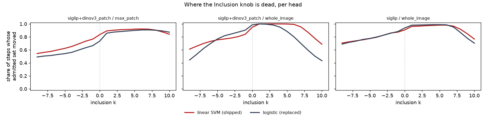
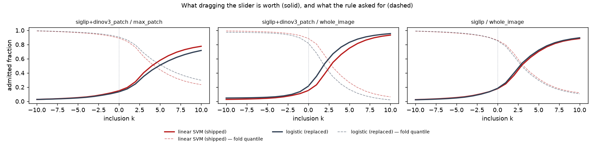
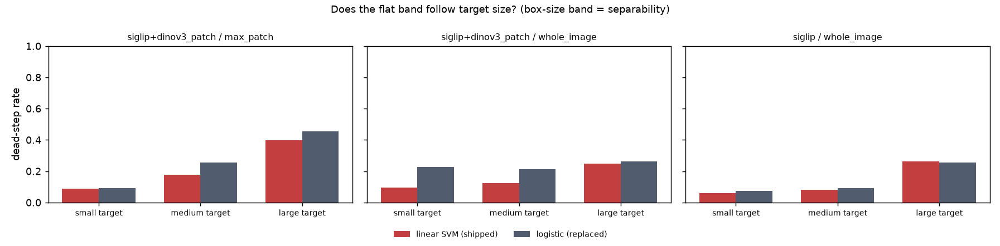
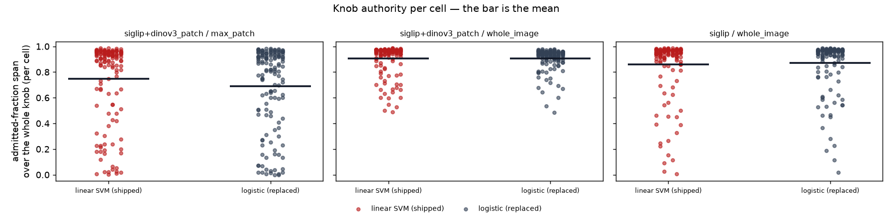
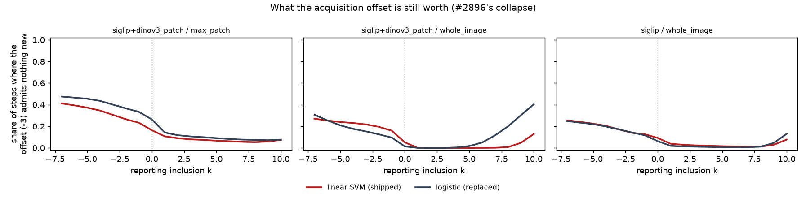

# Does the Inclusion knob still have authority under the linear SVM head? (#3196)

**Yes. The premise does not reproduce on real data, and the sign is the other
way round: under the shipped linear SVM the knob is at least as live as it was
under the logistic head, and significantly livelier in both DINOv3
environments. Nothing ships; keep `mid_tilt`.**

Pre-registration: [`PLAN.md`](PLAN.md), fixed before the first cell landed.
576 of 576 cells COMPLETED, 0 unreadable, 0 empty, 0 zero-byte, 11.7 M
cut-inclusion rows per head arm.

| | |
|---|---|
| Run | `/expscratch/sgreenberg/incl-3196`, arrays 594924 (`svm`) + 594962 (`linear`), 21:30–00:31 on 2026-08-29 |
| Worktree / branch | `/exp/sgreenberg/projects/vts-incl-3196`, `claude/inclusion-knob-3196` |
| Dataset | `vg_scale` — 12 hand-checked classes × 3 box-size bands, 100 positives and prevalence 0.0250 in every cell |
| Environments | `siglip/whole_image` (binary), `siglip+dinov3_patch/whole_image` (binary, other embedder), `siglip+dinov3_patch/max_patch` (region) |
| Arms | head `linear_svm` (shipped, `CALIB_HEAD` unset) vs `linear` (declared `--diverges head`); 21 inclusion stops × 5 cut rules × 5 `q_tilt` step sizes, eval-only |
| Read on | the deep regime, `n_votes >= 100`; 7,344 steps per (arm, environment) |

## Instrument checks

Both are algebra, not findings; a failure in either would have made everything
below unreadable.

- **`mid` is inert**, exactly as #2865 measured: dead-step rate **1.00**, knob
  yield **0.048** = 1/21, fully-inert step rate **1.00**, in every environment
  under both heads. One admitted set for the entire slider.
- **`mid_tilt` tracks `rate`.** #2865's result is that the two differ by a
  *constant* in fold-quantile space; the invariant that follows is on the
  distance travelled in quantile space, and the largest gap in `quantile_span`
  anywhere in this run is **6·10⁻⁸** — float32 epsilon. The algebra reproduces
  exactly on a new head and a new dataset.

That invariant says nothing about the *realized* sets, and this run shows why it
must not be asked to: the same two rules differ in dead-step rate by up to
**0.12**. Two cuts a constant apart sit at different places in the score
distribution, so one quantile path lands on ties and gaps the other misses. The
first version of this check gated on the admitted rate and called the run's own
instrument broken; the gate now reads the quantile span, and the difference in
realized sets is reported as what it is — a fact about local density.

## H1 — did the head move the knob? Not the way the issue expected

Paired by cell (same environment, category and seed; the two heads collect
different votes from their first retrain, so the cell is the only pairing unit
that survives), bootstrap over 144 cells per environment. **Negative = livelier
under the SVM.**

| environment | Δ dead-step rate | 95% CI | SVM | logistic |
|---|---|---|---|---|
| `siglip+dinov3_patch/whole_image` | **−0.077** | [−0.10, −0.051] | 0.16 | 0.23 |
| `siglip+dinov3_patch/max_patch` | **−0.046** | [−0.073, −0.019] | 0.22 | 0.27 |
| `siglip/whole_image` | −0.0053 | [−0.021, +0.012] | 0.13 | 0.14 |

| environment | Δ admitted span | 95% CI | SVM | logistic |
|---|---|---|---|---|
| `siglip+dinov3_patch/max_patch` | **+0.059** | [+0.024, +0.096] | 0.75 | 0.69 |
| `siglip+dinov3_patch/whole_image` | −0.0018 | [−0.014, +0.0092] | 0.91 | 0.91 |
| `siglip/whole_image` | −0.013 | [−0.033, +0.010] | 0.86 | 0.87 |

H1 is **not supported**: no environment is deader under the SVM, two are
significantly livelier, and the shipped default detector (`siglip/whole_image`)
is a null — a difference smaller than twice its own standard error, which is
"not resolvable here", not "unchanged".



*Share of steps whose admitted set changed at each stop of the knob, one line
per head, deep regime. Read the **position**, not just the level: liveness peaks
between k = 0 and k = +5 — where users sit — and decays toward the permissive
end. There is no flat band anywhere near 0 under either head, and the red
(shipped) line is at or above the dark one almost everywhere. This is a mean
over 7,344 steps per line; it does not license a claim about any single cell,
which is what the per-cell figure below is for.*

## H2 — has the knob gone soft in absolute terms? No

Read on the shipped head only, in the deep regime, against the bars fixed in the
plan: soft means dead-step rate ≥ 0.50 **or** admitted span ≤ 0.05.

| environment | dead-step rate | admitted span | fully-inert steps |
|---|---|---|---|
| `siglip/whole_image` | 0.13 | 0.86 | 0.008 |
| `siglip+dinov3_patch/whole_image` | 0.16 | 0.91 | 0.000 |
| `siglip+dinov3_patch/max_patch` | 0.22 | 0.75 | 0.035 |

Nothing is close to either bar. Dragging the slider end to end moves the
admitted fraction across three quarters to nine tenths of the collection.



*Mean admitted fraction across the knob (solid) beside the fold quantile the
rule asked for (dashed, and falling because it is a low-side quantile). The
solid curves are monotone sigmoids from ~0.03 at k = −10 to 0.75–0.95 at
k = +10, with no plateau at the middle. Averaged over cells, so it cannot show
the tail — see below.*

## The flat band is real. Its axis is the target, not the head

The issue's mechanism is correct: where the fitted components are cleanly
separated, the rate root stays interior and the tilt cannot express itself. What
the run relocates is *what makes a haystack cleanly separated*. It is the size
of the thing being looked for, and the effect is monotone in the box-size band
under **both** heads.

Dead-step rate (admitted span in parentheses), shipped head:

| environment | small | medium | large |
|---|---|---|---|
| `siglip/whole_image` | 0.061 (0.94) | 0.081 (0.93) | **0.26** (0.71) |
| `siglip+dinov3_patch/whole_image` | 0.095 (0.94) | 0.12 (0.93) | **0.25** (0.84) |
| `siglip+dinov3_patch/max_patch` | 0.087 (0.89) | 0.18 (0.80) | **0.40** (0.55) |



*The same numbers with the logistic head beside them. The ordering
small < medium < large holds in all six series; the head shifts the level
slightly and never the ordering. A large target is most of the frame, which is
exactly the regime the planted-patch fixture is built in.*

**And the tail is the finding a mean cannot show.** Per cell, on region voting
under the shipped head, **5.6%** of cells have an admitted span ≤ 0.05 — a
slider that genuinely does nothing — and **15%** have a dead-step rate ≥ 0.50.
Under the logistic head those are **8.3%** and **21%**: worse, again.



*One marker per cell, bar at the mean. The distribution is bimodal, not spread:
most cells sit at 0.9–1.0 and a minority sit near zero. The region panel's mean
of 0.75 is not what a typical cell looks like — it is 0.95 with a tail hanging
off it.*

Seven of the eight dead cells under the shipped head on region voting are
`@large`, and they are not scattered: **`clock@large` is dead in all four
seeds**, `bird@large` in two, plus `umbrella@large` and one `kite@small`. That
is a per-target property reproducing across seeds, not noise. A clock fills its
box, the fitted components separate, the rate root never leaves the inter-mean
interval, and the user's slider stops doing anything — the issue's mechanism,
observed on real data, for the targets that produce it.

## H3 — `q_tilt` does not ship, and would not have even if H2 had fired

H2 did not fire, so by the pre-registered rule nothing ships. The candidate was
priced anyway, and it fails on its own terms.

`q_tilt` vs the incumbent, paired by cell on the shipped head (negative = fewer
dead steps), beside how many of the 63 (environment, k) stops it is *materially*
worse at — CI entirely above the pre-registered 0.01 rate-scale tolerance:

| step | Δ dead-step rate (range over environments) | harmed stops |
|---|---|---|
| 0.005 | −0.071 to −0.099 | **53 / 63** |
| 0.01 | −0.045 to −0.057 | **53 / 63** |
| 0.02 (`FOLD_ANCHOR_QTILT_STEP`) | +0.0087 to +0.043 | 38 / 63 |
| 0.04 | +0.12 to +0.18 | 19 / 63 |
| 0.08 | +0.19 to +0.26 | 14 / 63 |

The two step sizes that buy meaningfully more knob are the two that are worse
almost everywhere on it, and the placeholder 0.02 makes the knob **deader** than
the incumbent in two of three environments while still being harmed at 38 stops.
The free parameter has no good value here — the same verdict #2865 reached on a
different head and different datasets, which is worth more than either run
alone.

**A note on `rate`, and on reading a mechanical gate.** The stock #2865 analyzer,
run per arm, recommends `fold_anchored_w0.3_rate_qmean`: it has a higher knob
yield than the incumbent everywhere (0.87 vs 0.79 on region voting) and it is
**never materially worse** — 0 of 63 stops above the 0.01 bar. Do not ship it on
that. The gate is a materiality test, and underneath it the picture is a
crossover, not a tie: `rate` is significantly worse at **31** of the 63 stops
and significantly better at **20**. It wins on the middle corner
(`siglip+dinov3_patch/whole_image`) below k = 0 and loses nearly throughout on
the other two, including where it matters most —

| environment, k = 0 | Δ regret vs `mid_tilt` | 95% CI | steps `rate` wins |
|---|---|---|---|
| `siglip+dinov3_patch/max_patch` | +0.0089 | [+0.0074, +0.011] | 18% |
| `siglip/whole_image` | +0.0035 | [+0.0019, +0.0051] | 34% |
| `siglip+dinov3_patch/whole_image` | −0.0011 | [−0.0031, +0.0007] | 49% |

— so at the shipped operating point it is worse on the shipped default detector
and on region voting, and a null on the one environment that carries it. That
reproduces #2865's `rate` contrast (+0.015 at k = 0 there, +0.0089 here) on a
new head and a new dataset. Buying liveness the product question says is not
needed, with accuracy where users actually sit, is the trade this sweep exists
to price rather than to assume.

## H4 — the acquisition offset

The shipped `ACQUISITION_INCLUSION_OFFSET = −3` cuts the selector at `k − 3`
while reporting stays at `k`, so it is a gap *across* the slider and is worth
what the slider is worth over that span. Share of steps where the selector's cut
admits exactly what reporting's does — the offset buying nothing:

| environment | k = −7 | k = 0 | k = +2 |
|---|---|---|---|
| `siglip/whole_image` | 0.25 | 0.092 | 0.029 |
| `siglip+dinov3_patch/whole_image` | 0.27 | 0.051 | 0.000 |
| `siglip+dinov3_patch/max_patch` | 0.41 | 0.16 | 0.090 |



*The curve starts at k = −7 because below it the selector's own stop falls off
the end of the slider and there is nothing to compare. The collapse concentrates
at the **permissive end**: a user at k = −7 has a selector cut at k = −10, where
the quantile has pinned and there is nothing left to move past. On region voting
the logistic head is worse throughout (0.48 at k = −7, 0.26 at k = 0), so the
head change helped there; on the two binary environments the shipped head
collapses slightly more at k = 0 (0.051 vs 0.014, 0.092 vs 0.062) — small, and
the opposite sign, so the offset's health is not a head story either. At the
shipped operating point the offset is intact 84–95% of the time, and its mean
gap in admitted fraction at k = 0 is −0.073 to −0.096 — the documented
direction, the selector cutting higher up the ranking than the reported line.*

#2896's collapse is therefore real but mislocated by the same amount as the flat
band: it is a property of where on the slider the user is, not of which head
they are running.

## What this says about the fixture the issue measured

The synthetic planted-patch result (tilt moved 7/7 grid steps under the logistic
head, 0/7 under the SVM) is not wrong; it is a measurement of the **large-target
corner**, where this run also finds the deadest knob (0.40 dead-step rate,
0.55 span). What the fixture cannot show is that the corner is small: it is one
of three bands, and the other two are 0.087 and 0.18. Extrapolating the
fixture's separability to users would have moved the shipped Inclusion rule on
evidence from a regime most real cells are not in — which is why the issue asked
for this measurement before touching the knob, and it was right to.

## Reproduction

```
bash scripts/experiments/calibration/launch_incl_3196.sh prepare
bash scripts/experiments/calibration/launch_incl_3196.sh size 0     # binary cell
bash scripts/experiments/calibration/launch_incl_3196.sh size 36    # pair cell
bash scripts/experiments/calibration/launch_incl_3196.sh svm
bash scripts/experiments/calibration/launch_incl_3196.sh linear
INCL3196_DEPEND=<svm_array>:<linear_array> \
  bash scripts/experiments/calibration/launch_incl_3196.sh analyze
```

Tables and figures are regenerated from the cells by
[`analyze_incl_3196.py`](../../../scripts/experiments/calibration/analyze_incl_3196.py)
and
[`figures_incl_3196.py`](../../../scripts/experiments/calibration/figures_incl_3196.py);
[`selftest_analyze_incl_3196.py`](../../../scripts/experiments/calibration/selftest_analyze_incl_3196.py)
plants an answer for each hypothesis, including a `q_tilt` step size that buys
the knob back with accuracy and must be rejected.

### Ops

Sizing, measured on this grid before either arm was submitted:

| cell | environment | elapsed | MaxRSS |
|---|---|---|---|
| 0 | `siglip` · whole_image | 7m16s | 0.74 GB |
| 36 | `siglip+dinov3_patch` · whole_image + max_patch | 39m47s | 5.07 GB |

The pair cell runs both geometries in one task and set every limit: `--mem 12G`,
4 h, and 36-wide per arm so that two concurrent arms sit at 80% of the per-user
memory allowance. Both arrays drained in 3h01m against a 3h10m estimate, 288/288
COMPLETED each. The cross-head analysis reads 23.4 M rows and peaks at 6.2 GB.

Two things worth carrying:

- **The `__cutincl` frame's `head` column is what makes a cross-head study
  possible at all** — the two arms are separate runs with separate results dirs,
  and the pairing is reconstructed from the cell identity, not from the step.
- **A per-cell reading and a per-environment reading answer different
  questions.** No environment is soft by the pre-registered bars, and 5.6% of
  region cells are individually dead. Both are true, and only the second one
  would reach a user.
