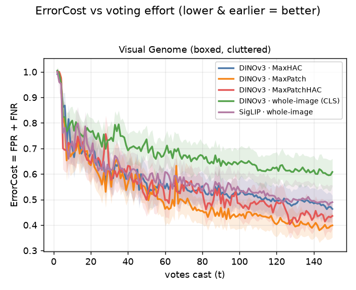
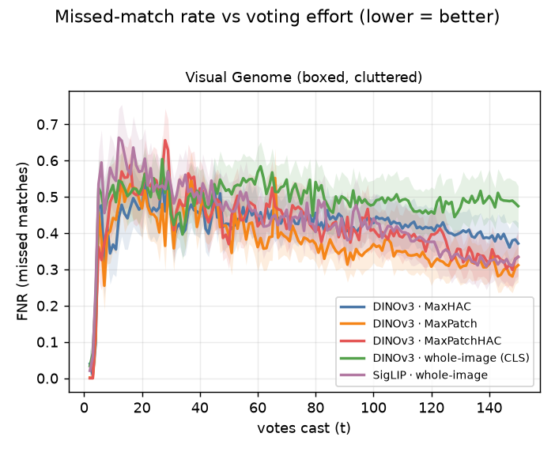
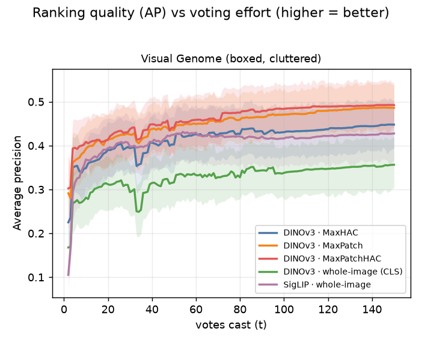
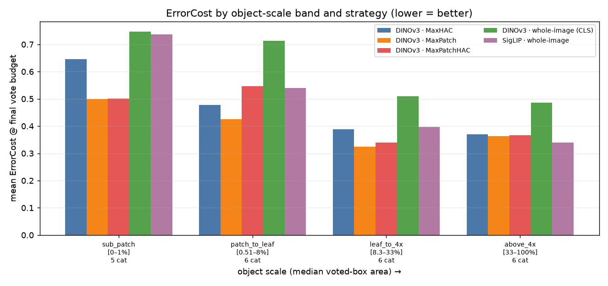
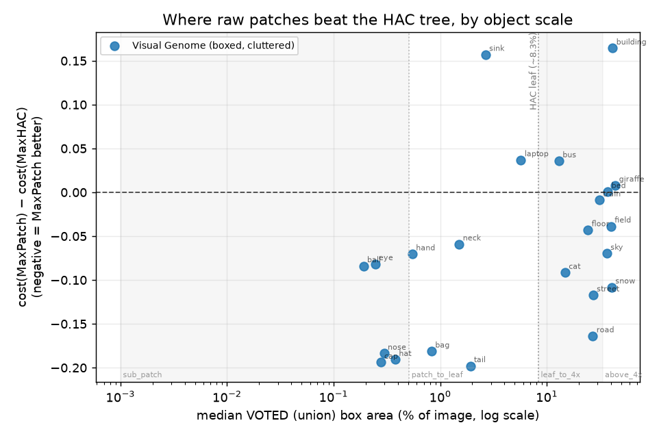

# Region-vote scoring for VTSearch Autopilot — MaxHAC vs MaxPatch vs MaxPatchHAC (vs SigLIP)

_An Autopilot simulation study on the HLTCOE Grid, run on the **corrected**
Max-Patch harness (geometry / calibration / scale-sampling defects fixed, PR
#2732). Tables and figures are generated deterministically from the per-cell
CSVs by `analyze.py`; the prose is written on top of those numbers. This report
supersedes the first (2026-07-29) run, whose Caltech-101 arm measured a harness
defect rather than a property of raw-patch scoring._

## BLUF

VTSearch's Autopilot learns a concept from a handful of Good/Bad votes and ranks
the rest of a collection. When the embedder is patch-based (DINOv3), a Good vote
can be a **region** — a box the user drags around the object — and the tool must
decide **what vector that region vote trains on** and **how an image is scored
from its patches**. Four strategies are compared:

- **MaxHAC** (today's production path) — build a per-image HAC region tree whose
  ~12 leaves are *k-means-pooled* clusters of patches; a Good region-vote snaps
  to the nearest tree node, Bad votes flood the CLS node + leaves, and an image
  scores by max-pooling the classifier over the ~24 pooled region nodes.
- **MaxPatch** (the tree-free challenger) — no tree: a Good region-vote trains
  on the single raw patch nearest the box, a Bad vote floods the whole-image
  vector + every raw patch, and an image scores by max-pooling over the
  whole-image vector plus all 196 raw patches.
- **MaxPatchHAC** (the hybrid, new) — a HAC tree whose **leaves are the raw
  patches themselves**, merged up a binary tree so the ~392 nodes span every
  scale from a single patch to the whole image. A Good region-vote snaps to the
  best-matching node (multi-scale), a Bad vote floods **every** node, and an
  image scores by max-pooling over all nodes — raw patches for small targets,
  merged regions for large ones. The idea: get MaxPatch's sharp small-object
  leaves *and* MaxHAC's multi-scale pooled regions in one tree, at only ~2× the
  node count of the raw patches.
- **SigLIP** (the whole-image baseline) — one global vector per image for both
  votes and scores; no region machinery at all.

## Verdict

**Ship tree-free MaxPatch as the DINOv3 region-vote strategy, and drop the HAC
tree from ingest. The tree does not earn its keep — the production k-means tree
(MaxHAC) loses to plain MaxPatch, and the new raw-patch-leaf tree (MaxPatchHAC)
does not beat MaxPatch either.** On the corrected harness, over 23 scale-band
Visual Genome categories × 3 seeds:

- **MaxPatch is the best arm** — ErrorCost **0.40** at t = 150, vs MaxHAC 0.46
  (paired Δ = −0.064, Holm p = 0.002) and MaxPatchHAC 0.44. It is the best or
  tied-best region style in **every** scale band and wins on both halves of the
  error (FPR 0.089, FNR 0.312).
- **The scale hypothesis holds for MaxPatch vs the production tree.** MaxPatch's
  edge over MaxHAC is largest on small objects and shrinks as objects grow
  (Spearman ρ = 0.50 between voted-box area and the MaxPatch−MaxHAC gap,
  p = 0.016): below leaf scale a raw patch is a near-pure object sample while the
  tree's smallest k-means-pooled leaf already blends the object with context; by
  whole-scene scale MaxHAC's pooled region catches up.
- **MaxPatchHAC lands between the two but beats neither convincingly.** It costs
  more than plain MaxPatch (Δ = +0.037, not significant) and only *numerically*
  edges the production MaxHAC (Δ = −0.027, Holm p = 0.064 — a trend, not
  significant). The one thing it clearly does best is **rank**: it has the
  highest average precision of any arm (AP 0.492 vs MaxPatch's 0.486). But its
  ~392-node multi-scale pool trades that ranking away at the operating point —
  it carries the **highest FPR** of the region styles (0.104 vs MaxPatch's
  0.089), because the max-over-N score has a heavier tail the more candidates N
  it pools. The result is a genuine double edge, visible per band: on large
  objects the merged nodes **improve recall** (FNR 0.21 vs MaxPatch's 0.26 in
  the above-4×-leaf band — the multi-scale idea working) but **over-fire** (FPR
  0.16 vs 0.11), netting to a tie; on the mid `patch_to_leaf` band — where a
  single raw patch is already the right candidate — the extra nodes are pure
  cost (worse FPR *and* FNR); on small objects it simply matches MaxPatch.
- **Why the hybrid doesn't win:** the geometry fix already gave plain MaxPatch a
  whole-image row in its scored pool, so MaxPatch **already spans scales** — a
  single-patch candidate for small objects and the full-image vector for
  whole-scene ones. MaxPatchHAC's intermediate merged nodes add large-object
  recall but pay for it in false positives, and add nothing a raw patch or the
  whole-image row didn't already cover on small and mid objects.
- **Region scoring still matters more than any of this.** All three region
  styles crush whole-image scoring — DINOv3's global CLS vector (0.61) is the
  worst arm, below the SigLIP baseline (each region style beats CLS at
  p < 0.001) — so the win is region-vote scoring itself, not the choice of
  embedder or pooling.

### Plans for moving forward

1. **Adopt MaxPatch for DINOv3 region-vote scoring** (nearest-patch Good vote,
   whole-image + all-patch Bad flood, max-pool over the whole-image row + raw
   patches) and **remove the HAC tree build** (k-means leaves + O(k³) merges +
   ~24 stored region vectors per image) from the default ingest path. Expect a
   modest per-retrain scoring-cost increase (max-pooling ~197 rows vs ~24 nodes;
   milliseconds at session sizes — measure on the largest collections first).
2. **The multi-scale idea is not dead — its threshold is the problem.**
   MaxPatchHAC ranks best of all arms and recovers real large-object recall; it
   loses only at the operating point, to the many-node false-positive tail. If
   large-object recall is worth chasing, keep the raw-patch tree but pair it with
   a **max-pool-aware calibration** or a **softer pool** (top-k / log-sum-exp
   instead of hard max) to tame the tail — a ranking that good should be
   convertible into a better operating point. Absent that, plain MaxPatch is the
   simpler and better default.
3. **Follow-ups the data motivates:** a second boxed dataset (especially a
   small-object one like OpenLogo, once fetchable) to test generality; a
   rare-prevalence arm for the recall angle; and the `mean-of-patches-in-box`
   Good-vote variant the plan lists.

## How to read the numbers (metrics defined once, up front)

Every metric is computed on a **held-out half** of the dataset that the
simulated user never votes on.

- **FPR (false-positive rate)** — of the items that are *not* matches, the
  fraction wrongly flagged. **Lower is better** (fewer false alarms).
- **FNR (false-negative rate)** — of the items that *are* matches, the fraction
  missed. **Lower is better** (fewer missed matches).
- **ErrorCost = FPR + FNR** — the headline error, at the detector's own
  cross-calibrated (trained) threshold — the same threshold path the live tool
  uses (`inclusion = 0`, equal weight). **Lower is better.** The study is
  decided on this.
- **Average precision (AP)** — threshold-free ranking quality; how well the
  score orders matches above non-matches. **Higher is better.** Reported to
  separate a bad *ranking* from a bad *threshold*.
- **AUROC** — area under the ROC curve; another threshold-free ranking summary.
  **Higher is better.**
- **votes cast (t)** — how many Good/Bad votes so far. Curves show error *as a
  function of effort*.
- **AULC (area under the ErrorCost curve)** — mean ErrorCost over the vote
  budget (t = 0 → 150); one number for the whole session. **Lower is better.**
- **voted-box area (object scale)** — the median area of the **union box a Good
  vote actually drags** for a category, as a fraction of the image. This is the
  scale axis the study turns on (not per-instance area, which diverges from the
  voted box on multi-instance categories). Reference scales: one DINOv3 patch ≈
  **0.51 %** of the image; the smallest MaxHAC pooled candidate — a leaf — ≈
  **8.3 %**. The pre-registered hypothesis is about this axis: below leaf scale
  MaxHAC has no well-matched pooled candidate while a raw patch is still a near-
  pure object sample; above it the pooled region is a cleaner prototype.

## What this experiment asked, in plain terms

When you draw a box around an object and vote Good, what should the detector
learn from, and what should it score against? A **pooled region** from the HAC
tree (clean prototype, but its smallest candidate blends a small object with
context), the **single raw patch** under the box (sharp for small objects, but
no multi-scale candidates for large ones), or a **tree of raw patches** that
offers both? MaxHAC bets on pooled regions; MaxPatch on raw patches; MaxPatchHAC
on a raw-patch tree that spans scales; SigLIP ignores the box entirely (the
"region votes don't help" control). If a tree-free or hybrid strategy matches or
beats MaxHAC, the k-means-pooled HAC build can change or be dropped.

We measured each strategy **the way a user experiences Autopilot**: seed the
session by ranking the collection against a cropped example, cast Good/Bad votes
in Autopilot's order, retrain and re-calibrate the threshold at every step
through the production path, and read errors off the held-out split.

## The corrected harness (what changed since the first run)

The first run's Caltech-101 arm reported perfect ranking (AP 1.0) with a broken
operating point, which the original report mis-attributed to raw-patch
"score compression." Chasing it down surfaced three defects, all fixed (PR
#2732) before this run:

1. **Train/score geometry parity.** A boxless Good vote trained on the CLS
   whole-image vector, but `MaxPatchStyle` scored only raw patches — a vector
   the scorer never evaluated. MaxPatch now leads its scored rows (and its Bad
   flood) with the whole-image vector, so every style trains on vectors it also
   scores. (MaxHAC always did — `patch_regions[0]` is the CLS node. MaxPatchHAC
   does by construction — its tree carries the CLS node.)
2. **Calibration in inference geometry.** A Good vote is one row while a Bad
   vote floods ~196–392; the calibrator collapsed each bag with `max`, so it
   compared a max-over-1 positive against a max-over-N negative while inference
   is max-over-N for both. Calibration now collapses each bag over the same rows
   the scorer pools (`score_rows_by_group`), matching inference.
3. **Deliberate, correctly-measured scale coverage.** Categories are now sampled
   to fill four **scale bands** straddling the patch (0.51 %) and leaf (8.3 %)
   reference scales, measured by the **median voted (union) box** — never the
   per-instance area, which the first run's Figure 4 plotted by mistake.
   Categories whose median voted box exceeds 80 % of the image are dropped (a
   near-frame "region vote" is really an image-level vote).

## Experimental setup

- **Dataset** (image, boxed): `visual_genome_m` — real ground-truth region
  boxes over cluttered scenes, with per-category voted-box scales spanning tiny
  parts to whole-scene regions. This is the regime region scoring exists for.
  **Caltech-101 is excluded**: with no boxes, every Good vote on it is
  image-level, so it cannot judge *region* voting (it was the first run's
  invalid arm). OpenLogo (the extreme-small-logo regime) could not be fetched —
  the cluster's shared egress repeatedly failed on the 27k-file HF dataset.
- **Embedders / arms:** `dinov3_patch` under four styles (`max_hac`,
  `max_patch`, `max_patch_hac`, `whole_image`) and `siglip` (`whole_image`). The
  DINOv3 `whole_image` arm is the CLS-only control ("does *any* region machinery
  beat the plain global vector?"); SigLIP is the standard baseline. `dinov2` is
  omitted (DINOv3 is the production patch embedder; its own `whole_image` arm is
  the control).
- **Categories:** scale-band sampled (up to 6 per band × 4 bands), paired across
  arms. **Seeds:** 3 paired seeds (same startup exemplar and sim/test split
  across all arms at a given category × seed). **Vote budget:** up to t = 150.
- **Classifier:** the production MLP for every arm (only the vote/score geometry
  differs). **Threshold:** production cross-calibration (`calibrate_count = 2`,
  `calibration_fraction = 0.5`, now bag-collapsed in inference geometry),
  `inclusion = 0`. **Held-out split:** 50 %.

## Results

_Trajectories: **344** (dataset × category × seed × arm). Categories/dataset: visual_genome_m 23; seeds: 3._

## Overall (final vote budget)


| arm | n | cost | fpr | fnr | AP | auroc | train_s | xcal_s | score_s |
|---|---|---|---|---|---|---|---|---|---|
| DINOv3 · MaxHAC | 69 | 0.463 | 0.092 | 0.371 | 0.448 | 0.866 | 0.3 | 0.6 | 0.1 |
| DINOv3 · MaxPatch | 69 | 0.399 | 0.087 | 0.312 | 0.486 | 0.905 | 0.2 | 0.7 | 0.6 |
| DINOv3 · MaxPatchHAC | 69 | 0.436 | 0.102 | 0.334 | 0.492 | 0.908 | 0.1 | 0.5 | 0.8 |
| DINOv3 · whole-image (CLS) | 69 | 0.608 | 0.134 | 0.474 | 0.356 | 0.794 | 0.3 | 0.6 | 0.0 |
| SigLIP · whole-image | 68 | 0.489 | 0.155 | 0.335 | 0.428 | 0.860 | 0.3 | 0.5 | 0.0 |

`train_s`/`xcal_s`/`score_s` are mean per-retrain seconds (training / cross-calibration / held-out scoring). `score_s` is where MaxPatch pays for max-pooling ~196 raw patches per image instead of ~24 pooled region nodes.

## Per dataset (final vote budget)

| dataset | arm | n | cost | fpr | fnr | AP | auroc | train_s | xcal_s | score_s |
|---|---|---|---|---|---|---|---|---|---|---|
| visual_genome_m | DINOv3 · MaxHAC | 69 | 0.463 | 0.092 | 0.371 | 0.448 | 0.866 | 0.3 | 0.6 | 0.1 |
| visual_genome_m | DINOv3 · MaxPatch | 69 | 0.399 | 0.087 | 0.312 | 0.486 | 0.905 | 0.2 | 0.7 | 0.6 |
| visual_genome_m | DINOv3 · MaxPatchHAC | 69 | 0.436 | 0.102 | 0.334 | 0.492 | 0.908 | 0.1 | 0.5 | 0.8 |
| visual_genome_m | DINOv3 · whole-image (CLS) | 69 | 0.608 | 0.134 | 0.474 | 0.356 | 0.794 | 0.3 | 0.6 | 0.0 |
| visual_genome_m | SigLIP · whole-image | 68 | 0.489 | 0.155 | 0.335 | 0.428 | 0.860 | 0.3 | 0.5 | 0.0 |

## ErrorCost / FNR / AP at fixed vote budgets, per dataset

Mean over categories × seeds at the step nearest each budget — the table form of the vote-budget curves. All region styles pull away from whole-image scoring as votes accumulate.

| dataset | t | arm | cost | fnr | AP |
|---|---|---|---|---|---|
| visual_genome_m | 10 | DINOv3 · MaxHAC | 0.728 | 0.356 | 0.343 |
| visual_genome_m | 10 | DINOv3 · MaxPatch | 0.699 | 0.433 | 0.373 |
| visual_genome_m | 10 | DINOv3 · MaxPatchHAC | 0.733 | 0.468 | 0.386 |
| visual_genome_m | 10 | DINOv3 · whole-image (CLS) | 0.813 | 0.521 | 0.264 |
| visual_genome_m | 10 | SigLIP · whole-image | 0.774 | 0.587 | 0.306 |
| visual_genome_m | 25 | DINOv3 · MaxHAC | 0.635 | 0.469 | 0.398 |
| visual_genome_m | 25 | DINOv3 · MaxPatch | 0.590 | 0.452 | 0.417 |
| visual_genome_m | 25 | DINOv3 · MaxPatchHAC | 0.658 | 0.529 | 0.426 |
| visual_genome_m | 25 | DINOv3 · whole-image (CLS) | 0.732 | 0.526 | 0.312 |
| visual_genome_m | 25 | SigLIP · whole-image | 0.675 | 0.587 | 0.359 |
| visual_genome_m | 50 | DINOv3 · MaxHAC | 0.570 | 0.434 | 0.398 |
| visual_genome_m | 50 | DINOv3 · MaxPatch | 0.532 | 0.394 | 0.436 |
| visual_genome_m | 50 | DINOv3 · MaxPatchHAC | 0.498 | 0.369 | 0.441 |
| visual_genome_m | 50 | DINOv3 · whole-image (CLS) | 0.736 | 0.524 | 0.314 |
| visual_genome_m | 50 | SigLIP · whole-image | 0.616 | 0.515 | 0.396 |
| visual_genome_m | 100 | DINOv3 · MaxHAC | 0.522 | 0.428 | 0.430 |
| visual_genome_m | 100 | DINOv3 · MaxPatch | 0.443 | 0.370 | 0.471 |
| visual_genome_m | 100 | DINOv3 · MaxPatchHAC | 0.484 | 0.410 | 0.484 |
| visual_genome_m | 100 | DINOv3 · whole-image (CLS) | 0.647 | 0.483 | 0.335 |
| visual_genome_m | 100 | SigLIP · whole-image | 0.543 | 0.448 | 0.412 |
| visual_genome_m | 150 | DINOv3 · MaxHAC | 0.463 | 0.371 | 0.448 |
| visual_genome_m | 150 | DINOv3 · MaxPatch | 0.399 | 0.312 | 0.486 |
| visual_genome_m | 150 | DINOv3 · MaxPatchHAC | 0.436 | 0.334 | 0.492 |
| visual_genome_m | 150 | DINOv3 · whole-image (CLS) | 0.608 | 0.474 | 0.356 |
| visual_genome_m | 150 | SigLIP · whole-image | 0.489 | 0.335 | 0.428 |

## Paired Wilcoxon (Holm-corrected), per dataset

Paired over (category, seed); `delta = mean_A − mean_B` (negative ⇒ the first arm has lower cost = better). Significance after Holm correction across the five comparisons: `*` p<0.05, `**` p<0.01, `***` p<0.001.

### Visual Genome (boxed, cluttered)

**AULC**

| comparison | mean_A | mean_B | delta | n_pairs | holm_p | sig |
|---|---|---|---|---|---|---|
| MaxPatchHAC − MaxHAC | 0.541 | 0.564 | -0.023 | 69 | 0.1734 |  |
| MaxPatchHAC − MaxPatch | 0.541 | 0.505 | 0.036 | 69 | 0.0017 |  ** |
| MaxPatch − MaxHAC | 0.505 | 0.564 | -0.059 | 69 | 0.0003 |  *** |
| MaxPatchHAC − whole(CLS) | 0.541 | 0.680 | -0.139 | 69 | 0.0000 |  *** |
| MaxHAC − whole(CLS) | 0.564 | 0.680 | -0.116 | 69 | 0.0000 |  *** |
| MaxPatch − whole(CLS) | 0.505 | 0.680 | -0.175 | 69 | 0.0000 |  *** |
| MaxPatchHAC − SigLIP | 0.541 | 0.594 | -0.053 | 68 | 0.0211 |  * |
| MaxHAC − SigLIP | 0.562 | 0.594 | -0.032 | 68 | 0.1080 |  |

**cost@50**

| comparison | mean_A | mean_B | delta | n_pairs | holm_p | sig |
|---|---|---|---|---|---|---|
| MaxPatchHAC − MaxHAC | 0.498 | 0.570 | -0.071 | 69 | 0.0166 |  * |
| MaxPatchHAC − MaxPatch | 0.498 | 0.532 | -0.034 | 69 | 0.2778 |  |
| MaxPatch − MaxHAC | 0.532 | 0.570 | -0.038 | 69 | 0.5044 |  |
| MaxPatchHAC − whole(CLS) | 0.498 | 0.736 | -0.238 | 69 | 0.0000 |  *** |
| MaxHAC − whole(CLS) | 0.570 | 0.736 | -0.167 | 69 | 0.0000 |  *** |
| MaxPatch − whole(CLS) | 0.532 | 0.736 | -0.204 | 69 | 0.0000 |  *** |
| MaxPatchHAC − SigLIP | 0.498 | 0.616 | -0.118 | 68 | 0.0013 |  ** |
| MaxHAC − SigLIP | 0.565 | 0.616 | -0.051 | 68 | 0.0137 |  * |

**cost@150**

| comparison | mean_A | mean_B | delta | n_pairs | holm_p | sig |
|---|---|---|---|---|---|---|
| MaxPatchHAC − MaxHAC | 0.436 | 0.463 | -0.027 | 69 | 0.0644 |  |
| MaxPatchHAC − MaxPatch | 0.436 | 0.399 | 0.037 | 69 | 0.7003 |  |
| MaxPatch − MaxHAC | 0.399 | 0.463 | -0.064 | 69 | 0.0019 |  ** |
| MaxPatchHAC − whole(CLS) | 0.436 | 0.608 | -0.172 | 69 | 0.0000 |  *** |
| MaxHAC − whole(CLS) | 0.463 | 0.608 | -0.145 | 69 | 0.0000 |  *** |
| MaxPatch − whole(CLS) | 0.399 | 0.608 | -0.209 | 69 | 0.0000 |  *** |
| MaxPatchHAC − SigLIP | 0.434 | 0.489 | -0.056 | 68 | 0.1651 |  |
| MaxHAC − SigLIP | 0.461 | 0.489 | -0.028 | 68 | 1.0000 |  |


## Figures



**Figure 1. ErrorCost (FPR + FNR) as votes accumulate.** One panel per dataset; each line is an arm, shaded band = bootstrap 95% CI across categories × seeds. Lower and earlier-dropping is better — fewer total mistakes for the same voting effort.



**Figure 2. False-negative rate (missed matches) vs votes.** Lower is better. The CLS-only and SigLIP whole-image arms tend to sit high here — a single global vector under-recalls cluttered scenes where the object is a small part of the image.



**Figure 3. Average precision (ranking quality) vs votes.** Higher is better. AP is threshold-free, so it isolates how well each strategy *orders* matches from how well it *places the decision threshold* (the latter shows up in ErrorCost/FPR/FNR).



**Figure 4. ErrorCost by object-scale band.** Mean final-budget ErrorCost of each arm within each voted-box scale band (lower = better). MaxPatch is best or tied-best in every band; MaxHAC is worst on the small bands (no sub-leaf candidate) and closes the gap on the large ones; MaxPatchHAC tracks MaxPatch at the ends but lags on the mid band, where its extra nodes add cost a single patch already covers.



**Figure 5. The scale story (MaxPatch vs the production tree).** Each point is a Visual Genome category: x = median **voted (union) box** area — the region a Good vote actually drags, not the area of a single annotated instance — (log scale), y = final ErrorCost(MaxPatch) − ErrorCost(MaxHAC). Shaded stripes are the scale bands categories were sampled from. Points below the dashed zero line are categories where the tree-free raw-patch strategy wins; the dotted line marks the HAC leaf scale (~8.3% area), the smallest candidate the tree can propose. Spearman ρ(log-area, MaxPatch−MaxHAC) = 0.50 (p = 0.016): positive ⇒ MaxPatch’s edge over MaxHAC grows as objects shrink.

## Where each strategy wins — concrete categories

| dataset | category | voted area % | union infl. | MaxPatch cost | MaxHAC cost | Δ(MP−MH) |
|---|---|---|---|---|---|---|
| visual_genome_m | tail | 1.91 | 1.2 | 0.193 | 0.391 | -0.198 |
| visual_genome_m | cap | 0.28 | 1.2 | 0.624 | 0.818 | -0.194 |
| visual_genome_m | hat | 0.38 | 1.3 | 0.362 | 0.553 | -0.191 |
| visual_genome_m | nose | 0.30 | 1.1 | 0.483 | 0.667 | -0.184 |
| visual_genome_m | bag | 0.83 | 1.3 | 0.587 | 0.769 | -0.181 |
| visual_genome_m | building | 41.46 | 3.1 | 0.593 | 0.428 | 0.164 |
| visual_genome_m | sink | 2.66 | 1.2 | 0.410 | 0.253 | 0.157 |
| visual_genome_m | laptop | 5.72 | 1.1 | 0.161 | 0.124 | 0.037 |
| visual_genome_m | bus | 13.00 | 1.2 | 0.291 | 0.255 | 0.036 |
| visual_genome_m | giraffe | 43.98 | 4.4 | 0.009 | 0.001 | 0.008 |

Top block: categories where MaxPatch beats MaxHAC most; bottom block: where MaxHAC wins most. Read alongside Figure 4.


## Take-aways

- **Region scoring is the big win; the tree is not.** The largest gap in the
  study is region-vote scoring vs whole-image scoring — DINOv3's global CLS
  vector is the *worst* arm, below even SigLIP, while the same embedder scored
  over its patches is the best. Once you score over patches, *how* you organise
  them (raw, k-means-pooled tree, or raw-patch tree) matters far less than the
  fact that you do.
- **Tree-free MaxPatch is the sweet spot.** With the geometry fix, MaxPatch
  scores over the whole-image vector *plus* every raw patch — so it already has
  a candidate at both ends of the scale range (a single patch for a small
  object, the full-image vector for a whole-scene one). That span is enough to
  make it the best arm at every scale, and it means the multi-scale *middle* a
  tree adds is not where the value is.
- **Neither tree beats tree-free scoring.** The production k-means tree (MaxHAC)
  loses to plain MaxPatch, and the raw-patch-leaf tree (MaxPatchHAC) only
  *numerically* edges MaxHAC (a trend, not significant) while still costing more
  than MaxPatch. A raw-patch-leaf tree does *rank* better than everything — so
  if a tree must exist, leaf it with raw patches, not k-means pools — but on the
  operating point the cleaner move is to delete the tree from ingest entirely.
- **More candidates is not free.** MaxPatchHAC's ~392-node pool does what it was
  designed to on large objects — its merged nodes improve large-object *recall*
  over pure raw patches — but the larger the pool, the heavier the tail of the
  max-over-N score, so it also raises *false positives*. The two cancel on large
  objects and the extra nodes are pure cost on mid-scale ones. Adding scale
  candidates helps recall and hurts precision; pick the pool size deliberately.
- **The scale crossover is real but already covered.** Raw patches beat pooled
  regions on small objects and the two converge on large ones (ρ = 0.50 between
  object size and the MaxPatch−MaxHAC gap) — the pre-registered hypothesis. But
  the whole-image row now inside MaxPatch covers the large end without a tree, so
  the crossover is a reason MaxPatch wins, not a reason to build multi-scale
  nodes.
- **Harness hygiene changed the answer.** The first run concluded MaxPatch
  "mis-calibrates on easy content"; that was a defect — a boxless Good vote
  trained on a vector the scorer never evaluated, and calibration bags collapsed
  in a geometry inference never used. With train/score geometry parity and
  calibration in inference geometry, MaxPatch is simply the best region-vote
  strategy. Worth remembering before trusting an operating-point result: check
  that every vector a vote trains on is a vector the scorer also scores.

## Limitations (accepted for this run)

- **One dataset.** The corrected study is Visual Genome only. Caltech-101 was
  removed on purpose (boxless → it cannot exercise *region* voting), and
  OpenLogo — the extreme-small-logo regime — could not be fetched (the cluster's
  shared egress repeatedly failed on the 27k-file HF dataset). VG's scale-band
  categories still span the sub-patch → whole-scene range the crossover lives
  in, but a second boxed dataset (especially a small-object one) would test
  generality.
- **Natural prevalence only.** No 1 %-rare arm; the question here is object
  *scale*, not rarity. A rare-prevalence arm is the obvious follow-up for the
  rare-event recall angle.
- **MLP classifier only.** Every arm uses the production MLP; only the
  vote/score geometry differs.
- **Uniform-mean internal nodes for MaxPatchHAC.** The experiment carries no
  per-patch saliency, so MaxPatchHAC's internal-node vectors are the plain
  (uniform) L2-normalised mean of their member patches, where production's HAC
  pools are saliency-weighted. The tree structure and merge order (blended
  cosine + spatial, average linkage) are otherwise faithful.
- **Acquisition proxy is style-blind.** Autopilot ranks pool candidates by their
  whole-image vector under every style; only training and test scoring differ
  per style, so vote-order differences are attributable to the trained model,
  not a different acquisition rule.

## Reproducibility

All code is on branch `claude/max-patch-hac` (built on the corrected harness, PR
#2732). The report, figures, `metrics.json`, and `prepare_info.json` are
committed under `docs/experiments/max-patch/`; the full per-cell CSVs (too large
for the repo's file-size hook) and the cached embedding pickles stay on the Grid
under `/exp/$USER/max-patch/{results/cells,datadir/embeddings}`.

```bash
# 0. one GPU node, worktree env sourced (scripts/experiments/max_patch/).
#    prepare embeds VG once and selects scale-band categories by median voted box.
MAXPATCH_EXP=/exp/$USER/max-patch \
MAXPATCH_DATASETS=visual_genome_m \
MAXPATCH_EMBEDDERS=dinov3_patch,siglip  python prepare_data.py

# 1. the voting array (one SLURM task per dataset×embedder×category×seed; all
#    styles for a cell run inside it — max_hac / max_patch / max_patch_hac /
#    whole_image on DINOv3, whole_image on SigLIP).
MAXPATCH_N_SEEDS=5 bash launch_cells.sh

# 2. the report (per-dataset paired Wilcoxon, bootstrap-CI curves, the
#    voted-box scale scatter, captioned figures, and REPORT.md).
python analyze.py
```

### MaxPatchHAC in one paragraph

`build_patch_hac_tree` (`vtscore/eval/patch_styles.py`) takes the H×W raw patch
grid, makes every patch a leaf, and agglomeratively merges them (blended
cosine + spatial distance, average linkage) into a binary tree — `2·H·W − 1`
nodes plus a CLS whole-image node at index 0, ~392 for DINOv3's 14×14 grid.
`MaxPatchHacStyle` scores an image by max-pooling over every node, snaps a Good
region-vote to the node whose box best matches (multi-scale), and floods **every
node** on a Bad vote (symmetric with inference). Because the tree carries the CLS
node and the flood covers every scored row, it satisfies the train/score
geometry parity the corrected harness enforces — verified by the shared parity
tests plus a dedicated `TestMaxPatchHacStyle` (56 tests pass).
