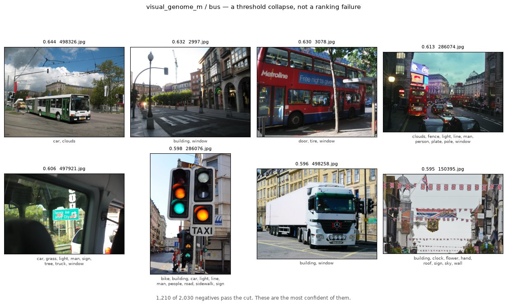
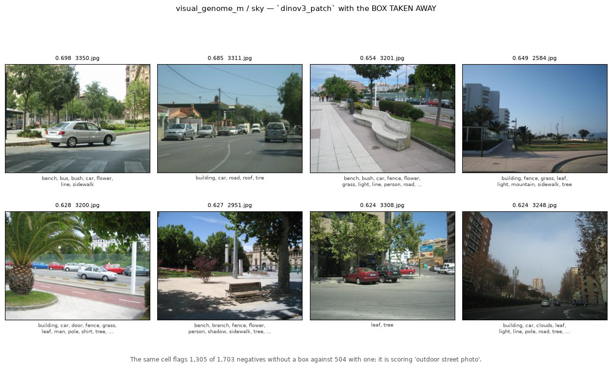
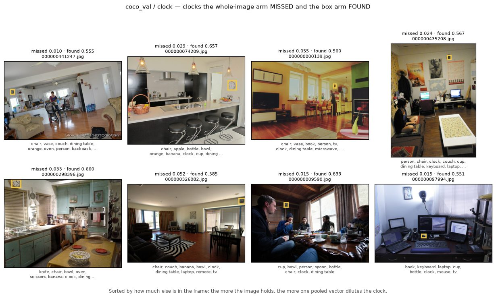
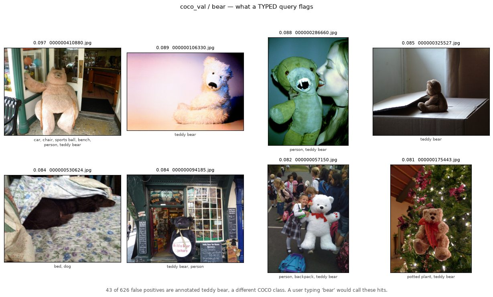
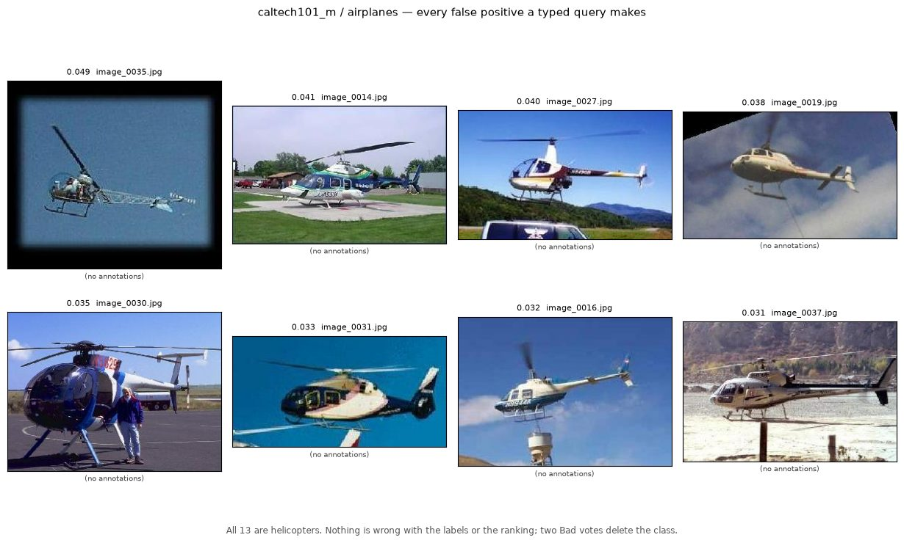
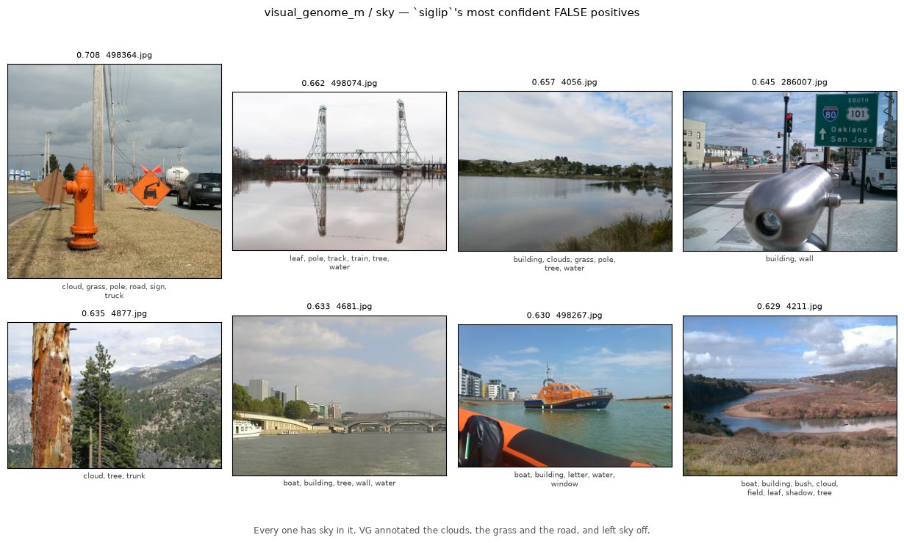
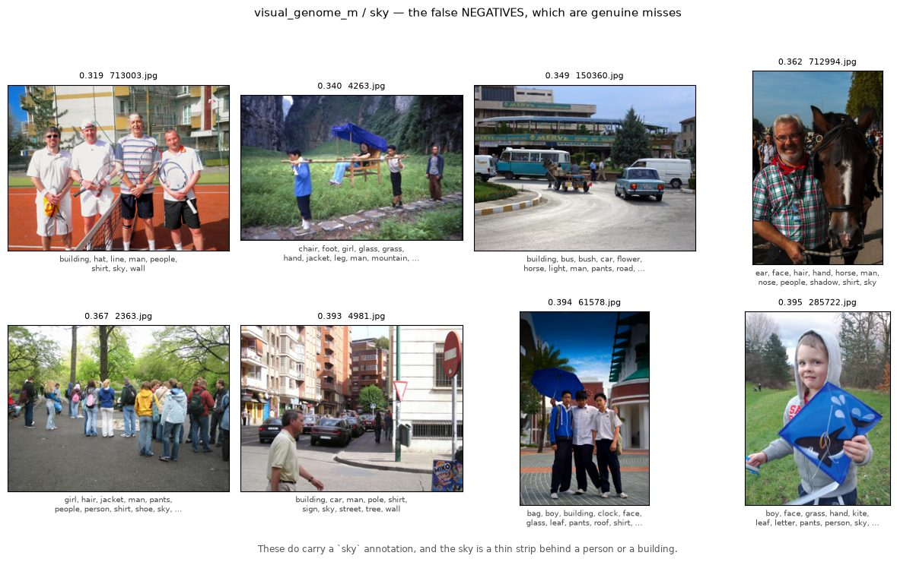
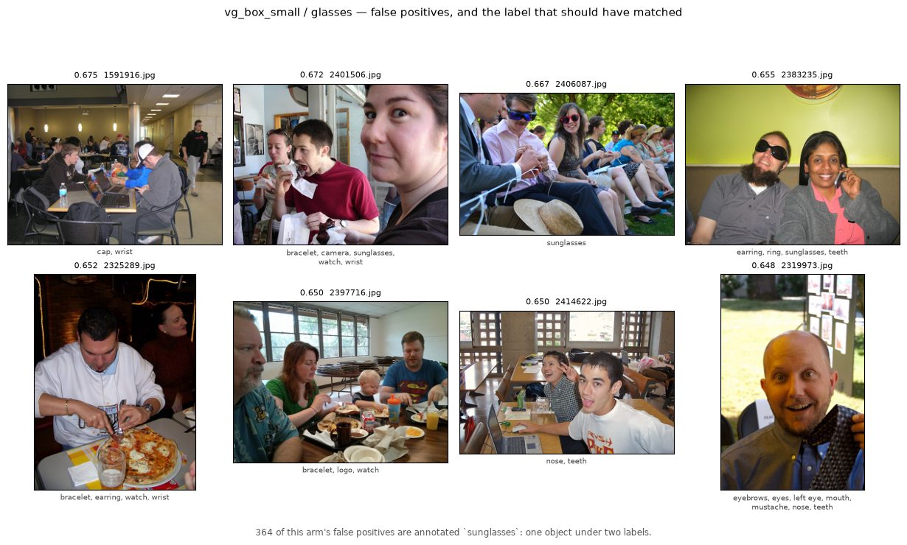
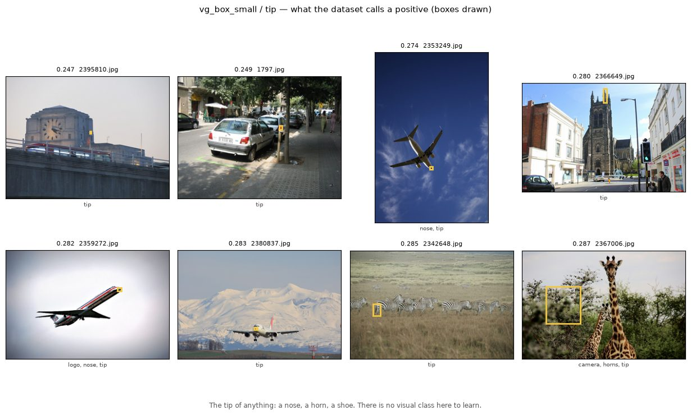

# VTSearch at production defaults: what each configuration gives a user

Everything here was run with every *behavioural* knob at its shipped value —
`linear` head, `safe_thresholds=False`, `calibrate_count=2`, acquisition
inclusion offset `-1`, production `max_patch` geometry — across three
representations, six haystacks, and both ways a user can answer (Good/Bad on
whole images, or a drawn box), against a typed query as the zero-click
alternative. 490 runs of the loop, 70,631 scored steps. It characterizes the tool
as it ships; it is not trying to pick a winner.

**What it found.**

- **A drawn box is worth more than a better encoder, and by a wide margin.** Take
  the boxes away and the patch encoder is *worse than the cheap default we
  already ship*. It is also the difference between a detector and no detector at
  all: on sub-patch targets, a quarter of whole-image runs never work.
- **Target scale is the strongest axis in the study.** Cost climbs from 0.37 to
  0.49 as the target shrinks from a twelfth of the frame to under half a percent
  of it, and no configuration escapes it.
- **Positives, not thresholds, are the binding constraint.** 150 clicks buy a
  median of 4–11 positive examples, and 6 % of runs end on two or fewer.
  Meanwhile the shipped cut rule already beats the best threshold fittable on the
  data it can see.
- **Typing and clicking are not alternatives — they are complements**, and
  nothing in the product composes them. A typed query is worth 45–97 clicks on
  Visual Genome, and it is the only entry point the patch encoder cannot use.
- **The labels are a real part of the measured error.** On Visual Genome, images
  the model is scored wrong on demonstrably contain the target; this report shows
  them, so you can judge that for yourself.

That last one bounds everything else, so read the numbers below as *what a user
experiences*, not as the ceiling of what the models can do.

---

# What was measured

| axis | levels |
|---|---|
| representation | `siglip` (shipped, whole-image, text-capable), `siglip2_l` (premium, whole-image, text-capable), `dinov3_patch` (patch geometry, region-voting where boxes exist, **no text tower**) |
| interaction | Good/Bad on whole images · Good votes carry the object's box |
| acquisition | Autopilot clicking, 150 votes · typed query, 0 clicks (GMM cut) |
| haystack | `coco_val` (4,952), `visual_genome_m` (4,193), `caltech101_m` (838, boxless), `vg_box_{small,medium,large}` (12,000 each, banded on box area) |
| sampling | 6–10 categories per haystack · 3 seeds · 150 votes each |

One run is one (haystack, representation, category, seed) cell, scored at every
step. `cost = fpr + fnr` on a held-out half; `regret` is cost against a perfectly
placed threshold on the same ranking; "deep regime" means votes 100–150.

**How to read the numbers.** Two significant digits, because that is what three
seeds support. Arm-vs-arm differences are quoted **paired** — same category, same
seed, same split — with a standard error, and a difference smaller than twice its
standard error is reported as unresolved rather than given a third decimal.

---

# What a run looks like


The end of each curve is the number a summary table would report. The interesting
part is not the end:

- **On COCO the premium encoder's whole value is early.** At 10 votes `siglip2_l`
  sits at cost 0.49 against `siglip`'s 0.64; by 40 votes the gap is 0.07, and by
  150 the two have crossed (0.22 vs 0.21).
- **On Visual Genome that early advantage does not exist** (0.75 vs 0.73 at 10
  votes), which is worth knowing before paying for the bigger encoder.
- **On the box bands the ramp is over by t≈60.** `vg_box_small × siglip` goes
  0.89 → 0.71 in the first 60 votes and 0.71 → 0.64 in the next 90. More clicks
  are not the lever there.

## Which error each configuration makes


Bar height is cost; the split says whether an arm over-includes or misses.
`siglip` **over-includes**: on Visual Genome its fpr (0.30) is three times its
fnr (0.09), the most lopsided budget in the study. `siglip2_l` rebalances rather
than only shrinking it (fpr 0.30 → 0.24, fnr 0.09 → 0.12). `dinov3_patch` with
boxes is the only arm whose fnr falls sharply on small targets — it buys recall
exactly where a whole-image vector dilutes the object.

Over-inclusion has an extreme form worth seeing, because it is a *threshold*
failure rather than a ranking one. On `visual_genome_m` / `bus`, one run flags
**1,210 of 2,030 negatives (60 %) and misses none of the 67 positives**:



*No buses, and no argument that the labels are wrong either — the ranking is
sound and the cut has simply fallen through the floor.*

## Reference numbers

Deep regime (t ≥ 100). `oracle` is the cost this same ranking would reach with a
perfectly placed threshold, so `oracle` is what the ranking costs and
`cost − oracle` is what the threshold costs.

| haystack | representation | cost | oracle | fpr | fnr | AP | AUROC | cell wall-time |
|---|---|---:|---:|---:|---:|---:|---:|---:|
| `caltech101_m` | `siglip` | 0.00 | 0.00 | 0.00 | 0.00 | 1.00 | 1.00 | ~110 s |
| `caltech101_m` | `siglip2_l` | 0.00 | 0.00 | 0.00 | 0.00 | 1.00 | 1.00 | ~110 s |
| `caltech101_m` | `dinov3_patch` | 0.00 | 0.00 | 0.00 | 0.00 | 1.00 | 1.00 | ~110 s |
| `coco_val` | `siglip` | 0.22 | 0.17 | 0.07 | 0.15 | 0.69 | 0.94 | ~110 s |
| `coco_val` | `siglip2_l` | 0.20 | 0.14 | 0.12 | 0.09 | 0.71 | 0.96 | ~110 s |
| `coco_val` | `dinov3_patch` | 0.15 | 0.10 | 0.09 | 0.06 | 0.79 | 0.98 | ~19 min |
| `visual_genome_m` | `siglip` | 0.39 | 0.28 | 0.30 | 0.09 | 0.43 | 0.90 | ~110 s |
| `visual_genome_m` | `siglip2_l` | 0.37 | 0.27 | 0.24 | 0.12 | 0.46 | 0.90 | ~110 s |
| `visual_genome_m` | `dinov3_patch` | 0.32 | 0.21 | 0.18 | 0.14 | 0.53 | 0.91 | ~17 min |
| `vg_box_large` | `siglip` | 0.46 | 0.37 | 0.27 | 0.19 | 0.35 | 0.85 | ~2 min |
| `vg_box_large` | `siglip2_l` | 0.44 | 0.34 | 0.33 | 0.10 | 0.36 | 0.87 | ~2 min |
| `vg_box_large` | `dinov3_patch` | 0.37 | 0.27 | 0.21 | 0.16 | 0.41 | 0.91 | ~23 min |
| `vg_box_medium` | `siglip` | 0.63 | 0.53 | 0.40 | 0.23 | 0.30 | 0.78 | ~2 min |
| `vg_box_medium` | `siglip2_l` | 0.60 | 0.50 | 0.37 | 0.24 | 0.34 | 0.79 | ~2 min |
| `vg_box_medium` | `dinov3_patch` | 0.46 | 0.35 | 0.34 | 0.12 | 0.39 | 0.88 | ~15 min |
| `vg_box_small` | `siglip` | 0.63 | 0.54 | 0.37 | 0.27 | 0.22 | 0.76 | ~2 min |
| `vg_box_small` | `siglip2_l` | 0.65 | 0.54 | 0.41 | 0.23 | 0.23 | 0.75 | ~2 min |
| `vg_box_small` | `dinov3_patch` | 0.49 | 0.39 | 0.34 | 0.15 | 0.29 | 0.85 | ~15 min |

Read down a column within a haystack, not across haystacks: prevalence differs
(0.03–0.07 across these sets) and so do the categories.

`caltech101_m` is at ceiling — every arm between cost 0.001 and 0.005, AP 1.00,
and the differences are ±0.002. It shows the floor case, that everything works
when the task is easy, and nothing else. **Retire it from this sweep.**

The patch arm's price is compute: **6.4–8.5 s per step against ~0.6 s
whole-image**, an 11–13× ratio that the per-cell wall time understates.

## What this sample can and cannot resolve

Paired per-run differences, deep regime, `mean ± SE`; **bold** is at least two
standard errors from zero.

| haystack | contrast | Δcost | ΔAP | ΔAUROC |
|---|---|---:|---:|---:|
| `coco_val` | `dinov3` − `siglip` | **−0.07 ± 0.03** | **+0.09 ± 0.03** | **+0.03 ± 0.01** |
| `coco_val` | `dinov3` − `siglip2_l` | −0.05 ± 0.03 | +0.08 ± 0.03 | **+0.02 ± 0.01** |
| `coco_val` | `siglip` − `siglip2_l` | +0.02 ± 0.01 | −0.02 ± 0.01 | −0.01 ± 0.01 |
| `visual_genome_m` | `dinov3` − `siglip` | −0.07 ± 0.04 | **+0.10 ± 0.03** | **+0.02 ± 0.01** |
| `visual_genome_m` | `dinov3` − `siglip2_l` | −0.04 ± 0.04 | **+0.07 ± 0.03** | +0.01 ± 0.01 |
| `visual_genome_m` | `siglip` − `siglip2_l` | +0.04 ± 0.03 | −0.04 ± 0.03 | −0.01 ± 0.01 |
| `vg_box_large` | `dinov3` − `siglip2_l` | −0.07 ± 0.04 | **+0.04 ± 0.02** | **+0.04 ± 0.01** |
| `vg_box_medium` | `dinov3` − `siglip2_l` | **−0.14 ± 0.04** | +0.05 ± 0.03 | **+0.10 ± 0.02** |
| `vg_box_small` | `dinov3` − `siglip2_l` | **−0.16 ± 0.02** | **+0.06 ± 0.02** | **+0.10 ± 0.02** |

**The two whole-image encoders are not separable on cost anywhere** — every
contrast between them is inside its own noise. What the premium encoder buys is
*ranking*, and even that is one marginal effect on Visual Genome plus a
resolvable one on medium boxes. Choose between them on price or on ranking, not
on an operating point this study cannot measure.

**The patch arm's ranking advantage is positive in every band** (+0.04, +0.05,
+0.06 AP against the premium encoder), though the *growth* of that margin is not
resolvable. Its cost advantage is: −0.16 ± 0.02 on sub-patch targets against
−0.07 ± 0.04 on large ones.

---

# The box is worth more than the encoder

Region voting needs two things at once — a patch embedder *and* a user willing to
draw — so every table above confounds them. To separate them, the patch encoder's
own runs were repeated with region voting off: same haystacks, same categories,
same seeds, same splits, differing only in whether a box is dragged.


| haystack | contrast | Δcost | ΔAP | ΔAUROC |
|---|---|---:|---:|---:|
| `visual_genome_m` | `dinov3` no boxes − `dinov3` boxes | **+0.16 ± 0.03** | **−0.12 ± 0.03** | **−0.06 ± 0.01** |
| `visual_genome_m` | `dinov3` no boxes − `siglip` | **+0.09 ± 0.03** | −0.02 ± 0.02 | **−0.04 ± 0.01** |
| `coco_val` | `dinov3` no boxes − `dinov3` boxes | **+0.14 ± 0.03** | **−0.15 ± 0.03** | **−0.04 ± 0.01** |
| `coco_val` | `dinov3` no boxes − `siglip` | **+0.08 ± 0.04** | −0.05 ± 0.04 | −0.01 ± 0.01 |

Positive means the box-free arm is worse. Two readings, both actionable:

- **Almost the whole DINOv3 advantage is box supervision, not encoder quality.**
  Removing the box costs it 0.14–0.16 cost and 0.12–0.15 AP.
- **Without boxes it is worse than the cheap default we ship**, by 0.08–0.09
  cost, the largest resolvable encoder effect in the study. If your users will not
  draw, a patch encoder is not a weaker version of the win; it is a regression.

**What "worse" looks like on one run.** `visual_genome_m` / `sky`, the same cell
run both ways:

| | threshold | false positives | false negatives |
|---|---:|---:|---:|
| `dinov3_patch` **with boxes** | 0.54 | 504 / 1,703 | 50 / 394 |
| `dinov3_patch` **without** | 0.38 | **1,305 / 1,703 (77 %)** | 28 / 394 |

Remove the box and the arm floods: it flags three quarters of the negatives,
buying 22 recovered positives with 800 extra false positives.



*Street scenes, mostly without sky annotated and several without much sky in
them. The boxed arm's false positives, further down, are pictures of sky.*

The mechanism is what the models are. DINOv3 is self-supervised and vision-only:
its strength is spatial correspondence between patches, and its whole-image
vector was never trained to separate semantic categories the way SigLIP's
language-contrastive embedding was. Give it a region to point at and that
strength is usable; take the region away and you are using the part of it that is
weakest — which is also why it has no text tower to fall back on.

One boundary condition: on a **boxless** haystack the patch arm is not a patch
model at all. With no box a Good vote has nothing to pool, so patch rows would be
negatives-only and could teach nothing but "patch-like ⇒ negative". On
`caltech101_m` it runs whole-image by construction, and behaves like it.

---

# Target scale sets the difficulty

The three `vg_box_*` haystacks exist to ask this one question. They are not size
*tiers* of a dataset; they are a **box-area axis**, built by scanning the whole
Visual Genome source (~108k images, full free-text object vocabulary) and banding
categories by how much of the frame the object occupies, anchored to the patch
embedder's own geometry — one DINOv3 patch is 1/196 of an image, and the smallest
HAC leaf is 1/12:

| haystack | box area | meaning |
|---|---|---|
| `vg_box_small` | 0 → **1/196** (0.5 %) | below what the patch grid can resolve at all |
| `vg_box_medium` | 1/196 → **1/12** (8 %) | resolvable by patches, smaller than one HAC leaf |
| `vg_box_large` | 1/12 → **0.80** | above 80 % a box is not a region, it is the image |


Best-arm cost runs **0.37 (large) → 0.46 (medium) → 0.49 (small)** and AP 0.41 →
0.39 → 0.29. Sub-patch retrieval is hard for every configuration; patch geometry
reduces the damage without removing it. This is also the first measurement of that
band on a realistic sample: the demo vocabulary puts **5** categories under one
patch, the full source has **643**.

The mechanism is visible one image at a time. On COCO `clock` the whole-image arm
misses 48 of 112 clocks and the box arm misses 21 — and **30 of the clocks the
whole-image arm missed, the box arm found** (3 go the other way):



*The yellow box is the clock. This is what "a whole-image vector dilutes a small
target" looks like: the box arm scores 0.55–0.66 on exactly the images the
whole-image arm scores 0.01–0.06 on.*

The three that go the other way are the same mechanism in reverse — wide outdoor
scenes where the clock is large and unambiguous (`000000036678.jpg`:
`boat, clock`, whole-image 0.879 against boxed 0.521).

---

# Positives are the binding constraint


150 clicks buy a median of **4–11 positive examples**, and a tenth of runs finish
on 2–5. Against the dotted diagonal — the unreachable ceiling where every vote is
a positive — the whole study happens in the bottom decade of that plot. The loop
is not threshold-limited, it is example-limited.

Averages hide what that does to an individual run:


**Every whole-image configuration has runs that sit flat near cost 1.0 for all
150 votes.** The mean says `vg_box_small × siglip` is 0.63 and implies a typical
run near 0.63; what is actually there is a mixture of runs that work and runs
that never start. Counting the ones that never start — deep-regime cost above 0.9
— turns that into the most practical thing the box bands say:

| haystack | `siglip` | `siglip2_l` | `dinov3_patch` |
|---|---:|---:|---:|
| `vg_box_large` | 3 / 30 | 3 / 29 | **0 / 29** |
| `vg_box_medium` | 5 / 30 | 3 / 30 | **0 / 30** |
| `vg_box_small` | 7 / 29 | 7 / 29 | **1 / 29** |
| `visual_genome_m` | 1 / 23 | 0 / 24 | 0 / 24 |
| `coco_val`, `caltech101_m` | 0 | 0 | 0 |

A quarter of whole-image runs on sub-patch targets never work at all, and the box
removes almost all of them. **On those targets the box is not buying a slightly
better detector; it is buying a detector instead of none.**

Individual runs, for the shape of it:

| the run | what it did |
|---|---|
| `vg_box_small` / `mustache` / `siglip` | found its first positive at **vote 144**; 7 scored steps in 150 votes, all at cost 1.00 |
| `vg_box_large` / `intersection` / `dinov3_patch` | first positive at **vote 119** |
| `vg_box_medium` / `chairs` / `siglip2_l` | ran all 150 votes holding **exactly one** positive; cost 1.00 throughout |
| `caltech101_m` / `cougar_face` / `siglip` | held **3** positives for 147 steps and reached cost **0.00** |

The last row is the control: few positives is not by itself fatal — on an easy
haystack three are enough for a perfect cut. It is few positives *plus* a hard
haystack that produces a flat-at-1.0 run.

## How often the loop fails outright

| mode | rate | where |
|---|---|---|
| **No positive at all in 150 votes** — the run produces nothing | **14 / 504 runs (2.8 %)** | the rarest categories (`ball` 51/4193, `refrigerator` 101/4952, `sports ball` 169/4952, `intersection` 95/12000, `tip` 333/12000) |
| **Two or fewer positives** at vote 150 | **27 / 447 (6.0 %)**, six of them exactly one | every haystack except COCO; cost pinned near 1.0 |
| **Cold-start default threshold** (`too_few_default`) | 1–7 % of steps on the whole-image haystacks, **6–16 %** on the box bands | worst on small boxes, and the worst *arm* there is `siglip2_l` (16 %), not `dinov3_patch` (10 %) |
| **Degenerate step** | 0.04 % whole-image, 0.11 % without boxes, **2.0 %** on the box bands | small and medium boxes |
| **Threshold fell back to a default cut** | **0 / 70,631 steps** | never observed |

Starvation is a property of the data, not of the interaction or the encoder. The
box-free arm starved on exactly the same two cells as its boxed twin
(`coco_val`/`refrigerator`/seed 0 and `coco_val`/`sports ball`/seed 1), and on the
box bands the starved cells are two (category, seed) pairs that starve *across all
three representations*: `vg_box_small`/`tip`/seed 2 on every one, and
`vg_box_large`/`intersection`/seed 0 on two of three, where the third survived
only by finding its first positive around vote 87. **A starvation fix has to act
on acquisition — changing the encoder demonstrably does not move it.**

---

# Typing and clicking supply different things

These two are usually discussed as alternatives. They are not the same kind of
thing at all: a typed query hands you *discrimination* immediately and calibrates
badly; the clicking loop hands you *calibration* and needs examples to do it.


| arm | text AP | detector AP after 150 votes | votes until the detector's cost stays below the typed cost |
|---|---:|---:|---:|
| `caltech101_m` × `siglip` | 1.00 | 1.00 | 6 |
| `caltech101_m` × `siglip2_l` | 1.00 | 1.00 | 17 |
| `coco_val` × `siglip2_l` | 0.74 | 0.71 | 26 |
| `coco_val` × `siglip` | 0.71 | 0.70 | 50 |
| `visual_genome_m` × `siglip` | 0.50 | 0.43 | 45 |
| `visual_genome_m` × `siglip2_l` | 0.54 | 0.46 | 97 |

On Visual Genome the ranking after 150 clicks is *worse* than the ranking you get
from typing the category name. Text's operating point is what lets the clicked
detector win at all: its GMM cut sits far from its own oracle, so text cost (0.49
on VG) is much worse than its ranking implies — and it still takes 45–97 votes to
beat that badly-calibrated zero-click baseline and stay beaten.

**So they are complements, and nothing composes them.** Text is good at what
clicking is bad at (a usable ranking from nothing) and bad at what clicking is
good at (placing the cut). It is sharpest for `dinov3_patch`: best ranking, worst
cold start, and **no text tower at all** — while SigLIP text would give a usable
ranking over the very same media for free.

## Where each mode fails

| category | representation | prevalence | text cost | detector @150 | text AP | det AP | what it shows |
|---|---|---:|---:|---:|---:|---:|---|
| `coco` `cat` | `siglip2_l` | 0.04 | **0.02** | 0.08 | 0.99 | 0.97 | text at ceiling; 150 clicks make it *worse* — they can only add threshold noise |
| `vg` `sky` | `siglip` | 0.19 | **0.57** | 0.68 | 0.44 | 0.38 | 19 % prevalent, and clicking still degrades a usable ranking; never crosses in any seed |
| `vg` `ball` | `siglip` | 0.01 | **0.57** | 0.91 | 0.18 | 0.11 | rare: the loop starves (one seed of three produced nothing) and the ranking collapses |
| `coco` `bear` | `siglip` | 0.01 | 0.27 | **0.01** | 0.83 | 0.99 | clicking's best case: rare, visually clean, crosses at 5–15 votes |

Typed queries fail in two ways the numbers alone do not explain, so here they
are. **A word the dataset uses for something else** — a typed "bear" on COCO
flags 626 of 2,452 negatives, and the confident end of that list is one thing:



*The typed query is not wrong about the pixels: 43 of those false positives are
annotated `teddy bear`, a different COCO class. A user typing "bear" would call
them hits — and two Bad votes settle what no amount of prompt engineering can,
which is why the clicked detector reaches cost 0.01 on this category.*

**The nearest visual neighbour**, which is the same story with no label ambiguity
at all:



*Every false positive of a typed "airplanes" query — 13 of 13 for `siglip`, 16 of
17 for `siglip2_l`. All helicopters (bar one elephant). Nothing is wrong with the
labels or the ranking; the query simply lands next door, and two Bad votes delete
the entire error class.*

---

# The cut rule is not the frontier


Regret against a perfectly placed threshold runs 0.00–0.11 by arm, and
essentially all of it is **calibration shift** — the move from the half the
detector was calibrated on to the half it is scored on. Pooled over all 441 runs
that carry the decomposition, calibration shift is **+0.097 ± 0.005** while
**rule inefficiency is −0.014 ± 0.004**: the shipped cut is *better* than the
best threshold fittable on the data it can actually see, by four standard errors.

Rule inefficiency is negative on 14 of 18 arms. The four positive ones are all
the `vg_box_medium` arms plus `vg_box_small × siglip`, and none is even 1.5
standard errors from zero (the medium band pools to +0.010 ± 0.006) — a
same-signed coincidence at this sample size, not a defect to chase.

The consequence for planning: a smarter cut rule optimises a term that is already
negative. Acquisition is where the headroom is, which is the same conclusion the
positives plot reaches from the other side.

---

# The labels bound what any of this can show

An aggregate fpr cannot say whether the *model* is wrong or the *label* is, and
those have opposite remedies: one means more work on the model, the other means
cleaning the dataset and re-running. Ten runs were therefore re-scored with
per-media dumping on — score, dataset label, threshold in force, source image, and
every category the dataset annotates on that image — plus a typed-query dump for
all 42 (haystack, representation, category) text arms. The full listings are
committed beside this report (`ERROR_EXAMPLES.txt`, `ERROR_EXAMPLES_text.txt`,
`LABEL_NOISE.txt`); what follows shows the images, with the target's box drawn
where the dataset has one, so the judgement is yours rather than mine.

**The test** is entailment: pick categories that cannot occur without the target —
you cannot have clouds without sky, a face has a nose, and `sunglasses` *are*
glasses. If the images the model flags are enriched for those relative to the
images it correctly rejects, the "false" positives are largely un-annotated
instances. Enrichment is measured against the model's own true negatives, so it is
not confounded by the model merely preferring outdoor scenes: both groups are
dataset-negative, and the only difference is what the model said.

## `visual_genome_m` / `sky` — the labels are wrong

| | `cloud`/`clouds` on false positives | on true negatives | enrichment |
|---|---:|---:|---:|
| `siglip` (682 FPs / 1,021 TNs) | 6.6 % | 0.4 % | **17×** |
| `dinov3_patch` (504 FPs / 1,199 TNs) | 9.5 % | 0.1 % | **114×** |

Outdoor context (`tree`, `building`, `grass`, `mountain`, `roof`, `water`,
`field`, `road`) appears on **84 %** of false positives against 36–43 % of true
negatives.



*Every image the model is scored wrong on. Judge it yourself: the annotations
under each are everything Visual Genome says is in that picture.*

`sky` is 19 % prevalent as annotated and the true rate is plainly higher, so every
`sky` number here is a lower bound on the model and an upper bound on its apparent
error.

The false negatives are a different thing, and genuine:



*Sky is present, small, and behind the subject — the same small-region failure the
box bands measure in aggregate.*

## `visual_genome_m` / `nose` — the same defect, on a part

`nose` is the other category whose fpr looks catastrophic (552 of 2,020 negatives
flagged). `face` — which entails a nose — appears on 5.1 % of the flagged images
against 2.2 % of the correctly-rejected ones (2.3×), and facial context (`eye`,
`eyes`, `hair`, `mouth`, `head`, `ear`) on 21 % against 9 %. The confident false
positives are all portraits:

```
score   image      annotated categories
0.7787  3537.jpg   ear, eye, hair, man, shirt
0.7253  3591.jpg   eye, face, hair, man
0.7130  3616.jpg   eye, shadow, woman
0.6779  4954.jpg   ear, eye, hair, hand, shirt, wall, woman
```

Its false negatives, by contrast, are animals and distant faces (`zebra`, `cow`, a
rider on a `horse`) — real misses of a small region.

## `vg_box_small` / `glasses` — one object, two labels

This is the sub-patch band's over-inclusion at its most extreme, and also its
clearest patch-vs-whole-image contrast: `siglip` flags **3,937 of 5,363 negatives
(73 %)** and misses 22 of 637 positives; `dinov3_patch` flags **2,863 (53 %)** and
misses 43. Part of both floods is a vocabulary split — the flagged images are
heavily enriched for `sunglasses`:

| | `sunglasses` on false positives | on true negatives | enrichment |
|---|---:|---:|---:|
| `siglip` (3,937 FPs / 1,426 TNs) | 9.1 % | 1.3 % | **7×** |
| `dinov3_patch` (2,863 FPs / 2,500 TNs) | 12.7 % | 0.6 % | **23×** |



*A user who trained a "glasses" detector would accept these. 364 false positives
in each arm are images annotated `sunglasses` and not `glasses`: the dataset
splits one object across two labels and the model is scored against the split.*

Unlike `sky` this is not a *missing* label but the same object under a second
name, which is what a free-text vocabulary does — and it is mechanically fixable
by merging near-synonyms before a run.

## `vg_box_small` / `tip` — the label is not a thing

`tip` is one of the two categories that starved outright, and its surviving runs
are the worst in the study: `siglip` misses **116 of 168** positives and still
flags 1,995 of 5,832 negatives. The dump says why — the positives carry no other
annotation, and the false positives are `knee`, `chimney`, `numbers`, `logo`:



*The yellow box is what the dataset asked the model to find: a plane's nose, a
church spire, a bollard, something in the foliage beside a giraffe. "Tip" in a
free-text vocabulary is the tip of anything, so there is no visual class here to
learn — and the giraffe box looks like a bad annotation on top of that.*

This run is not measuring a detector, it is measuring a label. **Categories like
it should be filtered out of a category selection**; the box-area scan already
drops categories whose instances are scattered, but not ones that are
semantically empty.

## `coco_val` / `clock` — here the model really is wrong

The entailment test does not apply on COCO: its 80-class vocabulary has no term
that entails `clock`, so there is nothing to be enriched for. The evidence points
the other way anyway. COCO's annotation is exhaustive over its classes, only 46 of
2,364 negatives are flagged at all (2 %, against `sky`'s 40 %), and the false
positives are indoor scenes with no plausible hidden clock (`chair`;
`couch, tv`; `chair, couch, bed, remote, tv`). The failure is the one shown under
target scale: small objects in cluttered frames.

## What that means for the rest of these numbers

- **Visual Genome numbers are pessimistic by an unknown amount** — worst for
  common scene categories (`sky`, and plausibly `tree`, `building`, `grass`), for
  parts (`nose`), and for split vocabularies (`glasses`/`sunglasses`). COCO does
  not have this problem.
- **Absolute cost is therefore not comparable between Visual Genome and COCO.**
  Within-haystack comparisons — which is what every configuration contrast here
  is — are unaffected, since all configurations see the same labels.
- **A label audit belongs upstream of the next Visual Genome study**, not inside
  it. The entailment test is cheap, mechanical and scripted
  (`scripts/experiments/calibration/label_noise.py`).

---

# Reading it under a constraint

Nobody picks freely, so the comparison that matters is within a constraint.

**Compute-limited, stuck on `siglip`.** You lose nothing measurable in cost
against the premium encoder; it buys ranking, not an operating point. Your
characteristic failure is over-inclusion (fpr 3× fnr on Visual Genome), so the
lever is the threshold, not the encoder. And you have a text tower: a typed query
gives you a usable ranking for free, worth 45–97 clicks on Visual Genome.

**Users who will not draw boxes.** Spending on a patch encoder you cannot point at
makes things **worse** — 0.08–0.09 cost worse than the default you ship. This is
the clearest actionable finding here. Choosing between the two whole-image
encoders on cost grounds is not something this study can justify either way.

**Users who will draw, on hardware that can afford it.** The advantage is real and
largest where targets are small (−0.14 to −0.16 cost on the two smaller bands,
−0.05 to −0.07 elsewhere), and on sub-patch targets it is the difference between a
working detector and none. It costs 11–13× per step, has the worst cold start on
Visual Genome (`too_few_default` 7 %), and cannot be seeded from text.

**Anyone, on small targets.** Expect cost near 0.5 at best, and expect a
meaningful fraction of sessions to produce nothing usable. Sub-patch retrieval is
not a solved regime.

---

# What this points at next

1. **Compose typing and clicking** rather than choosing between them: seed a
   detector from a text ranking, especially for `dinov3_patch`, which cannot be
   typed at and has the worst cold start. A typed query is worth 45–97 votes on
   Visual Genome.
2. **Spend the next effort on acquisition, not on cut rules.** Rule inefficiency
   is already negative (−0.014 ± 0.004 pooled), while 6 % of runs finish on two or
   fewer positives and 2.8 % on none.
3. **Clean the vocabulary before the next Visual Genome run**: merge near-synonyms
   (`glasses`/`sunglasses`), drop semantically empty labels (`tip`), and treat
   scene categories like `sky` as lower bounds. Cheapest measurable improvement
   available, and it needs no new arm.
4. **Make a starved run say so.** A run that never finds a positive currently
   emits no row at all; it should emit a `starved` flag and a warning, and the
   same goes for finishing on two or fewer positives.
5. **Retire `caltech101_m`** from this sweep — saturated for all three
   representations and for text.
6. **Re-check the medium band's cut rule with more seeds** if it matters: all
   three encoders come out positive there (+0.010 ± 0.006 pooled) where
   everything else is negative, which is suggestive and not yet resolvable.

---

# How this was run

**Runs.** 504 cells over three grids: the whole-image haystacks (189 cells,
26,538 steps), the box-area bands (270 cells, 37,844 steps), and the boxes-off arm
on `visual_genome_m` and `coco_val` (45 cells, 6,249 steps). 490 cells produced
data; the other 14 never found a positive, which is the starvation rate reported
above rather than an exclusion. Arrays `496044`, `496673`, `496762`; per-media
dumps `496798`–`496802` and `507225`–`507230`; results under
`/expscratch/sgreenberg/bench-{overview,vgbox2,binary,errors}/results`.

**Categories.** Selected per haystack before the run and held fixed across
representations and seeds; the count of positive images is in brackets.

- `visual_genome_m` — `ball` (51), `bed` (100), `bus` (67), `cat` (30),
  `laptop` (60), `nose` (146), `sink` (60), `sky` (793).
- `coco_val` — `bear` (49), `bed` (149), `cat` (184), `clock` (204),
  `microwave` (54), `refrigerator` (101), `sports ball` (169).
- `caltech101_m` — `airplanes` (228), `car_side` (35), `grand_piano` (28),
  `starfish` (24), `ibis` (23), `cougar_face` (20).
- `vg_box_small` — `nose` (2741), `glasses` (1259), `watch` (581), `camera` (461),
  `tip` (333), `outlet` (264), `drain` (178), `mask` (154), `mustache` (115),
  `tusks` (52).
- `vg_box_medium` — `hair` (2628), `shorts` (987), `clock` (662), `lamp` (590),
  `truck` (507), `backpack` (346), `basket` (306), `frisbee` (231),
  `holder` (160), `chairs` (116).
- `vg_box_large` — `fence` (2621), `hill` (807), `lady` (591), `couch` (483),
  `court` (429), `walkway` (255), `runway` (202), `station` (157),
  `intersection` (95), `barn` (57).
- The boxes-off arm uses the `visual_genome_m` and `coco_val` lists above.

**How the box bands were built** (`scripts/experiments/pile/scan_vg_boxes.py`):
scan all ~108k Visual Genome images across `VG_100K` and `VG_100K_2` with the full
free-text vocabulary from `objects.json`; normalise pixel boxes against dimensions
read from each JPEG header; take 40 categories and 12,000 images per band,
stratified *within* the band so a band is not silently all one size; drop
categories whose union box exceeds 1.5× a single instance, since scattered
instances are not a region a user would drag; require at least 50 images per
category.

**Limits worth knowing.**

- Three seeds. Every difference is quoted paired with a standard error for that
  reason; unpaired differences under ~0.05 in cost are not resolvable at all.
- Text queries are **raw category names** (`car_side`, `sports ball`);
  `embed_text_enriched` was not used, so text numbers are a lower bound.
- `caltech101_m × dinov3_patch` is a pairing not present in `dev`.
- The error dumps are one seed of one category per cell: evidence about a
  mechanism, not a rate. The rates beside them come from the full run.
- COCO's sub-patch band had one candidate category against a target of two, and
  that category (`sports ball`) is one of the two that starved.

**Reproduce.** All under `scripts/experiments/calibration/`: `analyze_bench.py`
(tables), `analyze_bench_interaction.py` (boxes vs no boxes),
`make_bench_figs.py --svg` (plots — PNG for this page, SVG for the reading copy),
`launch_errdump.sh` + `error_report.py` + `label_noise.py` (error listings and the
entailment test), `make_error_sheets.py` (the image sheets; it runs on the
cluster, where the source images are). Generated tables are committed beside this
file as `ANALYSIS_TABLES*.txt`.

**Reading copy.** [`docs/reports/2026-08-17-overview-bench.html`](../../reports/2026-08-17-overview-bench.html)
is this document as one self-contained page — plots as zoomable vector art,
photographs embedded. It is **generated** from this file by `make_bench_html.py`;
edit the report, then re-run the script so the two cannot disagree.
