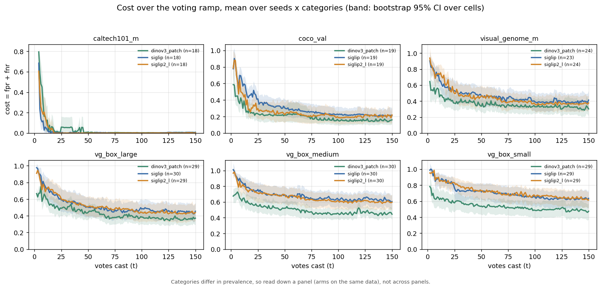
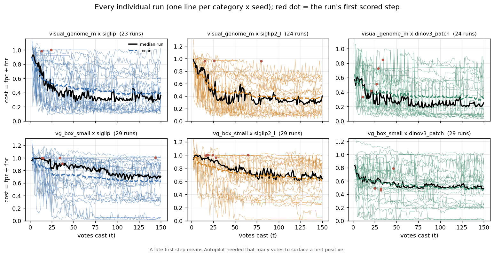
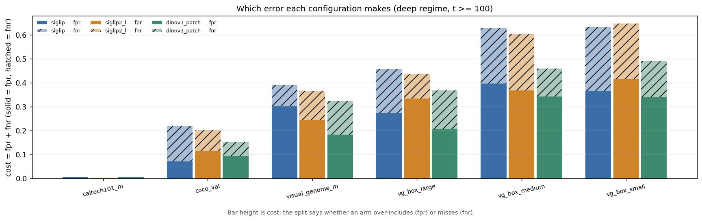
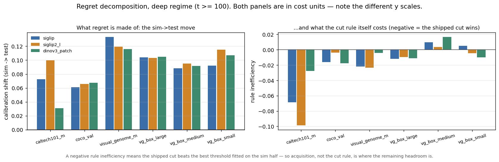
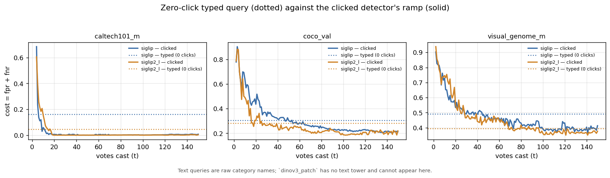
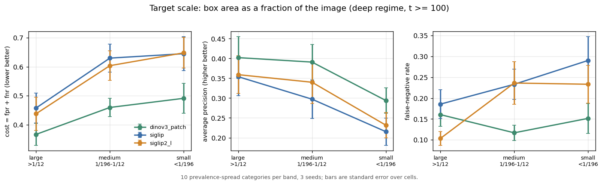
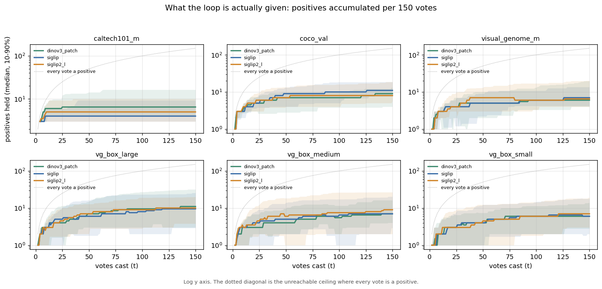
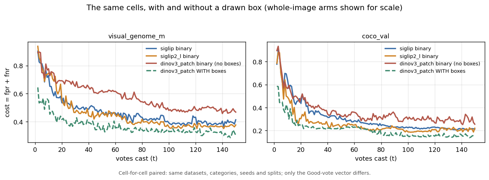

# VTSearch overview benchmark: how each configuration behaves

**Run:** 2026-08-12 · branch `claude/vts-benchmark` · arrays `496044` (wave 1),
`496454` (wave 2), `496673` (wave 2 re-run, drained 2026-08-13 00:00), `496762`
(binary-voting arm), plus per-media error dumps (`496798`–`496802`, `507225`–`507230`)
**Data:** `/expscratch/sgreenberg/bench-{overview,vgbox,vgbox2,binary,errors}/results`
**Reproduce:** `analyze_bench.py` (tables), `analyze_bench_interaction.py`
(binary vs boxes), `make_bench_figs.py` (every figure), `launch_errdump.sh` +
`error_report.py` + `label_noise.py` (the examples) — all under
`scripts/experiments/calibration/`.

This is a **characterization**, not a comparison. Nothing here is trying to pick
a configuration to ship. The question is what each of them *does* — what it is
good at, what it is bad at, and what regime moves it from one to the other. Where
two configurations differ, the useful output is the mechanism behind the
difference, not the sign of it.

Every *behavioural* knob is at its shipped default — head `linear`,
`safe_thresholds=False`, `calibrate_count=2`, acquisition inclusion offset `-1`,
production `max_patch` geometry. Only sizing knobs were set.

**On the numbers.** Two significant digits, because that is what 3 seeds
support: differences are quoted **paired** (same category, same seed, same
split) with a standard error, and a difference smaller than twice its standard
error is called unresolved rather than dressed in a third decimal. Three of this
report's earlier claims did not survive being written that way, and each is
marked where it appears.

## What was exercised

| axis | levels |
|---|---|
| representation | `siglip` (shipped, whole-image, text-capable), `siglip2_l` (premium, whole-image, text-capable), `dinov3_patch` (patch geometry, region-voting where boxes exist, **no text tower**) |
| acquisition | typed query (0 clicks, GMM cut) · Autopilot clicking (150 votes) |
| interaction | Good/Bad on whole images · Good votes carry a drawn box |
| haystack | `visual_genome_m` (4,193), `coco_val` (4,952), `caltech101_m` (838, boxless), `vg_box_{small,medium,large}` (12,000 each, banded on box area) |
| category | 6–10 per dataset · 3 seeds · 150 votes |

Wave 1: 189 cells / 26,538 steps. Wave 2: 99 cells / 14,042 steps. **Wave 2
re-run: 270 cells / 37,844 steps** — 10 prevalence-spread categories per box
band, replacing the collapsed 5 / 4 / 2 selection wave 2 ran on. Binary arm: 45
cells. Loaded: 182/189, 265/270, 43/45 — the rest are *starved* cells that never
found a positive and so never emitted a row (see Failure modes).

**Every `vg_box_*` number in this report is from the re-run**; wave 2's are
superseded and kept in `ANALYSIS_TABLES_vgbox.txt` for comparison. The two are
not interchangeable — the re-run's categories are more prevalent (0.05 against
0.02), so costs are not comparable *across* the waves even though the arm
ordering *within* each is.

---

# Reference numbers

Deep regime (t ≥ 100). cost = fpr + fnr. `oracle` is the cost the same ranking
would reach with a perfectly placed threshold, so `cost − oracle` is what the
threshold costs and `oracle` is what the ranking costs. No ordering implied.

| dataset | embedder | cost | oracle | fpr | fnr | AP | AUROC | cell wall-time |
|---|---|---:|---:|---:|---:|---:|---:|---:|
| `caltech101_m` | `siglip` | 0.00 | 0.00 | 0.00 | 0.00 | 1.00 | 1.00 | ~110 s |
| `caltech101_m` | `siglip2_l` | 0.00 | 0.00 | 0.00 | 0.00 | 1.00 | 1.00 | ~110 s |
| `caltech101_m` | `dinov3_patch` | 0.00 | 0.00 | 0.00 | 0.00 | 1.00 | 1.00 | ~110 s |
| `coco_val` | `siglip` | 0.22 | 0.17 | 0.07 | 0.15 | 0.69 | 0.94 | ~110 s |
| `coco_val` | `siglip2_l` | 0.20 | 0.14 | 0.12 | 0.09 | 0.71 | 0.96 | ~110 s |
| `coco_val` | `dinov3_patch` | 0.15 | 0.10 | 0.09 | 0.06 | 0.79 | 0.98 | ~19 min |
| `visual_genome_m` | `siglip` | 0.39 | 0.28 | 0.30 | 0.09 | 0.43 | 0.90 | ~110 s |
| `visual_genome_m` | `siglip2_l` | 0.37 | 0.27 | 0.24 | 0.12 | 0.46 | 0.90 | ~110 s |
| `visual_genome_m` | `dinov3_patch` | 0.32 | 0.21 | 0.18 | 0.14 | 0.53 | 0.91 | ~17 min |
| `vg_box_large` | `siglip` | 0.46 | 0.37 | 0.27 | 0.19 | 0.35 | 0.85 | ~2 min |
| `vg_box_large` | `siglip2_l` | 0.44 | 0.34 | 0.33 | 0.10 | 0.36 | 0.87 | ~2 min |
| `vg_box_large` | `dinov3_patch` | 0.37 | 0.27 | 0.21 | 0.16 | 0.41 | 0.91 | ~23 min |
| `vg_box_medium` | `siglip` | 0.63 | 0.53 | 0.40 | 0.23 | 0.30 | 0.78 | ~2 min |
| `vg_box_medium` | `siglip2_l` | 0.60 | 0.50 | 0.37 | 0.24 | 0.34 | 0.79 | ~2 min |
| `vg_box_medium` | `dinov3_patch` | 0.46 | 0.35 | 0.34 | 0.12 | 0.39 | 0.88 | ~15 min |
| `vg_box_small` | `siglip` | 0.63 | 0.54 | 0.37 | 0.27 | 0.22 | 0.76 | ~2 min |
| `vg_box_small` | `siglip2_l` | 0.65 | 0.54 | 0.41 | 0.23 | 0.23 | 0.75 | ~2 min |
| `vg_box_small` | `dinov3_patch` | 0.49 | 0.39 | 0.34 | 0.15 | 0.29 | 0.85 | ~15 min |

`caltech101_m` is at ceiling: every arm's cost there is between 0.001 and 0.005
and the differences (±0.002 paired) mean nothing. It characterizes the floor
case — everything works when the task is easy — and nothing else. **Retire it
from the next sweep.**

The box-band rows sit at prevalence 0.05, the wave-1 rows at 0.03–0.07 — so read
down a column within a band rather than across the table. Wall-time is the
median cell, and a step is what actually differs: **6.4–8.5 s for
`dinov3_patch` against ~0.6 s whole-image**, an 11–13× per-step ratio that the
per-cell figure understates.

## What the sample can and cannot resolve

Paired per-cell differences, deep regime, `mean ± SE` (full table in
`ANALYSIS_TABLES*.txt`; **bold** = at least 2 SE from zero):

| dataset | contrast | Δcost | ΔAP | ΔAUROC |
|---|---|---:|---:|---:|
| `coco_val` | `dinov3` − `siglip` | **−0.07 ± 0.03** | **+0.09 ± 0.03** | **+0.03 ± 0.01** |
| `coco_val` | `dinov3` − `siglip2_l` | −0.05 ± 0.03 | +0.08 ± 0.03 | **+0.02 ± 0.01** |
| `coco_val` | `siglip` − `siglip2_l` | +0.02 ± 0.01 | −0.02 ± 0.01 | −0.01 ± 0.01 |
| `visual_genome_m` | `dinov3` − `siglip` | −0.07 ± 0.04 | **+0.10 ± 0.03** | **+0.02 ± 0.01** |
| `visual_genome_m` | `dinov3` − `siglip2_l` | −0.04 ± 0.04 | **+0.07 ± 0.03** | +0.01 ± 0.01 |
| `visual_genome_m` | `siglip` − `siglip2_l` | +0.04 ± 0.03 | −0.04 ± 0.03 | −0.01 ± 0.01 |
| `vg_box_large` | `dinov3` − `siglip2_l` | −0.07 ± 0.04 | **+0.04 ± 0.02** | **+0.04 ± 0.01** |
| `vg_box_medium` | `dinov3` − `siglip2_l` | **−0.14 ± 0.04** | +0.05 ± 0.03 | **+0.10 ± 0.02** |
| `vg_box_small` | `dinov3` − `siglip2_l` | **−0.16 ± 0.02** | **+0.06 ± 0.02** | **+0.10 ± 0.02** |

Two things follow immediately, and both revise what this report used to say:

- **`siglip` and `siglip2_l` are not separable on cost anywhere.** Every
  contrast between them is inside its own noise (worst case +0.04 ± 0.03). What
  the premium encoder buys is *ranking*, and even there it is one marginal
  effect (VG AP −0.04 ± 0.03) plus a resolvable one on the medium band. The
  earlier phrasing — "you lose ~0.026 cost on VG, ~0.016 on COCO" — quoted three
  decimals of a number this run cannot measure.
- **DINOv3's ranking margin over the premium encoder is positive in all three
  box bands (+0.04, +0.05, +0.06) but its *growth* is not resolvable.** What is
  resolvable is that its *cost* advantage is much larger on the two smaller
  bands than on the large one (−0.16 ± 0.02 vs −0.07 ± 0.04). So "the advantage
  grows as targets shrink" survives on cost and, on AP, only as an ordering.

---

# Cost over the ramp



The deep-regime table is only the right-hand edge of this figure, and the edge
is not where the differences are:

- **On COCO the premium encoder's whole value is early.** At 10 votes
  `siglip2_l` sits at cost 0.49 against `siglip`'s 0.64; by 40 votes the gap is
  0.07, and by 150 the two have crossed (0.22 vs 0.21). A deep-regime table
  reports the crossing point and calls them equal.
- **On VG that early advantage does not exist** (0.75 vs 0.73 at 10 votes), which
  is worth knowing before paying for the bigger encoder.
- **On the box bands the ramp is over by t≈60.** `vg_box_small × siglip` goes
  0.89 → 0.71 in the first 60 votes and 0.71 → 0.64 in the next 90. Asking the
  user for a hundred more clicks is not the lever there.



**This is the figure the means were hiding.** Every whole-image configuration has
runs that sit flat near cost 1.0 for all 150 votes. The mean says `vg_box_small ×
siglip` is 0.63 and implies a typical run near 0.63; what is actually there is a
mixture of runs that work and runs that never start, and the second kind is set
by whether Autopilot ever surfaced positives (red dots mark a run's first scored
step — some are past vote 100).

Counting the stuck runs — cells whose deep-regime cost stays above 0.9 — turns
that into a number, and into the most practically useful thing the box bands say:

| dataset | `siglip` | `siglip2_l` | `dinov3_patch` |
|---|---:|---:|---:|
| `vg_box_large` | 3 / 30 | 3 / 29 | **0 / 29** |
| `vg_box_medium` | 5 / 30 | 3 / 30 | **0 / 30** |
| `vg_box_small` | 7 / 29 | 7 / 29 | **1 / 29** |
| `visual_genome_m` | 1 / 23 | 0 / 24 | 0 / 24 |
| `coco_val`, `caltech101_m` | 0 | 0 | 0 |

A quarter of whole-image runs on the sub-patch band never work at all, and the
patch geometry removes almost all of them. That is a different claim from "mean
cost is 0.14 lower", and a more actionable one: the box is not buying a slightly
better detector, it is buying **a detector instead of none** on a fifth to a
quarter of runs.

Concretely, from the traces:

| the run | what it did |
|---|---|
| `vg_box_small` / `mustache` / seed 0 / `siglip` | found its first positive at **vote 144**; 7 scored steps in 150 votes, all at cost 1.00 |
| `vg_box_large` / `intersection` / seed 1 / `dinov3_patch` | first positive at **vote 119** |
| `vg_box_medium` / `chairs` / seed 2 / `siglip2_l` | ran all 150 votes holding **exactly one** positive; cost 1.00 throughout |
| `vg_box_small` / `mask` / seed 1 / `siglip` | same shape: one positive, 149 steps, cost 1.00 |
| `caltech101_m` / `cougar_face` / seed 0 / `siglip` | held **3** positives for 147 steps and reached cost **0.00** |

Six cells finished 150 votes with a single positive. The last row is the
control: a tiny positive set is not by itself fatal — on an easy haystack three
positives are enough for a perfect cut. It is few positives *plus* a hard
haystack that produces the flat-at-1.0 runs.

---

# The representations

## `siglip` — the shipped default

**Behaves like:** a fast, text-addressable whole-image encoder that degrades
gracefully. ~110 s per 150-vote run; a text tower, so a user can start from a
typed query at zero cost.

**Its error budget sits in false positives.** On VG its fpr (0.30) is 3× its fnr
(0.09) — by far the most lopsided arm in the study. It is *including* too much,
not missing things. That shape is stable across datasets: fpr ≥ fnr everywhere
except COCO.



**Where it holds up:** anything with a clean whole-image signature. On
`caltech101_m` it is at ceiling. On COCO its ranking (AP 0.69) is within noise of
the premium encoder (−0.02 ± 0.01).

**Where it comes apart:** as the target shrinks relative to the frame. Across the
box bands its AP falls 0.35 → 0.30 → 0.22 and AUROC 0.85 → 0.78 → 0.76, against
`dinov3_patch`'s 0.91 → 0.88 → 0.85. Pooling a whole image into one vector
cannot preserve an object that occupies under 0.5 % of it — and the literal
version of that failure is in [the label-noise section](#coco_val--clock--the-model-is-wrong-and-the-boxes-fix-it):
30 of the 112 `clock` images this arm missed on COCO are found by the patch arm,
and they are precisely the cluttered ones.

## `siglip2_l` — the premium whole-image encoder

**Behaves like:** `siglip` with a slightly better ranking and no measurable cost
difference. Same ~110 s. AP is higher on every non-saturated dataset (VG 0.46 vs
0.43; COCO 0.71 vs 0.69) and its *text* ranking is better (VG text AP 0.54 vs
0.50), but no cost contrast against `siglip` in this study clears its own
standard error.

**It rebalances the error budget rather than only shrinking it.** On VG it moves
fpr 0.30 → 0.24 while fnr rises 0.09 → 0.12. It is a less trigger-happy encoder,
not merely a more accurate one.

**It inherits `siglip`'s scale failure intact.** AP across box bands 0.36 → 0.34
→ 0.23, tracking `siglip`'s 0.35 → 0.30 → 0.22 far more closely than either
tracks the patch arm. Capacity does not substitute for geometry: whatever a
bigger whole-image encoder buys, it is not the ability to see a sub-patch object.
It also has the **worst cold start** on the sub-patch band (`too_few_default` on
16 % of steps, against DINOv3's 10 %).

## `dinov3_patch` — patch geometry, and region voting where boxes exist

**Behaves like:** the best ranker in the study and the best cost on every boxed
set, at 11–13× the compute per step (15–23 min per box-band run against ~2 min).

**Its ranking is the best measured, on every dataset and every band**, by
+0.04 to +0.10 AP paired against the whole-image arms, and by AUROC on all of
them. The mechanism is straightforward: box supervision only carries information
the whole-image vector lacks when the box is a small fraction of the frame. A box
covering a third of the image *is* approximately the image — which is why the
margin is smallest on `vg_box_large`.

**It also wins on cost in every band**, by 0.07 (large), 0.14 (medium) and 0.16
(small) against the premium whole-image arm; the medium and small figures are
several standard errors from zero, the large one is not. Its error budget is the
reason: `fnr` is roughly half the whole-image arms' on medium and small (0.12 /
0.15 against 0.23–0.27), so the patch geometry is buying recall on exactly the
targets a whole-image vector dilutes.

> **Wave 2 said otherwise on the large band, and the re-run overturns it.** On
> the 5-category wave-2 sample, `dinov3_patch` on `vg_box_large` was the *only
> arm in the study with a positive `rule_inefficiency`*, its regret was 0.12
> against `siglip2_l`'s 0.07, and the ranking and threshold effects cancelled to
> an identical cost. At 10 categories none of that reproduces: `rule_inefficiency`
> is negative, regret is level at 0.09 both sides, and the cost gap opens to 0.37
> vs 0.44 in DINOv3's favour. The "unconverted ranking advantage" was a property
> of five large-box categories, not of the arm.

**Where it comes apart:** cost and cold start. `too_few_default` fires on 7 % of
VG steps and 6–10 % across the box bands, and it has **no text tower**, so there
is no zero-click entry point for it at all.

**On a boxless dataset it is not a patch model.** `caltech101_m × dinov3_patch`
runs `whole_image` by construction: with no box, a Good vote has nothing to pool,
so patch rows would be negatives-only and could teach nothing but "patch-like ⇒
negative". It is DINOv3 used as a whole-image encoder, and it behaves like one.

## Where the shipped cut rule stands



Regret against a perfectly placed threshold runs 0.00–0.11 by arm, and
**essentially all of it is `calibration_shift`** — the move from the simulated
half to the test half. Pooled over all 441 cells with a decomposition,
`calibration_shift` is +0.097 ± 0.005 while `rule_inefficiency` (what the shipped
rule loses against the best threshold fitted on the data it can actually see) is
**−0.014 ± 0.004**: the shipped cut is already *better* than its own in-sample
optimum, by four standard errors. This reproduces
[#2836](../gmm-cut/REPORT.md) — acquisition, not the cut rule, is the frontier.

`rule_inefficiency` is negative on 14 of 18 arms. The four positive ones are the
three `vg_box_medium` arms (+0.017, +0.009, +0.004) and `vg_box_small × siglip`
(+0.005) — and **none of them is even 1.5 SE from zero**; the medium band pooled
across its three encoders is +0.010 ± 0.006. Earlier drafts of this report
promoted "the medium band beats the shipped cut rule" to a follow-up on the
strength of those three same-signed means. Three coin flips agreeing is what a
band-level effect and no effect at all both look like at this sample size, so it
is listed below as a check to run, not a finding.

---

# Typing and clicking supply different things

The two acquisition modes are usually discussed as alternatives. The measurement
says they are not the same kind of thing at all.



**What a typed query supplies: discrimination, immediately, badly calibrated.**

| arm | text AP | detector AP after 150 votes | votes for the detector's cost to stay under the typed cost |
|---|---:|---:|---:|
| `caltech101_m` × `siglip` | 1.00 | 1.00 | 6 |
| `caltech101_m` × `siglip2_l` | 1.00 | 1.00 | 17 |
| `coco_val` × `siglip2_l` | 0.74 | 0.71 | 26 |
| `coco_val` × `siglip` | 0.71 | 0.70 | 50 |
| `visual_genome_m` × `siglip` | 0.50 | 0.43 | 45 |
| `visual_genome_m` × `siglip2_l` | 0.54 | 0.46 | 97 |

On Visual Genome the *ranking* after 150 clicks is worse than the ranking you get
from typing the word. But text's operating point is poor: its GMM cut sits far
from its own oracle, so text cost (0.49 on VG) is much worse than its ranking
implies — and it still takes 45–97 votes for the clicked detector to beat that
badly-calibrated zero-click baseline and stay beaten.

**What the clicking loop supplies: calibration.** Its regret falls with votes and
its `rule_inefficiency` is negative nearly everywhere.

**So the two are complementary, and the composition is untested.** Text is good
at the thing clicking is bad at (getting a usable ranking from nothing) and bad
at the thing clicking is good at (placing the cut). This is sharpest for
`dinov3_patch`: best ranking, worst cold start, no text tower — while SigLIP text
gives a usable ranking over the same medias in the pile for free. Seeding a
DINOv3 detector from a SigLIP text query is the obvious thing this measurement
points at, and nothing here tests it.

## What each mode fails on, with the failures

| category | embedder | prevalence | text cost | detector @150 | text AP | det AP | what it shows |
|---|---|---:|---:|---:|---:|---:|---|
| `coco` `cat` | `siglip2_l` | 0.04 | **0.02** | 0.08 | 0.99 | 0.97 | text at ceiling; 150 clicks make it *worse* — they can only add threshold noise |
| `vg` `sky` | `siglip` | 0.19 | **0.57** | 0.68 | 0.44 | 0.38 | 19 % prevalent, and clicking still degrades a usable ranking; never crosses in any seed |
| `vg` `ball` | `siglip` | 0.01 | **0.57** | 0.91 | 0.18 | 0.11 | rare: the loop starves (1 of 3 seeds emitted nothing at all) and the ranking collapses |
| `coco` `bear` | `siglip` | 0.01 | 0.27 | **0.01** | 0.83 | 0.99 | clicking's best case: rare, visually clean, crosses at 5–15 votes |

(Both sides are means over the 3 seeds; the detector columns average only the
seeds that produced a row, which for `ball` is 2 of 3.)

Typed queries fail on **parts and mass nouns** and on **words the dataset uses
for something else**. Both are visible in the dumps rather than inferable from
the numbers:

`coco_val` / `bear`, typed query — 626 of 2,452 negatives flagged, and the
confident end of that list is one thing:

```
score    image              annotated categories
0.0970   000000410880.jpg   car, chair, sports ball, bench, person, teddy bear
0.0893   000000106330.jpg   teddy bear
0.0880   000000286660.jpg   person, teddy bear
0.0851   000000325527.jpg   teddy bear
```

43 of the 626 false positives are annotated `teddy bear`. The typed query is not
wrong about the pixels; "bear" and "teddy bear" are different COCO classes and
the text tower does not know which one the user meant. **A user typing "bear"
would call these hits.** The clicked detector on the same category reaches cost
0.01 — because two Bad votes on teddy bears settle the question that no amount of
prompt engineering can.

`visual_genome_m` / `nose`, typed query — its top false positives are portraits:

```
score    image        annotated categories
0.0646   3616.jpg     eye, shadow, woman
0.0617   3604.jpg     hair, neck, wall, woman
0.0596   4954.jpg     ear, eye, hair, hand, shirt, wall, woman
0.0577   3659.jpg     bag, eye, face, hair, man
```

Every one of these has a nose in it. VG annotated the eye and the hair and not
the nose. This is the same defect as `sky` below, and it means the *text* numbers
on VG parts are lower bounds too.

---

# What moves the regime

**Target scale** is the strongest axis in the study.



Best-arm cost across the bands runs 0.37 (large) → 0.46 (medium) → 0.49 (small),
and AP 0.41 → 0.39 → 0.29. Sub-patch retrieval is hard for every configuration;
the patch geometry reduces the damage but does not remove it. This is the first
measurement of that band on a real sample — the full VG vocabulary has 643
sub-patch categories against 5 in the demo vocabulary.

The monotone trend held across both samples, but its *shape* changed: on wave 2's
five-per-band selection the large→medium step was a cliff (0.32 → 0.59); on ten
prevalence-spread categories it is a slope. Scale is still the strongest axis; it
is not the step function the first sample drew.

**Prevalence governs whether the clicking loop functions at all.**



Median positives found in 150 votes is 4–11 — the loop spends 150 clicks to
train on fewer than a dozen examples of what the user wants, and a tenth of
cells finish 150 votes on 2–5 positives. Read against the dotted diagonal
(the unreachable ceiling where every vote is a positive), the whole study is
happening in the bottom decade of that plot. **This, not the cut rule, is the
binding constraint** — and it is the same conclusion the regret decomposition
reaches from the other side.

---

# Failure modes observed

| mode | rate | where |
|---|---|---|
| **Total starvation** — no positive in 150 votes, cell emits nothing | 7 / 189 (3.7 %) wave 1; 0 / 99 wave 2; **5 / 270 (1.9 %)** re-run; 2 / 45 binary | rarest categories (`ball` 51/4193, `refrigerator` 101/4952, `sports ball` 169/4952, `intersection` 95/12000, `tip` 333/12000) |
| **Effective starvation** — reached t=150 holding ≤2 positives | **27 / 447** cells (6.0 %), of which **6** held exactly one | every dataset except COCO; cost pinned near 1.0 (see the trace figure) |
| **Cold-start default threshold** (`too_few_default`) | 1–7 % wave 1; **6–16 %** across the box bands | worst on small boxes; worst *arm* is `siglip2_l` (16 %), not `dinov3_patch` (10 %) |
| **Degenerate step** | 0.04 % wave 1; **2.0 %** re-run | small/medium boxes |
| **Regret rising with votes** | **0 arms** (was 1 in wave 2, did not reproduce) | — |
| **Cut fallback** | **0 / 78,424** | never observed |

A starved cell is **silent**: no row is ever emitted with `n_good == 0`, so it
writes a header and exits 0. That is how the first seven were nearly lost — they
are reported, not excluded, and every average above is conditioned on the run
having produced data at all. The re-run's five were caught by the analyzer
counting loaded cells separately from files found (265 vs 270).

---

# The constraint scenarios

Nobody gets to pick freely. Some environments cannot run the premium encoder;
some users will not draw boxes; real text queries are not the toy ones. So the
comparison that matters is *within* a constraint, not across.

Region voting needs **both** a patch embedder and a user willing to draw. That
makes the interaction axis measurable independently of the encoder axis, which
every earlier table in this report confounded:

| | binary only (Good/Bad on whole images) | draws boxes |
|---|---|---|
| `siglip` | measured | impossible — no patch grid |
| `siglip2_l` | measured | impossible |
| `dinov3_patch` | **measured (array 496762)** | measured |

`dinov3_patch` binary was run on the *same* datasets, categories, seeds and
splits as its box-drawing counterpart — cell-for-cell paired, differing only in
whether a box is dragged.

## Strip the boxes and the expensive encoder finishes last



Paired contrasts, deep regime (positive Δcost = the binary arm is worse;
`analyze_bench_interaction.py`):

| dataset | contrast | Δcost | ΔAP | ΔAUROC |
|---|---|---:|---:|---:|
| `visual_genome_m` | `dinov3` binary − `dinov3` boxes | **+0.16 ± 0.03** | **−0.12 ± 0.03** | **−0.06 ± 0.01** |
| `visual_genome_m` | `dinov3` binary − `siglip` binary | **+0.09 ± 0.03** | −0.02 ± 0.02 | **−0.04 ± 0.01** |
| `coco_val` | `dinov3` binary − `dinov3` boxes | **+0.14 ± 0.03** | **−0.15 ± 0.03** | **−0.04 ± 0.01** |
| `coco_val` | `dinov3` binary − `siglip` binary | **+0.08 ± 0.04** | −0.05 ± 0.04 | −0.01 ± 0.01 |

So essentially the whole DINOv3 advantage reported earlier in this document is
**box supervision, not encoder quality.** Read as a constraint: *if your users
will not draw boxes, DINOv3 is not a weaker version of the win — it is worse than
the default you already ship*, by 0.08–0.09 cost, which is the largest
resolvable encoder effect in the study. (Correction to the earlier phrasing: it
is worse on **cost** and on **AUROC**; the AP difference against `siglip` is
inside the noise, so "worse on ranking too" was over-read from unpaired means.)

**What "worse" looks like on one cell.** `visual_genome_m` / `sky` / seed 0, the
same cell run both ways:

| | threshold | false positives | false negatives |
|---|---:|---:|---:|
| `dinov3_patch` **with boxes** | 0.54 | 504 / 1,703 | 50 / 394 |
| `dinov3_patch` **binary** | 0.38 | **1,305 / 1,703 (77 %)** | 28 / 394 |

Remove the box and the arm floods: it flags three quarters of the negatives,
buying 22 recovered positives with 800 extra false positives. Its confident false
positives are street scenes with no sky annotated —

```
score    image      annotated categories
0.6981   3350.jpg   bench, bus, bush, car, flower, line, sidewalk
0.6854   3311.jpg   building, car, road, roof, tire
0.6542   3201.jpg   bench, bush, car, fence, flower, grass, light, person, road, sidewalk
```

— which is the mechanism, not a coincidence: with no region to point at, the
model is scoring "outdoor street photo", and the threshold then has to separate
sky-containing street photos from sky-free ones on a signal that barely
distinguishes them. (Part of this is VG's labels again: 3.6 % of the flagged
images are annotated `clouds`, 7× the rate among the images it correctly rejects.)

The mechanism is consistent with what the models are. DINOv3 is self-supervised
and vision-only: its strength is spatial correspondence between patches, and its
whole-image vector was never trained to separate semantic categories the way
SigLIP's language-contrastive embedding was. Give it a region to point at and
that spatial strength is usable; take the region away and you are using the part
of it that is weakest — which is also why it has no text tower to fall back on.

## What this says per constraint

**Compute-limited (stuck on `siglip`).** You lose nothing measurable in cost
against `siglip2_l`; the premium encoder buys ranking, not an operating point.
Your characteristic failure is **over-inclusion**: fpr is 3× fnr on VG, the most
lopsided error budget in the study. The lever is the operating point, not the
encoder. And `siglip` has a text tower, so a typed query gives you a usable
ranking for free.

**Box-averse (users answer Good/Bad only).** Spending on a patch encoder you
cannot point at makes things **worse** — this is the clearest actionable finding
in the report. Choosing between the two whole-image encoders on cost grounds is
not something this run can justify either way; pick on ranking (`siglip2_l`) or on
price (`siglip`).

**Can draw boxes and can afford DINOv3.** The advantage is real (−0.14 to −0.16
cost on the two smaller box bands, −0.05 to −0.07 elsewhere) and largest where
targets are small, but it costs 11–13× per step, has the worst cold start on VG
(`too_few_default` 7 %) and cannot be seeded from text.

## Starvation is a property of the data, not the interaction

The binary arm starved on exactly the same two cells as the box-drawing arm —
`coco_val`/`refrigerator`/seed 0 and `coco_val`/`sports ball`/seed 1 — 2 of 45.
Identical categories and seeds. Whether the user draws boxes has no bearing on
whether Autopilot ever surfaces a first positive; that is set by prevalence and
the split.

**The re-run extends this from the interaction to the encoder.** Its five starved
cells are two (category, seed) pairs, and they starve *across embedders*:
`vg_box_small`/`tip`/seed 2 starved on all three, and
`vg_box_large`/`intersection`/seed 0 on two of three. The third — `intersection`
on `siglip` — is the exception that shows the mechanism rather than breaking it:
it survived, but emitted only 63 of 150 steps, i.e. it found its first positive
around vote 87. Starvation is set by the draw, not by what is doing the ranking.

**A starvation fix has to act on acquisition, because changing the encoder
demonstrably does not move it.**

---

# The datasets, their classes, and what the model actually gets wrong

## What the `vg_box_*` sets are

Not size tiers. `visual_genome_m`'s `_m` is a *dataset size* tier and says
nothing about boxes; these three are a **box-area axis**, built specifically so
the scale question could be asked.

Bands are fractions of image area, anchored to the patch embedder's geometry
rather than chosen round numbers — one DINOv3 patch is 1/196 of the image and
the smallest HAC leaf is 1/12:

| set | box area | meaning |
|---|---|---|
| `vg_box_small` | 0 → **1/196** (0.5 %) | below what the patch grid can resolve at all |
| `vg_box_medium` | 1/196 → **1/12** (8 %) | resolvable by patches, smaller than one HAC leaf |
| `vg_box_large` | 1/12 → **0.80** | above 80 % a box is not a region, it is the image (mirrors `MAX_VOTED_AREA`) |

Construction (`scripts/experiments/pile/scan_vg_boxes.py`, PR #3123):

- Scans the **whole VG source** — all ~108k images across `VG_100K` and
  `VG_100K_2`, with the full free-text object vocabulary from `objects.json`.
  Not the demo pipeline, which uses 100 curated categories over a 4 % slice.
- `objects.json` stores boxes in **pixels** and carries no image dimensions, so
  areas are normalised against dimensions read from each JPEG header.
- **40 categories and 12,000 images per band**, categories stratified *within*
  the band so a band is not silently all one size.
- Categories whose union box is >1.5× a single instance are dropped — scattered
  instances are not a region a user would drag.
- Minimum 50 images per category.

The motivating number: the demo vocabulary puts **5** categories in the
sub-patch band; the full source has **643**. The "starved sub-patch band" was a
vocabulary artefact.

## Classes used, by dataset

**Wave 1** — `visual_genome_m` (4,193 images, scale-banded): `ball` (51),
`bed` (100), `bus` (67), `cat` (30), `laptop` (60), `nose` (146), `sink` (60),
`sky` (793).

`coco_val` (4,952, scale-banded): `bear` (49), `bed` (149), `cat` (184),
`clock` (204), `microwave` (54), `refrigerator` (101), `sports ball` (169).

`caltech101_m` (838, prevalence-spread): `airplanes` (228), `car_side` (35),
`grand_piano` (28), `starfish` (24), `ibis` (23), `cougar_face` (20).

**Wave 2, first run** (scale bands — the collapsed selection):
`vg_box_small`: `hands` (799), `lips` (155), `mask` (154), `mustache` (115).
`vg_box_medium`: `chest` (122), `collar` (369) — **only two**.
`vg_box_large`: `barn` (57), `court` (429), `dresser` (94), `sheet` (174),
`station` (157).

**Wave 2, re-run** (prevalence spread, 10 per set — the source of every
`vg_box_*` number above; `tip` and `intersection` are the two that starved):
`vg_box_small`: `nose` (2741), `glasses` (1259), `watch` (581), `camera` (461),
`tip` (333), `outlet` (264), `drain` (178), `mask` (154), `mustache` (115),
`tusks` (52).
`vg_box_medium`: `hair` (2628), `shorts` (987), `clock` (662), `lamp` (590),
`truck` (507), `backpack` (346), `basket` (306), `frisbee` (231), `holder` (160),
`chairs` (116).
`vg_box_large`: `fence` (2621), `hill` (807), `lady` (591), `couch` (483),
`court` (429), `walkway` (255), `runway` (202), `station` (157),
`intersection` (95), `barn` (57).

**Binary-voting arm**: same categories as wave 1's VG and COCO.

## Are the errors the model's, or the labels'?

Aggregate fpr cannot tell those apart, so selected cells were re-run with
per-media dumping on (`launch_errdump.sh`, which reuses the original run's
category selection and exemplar crops so the dumped cell **is** the same cell —
each job's log line is checked against the source run's). Each dump records, for
every held-out media at the final step: score, label, threshold, source image id,
and every category the dataset annotates on that image. Ten cells are dumped,
plus a typed-query dump for all 42 (dataset, embedder, category) text arms.

**The test.** Pick categories that *cannot* occur without the target — you
cannot have clouds without sky, a face has a nose, and `sunglasses` **are**
glasses. If the images the model flags are enriched for those relative to the
images it correctly rejects, the "false" positives are largely un-annotated
instances. Enrichment is measured against the model's own **true negatives**, so
it is not confounded by the model merely preferring outdoor scenes: both groups
are dataset-negative, and the only difference is what the model said.

### `visual_genome_m` / `sky` — the labels are wrong

| | `cloud`/`clouds` on FPs | on true negatives | enrichment |
|---|---:|---:|---:|
| `siglip` (682 FPs / 1021 TNs) | 6.6 % | 0.4 % | **17×** |
| `dinov3_patch` (504 FPs / 1199 TNs) | 9.5 % | 0.1 % | **114×** |

Outdoor context (`tree`, `building`, `grass`, `mountain`, `roof`, `water`,
`field`, `road`) appears on **84 %** of false positives against 36–43 % of true
negatives (~2×).

Literal examples — VG annotates the clouds and omits the sky:

```
score   image        annotated categories
0.7075  498364.jpg   cloud, grass, pole, road, sign, truck
0.6568    4056.jpg   building, clouds, grass, pole, tree, water
0.6346    4877.jpg   cloud, tree, trunk
0.6291    4211.jpg   boat, building, bush, cloud, field, leaf, shadow, tree
0.5781    2628.jpg   bird, clouds, leaf, mountain, shadow, tree, trunk
```

**These are missing labels, not model errors.** `sky` is 19 % prevalent as
annotated; the true rate is plainly higher. Every `sky` number in this report is
therefore a *lower bound on the model* and an upper bound on its apparent error.

The false negatives look genuine, and differ in kind: images that *do* carry a
`sky` annotation but where sky is a thin strip behind a person or a building —
`713003.jpg` (building, hat, line, man, people, shirt, sky, wall),
`712994.jpg` (ear, face, hair, hand, horse, man, nose, people, shadow, shirt,
sky). Small-region failures, which is consistent with the box-band result.

### `visual_genome_m` / `nose` — the same defect, on a part

`nose` is the other wave-1 category whose fpr looks catastrophic (552 of 2,020
negatives flagged). `face` — which entails a nose — appears on 5.1 % of the
flagged images against 2.2 % of the correctly-rejected ones (2.3×), and the
weaker facial context (`eye`, `eyes`, `hair`, `mouth`, `head`, `ear`) on 21 %
against 9 % (2.4×). The confident false positives are all portraits:

```
score   image      annotated categories
0.7787  3537.jpg   ear, eye, hair, man, shirt
0.7253  3591.jpg   eye, face, hair, man
0.7130  3616.jpg   eye, shadow, woman
0.6779  4954.jpg   ear, eye, hair, hand, shirt, wall, woman
```

Its false negatives, by contrast, are animals and distant faces (`zebra`,
`cow`, a rider on a `horse`) — genuine misses of a small region.

### `coco_val` / `clock` — the model is wrong, and the boxes fix it

The entailment test is **not applicable** here: COCO's 80-class vocabulary
contains no term that entails `clock`, so there is nothing to be enriched for.
The evidence points the other way anyway. COCO's annotation is exhaustive over
its classes, only 46 of 2,364 negatives are flagged at all (2 %, against VG
`sky`'s 40 %), and the false positives are indoor scenes with no plausible
hidden clock (`chair`; `couch, tv`; `chair, couch, bed, remote, tv`).

The false negatives are the informative half, and the paired dump makes the
mechanism explicit. Same cell, same split, whole-image against boxes:

| | threshold | false negatives | false positives |
|---|---:|---:|---:|
| `siglip` (whole image) | 0.17 | **48 / 112** | 46 / 2,364 |
| `dinov3_patch` (boxes) | 0.55 | **21 / 112** | 62 / 2,364 |

**30 of the clocks `siglip` misses, the box arm finds** (3 go the other way), and
they are the cluttered scenes — the more the frame holds, the more a single
pooled vector dilutes the clock:

```
labels  image              siglip          dinov3          annotated categories
14      000000441247.jpg   0.010 < 0.17    0.555 >= 0.55   chair, vase, couch, dining table, orange, oven, person, backpack, banana, ...
12      000000074209.jpg   0.029 < 0.17    0.657 >= 0.55   chair, apple, bottle, bowl, orange, banana, clock, cup, dining table, oven, ...
10      000000435208.jpg   0.024 < 0.17    0.567 >= 0.55   person, chair, clock, couch, cup, dining table, keyboard, laptop, mouse, tv
10      000000000139.jpg   0.055 < 0.17    0.560 >= 0.55   chair, vase, book, person, tv, clock, dining table, microwave, potted plant, ...
 9      000000326082.jpg   0.052 < 0.17    0.585 >= 0.55   chair, couch, banana, bowl, clock, dining table, laptop, remote, tv
```

The three that go the other way are the complement of the same mechanism — wide
outdoor scenes where the clock is large and unambiguous (`000000036678.jpg`:
`boat, clock`, siglip 0.879 against dinov3 0.521). This is a genuine **scale**
failure by a whole-image encoder, measured on individual images, and it is the
same mechanism the `vg_box` bands measure in aggregate.

### `visual_genome_m` / `bus` — a threshold collapse

The starkest single failure in the study: **1,210 of 2,030 negatives flagged
(60 %) and 0 of 67 positives missed.** The threshold has fallen so far that
almost everything passes. The ranking is not necessarily broken; the cut is.
This is the over-inclusion signature of `siglip` (fpr ≫ fnr) in its extreme form,
on a rare category (67 positives, 3 %).

*A caution about one heuristic*: the error report flags false positives carrying
a category name that contains the target, and for `bus` this matched 80 images
annotated **`bush`**. That is a substring coincidence, not evidence — `bush` does
not entail `bus`. It is reported here as a known false lead rather than quietly
dropped, because the same heuristic is genuinely useful for annotation
*granularity* cases, and the next section is one.

### `vg_box_small` / `tip` — the label is not a thing

`tip` is one of the two categories that starved (all three embedders, seed 2),
and its surviving cells are the worst in the study: `siglip` misses **116 of 168**
positives and still flags 1,995 of 5,832 negatives. The dump says why. Its
positives carry no other annotation at all —

```
score   image        annotated categories
0.2468  2395810.jpg  tip
0.2492     1797.jpg  tip
0.2744  2353249.jpg  nose, tip
0.2824  2359272.jpg  logo, nose, tip
0.2873  2367006.jpg  camera, horns, tip
```

— and its false positives are `knee`, `chimney`, `numbers`, `logo`. "Tip" in VG's
free-text vocabulary is the tip of *anything*: a nose, a horn, a wing, a shoe.
There is no visual class here to learn, so this cell is not measuring a detector,
it is measuring a label. **Categories like this should be filtered out of a
prevalence-spread selection** — the `scan_vg_boxes.py` union-box filter catches
scattered instances but not semantically empty labels.

### `vg_box_small` / `glasses` — one object, two labels

The sub-patch band's enormous false-positive rates are partly a vocabulary split.
Both arms' flagged images are heavily enriched for `sunglasses`:

| | `sunglasses` on FPs | on true negatives | enrichment |
|---|---:|---:|---:|
| `siglip` (3,937 FPs / 1,426 TNs) | 9.1 % | 1.3 % | **7×** |
| `dinov3_patch` (2,919 FPs / 2,444 TNs) | 12.5 % | 0.6 % | **22×** |

```
score   image        annotated categories
0.6674  2406087.jpg  sunglasses
0.6553  2383235.jpg  earring, ring, sunglasses, teeth
0.6436  2378141.jpg  logo, sunglasses
0.6429  2403437.jpg  sunglasses
```

Around 360 false positives per arm are images annotated `sunglasses` and not
`glasses`. A user who trained a "glasses" detector would count every one of them
as correct. Unlike `sky`, this is not a *missing* label — it is the same object
under a second name, which is what a free-text vocabulary does. It is also
mechanically fixable: merging near-synonym labels before the run would move both
arms' fpr, and the sub-patch band is where it matters most.

## What this means for the rest of the report

- **VG-derived numbers are pessimistic by an unknown amount**, worst for common
  scene categories (`sky`, and plausibly `tree`, `building`, `grass`), for parts
  (`nose`), and for split vocabularies (`glasses`/`sunglasses`). COCO numbers do
  not have this problem.
- Cross-dataset comparisons of *absolute* cost between VG and COCO are therefore
  not safe. Within-dataset comparisons — which is what every configuration
  contrast in this report is — remain valid, since all configurations see the
  same labels.
- **A label audit belongs upstream of the next VG study**, not inside it. The
  entailment test is cheap, mechanical, and scripted
  (`scripts/experiments/calibration/label_noise.py`); the synonym-merge and the
  empty-label filter are the two concrete fixes it points at.

---

# Caveats

- **Wave 2's category selection was collapsed by my error, and the re-run
  replaces it.** The scale-band selector was left on for datasets already banded
  by box size, so it re-banded within each set: 5 / 4 / 2 categories out of 40
  available, with `vg_box_medium` resting on two. The re-run (270 cells, 10
  categories per set) is what every `vg_box_*` number here now comes from.
- **The two box-band samples differ in prevalence** (0.05 against 0.02), because
  the re-run spread categories by prevalence rather than re-banding by size.
  Absolute costs moved for reasons unrelated to scale; only within-sample arm
  ordering carries across.
- Text queries are **raw category names** (`car_side`, `sports ball`) and
  `embed_text_enriched` was not used, so text numbers are a lower bound.
- 3 seeds. Every difference is quoted paired with a standard error for this
  reason; unpaired differences under ~0.05 in cost are not resolvable at all.
- `caltech101_m × dinov3_patch` is a pairing not present in `dev`.
- COCO's `sub_patch` band had 1 candidate against a target of 2, and that
  category (`sports ball`) is one of the two that starved.
- The error dumps are **one seed of one category per cell** — they are evidence
  about a mechanism, not a rate. The rates they sit beside come from the full run.

# What this points at next

1. **Compose typing and clicking** rather than choosing: seed a detector from a
   text ranking, especially for `dinov3_patch`, which cannot be typed at. The
   crossing table says a typed query is worth 45–97 votes on VG.
2. **Acquisition is the scarce resource, not the cut rule** — `rule_inefficiency`
   is negative on 15 of 18 arms, and 6 % of cells spend 150 votes on ≤2
   positives. Everything about the ramp figures says the same thing.
3. **Clean the vocabulary before the next VG run**: merge near-synonyms
   (`glasses`/`sunglasses`), drop semantically empty labels (`tip`), and treat
   `sky`-like scene categories as lower bounds. This is the cheapest measurable
   improvement available and it needs no new arm.
4. **Check, don't assume, the medium band's positive `rule_inefficiency`** —
   all three `vg_box_medium` encoders come out positive (pooled +0.010 ± 0.006)
   where everything else is negative. That is a same-signed coincidence at this
   sample size; more seeds on that band alone would settle it cheaply.
5. **Make a starved run say so** — a `starved` column and a warning; this is the
   shape that hid #2877. Effective starvation (≤2 positives at t=150) deserves
   the same flag.
6. **Retire `caltech101_m`** from this sweep: saturated for all four
   configurations and for text.
