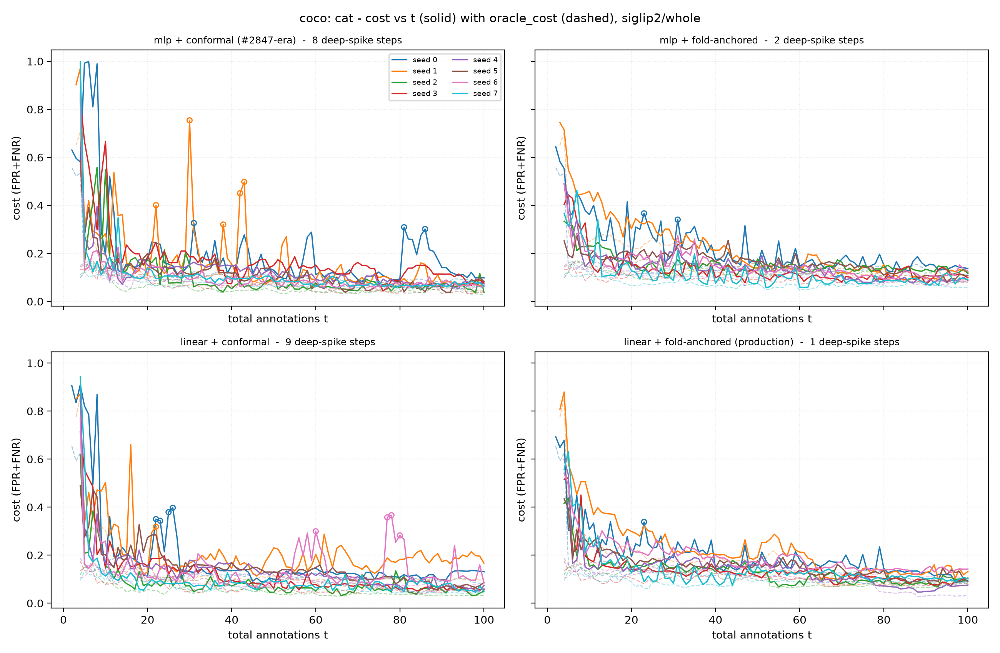
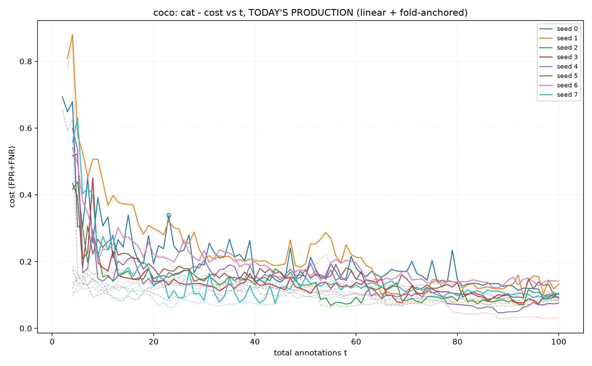
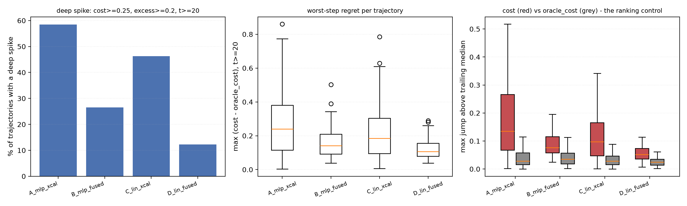

# #2847 - do the MLP-era cost spikes survive today's stack?

Deep spike = a step at `t >= 20` with `cost >= 0.25` **and** `cost - oracle_cost >= 0.2`; local jump = `cost` above its own trailing-5 median by `>= 0.15`. Cold start (`t < 20`) is reported separately - every arm humps there and it is a different phenomenon.

## Per-arm

| arm | trajectories | deep-spike runs | deep-spike steps | median worst-step regret | p90 | median max jump (cost / oracle) | median final cost | median positives found |
|---|---:|---:|---:|---:|---:|---:|---:|---:|
| `A_mlp_xcal` - mlp + conformal (#2847-era) | 147 | 58.5% | 9.30% | 0.239 | 0.573 | 0.135 / 0.028 | 0.133 | 9.0 |
| `B_mlp_fused` - mlp + fold-anchored | 147 | 26.5% | 1.76% | 0.141 | 0.260 | 0.076 / 0.036 | 0.151 | 4.0 |
| `C_lin_xcal` - linear + conformal | 147 | 46.3% | 6.65% | 0.184 | 0.416 | 0.097 / 0.028 | 0.136 | 8.0 |
| `D_lin_fused` - linear + fold-anchored (production) | 147 | 12.2% | 0.63% | 0.107 | 0.213 | 0.052 / 0.025 | 0.137 | 4.0 |

## Paired against the control (`A_mlp_xcal`)

Pairs are `(category, seed)` cells, not steps - the arms are separate trajectories.

| arm | metric | n pairs | control median | arm median | median delta | frac lower | p |
|---|---|---:|---:|---:|---:|---:|---:|
| `B_mlp_fused` | max_excess_warm | 147 | 0.239 | 0.141 | -0.071 | 69% | 0.00000 |
| `B_mlp_fused` | max_cost_warm | 147 | 0.449 | 0.351 | -0.032 | 56% | 0.00006 |
| `B_mlp_fused` | max_jump_cost | 147 | 0.135 | 0.076 | -0.057 | 71% | 0.00000 |
| `C_lin_xcal` | max_excess_warm | 147 | 0.239 | 0.184 | -0.020 | 58% | 0.00026 |
| `C_lin_xcal` | max_cost_warm | 147 | 0.449 | 0.430 | -0.004 | 53% | 0.07887 |
| `C_lin_xcal` | max_jump_cost | 147 | 0.135 | 0.097 | -0.027 | 66% | 0.00000 |
| `D_lin_fused` | max_excess_warm | 147 | 0.239 | 0.107 | -0.117 | 76% | 0.00000 |
| `D_lin_fused` | max_cost_warm | 147 | 0.449 | 0.306 | -0.042 | 63% | 0.00000 |
| `D_lin_fused` | max_jump_cost | 147 | 0.135 | 0.052 | -0.079 | 83% | 0.00000 |

| arm | deep-spike incidence (control -> arm) | only control | only arm | p exact |
|---|---|---:|---:|---:|
| `B_mlp_fused` | 58.5% -> 26.5% | 56 | 9 | 0.00000 |
| `C_lin_xcal` | 58.5% -> 46.3% | 26 | 8 | 0.00294 |
| `D_lin_fused` | 58.5% -> 12.2% | 71 | 3 | 0.00000 |

## What the surviving spikes look like

| arm | spike steps | median n_good | median FNR | median FPR | fallback provenance |
|---|---:|---:|---:|---:|---|
| `A_mlp_xcal` | 1102 | 4 | 0.409 | 0.024 | conformal x1018, too_few_default x84 |
| `B_mlp_fused` | 209 | 3 | 0.250 | 0.331 | fold_anchored[2/2] x154, gmm_blend x47, fold_anchored[1/2] x8 |
| `C_lin_xcal` | 788 | 4 | 0.472 | 0.014 | conformal x776, too_few_default x12 |
| `D_lin_fused` | 75 | 3 | 0.598 | 0.304 | fold_anchored[2/2] x69, gmm_blend x6 |

## Data read

| arm | cell files | trajectories | never found a positive | unreadable | zero-byte | base rows |
|---|---:|---:|---:|---:|---:|---:|
| `A_mlp_xcal` | 152 | 147 | 5 | 0 | 0 | 14220 |
| `B_mlp_fused` | 152 | 147 | 5 | 0 | 0 | 14220 |
| `C_lin_xcal` | 152 | 147 | 5 | 0 | 0 | 14220 |
| `D_lin_fused` | 152 | 147 | 5 | 0 | 0 | 14220 |

`never found a positive` = 100 votes, zero positives, so the simulator never trained and the cell emits no step. Not a failure - the extreme of the same positive-starvation regime the spikes live in. These cells differ per arm, so the paired tests above drop them.

## Figures

