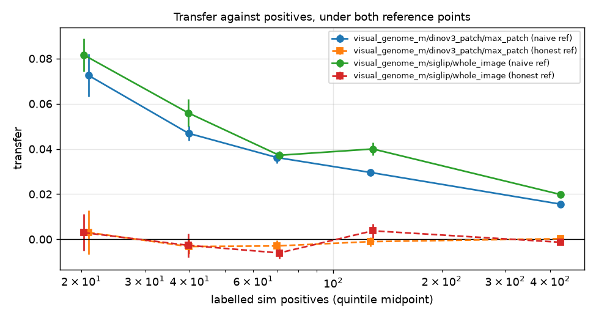
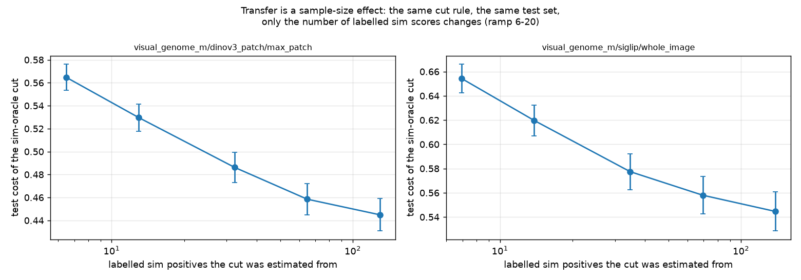
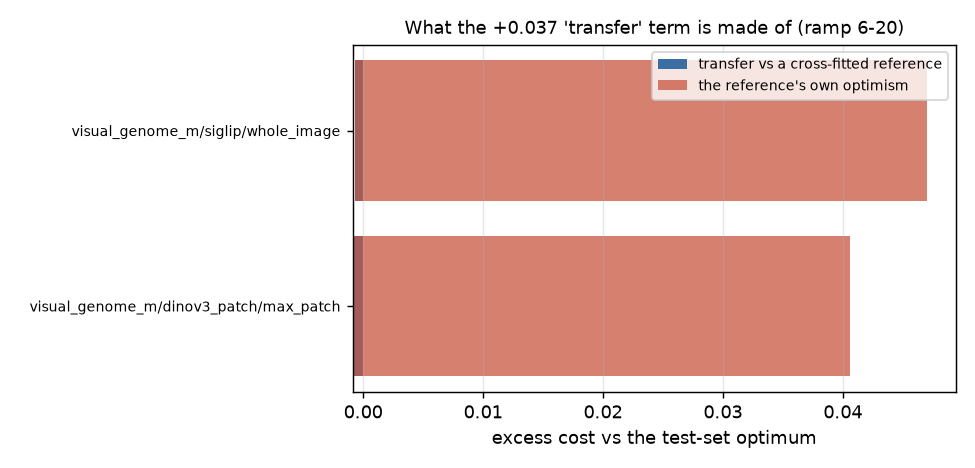
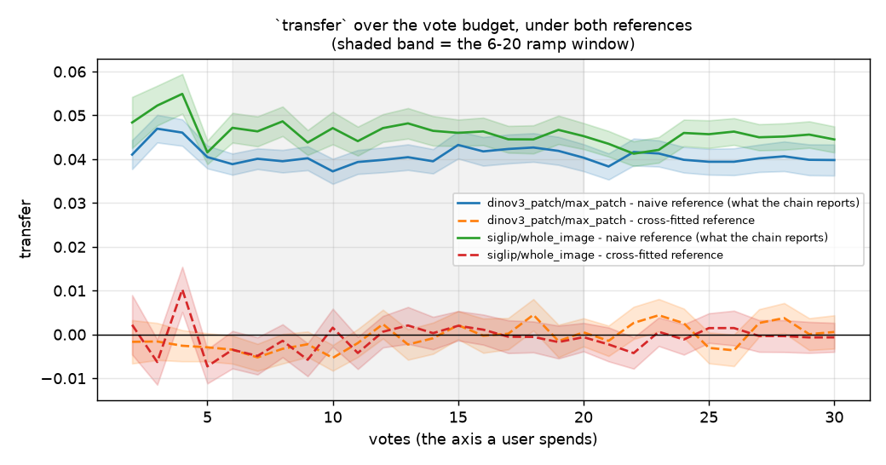
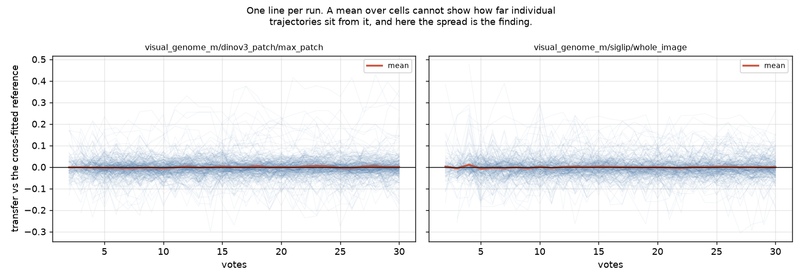

# `transfer` is not a cost. It is a variance measured against an optimistic reference (#2883)

**Run:** fresh worktree off `dev` `5ccd7597`, branch `claude/transfer-2883`.
552/552 cells COMPLETED, **0 failures, 0 zero-byte outputs**, 40 min on the `cpu`
partition, no GPU stage (the pile at `/expscratch/$USER/vts-cache` supplied every
embedding). 434,785 variant rows, 27,306 cut-diagnostic rows. **41 of the 552
cells emitted no rows** (a category/seed whose trajectory never trains), so every
table below is over **511 cells**, of which 267 production-arm and 233
control-arm cells fall in the ramp window.

**Pre-registration:** [`PREREG.md`](PREREG.md), written and committed before the
array was submitted. **All four hypotheses land, on both arms independently.**
One sub-prediction inside H4 was wrong and is called out below.

---

## BLUF

The #2836 decomposition's dominant term is an artefact of how it is measured.

| | production arm, ramp 6–20 |
|---|---:|
| `transfer` as the chain reports it | **+0.041 ± 0.002** |
| …against a reference that does not read its own answer | **−0.001 ± 0.002** |
| the difference — the reference point's own optimism | **+0.041 ± 0.002** |
| share of today's number that is reference artefact | **1.02** |

Actual estimation error at the operating point, from the fitted learning curve,
is **0.0030** — about **7 %** of the +0.041 the chain attributes to this term.

**Consequences.** `transfer` should not be the target of a study, because there
is almost nothing there to recover. `decisions.family_headroom_exhausted` rests
on a claim that is false out of sample, and this run refutes it directly. And
the decomposition's fourth term needs an honest reference before anyone reads it
again.

---

## H1 — it is a variance, not a bias ✓

A term that encodes a wrong *assumption* moves the cut the same way every time.
A term that is finite-sample noise moves it both ways. `symmetry` is
`|mean| / mean_abs` in threshold units — near 1 for a bias, near 0 for a
variance. Bar: **< 0.10, and below every sibling measured the same way.**

| term (production arm) | mean | mean_abs | symmetry |
|---|---:|---:|---:|
| `prior_loss` | +0.015 | 0.015 | 1.00 |
| `identification` | −0.021 | 0.022 | 0.96 |
| `misspecification` | +0.006 | 0.021 | 0.27 |
| **`transfer`** | **+0.001** | **0.016** | **0.070** |

Control arm: `transfer` 0.020, siblings 0.47–0.99. Both arms pass both halves of
the bar. `transfer` moves the cut ±0.016 and nets to nothing.

There is no distribution for it to transfer across: `D_sim` and `D_test` are one
random partition of a single pool (2096 / 2097 medias) scored by one model.

## H2 — the reference point is optimistic, and it is the whole term ✓

`oracle_cost` is the minimum of the empirical cost **over the test sample it is
then scored on** — `oracle_cut`'s own docstring calls it "a lower bound on
achievable cost, not a rule". Beside it this run records a cross-fitted
reference: the cut chosen on 4/5 of the test set, paid for on the held-out fifth.

| ramp 6–20 | naive ref | cross-fitted ref | optimism | share |
|---|---:|---:|---:|---:|
| `dinov3_patch/max_patch` | **+0.041 ± 0.002** | **−0.001 ± 0.002** | +0.041 ± 0.002 | **1.02** |
| `siglip/whole_image` | **+0.047 ± 0.003** | **−0.001 ± 0.002** | +0.048 ± 0.002 | **1.01** |

Against an honest reference the term is **gone on both arms** — indistinguishable
from zero, and if anything faintly negative.

**The mechanism, on three real steps.** A sample minimum over a cost curve whose
FNR moves in steps of `1/n_pos` can always find a threshold that flatters itself,
and the fewer positives the more it can flatter:

| category, seed, step | test positives | naive ref | cross-fitted ref | optimism | one FNR step |
|---|---:|---:|---:|---:|---:|
| `giraffe`, seed 0, t=13 | 10 | 0.020 | 0.115 | **+0.096** | 0.100 |
| `field`, seed 4, t=19 | 87 | 0.403 | 0.429 | +0.025 | 0.011 |
| `sky`, seed 0, t=6 | 394 | 0.493 | 0.500 | +0.007 | 0.003 |

and across the whole run the optimism tracks that granularity:

| test positives (quintile) | optimism | one FNR step |
|---:|---:|---:|
| 21 | 0.072 | 0.055 |
| 40 | 0.050 | 0.026 |
| 70 | 0.036 | 0.015 |
| 122 | 0.033 | 0.009 |
| 404 | 0.016 | 0.003 |

## H3 — it scales like an estimation error, in *positives* ✓

Four subsample levels of the sim set plus the full set, all re-cutting the same
per-step model against the same test scores — so the only thing that moves along
a curve is how many labelled sim scores the cut was estimated from.

| sim positives | 6.5 | 13 | 32 | 65 | 130 |
|---|---:|---:|---:|---:|---:|
| test cost of the sim-oracle cut | 0.565 | 0.530 | 0.486 | 0.459 | 0.445 |

`a + b/n_pos` fits with **median R² = 0.90** (control 0.87) and slope
**0.39 ± 0.015** — 26 SE from zero. At the operating point (130 positives) the
curve's own estimation excess is **b/n_pos = 0.0030**, which is the honest size
of this term.

**The axis is positives, not sample size**, and that is decided across cells, not
within one: within a cell the category is fixed, so `n_pos` is exactly
proportional to `m` and the two axes fit identically (R² agrees to four decimals).
What separates them is whether the fitted slope moves with prevalence — the
`m`-axis slope must go as `1/prevalence` to compensate, the `n_pos`-axis slope
should not move at all. It does not, on both arms:

| arm | ρ(slope, prevalence), `m` axis | `n_pos` axis |
|---|---:|---:|
| `dinov3_patch/max_patch` | −0.66 | **+0.41** |
| `siglip/whole_image` | −0.71 | **+0.31** |

Directionally consistent on both arms, but **+0.41 is not zero** — the positives
axis is the better of the two, not a clean fit, and this is the weakest of the
four results.

**And the scaling holds only for the naive reference.** Banded by positives, the
naive term decays 0.072 → 0.016 while the cross-fitted term is flat on zero in
every band (+0.003, −0.003, −0.003, −0.001, +0.000). The thing that scales with
positives *is the reference point's optimism*. The two flat lines against the two decaying ones are the study's single most
compact statement:

*Naive reference (solid) decays from 0.072 to 0.016 as labelled positives rise;
the cross-fitted reference (dashed) is flat on zero in every band, on both arms.
Log x-axis; error bars are ±1 SE over cells. This does not license reading a
single cell off the curve — see the per-run figure below.*

### The one place to be careful

Three estimates of one reference point:

| | value |
|---|---:|
| naive (sample minimum) — a **lower** bound | 0.404 |
| cross-fitted — an **upper** bound (its cut sees only 4/5 of the data) | 0.446 |
| the learning curve's intercept — uses neither sample | **0.451 ± 0.014** |

The intercept lands **0.006 above** the bracket, or 14 % of the bracket's width
(0.042). The pre-registration commits to calling H2 *unresolved* if it missed by
more than the full width; it does not, so H2 stands — but the intercept is
outside, and the honest reading is that the population optimum sits at the top of
the bracket or a little above it, not in the middle. Every conclusion here
survives that, because the term being measured is +0.041 and the entire bracket
is 0.042 wide.

## H4 — `pooled_sim_oracle` is not a bound on test loss ✓

`decisions.family_headroom_exhausted` is mechanised from the claim that
`pooled_sim_oracle` *"bounds every rule that picks a threshold from that sim
set"*. It bounds every rule's loss **on the sim set**. It is not a bound on
**test** loss, which is what every table in this line reports — and two
regularised estimators of the same target beat it out of sample, on both arms:

| ramp 6–20 | `dinov3_patch/max_patch` | `siglip/whole_image` |
|---|---:|---:|
| `sim_oracle_smooth` − `sim_oracle` | **−0.0038 ± 0.0011** (p = 3e−5) | **−0.0045 ± 0.0009** (p < 1e−4) |
| `sim_oracle_bag` − `sim_oracle` | −0.0009 ± 0.0010 (p = 0.001) | **−0.0033 ± 0.0012** (p < 1e−4) |

The refutation rests on `smooth`, which is resolvable on both arms. **`bag` on
the production arm is not**: its mean is smaller than its own standard error, and
the p-value is a Wilcoxon on signs — the direction is consistent, the size is not
resolvable here. Reported as such rather than added to the pile.

**A pre-registered sub-prediction was wrong.** PREREG predicted "`smooth` wins
and `bag` does not", from a synthetic sweep where bagging the argmin *lost*
wherever positives were starved. On real scores `bag` wins too (clearly on the
control arm). The hypothesis held; the mechanism guess inside it did not, which
is why both estimators were run instead of one.

This does not change what ships — both read labels. What it changes is the
**flag**: `family_headroom_exhausted` should say what it measures, which is that
one particular estimator has no measurable headroom against production
(−0.0045, p = 0.10 in this run — itself a failure to reject at p > 0.05, not a
demonstration of no effect).

## The label-free arm: a clean negative on the arm that matters

Bagging the *mixture fit* rather than the labelled cost curve reads no labels, so
unlike everything above it could ship. Pre-registered as exploratory and fenced
out of the ship gate (`SWEEP_ONLY`), which is how it should stay:

| ramp 6–20 | `dinov3_patch/max_patch` | `siglip/whole_image` |
|---|---:|---:|
| `bagfit_mid` − `pooled_mid` | −0.0008 ± 0.0007 (p = 0.22) | −0.0013 ± 0.0004 (p < 1e−4) |
| `bagfit_priorfree` − `pooled_priorfree` | −0.000003 ± 0.0009 (p = 0.28) | −0.0012 ± 0.0004 (p = 0.003) |

**Nothing on the production arm.** A small, real gain on the single-vector
control. That is consistent with the rest of the study: the variance that matters
lives in the *labelled* cost-curve estimator, not in the unsupervised mixture
fit, so smoothing the fit does not reach it.

## What this run does not establish

- **One environment.** `visual_genome_m` only, two geometries. The generalisation
  check is `coco_val × dinov3_patch` — the second genuine region-voting
  environment — which needs `REGION_VOTING_BY_DATASET["coco_val"]` flipped, and
  that flag is #2905's open question. Deliberately not entangled with it here.
- **The intercept is outside the bracket** (above), by 14 % of its width.
- **`bag` on the production arm is directional only.**
- No claim about *ranking* quality: every number here is about where a threshold
  lands, not about how good the scores are.

## Recommendations

1. **Stop aiming studies at `transfer`.** After an honest reference it is
   −0.001 ± 0.002 on the production arm. The +0.041 was the yardstick.
2. **Give the decomposition an honest reference**, or report the fourth term as a
   bracket. `cost_test_oracle_honest` is now emitted per step and costs nothing.
   The same defect applies to `rule_inefficiency` / `calibration_shift`, which
   #3116 has open for the same reason — this is one fix, not two.
3. **Caveat `family_headroom_exhausted`** to say what it measures. It is
   currently set by a failure to reject at p = 0.10, from a premise this run
   refutes.
4. **The binding constraint is positives**, again: the estimation error that is
   real scales as `0.39 / n_pos`, and the runs that hurt are the ones with 10–20
   of them. That is the same conclusion #3129 reached from a different direction.

## Figures

All generated by `analyze_transfer.py` from the CSVs in `results/agg/`.

*The same cut rule, the same test set, the same per-step model — only the number
of labelled sim scores changes. Log x-axis, ±1 SE over cells. The curve is the
estimator's learning curve, not a cost anyone pays: at the operating point
(rightmost) the remaining estimation excess is 0.0030.*

*Stacked: the cross-fitted term (left segment) against the reference's own
optimism (right). Not a decomposition of variance — the two segments are
differences of the same cut against two different references.*

*Both references over the axis a user spends, ±1 SE, ramp window shaded. The gap
does not close with votes, because it is not about how well trained the model is.*

*One faint line per (category, seed) against the cell mean. The mean sits inside
a wide spread: individual runs range far either side of zero, which is what a
variance looks like and what the window means cannot show.*

Refs #2883, refs #3187, refs #3116, refs #2884, refs #2879, refs #2836.
