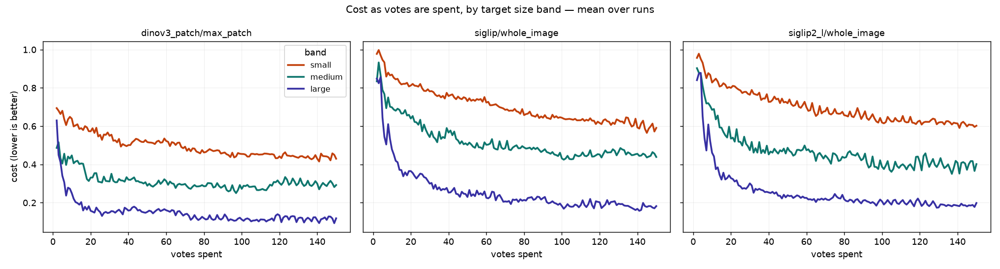
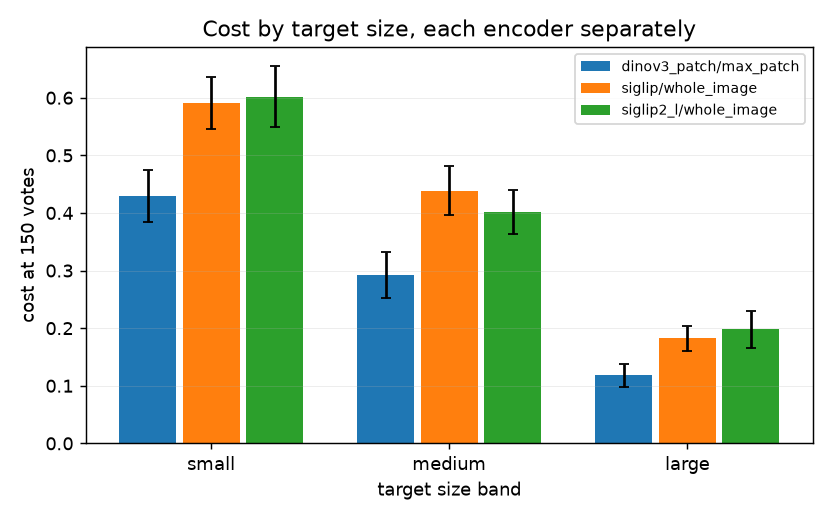

# Finding small things is expensive, and region voting pays for part of it

**Study:** the scale study on `vg_scale` (#3156) — one class list at three box
sizes, 324 cells: 12 classes × {small, medium, large} × 3 encoders × 3 seeds,
150 votes each, shipped defaults throughout.

Two questions, both answerable for the first time. The published `vg_box_*` sets
band each category by its *median* box, so their vocabularies are disjoint and a
small-vs-large gap there could always have been "noses are harder than fences".
Here the twelve classes are held fixed, the bands share one negative pool, and
prevalence is 0.0250 in every cell by construction — so a difference between
bands is a difference of **size**.

## 1. Cost roughly triples from large targets to small ones

Cost at 150 votes, paired within `(class, seed)`:

| arm | small | medium | large | paired small − large |
|---|---:|---:|---:|---:|
| `dinov3_patch` / max_patch | 0.43 ± 0.05 | 0.29 ± 0.04 | 0.12 ± 0.02 | **0.31 ± 0.05** |
| `siglip` / whole_image | 0.59 ± 0.05 | 0.44 ± 0.04 | 0.18 ± 0.02 | **0.41 ± 0.05** |
| `siglip2_l` / whole_image | 0.60 ± 0.05 | 0.40 ± 0.04 | 0.20 ± 0.03 | **0.41 ± 0.06** |

Every difference is several times its standard error. The ordering
small > medium > large holds in all three arms, at every point along the
trajectory, and in **83–94% of individual runs** — so it is not an artefact of
averaging.



*Mean over runs, one panel per arm. Read the vertical gap between bands, not the
absolute heights: the three arms differ in encoder as well as geometry. The
bands separate within the first ~20 votes and never re-converge.*

The gap is worst early, which is when a user decides whether the tool works:

| arm | small @ 20 votes | large @ 20 votes |
|---|---:|---:|
| `dinov3_patch` / max_patch | 0.57 ± 0.05 | 0.16 ± 0.03 |
| `siglip` / whole_image | 0.81 ± 0.05 | 0.37 ± 0.05 |
| `siglip2_l` / whole_image | 0.80 ± 0.05 | 0.33 ± 0.05 |

## 2. Region voting helps most in the middle, and does not rescue the small band

The clean contrast is region voting against **the same encoder with geometry
off** — same cells, same seeds, only `max_patch` vs `whole_image` differing.
(Comparing against `siglip` would confound geometry with encoder.)

| band | max_patch | whole_image | paired difference |
|---|---:|---:|---:|
| small | 0.43 | 0.67 | **−0.24 ± 0.03** |
| medium | 0.29 | 0.60 | **−0.31 ± 0.04** |
| large | 0.12 | 0.30 | **−0.18 ± 0.04** |

Region voting wins everywhere, and its advantage is **largest in the middle
band**, not at the extremes. That shape makes sense: a large target is already
most of the frame, so pooling over its patches adds little; a sub-patch target
is smaller than the grid can resolve, so the geometry has nothing to isolate.
The middle band is where a region is both resolvable and much smaller than the
image — exactly where max-pooling over patches earns its keep.

It narrows the size penalty (0.31 vs 0.37 for the same encoder) but does not
remove it. **Region voting mitigates the small-target problem; it does not
solve it.**



*Endpoint cost at 150 votes with standard errors, encoders side by side. The
band ordering is identical in each, which is the point: the effect survives a
change of encoder and a change of voting geometry.*

## 3. The effect is broad, not carried by a few classes


*Paired `cost(small) − cost(large)` per class. Above zero means the small band is
harder. Positive for 11 of 12 classes in every arm; `kite` sits near zero and
`book` goes slightly negative under region voting. This is the figure that
would have exposed a pooled mean produced by two outliers — it isn't one.*

`bird` carries the largest penalty (~0.75), which fits: 58% of COCO's bird
instances are sub-patch, and a distant bird is a few dark pixels against sky.
`kite` is the exception, and plausibly for the same reason in reverse — kites
are high-contrast against uniform sky at any size.

## 4. The two whole-image encoders are indistinguishable here

`siglip` and `siglip2_l` produce the same size penalty (0.41 ± 0.05 vs
0.41 ± 0.06) and overlapping costs in every band. A premium encoder does not buy
its way out of the small-target problem — consistent with the overview
benchmark, which also could not resolve these two on cost at three seeds. Their
value in this study is as **replication**: the effect is not a property of one
encoder.

## What this does not license

- **Cost is the harness's operating-point cost**, not accuracy. A band that
  costs more is one where the user spends more to reach the shipped decision
  rule's operating point.
- **The small band's labels are the least verifiable part of the dataset.**
  Boxed review confirms only ~2/3 of sub-patch positives, by human or model
  (`DATASHEET.md`). The small-band numbers rest on labels whose residual
  uncertainty is real and measured, not zero.
- **The negative pool carries ~2.0% residual contamination** (95% CI 0.8–5.0%),
  concentrated in `book` — which is also the one class whose penalty flips sign
  under region voting. Treat `book` as the least trustworthy row here.
- **Three seeds.** Differences smaller than twice their standard error are
  reported as unresolvable rather than quoted to a decimal the sample cannot
  support.

## Reproducing

```bash
bash scripts/experiments/calibration/launch_scale.sh prepare   # asserts region voting resolves
bash scripts/experiments/calibration/launch_scale.sh cells     # 324 cells, ~16G for patch cells
python scripts/experiments/calibration/analyze_scale.py \
    --extra-cells /expscratch/$USER/scale-3156/results-dinov3-wholeimage
python scripts/experiments/calibration/figures_scale.py
```

The `results-dinov3-wholeimage/` control arm exists because the first run's patch
cells silently fell back to whole-image geometry
(`scripts/experiments/lessons/2026-08-25-sized-from-the-wrong-configuration.md`).
Preserving that failure turned it into the paired control the region-voting
result now rests on.
