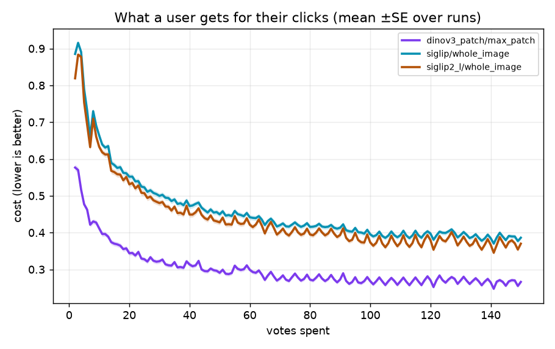
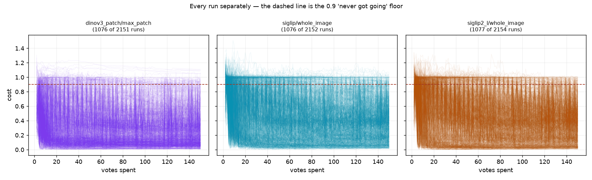
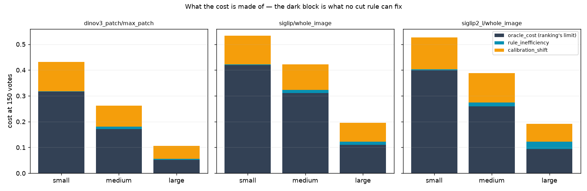
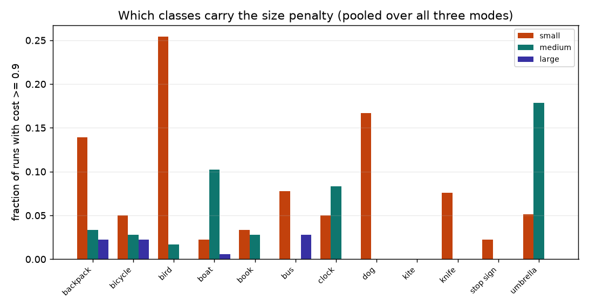

# #3156 — the `vg_scale` overview grid, on a head that no longer ships

**Verdict: the grid is complete and clean, and it measures the wrong head.**
All 6480 cells ran, 0 failed, 0 are zero-byte — but every row of it carries
`trainer=mlp head=linear`, and `linear` stopped being the shipped head in
[`89487ec25`](../../../vtscore/eval/voting_iterations.py) ("Make the linear SVM
the default detector head", PR #3198). The array (job 540591) launched from a
base **321 commits behind dev**, so `head=default (production)` resolved to the
*previous* production. Read every number below as the **baseline arm** of a
paired comparison, never as production's behaviour.

The corrected rerun on `linear_svm` (job 549465, `/expscratch/$USER/scale-3156-svm`)
is running now and lands the production answer. This report exists so that when
it lands there is something to difference it against, and because three of its
findings are about the **dataset**, not the head, and hold either way.

- **Run:** 6480/6480 cells, 0 failures, 0 zero-byte, **23 header-only**, 931,013
  rows over 6457 runs. Every cell from job 540591 — none survives from the
  cancelled 540411 attempt (checked: 0 cell files predate 540591's start).
- **Grid:** `vg_scale` × {`siglip`, `siglip2_l`, `dinov3_patch`} × 12 classes ×
  3 size bands × 60 seeds, horizon 150 votes. Only `dinov3_patch` carries patch
  grids, so it is the only mode where `max_patch` region voting is real.
- **Data:** `/expscratch/$USER/scale-3156-final`. Analysis
  [`analyze_overview.py`](../../../scripts/experiments/calibration/analyze_overview.py),
  figures [`figures_overview.py`](../../../scripts/experiments/calibration/figures_overview.py).
- **Dataset:** [`DATASHEET.md`](DATASHEET.md).

## How the head got retired under the run

Worth stating plainly, because the worktree no longer shows it. `vts-vgscale-tests`
today sits at `0e4e2e5c6` with `PRODUCTION_HEAD = "linear_svm"` — it was moved
forward *after* the array finished. The only surviving evidence of what actually
trained is the `head` column in the rows themselves, which is why it is worth
recording a resolved default as data and not just as a launcher argument. The
cell logs say `head=default (production)`, which is true and useless: it names
the *rule*, not the *resolution*.

Why `preflight.sh` check 12 did not catch it — it reads `PRODUCTION_HEAD` out of
the same stale worktree, so both sides of the comparison were equally old and
agreed — is written up in
[both sides of the knob check were stale](../../../scripts/experiments/lessons/2026-08-26-both-sides-of-the-knob-check-were-stale.md),
alongside its predecessor
[a launcher pinned a head that stopped being production](../../../scripts/experiments/lessons/2026-08-21-a-launcher-pinned-a-head-that-stopped.md).
Check 4 now fails a worktree more than 100 commits behind `origin/dev`, which is
the control that would have stopped this run. It is also why the rerun's driver
pins a dedicated worktree at a tested commit and echoes `PRODUCTION_HEAD` into
its own log before submitting anything.

## Cost, and what it decomposes into

At 150 votes, `cost = oracle_cost + regret` — the ranking's own floor plus what
the cut rule gives away. Two significant digits throughout; ± is one SE.

| mode | cost | oracle | regret | regret share |
|---|---|---|---|---|
| `dinov3_patch` / `max_patch` | **0.27** ± 0.00 | 0.18 | 0.09 | 0.33 |
| `siglip2_l` / `whole_image` | 0.37 ± 0.01 | 0.25 | 0.12 | 0.32 |
| `siglip` / `whole_image` | 0.39 ± 0.01 | 0.28 | 0.11 | 0.27 |

Region voting wins on cost by **0.10–0.12**, and it wins because its *ranking* is
better (oracle 0.18 vs 0.25/0.28), not because its cut is better — regret is
within 0.03 across all three.

Averaged trajectories hide the thing that matters, so the same data per run:

### Inside regret: it is calibration, not the rule

| mode | regret | `rule_inefficiency` | `calibration_shift` |
|---|---|---|---|
| `dinov3_patch` / `max_patch` | 0.09 | 0.01 | **0.08** |
| `siglip` / `whole_image` | 0.11 | 0.01 | **0.09** |
| `siglip2_l` / `whole_image` | 0.12 | 0.02 | **0.10** |

`calibration_shift` outweighs `rule_inefficiency` roughly **8:1** in every mode.
The cut rule picks nearly the right point *on the distribution it was shown*; the
distribution it was shown is not the one it is scored against. That is a
sim→test transfer term, and it is the same wall #2836 and #2883 hit — so **no
further cut-rule work is indicated by this grid.** Note this is exactly the
family of conclusion the head swap could move, so treat it as provisional until
549465 lands.

## Size band: monotone, and it is the ranking that moves

| mode | small | medium | large |
|---|---|---|---|
| `dinov3_patch` / `max_patch` | 0.43 | 0.26 | **0.11** |
| `siglip2_l` / `whole_image` | 0.53 | 0.39 | 0.19 |
| `siglip` / `whole_image` | 0.54 | 0.42 | 0.20 |

Cost falls monotonically with target size in all three modes, and the oracle term
falls with it (`dinov3_patch`: 0.32 → 0.17 → 0.05) while regret barely moves
(0.12 → 0.09 → 0.05). Small targets are a **ranking** problem. This is a property
of the dataset and the embedders, and does not depend on the head.

## Stuck runs: a tail, not a class of cell

266 of 6457 runs (**4.1%**) end at `cost ≥ 0.9` after 150 votes. They split into
two distinct phases:

| phase | stuck | healthy | what it means |
|---|---|---|---|
| `hard` | 134 | 5234 | escaped seeding; the learned selector starved it |
| `good` | 128 | 82 | never found `GOOD_TARGET` positives — still on the text sort |
| `done` | 2 | 832 | ran to completion |
| `new` | 2 | 43 | exploring the coverage atlas |

A stuck run is separated from a healthy one almost entirely by **how many
positives it ever saw** (`n_good` 3.0 ± 0.1 vs 7.2 ± 0.0) and by the quality of
its ranking (AP 0.11 vs 0.56), not by its threshold.

**No cell is hard as a cell.** Zero of 108 (category × mode) cells have a median
cost ≥ 0.9, and zero are hard for one mode but not others. Stuckness is a
per-run tail, so a mode change cannot fix it and a per-cell exclusion would be
throwing away 96% good runs to remove 4% bad ones.

## Literal examples — and two annotation-error candidates

Every rate above is a rate over runs, so here are the runs, by
`exemplar_id`, checkable one at a time.

**Worst individual stuck runs.** Each is a real seed on a real exemplar:

| category | embedder | seed | `exemplar_id` | cost | `n_good` | AP |
|---|---|---|---|---|---|---|
| `bus@small` | `siglip` | 7 | 1159597 | 1.15 | 3 | 0.02 |
| `knife@small` | `dinov3_patch` | 24 | 2322075 | 1.11 | 1 | 0.02 |
| `bird@small` | `dinov3_patch` | 19 | 1222 | 1.10 | 1 | 0.03 |
| `boat@medium` | `dinov3_patch` | 33 | 2321462 | 1.10 | 1 | 0.02 |
| `backpack@small` | `siglip` | 26 | 2381555 | 1.07 | 2 | 0.02 |
| `clock@medium` | `siglip` | 34 | 2330189 | 1.06 | 3 | 0.02 |

**Seven exemplars are stuck on every seed that ever drew them** — these account
for 46 of the 266 stuck runs (17%):

| category | embedder | `exemplar_id` | stuck / drawn |
|---|---|---|---|
| `backpack@small` | `siglip` | 2381555 | 8 / 8 |
| `umbrella@medium` | `siglip` | 2414453 | 8 / 8 |
| `boat@medium` | `siglip2_l` | 2321462 | 8 / 8 |
| `bus@small` | `siglip` | 1159597 | 7 / 7 |
| `boat@medium` | `siglip` | 2321462 | 6 / 6 |
| `knife@small` | `siglip` | 2322075 | 5 / 5 |
| `knife@small` | `siglip2_l` | 2322075 | 4 / 4 |

**Two of them fail across all three embedders**, which is the signature worth
acting on — three independent representations and ~15–20 independent seeds, and
essentially nothing ever gets going:

| category | `exemplar_id` | `siglip` | `siglip2_l` | `dinov3_patch` | total |
|---|---|---|---|---|---|
| `boat@medium` | **2321462** | 6/6 | 8/8 | 4/6 | **18/20** |
| `knife@small` | **2322075** | 5/5 | 4/4 | 4/6 | **13/15** |

A model failure should not survive a change of representation. **Check these two
images before treating them as a modelling result** — if the box or the label is
wrong, the fix is to clean `vg_scale`, not to tune the selector. No exemplar is
stuck 100% across all three, so this is a shortlist of two, not a systemic
labelling problem.

## The 23 header-only cells are seed-determined, not random

A cell whose category never collects both classes writes its CSV header and
nothing else. It is non-empty, parses clean, and passes `find -size 0`, so it
counts as present everywhere. The 23 here are **not** spread evenly:

| category | count | seeds involved |
|---|---|---|
| `knife@small` | 9 | 0, 40, 48, 56 |
| `umbrella@small` | 4 | 16, 24, 48 |
| `boat@medium` | 4 | 17, 49 |
| `bird@small` | 3 | 3, 27, 43 |
| `backpack@large` | 2 | 5, 29 |
| `umbrella@medium` | 1 | 2 |

The same `(category, seed)` pair recurs **across embedders** — `knife@small`
seeds 0 and 48 are header-only in all three, `boat@medium` seeds 17 and 49 in
two. The seed picks the exemplar, so this is the exemplar draw failing, not the
embedder. `knife@small` alone is 39% of them, and it is also one of the two
cross-embedder stuck candidates above — the same class arriving twice by two
different routes.

Reproducing one costs nothing: rerun `knife@small` at seed 0 on any embedder.

## What to do

1. **Do not quote these numbers as production.** They are the retired `linear`
   head. Difference them against 549465 when it lands.
2. **Inspect `vg_scale` exemplars 2321462 (`boat@medium`) and 2322075
   (`knife@small`).** Two images, a few minutes, and the answer decides whether
   17% of the stuck tail is a data bug or a modelling result.
3. **Look at `knife@small` as a cell.** 9 of 23 header-only cells and a
   cross-embedder stuck candidate is enough signal to re-examine how its
   positives were drawn.
4. **No cut-rule work from this grid.** `calibration_shift` dominates
   `rule_inefficiency` 8:1; that is transfer, and #2883 already showed cut rules
   cannot reach it. Re-check once the `linear_svm` rerun lands.
