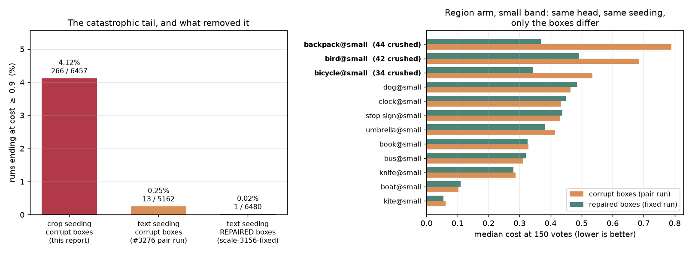

# #3156 — the `vg_scale` overview grid, on a head that no longer ships

> # ⚠️ SEEDING CAVEAT — these runs did not start the way the app does
>
> **Recorded 2026-08-26 (#3156).** Autopilot seeds its first three Good votes from
> a **text sort**: the user types a query and votes down that ranking. Until
> PR #3269 this harness instead ranked every item by cosine to a **crop of one
> boxed positive** — a ranking no user ever produces — and passed it as
> `seed_scores`, the argument that `al_strategies`, `EVAL.md` and
> `voting_iterations` all describe as "similarity to the **typed query**".
>
> **What to distrust here:** anything that depends on *how a run starts* —
> positive starvation, stuck or never-got-going runs, `n_good`, and
> early-trajectory cost. Measured on one cell after the fix, text seeding put the
> first positive at **rank 1** with five in the top 20, while the exemplar that
> crop-seeding made look like the dataset's hardest positive ranked **4006 of
> 7749** for its own class.
>
> **What still holds:** within-study contrasts where every arm seeded identically,
> which is most of what these reports conclude — the seeding is a shared baseline
> shift, not an arm-dependent one.
>
> See [the harness seeded from a crop](../../../scripts/experiments/lessons/2026-08-26-the-harness-seeded-from-a-crop.md).

> # ⚠️ BOX CAVEAT — 130 of the boxes these runs ranked against were corrupt
>
> **Recorded 2026-08-28 (#3281, #3284).** `vg_scale` stored 130 region boxes
> crushed onto the frame origin: `corrections.json` holds boxes that are already
> normalised, and `build_pile.py` divided them by `(W, H)` a second time. The
> defect is concentrated in the small band of three classes — **`backpack@small`
> 44, `bird@small` 42, `bicycle@small` 34** of 100 positives each.
>
> **It is not only a region-voting problem.** Band membership is *derived from
> box area*, so a crushed box also files its image in the wrong band. Whole-image
> arms, which never read a box, were still asked to find small objects while
> holding large ones. That is how the corruption reached the `siglip`
> whole-image rows below.
>
> The pile was rebuilt 2026-08-27 15:09 and the whole grid rerun — array 570303,
> 6480/6480 cells, `/expscratch/$USER/scale-3156-fixed`. **The rebuild moved the
> positive set of 22 of 36 categories** (each cell draws 100 positives from a
> ranked pool, so repairing one band re-selects the others), so only the
> categories `diff_labels.py` calls unchanged are comparable across it — see
> [what is still comparable](#what-is-still-comparable-across-the-rebuild).
>
> **What this withdrew:** every per-exemplar row in
> [Literal examples](#literal-examples--and-two-annotation-error-candidates),
> and the `bird@small` row of the header-only table. **What survived:** the two
> annotation adjudications — both of those boxes are byte-identical before and
> after the rebuild.

**Verdict: the grid is complete and clean, and it measures the wrong head.**
All 6480 cells ran, 0 failed, 0 are zero-byte — but every row of it carries
`trainer=mlp head=linear`, and `linear` stopped being the shipped head in
[`89487ec25`](../../../vtscore/eval/voting_iterations.py) ("Make the linear SVM
the default detector head", PR #3198). The array (job 540591) launched from a
base **321 commits behind dev**, so `head=default (production)` resolved to the
*previous* production. Read every number below as the **baseline arm** of a
paired comparison, never as production's behaviour.

~~The corrected rerun on `linear_svm` (job 549465, `/expscratch/$USER/scale-3156-svm`)
is running now and lands the production answer.~~ **(#3284: it landed, and was
superseded — see [What to do](#what-to-do) item 1.)** This report exists so that
when it lands there is something to difference it against, and because three of
its findings are about the **dataset**, not the head, and hold either way.

- **Run:** 6480/6480 cells, 0 failures, 0 zero-byte, **23 header-only**, 931,013
  rows over 6457 runs. Every cell from job 540591 — none survives from the
  cancelled 540411 attempt (checked: 0 cell files predate 540591's start).
- **Grid:** `vg_scale` × {`siglip`, `siglip2_l`, `dinov3_patch`} × 12 classes ×
  3 size bands × 60 seeds, horizon 150 votes. Only `dinov3_patch` carries patch
  grids, so it is the only mode where `max_patch` region voting is real.
- **Data:** `/expscratch/$USER/scale-3156-final`. The analysis and figure scripts
  (analyze_overview and figures_overview, in the calibration experiment
  directory) are still on the unmerged `claude/vg-scale-scan-3156` branch, so
  they are named here rather than linked.
- **Dataset:** [`DATASHEET.md`](DATASHEET.md).

## How the head got retired under the run

Worth stating plainly, because the worktree no longer shows it. `vts-vgscale-tests`
today sits at `0e4e2e5c6` with `PRODUCTION_HEAD = "linear_svm"` — it was moved
forward *after* the array finished. The only surviving evidence of what actually
trained is the `head` column in the rows themselves, which is why it is worth
recording a resolved default as data and not just as a launcher argument. The
cell logs say `head=default (production)`, which is true and useless: it names
the *rule*, not the *resolution*.

Why `preflight.sh` check 12 did not catch it — it reads `PRODUCTION_HEAD` out of
the same stale worktree, so both sides of the comparison were equally old and
agreed — is written up in
[both sides of the knob check were stale](../../../scripts/experiments/lessons/2026-08-26-both-sides-of-the-knob-check-were-stale.md),
alongside its predecessor
[a launcher pinned a head that stopped being production](../../../scripts/experiments/lessons/2026-08-21-a-launcher-pinned-a-head-that-stopped.md).
Check 4 now fails a worktree more than 100 commits behind `origin/dev`, which is
the control that would have stopped this run. It is also why the rerun's driver
pins a dedicated worktree at a tested commit and echoes `PRODUCTION_HEAD` into
its own log before submitting anything.

## Cost, and what it decomposes into

At 150 votes, `cost = oracle_cost + regret` — the ranking's own floor plus what
the cut rule gives away. Two significant digits throughout; ± is one SE.

| mode | cost | oracle | regret | regret share |
|---|---|---|---|---|
| `dinov3_patch` / `max_patch` | **0.27** ± 0.00 | 0.18 | 0.09 | 0.33 |
| `siglip2_l` / `whole_image` | 0.37 ± 0.01 | 0.25 | 0.12 | 0.32 |
| `siglip` / `whole_image` | 0.39 ± 0.01 | 0.28 | 0.11 | 0.27 |

Region voting wins on cost by **0.10–0.12**, and it wins because its *ranking* is
better (oracle 0.18 vs 0.25/0.28), not because its cut is better — regret is
within 0.03 across all three.

Averaged trajectories hide the thing that matters, so the same data per run:

### Inside regret: it is calibration, not the rule

| mode | regret | `rule_inefficiency` | `calibration_shift` |
|---|---|---|---|
| `dinov3_patch` / `max_patch` | 0.09 | 0.01 | **0.08** |
| `siglip` / `whole_image` | 0.11 | 0.01 | **0.09** |
| `siglip2_l` / `whole_image` | 0.12 | 0.02 | **0.10** |

`calibration_shift` outweighs `rule_inefficiency` roughly **8:1** in every mode.
The cut rule picks nearly the right point *on the distribution it was shown*; the
distribution it was shown is not the one it is scored against. That is a
sim→test transfer term, and it is the same wall #2836 and #2883 hit — so **no
further cut-rule work is indicated by this grid.** Note this is exactly the
family of conclusion the head swap could move, so treat it as provisional until
549465 lands.

## Size band: monotone, and it is the ranking that moves

| mode | small | medium | large |
|---|---|---|---|
| `dinov3_patch` / `max_patch` | 0.43 | 0.26 | **0.11** |
| `siglip2_l` / `whole_image` | 0.53 | 0.39 | 0.19 |
| `siglip` / `whole_image` | 0.54 | 0.42 | 0.20 |

Cost falls monotonically with target size in all three modes, and the oracle term
falls with it (`dinov3_patch`: 0.32 → 0.17 → 0.05) while regret barely moves
(0.12 → 0.09 → 0.05). Small targets are a **ranking** problem. This is a property
of the dataset and the embedders, and does not depend on the head.

## Stuck runs: a tail, not a class of cell

266 of 6457 runs (**4.1%**) end at `cost ≥ 0.9` after 150 votes. They split into
two distinct phases:

| phase | stuck | healthy | what it means |
|---|---|---|---|
| `hard` | 134 | 5234 | escaped seeding; the learned selector starved it |
| `good` | 128 | 82 | never found `GOOD_TARGET` positives — still on the text sort |
| `done` | 2 | 832 | ran to completion |
| `new` | 2 | 43 | exploring the coverage atlas |

A stuck run is separated from a healthy one almost entirely by **how many
positives it ever saw** (`n_good` 3.0 ± 0.1 vs 7.2 ± 0.0) and by the quality of
its ranking (AP 0.11 vs 0.56), not by its threshold.

**No cell is hard as a cell.** Zero of 108 (category × mode) cells have a median
cost ≥ 0.9, and zero are hard for one mode but not others. Stuckness is a
per-run tail, so a mode change cannot fix it and a per-cell exclusion would be
throwing away 96% good runs to remove 4% bad ones.

> **Both figures plot a quantity that no longer exists.** On the repaired grid
> under text seeding the same rate is **1 run in 6480 (0.02%)**, so there is
> nothing left for a per-cell or per-class breakdown to resolve. Kept as the
> record of what the corrupt-box, crop-seeded grid looked like.

## Literal examples — and two annotation-error candidates

Every rate above is a rate over runs, so here are the runs, by
`exemplar_id`, checkable one at a time.

> **⚠️ WITHDRAWN 2026-08-28 (#3284).** Both tables below are kept as filed and
> struck through. Two of the exemplars in them held a **crushed box** (#3281),
> and every remaining row sits in a cell whose positive roster the rebuild
> re-selected. They are superseded by the rerun on repaired boxes,
> `/expscratch/$USER/scale-3156-fixed` (array 570303). **What replaced them is at
> the end of this chapter** — including why no re-measured version of the second
> table can exist. Do not quote either table.

~~**Worst individual stuck runs.** Each is a real seed on a real exemplar:~~

| category | embedder | seed | `exemplar_id` | cost | `n_good` | AP | status |
|---|---|---|---|---|---|---|---|
| ~~`bus@small`~~ | ~~`siglip`~~ | ~~7~~ | ~~1159597~~ | ~~1.15~~ | ~~3~~ | ~~0.02~~ | box clean; roster identical, **one other box in the cell repaired** |
| ~~`knife@small`~~ | ~~`dinov3_patch`~~ | ~~24~~ | ~~2322075~~ | ~~1.11~~ | ~~1~~ | ~~0.02~~ | box clean; roster unchanged |
| ~~`bird@small`~~ | ~~`dinov3_patch`~~ | ~~19~~ | ~~1222~~ | ~~1.10~~ | ~~1~~ | ~~0.03~~ | box clean; **cell 42% corrupt** |
| ~~`boat@medium`~~ | ~~`dinov3_patch`~~ | ~~33~~ | ~~2321462~~ | ~~1.10~~ | ~~1~~ | ~~0.02~~ | box clean; **roster moved** |
| ~~`backpack@small`~~ | ~~`siglip`~~ | ~~26~~ | ~~2381555~~ | ~~1.07~~ | ~~2~~ | ~~0.02~~ | **BOX CRUSHED** |
| ~~`clock@medium`~~ | ~~`siglip`~~ | ~~34~~ | ~~2330189~~ | ~~1.06~~ | ~~3~~ | ~~0.02~~ | box clean; roster unchanged |

~~**Seven exemplars are stuck on every seed that ever drew them** — these
account for 46 of the 266 stuck runs (17%):~~

| category | embedder | `exemplar_id` | stuck / drawn | status |
|---|---|---|---|---|
| ~~`backpack@small`~~ | ~~`siglip`~~ | ~~2381555~~ | ~~8 / 8~~ | **BOX CRUSHED** |
| ~~`umbrella@medium`~~ | ~~`siglip`~~ | ~~2414453~~ | ~~8 / 8~~ | box clean; **roster moved** |
| ~~`boat@medium`~~ | ~~`siglip2_l`~~ | ~~2321462~~ | ~~8 / 8~~ | box clean; **roster moved** |
| ~~`bus@small`~~ | ~~`siglip`~~ | ~~1159597~~ | ~~7 / 7~~ | box clean; roster identical, **one other box in the cell repaired** |
| ~~`boat@medium`~~ | ~~`siglip`~~ | ~~2321462~~ | ~~6 / 6~~ | box clean; **roster moved** |
| ~~`knife@small`~~ | ~~`siglip`~~ | ~~2322075~~ | ~~5 / 5~~ | box clean; roster unchanged |
| ~~`knife@small`~~ | ~~`siglip2_l`~~ | ~~2322075~~ | ~~4 / 4~~ | box clean; roster unchanged |

**Two of them fail across all three embedders** — three independent
representations and ~15–20 independent seeds, and essentially nothing ever gets
going:

| category | `exemplar_id` | `siglip` | `siglip2_l` | `dinov3_patch` | total |
|---|---|---|---|---|---|
| `boat@medium` | **2321462** | 6/6 | 8/8 | 4/6 | **18/20** |
| `knife@small` | **2322075** | 5/5 | 4/4 | 4/6 | **13/15** |

### Both were adjudicated by looking. They are not the same thing.

This was the interesting part, and it corrects the reasoning that produced the
shortlist.

> **These two survive #3281.** Both boxes are byte-identical before and after the
> rebuild (see the table above), so neither adjudication rests on corrupt
> geometry. What is withdrawn is the *stuck counts* that put them on the
> shortlist, not the two verdicts about the images. The `knife@small` mislabel is
> still a mislabel and still worth fixing.

**`boat@medium` 2321462 — the label is CORRECT.** The image is a tennis court,
and the box lands beyond the court fence. Behind the foliage there **is** a boat
hull, stored on a cradle and heavily occluded by a tree:

At 1.16% of the image, occluded, and in a scene whose every other cue says
"tennis", it is a genuinely atypical example of its class — but see below: under
the query a user would actually type it ranks 4006 of 7749, so it would never
have seeded a run at all. Its stuck count is not a difficulty measurement.

**`knife@small` 2322075 — the label is WRONG.** The image is a railway scene, and
the box lands on empty red-paved walkway beside the track. There is no knife in
the box, and none anywhere in the frame:

The same image also carries a VG `pizza` box a little further along the same
empty pavement, so it has at least two spurious objects.

### Both stuck counts are artefacts of how this grid seeded runs

**This grid did not seed the way the app does, and that changes both verdicts.**
The app's Autopilot starts on a **text sort**: the user types a query and votes
down the ranking until it has `GOOD_TARGET` (3) positives. This grid instead
ranked every media by cosine to a **crop of one boxed positive**, chosen by
`seed % len(candidates)` — a ranking no user ever produces. Details and the fix
are in
[the harness seeded from a crop where the app types a query](../../../scripts/experiments/lessons/2026-08-26-the-harness-seeded-from-a-crop.md).

Measured on this exact cell after wiring text seeding (`boat@medium`, `siglip`,
7749 medias, 100 positives):

| seeding | first positive | positives in first 20 votes | rank of 2321462 |
|---|---|---|---|
| text — `"a boat on the water"` | **rank 1** | **5** | **4006 / 7749** |
| crop of 2321462 (what ran) | — | too few to leave the Good phase | 1 (it *is* the query) |

So:

- **`knife@small` 2322075** was stuck because the crop is of **empty pavement** —
  the box is wrong, so the run queried the dataset with a pavement vector. That
  is why `n_good` is exactly 1 in all 15 runs. The mislabel is real and worth
  fixing; the stuck count is a consequence of seeding *from* it.
- **`boat@medium` 2321462** is correctly labelled but ranks **4006 of 7749** for
  its own class under the query a user would type. Under the app's flow it would
  never anchor a run — the first three Goods come from the five obvious boats in
  the top 20. Its 18 stuck runs measure crop-seeding, not difficulty.

Neither survives as a modelling result. **Do not quote the stuck rates in this
report as app behaviour.** The `good`-phase bucket — 128 of the 266 stuck runs,
which never reached 3 positives — is the one most likely to shrink under text
seeding, though that is one cell measured, not the grid re-run.

> **Confirmed on the grid re-run, 2026-08-28.** It did not shrink; it emptied.
> In both text-seeded grids **no run ends in the `good` phase at all**, and the
> whole `cost ≥ 0.9` tail falls to 1 run in 6480. See
> [what replaced them](#what-replaced-them-the-tail-is-gone-and-the-boxes-are-why-the-last-of-it-went).

### The heuristic that built this shortlist is too strong

The shortlist came from the rule *"a model failure should not survive a change of
representation."* **2321462 refutes it.** A positive that is genuinely tiny,
occluded and out of context fails on every representation too, for the ordinary
reason that it is hard — so cross-embedder persistence cannot, on its own,
separate a bad label from a hard example. Both look identical in every column
this grid records.

Cross-embedder persistence is therefore a **shortlist generator, not a verdict.**
It cost two minutes of looking to split these two, and there is no metric in the
run that would have done it.

**What that means for the stuck tail.** Of the 266 stuck runs, **13 trace to a
confirmed mislabel** (2322075) and are recoverable by cleaning; **18 trace to a
confirmed-real hard positive** (2321462) and are not — they are the dataset
working as intended. ~~The other five repeat-offender exemplars are
**unadjudicated**: each is single-embedder, and none has been looked at.~~
**Superseded (#3284):** one of the five (2381555) was a crushed box rather than a
hard positive, and the tail those 266 runs made up is itself withdrawn — see
[what the boxes actually were](#what-the-boxes-actually-were--checked-not-assumed).

### What the boxes actually were — checked, not assumed

Each `exemplar_id` above was looked up in the pre-rebuild pickle
(`scale-3156-pair/prefix_3281/vg_scale__siglip.pkl`) and in the live one, with
[`box_history.py`](../../../scripts/experiments/pile/box_history.py) — written
for this correction, because the only way to settle a named exemplar is to look
it up on both sides rather than reason from the defect's footprint. Its census
confirms the two sides: **130 crushed boxes before, 0 after** (130 of the 3600
boxes that back a positive; #3281 quotes the same 130 against its own count of
4687 raw region entries).

| `exemplar_id` | box before | area | box after | area | verdict |
|---|---|---|---|---|---|
| **2381555** | `[0.00071, 0.00042, 0.00152, 0.00083]` | 0.000033% | `[0.3035, 0.2698, 0.6461, 0.5302]` | **8.92%** | **crushed; `backpack@small` → `backpack@large`** |
| **2349789** | `[0.00000, 0.00175, 0.00048, 0.00234]` | 0.000004% | `[0.0000, 0.7463, 0.3056, 1.0000]` | **7.75%** | **crushed; `backpack@small` → `backpack@medium`** |
| 1159597 | `[0.1529, 0.4531, 0.1878, 0.5641]` | 0.39% | identical | 0.39% | clean, unmoved |
| 2322075 | `[0.4780, 0.7251, 0.5620, 0.7734]` | 0.41% | identical | 0.41% | clean, unmoved |
| 2321462 | `[0.4078, 0.0819, 0.5460, 0.1656]` | 1.16% | identical | 1.16% | clean, unmoved |
| 2414453 | `[0.1372, 0.1501, 0.2605, 0.2105]` | 0.74% | identical | 0.74% | clean, unmoved |
| 2330189 | `[0.1880, 0.1947, 0.2720, 0.3013]` | 0.90% | identical | 0.90% | clean, unmoved |
| 1222 | `[0.5625, 0.1579, 0.6000, 0.2068]` | 0.18% | identical | 0.18% | clean, unmoved |

Three things fall out of that table, and only the first was expected.

**1. `backpack@small` × `siglip` × 2381555 was manufactured by the corruption,
on an arm that never reads a box.** `siglip`/`whole_image` cannot see the box, so
this row looked immune. But *band membership is derived from box area*, and the
crushed box is the only reason 2381555 was in `backpack@small` at all — its real
backpack fills **8.92%** of the frame. The arm was hunting small backpacks while
seeded with a large one. After the rebuild the image is not a member of
`backpack@small` in any form, so **the row cannot be re-measured in place; it
can only be withdrawn.** The path from a box defect to a whole-image finding is
the band, not the box.

**2. `backpack@small` × `dinov3_patch` seed 5 (exemplar 2349789, cost 1.06) is
the same story, and neither #3281 nor #3284 named it.** It was the ninth-worst
run in the grid, one place outside the table above. A second crushed box, a
second wrong band (its backpack is 7.75% of frame, `@medium`). Two of the ten
worst runs in a 6457-run grid were the same build defect.

**3. `bird@small` 1222's own box is clean — it is the *cell* that was corrupt.**
This is the row it would have been easiest to get wrong in either direction. The
exemplar's geometry is byte-identical across the rebuild, so nothing about *it*
was manufactured; but 42 of the 100 positives it was ranked against were
crushed, and the rebuild replaced 33 of that roster. The run is unquotable
because of the pool, not the seed. **A clean exemplar in a corrupt cell is still
a withdrawn row.**

### What replaced them: the tail is gone, and the boxes are why the last of it went

The rerun is not a re-measurement of these rows — it cannot be, because two of
them no longer exist as members of their cell. It answers the question the rows
were evidence for: *does the stuck tail survive on clean data?* **It does not.**

Three grids, differing in known ways:

| grid | seeding | head | boxes | runs at `cost ≥ 0.9` |
|---|---|---|---|---|
| `scale-3156-final` (this report) | crop | `linear` | corrupt | **266 / 6457 — 4.12%** |
| `scale-3156-pair` (#3276) | text | `linear_svm` | corrupt | **13 / 5162 — 0.25%** |
| `scale-3156-fixed` (#3281 rerun) | text | `linear_svm` | **repaired** | **1 / 6480 — 0.02%** |

*(drawn by [`figures_tail_3281.py`](../../../scripts/experiments/calibration/figures_tail_3281.py),
which also prints the table below)*

**The first step is not attributable to any one change** — seeding, head and the
third arm all moved between `final` and `pair` — though this report already
predicted the direction: the 128 stuck runs still in the `good` phase were the
ones most likely to shrink under text seeding, and in both text-seeded grids
**no run ends in the `good` phase at all**.

**The second step is clean.** `pair` and `fixed` share head, seeding, arms and
analysis; the only difference is the pile rebuild. Median cost at 150 votes on
the region arm, small band:

| category | corrupt boxes | repaired | Δ | crushed boxes |
|---|---|---|---|---|
| `backpack@small` | 0.79 | **0.37** | **−0.42** | 44 |
| `bird@small` | 0.69 | **0.49** | **−0.20** | 42 |
| `bicycle@small` | 0.54 | **0.34** | **−0.20** | 34 |
| `dog@small` | 0.46 | 0.48 | +0.02 | 1 |
| `clock@small` | 0.43 | 0.45 | +0.02 | 0 |
| `stop sign@small` | 0.43 | 0.44 | +0.01 | 0 |
| `umbrella@small` | 0.41 | 0.38 | −0.03 | 2 |
| `book@small` | 0.33 | 0.33 | 0.00 | 2 |
| `bus@small` | 0.31 | 0.32 | +0.01 | 1 |
| `knife@small` | 0.29 | 0.28 | −0.01 | 0 |
| `boat@small` | 0.10 | 0.11 | +0.01 | 1 |
| `kite@small` | 0.06 | 0.05 | −0.01 | 0 |

The three classes that hold the corruption are the three that move, and the
other nine move by ≤ 0.03 — most of that is the roster re-selection, since these
cells were re-drawn too. `backpack@small`'s stuck count on the region arm goes
**9/47 → 0/60**.

*A note on how not to draw this.* The first version of the figure used each
arm's **worst AP decile** per category, which is what #3281 quoted. That measure
is a fixed 10% budget: when the corrupted classes leave the tail, some other
class must fill it, so `stop sign@small` appeared to get *worse* (0.22 → 0.55)
while its median cost moved 0.43 → 0.44. **A share-of-a-fixed-tail is zero-sum
across the things sharing it**; the absolute measure is the one to plot.

**And the second table has no re-measured form at all.** Under text seeding a run
opens on a typed query, not on one boxed positive, so `exemplar_id` is not a
column of the new grid — there is no per-run exemplar to be repeatedly stuck on.
"Exemplars stuck on every seed that drew them" was a property of crop seeding,
and it was retired by PR #3269 rather than refuted. The surviving shape of the
finding is the per-*category* concentration: 68 `(category, seed)` pairs sit in
every mode's worst decile in the repaired grid, and all 68 fall in ten
categories — but no run in them ends stuck.

## The 23 header-only cells are seed-determined, not random

A cell whose category never collects both classes writes its CSV header and
nothing else. It is non-empty, parses clean, and passes `find -size 0`, so it
counts as present everywhere. The 23 here are **not** spread evenly:

| category | count | seeds involved | status |
|---|---|---|---|
| `knife@small` | 9 | 0, 40, 48, 56 | roster unchanged |
| `umbrella@small` | 4 | 16, 24, 48 | **roster moved** |
| `boat@medium` | 4 | 17, 49 | **roster moved** |
| ~~`bird@small`~~ | ~~3~~ | ~~3, 27, 43~~ | **withdrawn — 42% of the cell was crushed, 33 of 100 re-selected** |
| `backpack@large` | 2 | 5, 29 | **roster moved** |
| `umbrella@medium` | 1 | 2 | **roster moved** |

The same `(category, seed)` pair recurs **across embedders** — `knife@small`
seeds 0 and 48 are header-only in all three, `boat@medium` seeds 17 and 49 in
two. The seed picks the exemplar, so this is the exemplar draw failing, not the
embedder. `knife@small` alone is 39% of them, and it is also one of the two
cross-embedder stuck candidates above — the same class arriving twice by two
different routes.

Reproducing one costs nothing: rerun `knife@small` at seed 0 on any embedder.

**⚠️ The phenomenon does not survive the seeding fix — there are zero header-only
cells in either text-seeded grid** (0 of 5162 in `scale-3156-pair`, 0 of 6480 in
`scale-3156-fixed`, against 23 of 6480 here). That is consistent with the
explanation given above rather than a correction to it: a header-only cell is one
whose *exemplar draw* never collected both classes, and a run that opens on a
typed query has no exemplar draw to fail. The `bird@small` row is struck for the
separate #3281 reason — its roster was 42% corrupt and a third of it was
replaced — but the whole table describes a failure mode that PR #3269 retired.

### What is still comparable across the rebuild

`diff_labels.py`, run against the preserved pre-rebuild pickle:

- **14 of 36 categories are unchanged in every respect** — `boat@large`,
  `book@medium`, `bus@large`, `bus@medium`, `clock@large`, `clock@medium`,
  `clock@small`, `dog@large`, `knife@large`, `knife@medium`, `knife@small`,
  `stop sign@large`, `stop sign@medium`, `stop sign@small`. Runs on these still
  describe the live dataset.
- **22 of 36 moved.** Six of them held no repaired box at all: each cell draws
  100 positives from a ranked pool, so repairing one band re-selects the others
  in the same class.

**The 14-versus-15 disagreement noted on #3281 is resolved: both numbers are
right, about different things.** `bus@small` has an *identical positive and
evaluable set* — which is why a recount of positive sets gives 15 — but one of
its boxes was repaired, which is why `diff_labels.py` calls it CHANGED. So the
sharp rule is per-arm, not per-category: **`bus@small`'s whole-image runs are
comparable across the rebuild and its region runs are not.** A category can be
the same sample of images and still be a different measurement.

## What to do

1. **Do not quote these numbers as production.** They are the retired `linear`
   head. ~~Difference them against 549465 when it lands.~~ **549465 is itself
   superseded (#3284):** it completed 2026-08-26 at 4813 of 6480 cells, but it
   still carries an `exemplar_id` column — so it crop-seeded — and it ran on the
   corrupt boxes. It fixes the head and neither of the other two defects.
   `scale-3156-fixed` fixes all three; difference against that.
2. **Drop or relabel `knife@small` exemplar 2322075** — confirmed to contain no
   knife. Leave `boat@medium` 2321462 alone: the label is right, and its stuck
   count was a seeding artefact rather than anything about the image.
3. **Look at `knife@small` as a cell.** 9 of 23 header-only cells, plus its worst
   exemplar now confirmed mislabelled, is enough signal to re-examine how its
   positives were drawn. Two independent routes point at the same class.
4. ~~**Adjudicate the other five repeat-offender exemplars by eye** — 2381555,
   2414453, 1159597, and the two single-embedder repeats.~~ **Done for 2381555
   and dropped for the rest (#3284).** 2381555 needed no eye: its box was
   crushed, its real backpack is 8.92% of frame, and it is not a member of
   `backpack@small` after the rebuild. The other four have clean, unmoved boxes,
   but the counts that nominated them came from crop seeding, which no longer
   exists — there is nothing left to adjudicate them *for*. What did survive is
   the point one line up: **no column in the run can substitute for looking**,
   and the two cases that were looked at are the two findings still standing.
5. **No cut-rule work from this grid.** `calibration_shift` dominates
   `rule_inefficiency` 8:1; that is transfer, and #2883 already showed cut rules
   cannot reach it. Re-check once the `linear_svm` rerun lands.
6. **Read the repaired grid, not this one, for anything about the tail.**
   `/expscratch/$USER/scale-3156-fixed` (array 570303) runs the shipped
   `linear_svm` head on text seeding over repaired boxes. Its map is written up
   on #3276. This report keeps its cost, regret and size-band structure — those
   are within-cell contrasts where a per-arm defect largely cancels — but every
   per-exemplar and per-run-tail claim in it has been withdrawn above.
