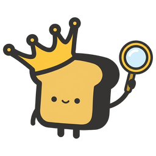
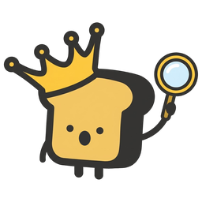

# Toasty's hints

Every hint King Toasty gives (#4680), by its id: the name `hidden_hints`
stores when a user ticks **Hide this hint**. One id is one bubble with one
text. A hint that would say something else in another state is a second hint,
with a condition disjoint from the first. The ids are `HINT_IDS` in
`frontend/src/app/services/hints.service.ts`, and
`tests_lib/meta/test_hints_doc.py` fails when this chart and the code disagree
on the ids or on a hint's Toasty.

**Toasty** is the face the hint shows:
 **happy** for a
next step, 
**surprised** when something needs fixing. No hint uses the **sad** face; that
one is for error toasts.

## Dashboard

At most one at a time: the first row, top to bottom, whose condition holds
(`dashboardHint` in `dashboard.component.ts`). So each row also means "and no
row above it fires". None shows while Add Dataset or New Detector is open, or
while the Dashboard is switching context.

| Hint | Toasty | Fires when |
|---|---|---|
| `add-dataset` |  happy | There are no datasets, and none is importing. |
| `select-dataset` |  happy | There are datasets, but none is selected. |
| `mixed-datasets` |  surprised | The selected datasets hold more than one media type. |
| `add-detector` |  happy | There are no detectors. |
| `select-detector` |  happy | The open detector tab lists detectors, but none is selected. |
| `mismatch` |  surprised | The selected datasets and detectors are not all one media type. |
| `train` |  happy | One detector with no training labels is selected, beside one dataset, so Train is enabled. |
| `test-or-find` |  happy | One trained detector and one dataset are selected, so Test is enabled. |
| `find` |  happy | Several datasets or detectors are selected, all trained, so Find is enabled but Test is not. |

## Train view

| Hint | Toasty | Fires when |
|---|---|---|
| `start-voting` |  happy | Autopilot is running on a detector with no labels, nothing has been voted, and an item is on screen. The first vote ends it. |
| `resort-prompt` |  happy | The **Update Sort Example?** prompt is up, below its dialog: Autopilot is still finding its first positives (**Find Initial Goods**) by a text or media example, and that sort has had ten votes (half as many again after each **Continue**) without enough. Answering the prompt ends it, and so does opening its media picker. |
| `autopilot-done` |  happy | An Autopilot run that started on an untrained detector finishes with every quality light green. The next vote ends it. |
| `autopilot-ran-dry` |  happy | As `autopilot-done`, on a document dataset, where Autopilot finishes when its best matches run dry (16 misses in a row) rather than on the lights. |
| `all-labeled` |  happy | An Autopilot run that started on an untrained detector labels every item before it finishes. The next vote ends it. |
