# VTSearch User Guide

## Contents

1. [What VTSearch does](#what-vtsearch-does)
2. [Loading a dataset](#loading-a-dataset)
3. [The three-panel layout](#the-three-panel-layout)
4. [Autopilot - the guided workflow](#autopilot--the-guided-workflow) *(start here)*
5. [Manual mode - for power users](#manual-mode--for-power-users)
6. [Region voting on images](#region-voting-on-images)
7. [Creating a detector](#creating-a-detector)
8. [Find - scoring and verifying](#find--scoring-and-verifying)
9. [View options](#view-options)
10. [Settings tabs](#settings-tabs)
11. [Dashboard - managing datasets and detectors](#dashboard--managing-datasets-and-detectors)
12. [Browse - exploring a dataset spatially](#browse--exploring-a-dataset-spatially)
13. [Exporting your work](#exporting-your-work)
14. [Importing pre-trained detectors](#importing-pre-trained-detectors)
15. [Achievements](#achievements)
16. [Tips and shortcuts](#tips-and-shortcuts)

---

## What VTSearch does

VTSearch helps you **find the items you care about** inside a large
collection of audio clips, images, text paragraphs, videos, or
documents. You search using a **detector** - a small trained ranker
that scores every item in the dataset by how well it matches what
you're looking for. There are two ways to search:

1. **Train a new detector.** Vote a handful of items **good** or
   **bad** and the detector learns from your votes to rank the
   rest of the dataset. Detectors are reusable - once trained, you can
   save one and re-apply it to any other dataset that shares its **media
   type** *and* a **compatible embedder** (the model that powers search
   and matching), or share it with another VTSearch user. A detector
   only works on a dataset set up with a compatible embedder, so reuse is
   scoped to that pairing rather than to "any future dataset of the same
   media type."
2. **Use an existing detector.** Load one you (or someone else)
   trained earlier and score a fresh dataset with it. No new labeling
   required. Loaded detectors can also be re-trained against the new
   dataset's votes if you want to refine them further.

A natural-language query ("dog barking", "red car in snow") seeds
either flow: VTSearch ranks items by how well they match your words,
giving the detector a useful starting point. This text ranking also
works as a quick stand-alone search when you don't need the precision
of a trained detector.

VTSearch's **Autopilot** drives the training loop for you - picking
which item to show next and when each phase ends - so most users never
need to think about sort modes or selection strategies directly.

<picture>
  <source media="(prefers-color-scheme: dark)" srcset="assets/dashboard-loaded.dark.png" />
  
</picture>

> Screenshots in this guide come in light and dark variants and follow
> your theme automatically - the in-app Help panel shows the one matching
> your current theme, and on GitHub/GitLab the `<picture>` element above
> picks the variant matching your site appearance. They are regenerated by
> the screenshot harness (`scripts/screenshots/refresh.sh`, see
> `docs/plans/user-docs-screenshots.md`), captured against a seeded synthetic
> dataset so they stay reproducible.

---

## Loading a dataset

Click the **+** button on the **Datasets** card to open the **Add Dataset**
dialog. It has three tabs, which boil down to two choices:

<picture>
  <source media="(prefers-color-scheme: dark)" srcset="assets/dataset-panel.dark.png" />
  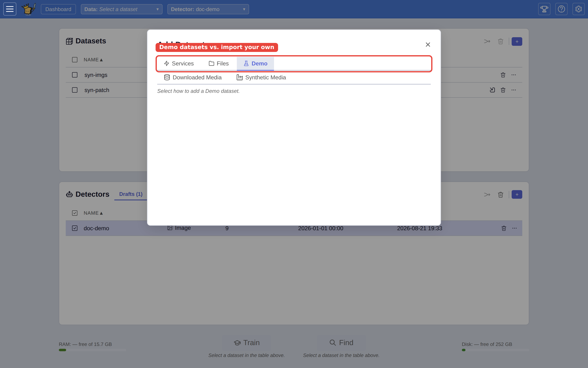
</picture>

- **Demo datasets** (the **Demo** tab) - VTSearch ships with a catalogue of open
  datasets across all five media types (audio, image, text, video,
  document). The demo importer groups them under a **per-media-type tab
  bar**, so you can narrow the catalogue to just audio, just images, and
  so on. Each demo downloads on first use (~15 MB to ~1.2 GB depending on
  dataset) and is cached, so subsequent loads are instant.
- **Import your own** (the **Files** and **Services** tabs) - Load a
  folder of files from the server, a VTSearch pickle file, a zipped HTTP
  archive, or combine several existing datasets. Each importer asks for
  the fields it needs (path, URL, media type) in a small form.

  The **Files → Manifest** importer also accepts a `.npz` archive of
  pre-computed fingerprints so you can import media you have already
  processed offline without doing the work twice. See
  [Pre-computed embeddings (.npz)](#pre-computed-embeddings-npz) below.

The quickest way to try VTSearch with no download is the **🏭 Synthetic
Media** generator on the **Demo** tab, which fabricates images, audio, or
video on the fly:

<picture>
  <source media="(prefers-color-scheme: dark)" srcset="assets/importer-picker.dark.png" />
  
</picture>

Each importer shows a small form for the fields it needs - here, the
Synthetic Media generator's media type and dataset size:

<picture>
  <source media="(prefers-color-scheme: dark)" srcset="assets/importer-form.dark.png" />
  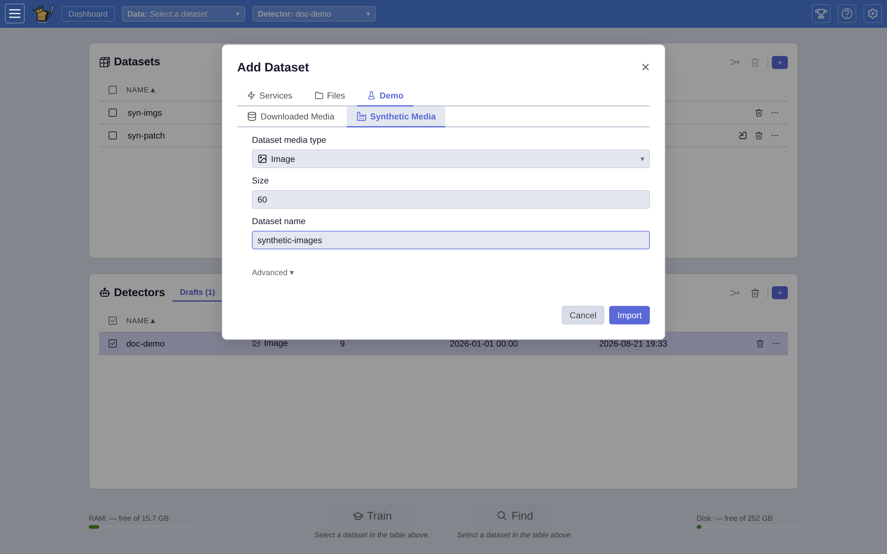
</picture>

### Advanced import options

The file importers expose a collapsible **Advanced** section. The most
important control there is the embedder picker, which is actually a
three-role picker:

- **Embedder** - the main model that powers search and matching for the
  dataset. VTSearch picks a sensible default for each media type.
- **Region embedder (optional)** - a region-aware model that lets you
  vote on parts of an image ([region voting on images](#region-voting-on-images)).
- **Instance embedder (optional)** - a pattern-matching model for
  finding a specific object or logo.

Two more import toggles live nearby:

- **Merge near-duplicates** - in addition to exact duplicates, fold in
  visually/textually near-identical copies (resizes, recompressions,
  trivial edits). VTSearch keeps the largest copy of each group, and
  exporting one member exports the whole group.
- **Reference files in place (don't copy)** - store a path reference to
  each original file on the server instead of copying its bytes in. Saves
  storage, but the dataset then depends on the source files staying put.

Loading a dataset does three things: downloads or reads the media,
analyzes every item with the embedder so it can be searched, and groups
similar items together so VTSearch can later suggest a broad mix.
Progress is shown in a modal while it runs.

If the model for your media type isn't downloaded yet, the first dataset
of that type triggers a one-time download (around 1 GB). Subsequent
datasets of the same type reuse the downloaded model.

### Pre-computed embeddings (.npz)

If you have already embedded your media offline - for example with
your own script using the same model VTSearch uses - you can skip the
server-side re-embedding step by handing VTSearch a NumPy `.npz`
archive of pre-computed vectors. The **Files → Manifest** importer
accepts this: instead of a `.txt`/`.list` paths file, point the
*Paths file* field at a `.npz`. The archive holds both the media-file
paths AND their vectors; VTSearch reads the paths from disk and reuses
the supplied vectors.

VTSearch accepts two NPZ layouts:

1. **`filenames` + `vectors` arrays** - produced by
   `np.savez(path, filenames=names, vectors=vecs)` where `names` is
   a 1-D string array of length *N* and `vecs` is a 2-D float array
   of shape *(N, D)*. The i-th name maps to the i-th row of `vecs`.
2. **Per-key** - produced by
   `np.savez(path, **{name: vec for name, vec in zip(names, vecs)})`.
   Each archive key is a filename; the corresponding value is its
   vector.

The vector dimension and the embedding model must match what
VTSearch would have used (e.g. 512-d CLAP for audio, 768-d SigLIP for
images). Embedding-model selection is **not** persisted inside the
NPZ - the importer's *Embedder* setting still controls which model
is used for any file that doesn't have a pre-computed vector, and
also acts as the model identifier recorded on each media. Pick an
embedder that matches the vectors in your NPZ.

### Archive members, no extraction (WebDataset shards)

Some corpora are too large to unpack. WebDataset-style collections pack
tens of thousands of audio/video chunks inside a handful of multi-GB
`shard_*.tar` (or `.zip`) files - the multivent-raw `videos/` set alone
is **4.1 TB across 667 shards** - so extracting a second on-disk copy
is a non-starter. The **Files → Manifest** importer handles this case too:
point its *Paths file* field at a `.npz` that references members inside
tar/zip shards, and VTSearch loads a chosen subset of those chunks
**without unpacking anything**. The importer auto-detects the archive-member
shape (a manifest with a `members` array) and switches to the
no-extraction path - there is no separate tab or mode to pick. Each
imported media records only `{archive path, member name}` and streams that
single tar/zip member on demand (HTTP Range), so playing a clip transfers a
few seconds of bytes rather than the whole shard. Nothing is written to
disk, and no member data is read at import time - the importer only walks
each referenced shard's tar headers to confirm the member exists and record
its size.

Set the *Dataset MediaType* to the kind of media the referenced members
hold (e.g. `video` or `audio`). Because the manifest supplies the
embeddings, the import needs no GPU and skips the embed stage entirely.

**Manifest schema.** The archive-member `.npz` holds these arrays, one
entry per row:

| Array | Shape | Required | Meaning |
|-------|-------|----------|---------|
| `vectors` (or `embeddings`) | *(N, D)* float | yes | one pre-computed vector per row |
| `members` | *(N,)* string | yes | member name within its archive |
| `archives` | *(N,)* string, or a single value | yes | archive path per row; a scalar is broadcast to every row (one-shard manifests). Relative paths resolve against the manifest's own directory |
| `filenames` | *(N,)* string | no | display names (default: the member's basename) |
| `clip_start` / `clip_end` | *(N,)* float seconds | no | sub-file **clip window** extents; a blank/`NaN` extent means a whole-member row |
| `window_id` | *(N,)* | no | per-window id (default: the clip start) |
| `embedder_name` | scalar string | no | the embedder that produced the vectors |

**Clip windows.** When rows carry `clip_start` / `clip_end`, the *same*
member can appear in several rows as distinct **sub-file clip windows**
(e.g. ≈14 × 10 s CLAP windows per chunk), each becoming its own
searchable media with its own pre-computed vector. Windowed media are
**display-only**: the byte routes always serve the whole member and the
player seeks/loops within `[clip_start, clip_end]` - VTSearch never
slices an AAC/MP4 member server-side. Each window gets a content-id that
folds in the window, so de-duplication, voting, and labels stay unique
per window.

The vector dimension and embedder must match what VTSearch uses for that
media type, exactly as for the [`.npz` manifest importer](#pre-computed-embeddings-npz)
above - pick an *Embedder* (or set `embedder_name` in the manifest) that
matches the vectors you supplied.

---

## The three-panel layout

Once a dataset is loaded, VTSearch shows three panels left to right:

<picture>
  <source media="(prefers-color-scheme: dark)" srcset="assets/three-panel.dark.png" />
  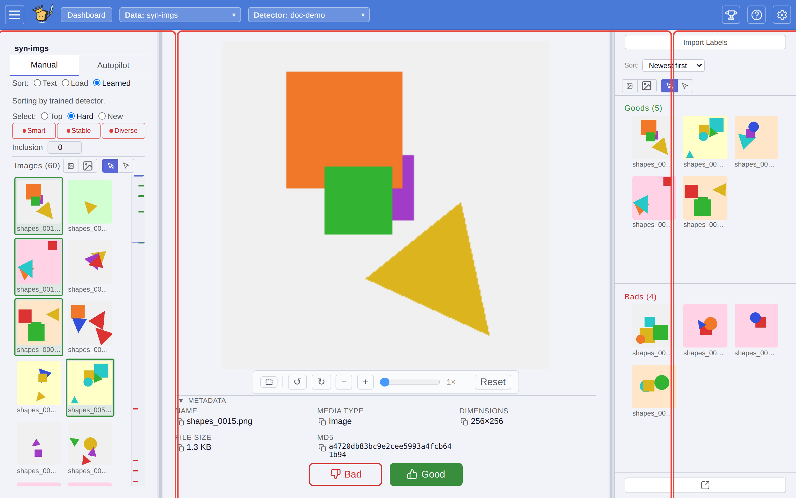
</picture>

- **Left panel** - the sort bar, your selection-strategy controls,
  the inclusion stepper, and the **media list** (ranked by the current
  sort). This is where you pick what to look at next.
- **Centre panel** - the **media viewer**. The selected item plays
  (audio), displays (image, video, text, document page), and offers
  two big vote buttons: **Good** (green) and **Bad** (red).  On
  image datasets whose embedder supports regions - a region-aware or
  pattern-matching embedder - the centre panel also supports **region
  voting** - see "Region voting on images" below.
- **Right panel** - your **vote piles**. Everything you've voted good
  or bad is stacked here, most-recent first, so you can scan your
  work, un-vote, or re-vote.

The dividers between panels can be dragged to resize them. The app
remembers your layout per media type.

---

## Autopilot - the guided workflow

**Start here.** Autopilot is the recommended way to use VTSearch.
Most users should never need Manual mode.

Click the **Autopilot** tab in the left panel. Autopilot breaks
labeling into four phases and tells you what to do at each step.
You still click **Good** or **Bad** on each item shown - Autopilot
just picks *which* items to show you and *when* each phase ends.

<picture>
  <source media="(prefers-color-scheme: dark)" srcset="assets/autopilot-vote.dark.png" />
  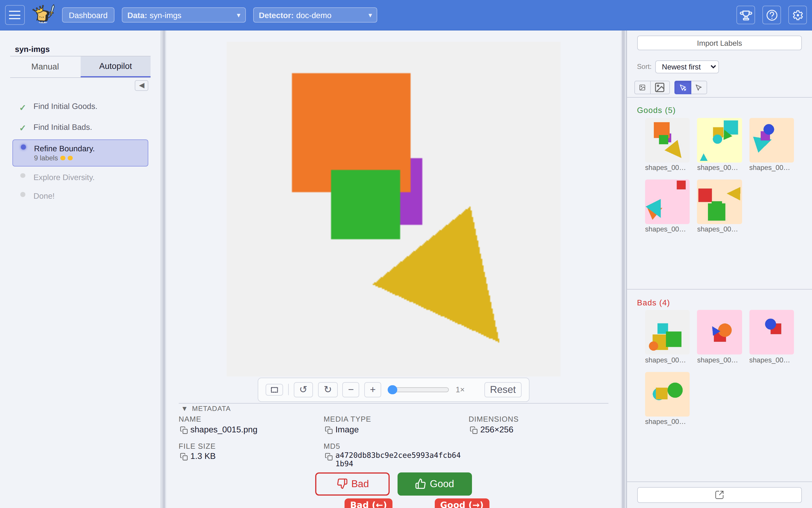
</picture>

### The four phases

The phase panel labels them, in order:

1. **Find Initial Goods.** - Vote some **good** items (default: 3).
   The detector needs good examples before it can learn anything.
   Autopilot offers strong candidates first, using the same text
   ranking the Text sort uses. If you don't see anything good, type
   a text query into the sort bar to jump-start the ranking.
2. **Find Initial Bads.** - Vote some **bad** items (default: 4). Now
   the detector has examples of both what you want and what you don't.
   Autopilot flips to items ranked low, so finding clear bad examples
   is usually quick.
3. **Refine Boundary.** - Autopilot serves items the detector is
   **uncertain about** - the borderline cases it can't yet call
   confidently. Voting these teaches the detector fastest. This phase
   continues until the detector's judgments settle down (the "smart"
   and "stable" indicators in the status bar both turn green).
4. **Explore Diversity.** - Autopilot serves items from parts of the
   dataset the detector hasn't seen yet, so your votes cover a broad
   mix. This catches edge cases the previous phase missed. The phase
   ends when this coverage hits your goal (default: 40).

When all four phases are done, Autopilot shows **Done!**. You can
keep labeling if you want - the detector continues to improve - or
move on to exporting results.

### The collapsed bar

You can collapse Autopilot to a thin strip that just shows the
four phase indicators. Click any active phase to re-pick the
current recommendation (useful if you voted the wrong way and
want a fresh suggestion). Collapsed mode is handy once you're
comfortable with the flow and want more vertical room for the
media list.

<picture>
  <source media="(prefers-color-scheme: dark)" srcset="assets/autopilot-progress.dark.png" />
  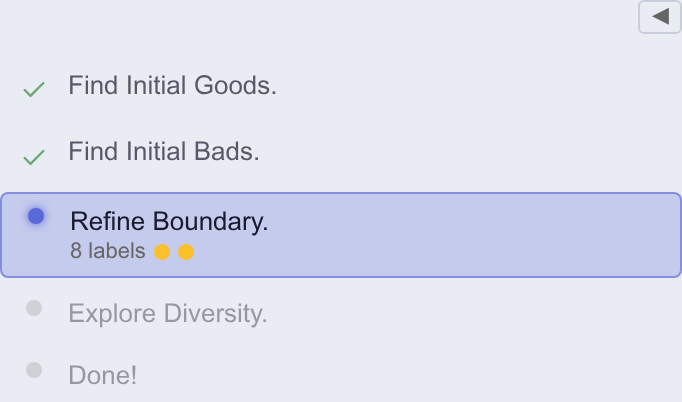
</picture>

### Configuring Autopilot

Most people never touch these, but the **Autopilot** tab in the Settings
modal (gear icon) exposes:

- **# Good to start** - how many good votes phase 1 requires (default 3).
- **# Bad to start** - how many bad votes phase 2 requires (default 4).
- **# Start to re-sort** - how many new votes to collect before the
  detector re-learns and re-ranks during phases 3 and 4 (default 10).
- **Goal Diversity** - how much of your collection phase 4 must cover
  before finishing (default 40).

Raising these numbers trains a more thorough detector at the cost of
more labelling effort. The same tab also has a **Hide autopilot panel**
toggle.

---

## Manual mode - for power users

Manual mode gives you direct control over what the sort bar ranks
by and which unlabeled item is served next. Use it if Autopilot's
defaults don't fit your workflow, you're debugging a weird
ranking, or you want to label under an unusual regime (e.g. pure
diversity sampling with no voting).

The Manual tab shows three control rows above the media list.

<picture>
  <source media="(prefers-color-scheme: dark)" srcset="assets/manual-controls.dark.png" />
  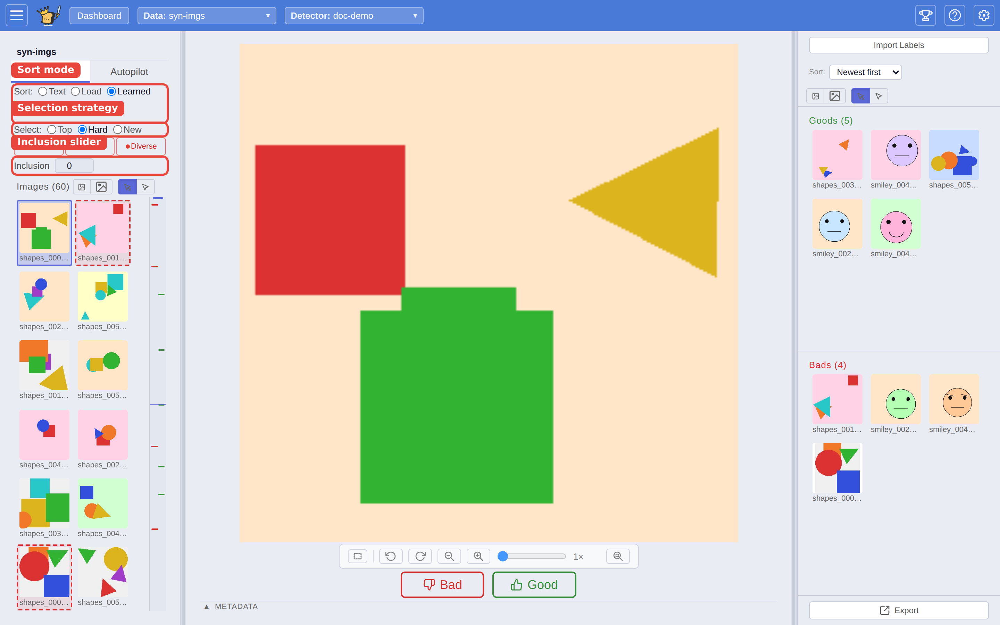
</picture>

### 1. Sort mode

Picks how the left-panel list is ordered. The sort bar offers three
modes, in order: **Text**, **Load**, **Learned**.

- **Text** - Type a natural-language query (e.g. "dog barking",
  "aerial photo of farmland"). Items are ranked by how well they
  match your query.
- **Load** - Apply a previously saved detector. Opens a modal where
  you can **Sort by Detector** (pick a saved detector from the
  registry) or **Sort by Examples** (sort by similarity to one or
  more example media items).
- **Learned** - Trains the detector on your current good/bad
  votes and ranks items by its scores. Needs at least one
  good vote and one bad vote before it works.

You can freely switch modes - votes and the detector persist across
switches.

### 2. Selection strategy

Picks *which unlabeled item* the app highlights next.

- **Top** - Pick the highest-ranked unlabeled item. Best for
  quickly finding strong matches.
- **Hard** - Pick the most borderline item - the one the detector
  is least sure about. These uncertain cases improve the detector fastest.
- **New** - Pick an item from a part of the dataset you haven't
  covered yet. Ensures a broad mix.

Autopilot cycles through these automatically in its four phases,
but in Manual mode you choose directly.

### 3. Inclusion stepper

A numeric stepper from **-10** (strict) to **+10** (lenient),
default 0.

Nudges the detector's good/bad cutoff. Negative values mean "only
call it good if you're very sure" - fewer matches, but the ones you
get are more likely right. Positive values mean "include borderline
items" - more matches, but more of them may be wrong. Changing it
**re-runs the ranking** so the new cutoff takes effect.

Leave at 0 unless you want to deliberately lean toward catching
everything or toward only the surest matches.

---

## Region voting on images

When the dataset's embedder supports regions - a region-aware or
pattern-matching embedder, set when the dataset was created - you can
vote **good** on a *region* of the image instead of the whole image. This
tells the detector "this specific part is what I like", and the learned
sort uses that hint to find similar regions elsewhere in the dataset.

<picture>
  <source media="(prefers-color-scheme: dark)" srcset="assets/region-voting.dark.png" />
  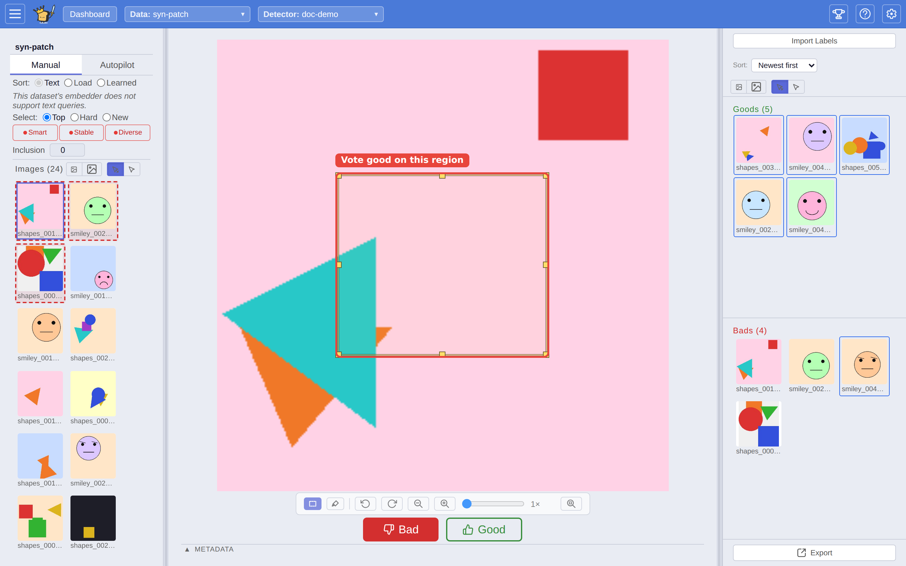
</picture>

The binary vote experience is **unchanged**: `→` is good, `←` is
bad.  Region voting is opt-in via a modifier key and never gets in
the way of fast keyboard voting.

### Drawing a region

There are two ways into region-draw mode:

- **Marquee button** - click the dashed-rectangle toggle in the
  image view controls (below the image, next to Rotate / Zoom).
  While the toggle is on, the cursor stays a crosshair and a normal
  left-drag draws a region.  The toggle persists across items, so
  you can annotate many in a row.  Click the button again to leave
  marquee mode and restore the default pan-on-drag behaviour.
- **`Shift`+drag** - a power-user shortcut that works whether or
  not marquee mode is on.  Hold `Shift` while the focus pane is
  showing an image: the cursor flips to a crosshair and the normal
  pan-on-drag gesture is suppressed.

Either way, **click-drag-release** to draw a rectangle over the
region you want to vote good on.  After release the rectangle shows
8 resize handles plus a draggable body, so you can adjust it.
Then **press `→`** (or click **Good**) to submit a good vote with
the region attached.

The rectangle is stored in *normalised image coordinates* - it
stays anchored to the same pixels of the image even if you zoom in,
pan, or rotate before voting.  A click without dragging (a
zero-area "click") restores the previously drawn rectangle rather
than discarding it.  `Esc` clears the rectangle without voting.

### The Highlight toggle

The image controls also include a **Highlight** toggle ("Highlight:
outline the region the detector matched best"). When on, VTSearch
draws the region the current detector keyed off of for the displayed
item, so you can see *why* it scored the way it did.

### Voting bad while a region is drawn

A `←` press while a region is drawn would normally throw the
rectangle away - and drawing a rectangle is real work, so VTSearch
**asks for confirmation**:

- The rectangle pulses red and a hint banner reads
  *"Press ← again to vote no and discard the box, or Esc to keep
  the box."*
- A second `←` confirms - the no-vote fires and the rectangle is
  discarded.
- `Esc`, clicking on the rectangle, drawing a new one, or
  navigating to the next item all cancel the confirmation and keep
  the rectangle.

There is **no timer** - the confirmation state waits as long as you
need.

### What region voting does to the detector

Region-voted good examples train the detector on the *region* you
drew instead of the full image.  Bad votes are
unaffected - VTSearch already treats every bad vote as "no region
in this image is good" regardless of whether you drew a rectangle.

Region voting is image-only.  Audio, text, video, and document
media types have no region affordance.

---

## Creating a detector

Every search starts from a detector. Click the **+** button on the
**Detectors** card on the Dashboard to open the **New Detector** modal.
It has two tabs:

<picture>
  <source media="(prefers-color-scheme: dark)" srcset="assets/new-detector.dark.png" />
  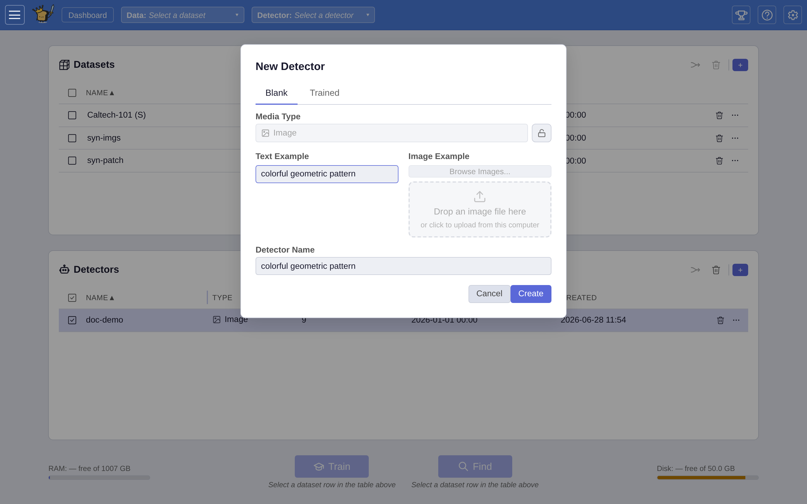
</picture>

- **Blank** - start a fresh detector that learns from your votes as you
  label. Give it a name, and seed it one of two ways: type a short
  **Text Example** ("e.g. dog barking sounds"), or pick one or more
  **media examples** by browsing demos / server folders / uploading
  files. Picked examples stack vertically, each with its own **Remove**
  button; use **+ Add** below the stack to append another. With several
  examples, Autopilot's first sort ranks the dataset against their
  *average* - it surfaces items resembling what the examples have in
  common, and each example is seeded as a Good vote when the detector
  loads. When the active dataset offers more than one kind of embedder, a
  **Detector Embedder Type** picker appears so you can choose which one
  this detector uses: **Semantic**, **Patch Semantic**, or **Structural**.
  That choice fixes what the detector is compatible with later. If the
  dataset's embedder can't search by text, you'll see a note that you can
  still create the detector but must label a few examples to train it.
- **Trained** - create a detector pre-trained on labels imported from an
  external source. It opens a label-importer picker (file, URL, or
  service); pick a source, fill its form, and VTSearch trains the
  detector on the imported labels (the button reads **Create & Import**).

You can also reach the Blank flow with an item pre-selected as the
example via the right-click media context menu's **Use as detector
seed** option (see [Tips and shortcuts](#tips-and-shortcuts)).

---

## Find - scoring and verifying

**Find** scores an entire dataset with a detector and drops you into a
dedicated **three-pane verification view** so you can confirm or correct
the detector's calls before exporting. Start it from the Dashboard:
select a dataset row and a detector row, then click **Find** in the
action bar (VTSearch scores every item, showing progress while it runs).

<picture>
  <source media="(prefers-color-scheme: dark)" srcset="assets/find-view.dark.png" />
  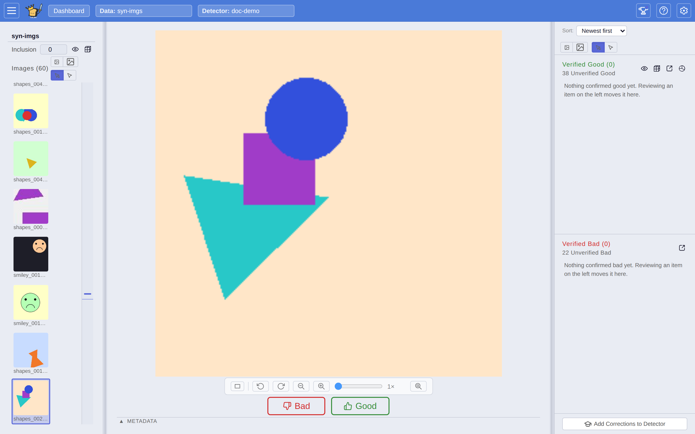
</picture>

- **Left pane** - the **work queue** of items the detector hasn't been
  confirmed on yet, ranked by score, with the same inclusion stepper
  you use while labeling.
- **Centre pane** - the **viewer** with Good / Bad buttons, so you
  verify the current item just like you vote during training.
- **Right pane** - the **Verified Good** and **Verified Bad** piles,
  where confirmed items accumulate.

The verification view's action buttons let you act on the result:

- **To Dataset** - promote the full good set (verified + unverified)
  into its own new dataset.
- **Add Corrections to Detector** - fold the items you changed from the
  detector's call back into the detector's examples and retrain it, so
  the detector gets better at the cases it got wrong.
- **Stats** - open the results modal: a breakdown of the detector's
  calls plus a chart of how wrong matches and missed matches change as
  you adjust inclusion - the clearest way to see the trade-off the
  inclusion stepper controls.
- **Export** - send the good set to clipboard, a file, email, or a
  webhook (see [Exporting your work](#exporting-your-work)).
- **Browse** - open the positive items in the spatial
  [Browse](#browse--exploring-a-dataset-spatially) view.

<picture>
  <source media="(prefers-color-scheme: dark)" srcset="assets/find-stats.dark.png" />
  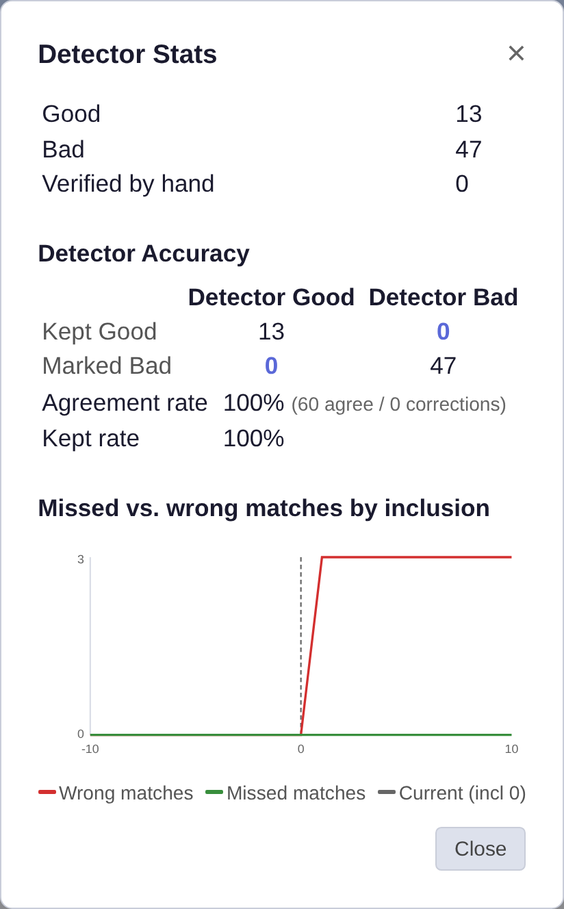
</picture>

---

## View options

The controls above the media list are an inline toolbar (no "View"
button and no separate view-settings modal). It carries just two
controls, remembered per media type:

<picture>
  <source media="(prefers-color-scheme: dark)" srcset="assets/view-options.dark.png" />
  
</picture>

- **Thumbnail size** - the two image icons shrink or grow the
  thumbnails. Larger thumbnails = fewer per screen but more readable.
  After training, the list ranks the thumbnails by the detector's score,
  with a threshold line marking the good/bad cut:

  <picture>
    <source media="(prefers-color-scheme: dark)" srcset="assets/results-grid.dark.png" />
    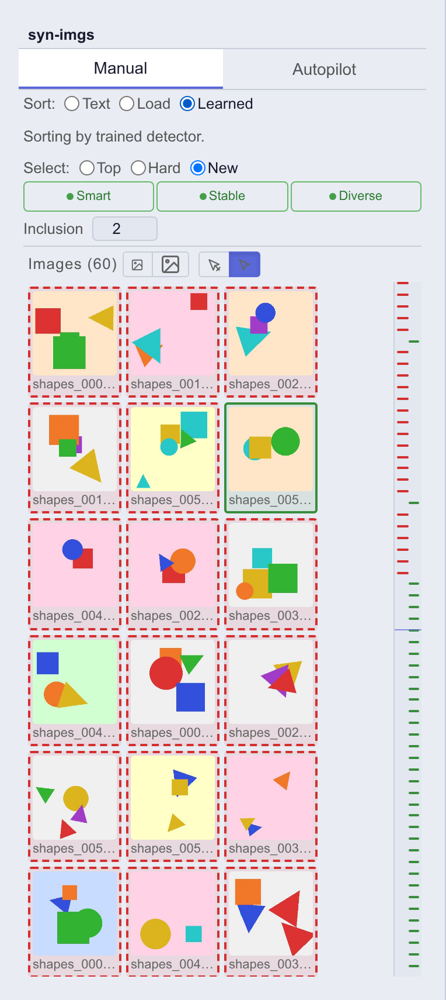
  </picture>
- **Focus mode** - Click-focus means you select an item by
  clicking it. Hover-focus means just moving your cursor over
  an item selects it (faster for scanning, more mis-clicks).

### Solo media type - streamline for one media type

If you only ever work with one kind of media (e.g. you exclusively
search images, optionally pulled in from videos and documents via
the built-in converters), pick that type under the **Import Defaults**
tab in the Settings modal (**Solo media type**). Once set:

<picture>
  <source media="(prefers-color-scheme: dark)" srcset="assets/settings-appearance.dark.png" />
  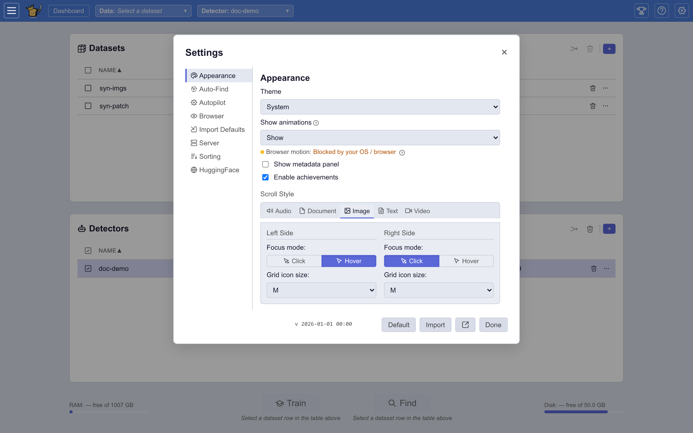
</picture>

- The dataset importer and new-detector dialogs stop asking which
  media type you want - they lock to your chosen type.
- Converter offerings filter to those that produce your type
  (so picking "image" still lets you import videos-as-frames and
  documents-as-pages, just not raw audio).
- Your chosen type's default embedder is warmed at startup so the
  first detector run is fast.

Pick **Show everything** to opt back out. Operators can also pass
`--solo-media-type image` (or any type id) on the command line as a
fallback for new users - anyone who explicitly changes the setting
overrides the CLI value for themselves.

---

## Settings tabs

The Settings modal (gear icon) is organised into eight tabs:

- **Appearance** - theme, animations, the metadata panel, the
  **Enable achievements** toggle, and per-media-type Scroll Style
  (focus mode and thumbnail size).
- **Auto-Find** - detectors that auto-run on import, and what exporter
  to send their results to.
- **Autopilot** - the guided-workflow knobs described under
  [Configuring Autopilot](#configuring-autopilot).
- **Browser** - per-media-type look of the spatial Browse view (tile
  shape, colour scheme, cell size), plus a **Graphics** control that
  applies to every media type. Leave Graphics on **Auto** and VTSearch
  picks for you: browsers without hardware acceleration get the cheaper
  animations automatically. Choose **Reduced** if panning or zooming the
  map still feels laggy - every animation keeps playing, but the costly
  effects (image smoothing during motion, drop shadows) are dropped.
  **Full** always uses the richest animations.
- **HuggingFace** - sign in with HuggingFace to download gated demo
  datasets and gated AI models.
- **Import Defaults** - default embedder, clipper, and converters per
  media type, plus the **Solo media type** picker.
- **Server** - read-only settings fixed when the server started and
  shared by everyone.
- **Sorting** - options that control how the trained ranking behaves.

---

## Dashboard - managing datasets and detectors

The Dashboard is your inventory view. Two tables stacked vertically
with bulk-action and per-card controls.

<picture>
  <source media="(prefers-color-scheme: dark)" srcset="assets/dashboard-manage.dark.png" />
  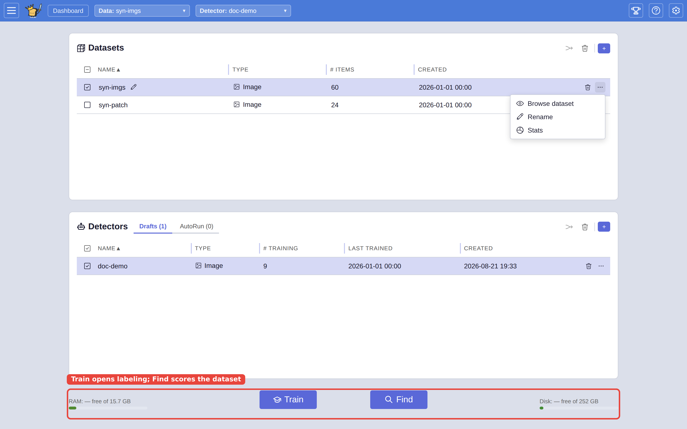
</picture>

- **Datasets** - every dataset on the server. Each row shows
  **Type**, **# Items**, **Created**, **Age-Off**, **Creator**, and
  **Readers**. A row that isn't in memory shows an inline **Load**
  button, which disappears once the dataset is loaded. The name has a
  pencil for **Rename**, **Delete** is an inline button, and the
  remaining actions (**Browse**, **Stats**, and - on multi-user
  deployments - access controls) live behind a **⋯** overflow menu.
- **Detectors** - every saved detector. Like datasets, the name carries
  a **Rename** pencil and **Delete** is inline; the **⋯** overflow menu
  holds the rest, including **Import Labels** (import labels into this
  detector) and **Export**.

The **+** button on each card creates a new dataset (the Add Dataset
dialog) or a new detector (the [New Detector](#creating-a-detector)
modal).

**Bulk actions.** Each table has a header **select-all** checkbox and,
once you've selected rows, **Combine selected datasets** / **Combine
selected detectors** and **Delete selected** buttons - so you can merge
or clean up several at once. See
[Combining datasets and detectors](#combining-datasets-and-detectors).

**Starting a labeling session:** click a dataset row and a detector
row to select them, then click the **Train** button in the action
bar below the two tables. That opens the three-panel labeling view
against your selection.

**Scoring a dataset:** select a dataset and a detector, then click
**Find** in the action bar to open the verification view (see
[Find - scoring and verifying](#find--scoring-and-verifying)).

You can keep multiple datasets and multiple detectors loaded at once.
Loading just pulls them into memory; the Train / Find buttons work
on whichever rows you currently have selected.

### Combining datasets and detectors

Selecting two or more rows and clicking **Combine selected datasets**
merges them into a single new dataset; **Combine selected detectors**
likewise merges detectors (pooling their votes). This is handy for
stitching together work that started out split across several imports.

---

## Browse - exploring a dataset spatially

Open Browse from a dataset row's **⋯** overflow menu (**Browse
dataset**) to get a bird's-eye map of the whole collection. VTSearch
arranges every item on a two-dimensional map - similar items land near
each other - and renders it as a pannable, zoomable density map.

<picture>
  <source media="(prefers-color-scheme: dark)" srcset="assets/browse-view.dark.png" />
  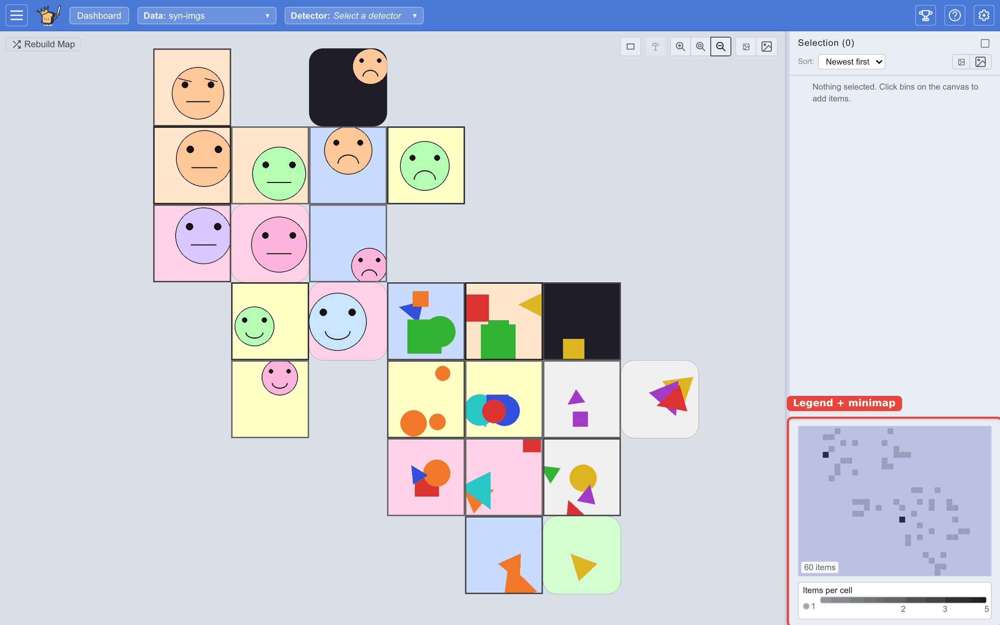
</picture>

Browse is a way to *see
the shape* of a dataset - where the clusters are, how big they are, what
sits between them - without training anything. It never votes, trains, or
scores; it's a pure explorer.

The first time you browse a dataset, VTSearch builds the map (a
progress bar shows the work). The layout is cached on the dataset, so
later visits open instantly.

### Reading the map

Each tile aggregates the items that landed in that part of the
map, and its **colour encodes how many** items are there - denser
regions are brighter. The **legend** on the right decodes the colour
scale; the **minimap** above it shows where your current view sits within
the whole map.

Hovering a tile previews a representative item from that region:

- **Audio** clips play on a loop while you hover (browsers need one
  click anywhere on the page first to unlock audio playback).
- **Images, text, video, and documents** show a thumbnail or snippet in
  a popup anchored to your cursor.

### Navigating

The control cluster at the bottom-left of the canvas gives you:

- **Zoom in / Zoom to fit / Zoom out** - or drag to pan and scroll to
  zoom directly on the canvas.
- **Thumbnail size** - smaller or bigger tiles.
- **Region select** - the dashed-rectangle toggle (or `Shift`+drag) lets
  you drag a box to select every item inside it.

The tiles are **squares** for media with browsable thumbnails (images,
video, documents) so the thumbnails pack edge-to-edge, and **hexagons**
for audio and text, where the tile is a density cell rather than a
picture. The shape is chosen automatically from the dataset's media type -
there's nothing to set.

Top-left, **Rebuild map** shuffles the items into a fresh layout
(handy when a cluster lands somewhere awkward). To return to the
inventory, use the **Dashboard** button in the top bar.

### Selecting items

Click a tile (or drag a region) to add its items to the **Selection**
panel on the right. The panel lists what you've picked - sortable by
recency, name, or ID - and clicking any entry drops it from the
selection. **Clear** empties the whole selection. This is how you carve
a region of interest out of a large collection by eye.

Browse can also open **scoped to a Find result**: after scoring a dataset
you can map just the matched items and use **Verified Good** /
**Verified Bad** to lasso and prune wrong matches before exporting.
(See [Find](#find--scoring-and-verifying).)

---

## Exporting your work

From the Labeling or Find view, the right panel's **Export** button
saves your current labels. Formats (by their display names):

<picture>
  <source media="(prefers-color-scheme: dark)" srcset="assets/export-picker.dark.png" />
  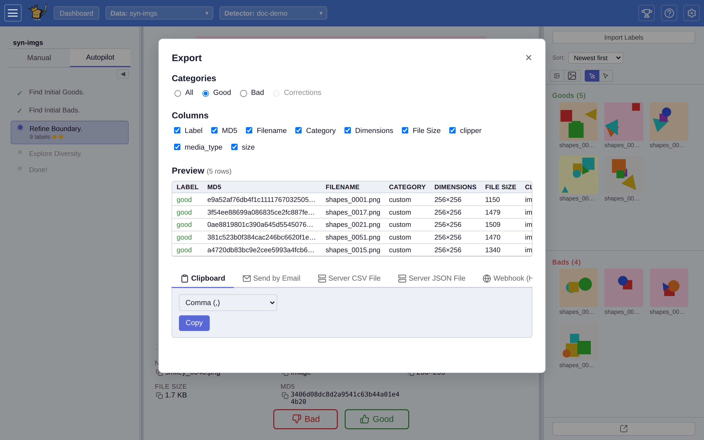
</picture>

- **Server JSON File** - saves a JSON file on the server.
- **Server CSV File** - same, but CSV.
- **Webhook (HTTP POST)** - POSTs the result to a URL you configure.
- **Send by Email** - emails the result if SMTP is configured.
- **Display Results** and **Holder Package** are also available for
  on-screen review and for bundling the matched media into a package.

The exporter also offers a **Clipboard** copy. It copies a
column-selected, delimited table (a header row plus one line per item),
not a raw JSON list - the default columns are **Label**, **MD5**,
**Filename**, and **Category**, and you can pick which columns and which
delimiter to use.

You can also export a **detector** from the Detectors dashboard
(the **Export** overflow item) - useful for sharing a trained detector
with another VTSearch instance.

---

## Importing pre-trained detectors

Two ways to bring in existing work:

<picture>
  <source media="(prefers-color-scheme: dark)" srcset="assets/import-detector.dark.png" />
  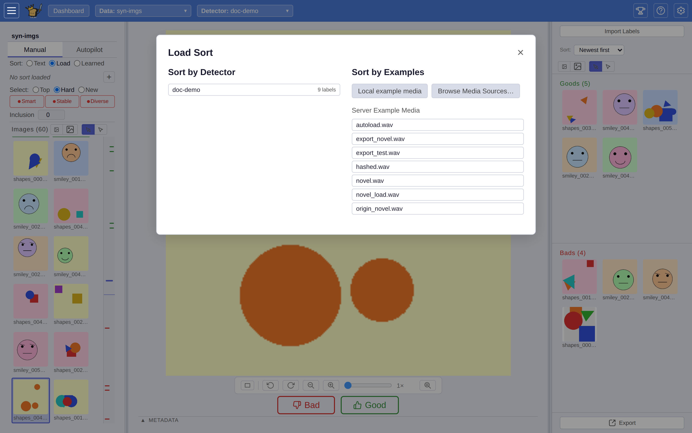
</picture>

- **Labels** - the right panel's **Import Labels** button (also the
  detector card's **Import Labels** overflow item) opens a label-importer
  picker - a server-driven list of import sources, each with its own
  small form - that populates your vote piles from the chosen source.
  Useful for continuing labelling across sessions or merging work from
  multiple labellers.
- **Detectors** - the **Load** sort mode's **Sort by Detector** option
  lists the saved detectors already in the registry, so you can score a
  fresh dataset with one without retraining. (There is no separate
  detector-file upload step in the labeling UI; detectors come in via the
  registry and via [Find](#find--scoring-and-verifying).)

---

## Achievements

VTSearch has an optional light gamification layer. When **Enable
achievements** is on (Settings → Appearance), a **trophy button**
appears; click it to open the **Achievements** panel, which lists the
achievements and your tier progress on each. As you use the app, hitting
a milestone fires a small **unlock toast**.

<picture>
  <source media="(prefers-color-scheme: dark)" srcset="assets/achievements.dark.png" />
  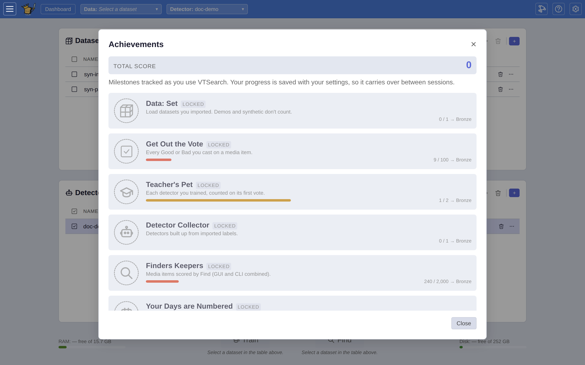
</picture>

A few achievements unlock via a **code phrase** rather than usage: docs
(like this guide) hide a phrase, and pasting it into the panel's code box
("Paste a code phrase") and clicking **Submit** unlocks the matching
achievement. The footer line of this guide is one such phrase.

Turning **Enable achievements** off zeros all counters and tier progress
and hides the trophy button and unlock pop-ups until you turn it back on.

---

## Tips and shortcuts

- **Top-bar dataset/detector pulldowns.** The pulldowns in the top bar
  let you switch the active dataset or detector without going back to the
  Dashboard, and offer an "Add New" shortcut to create one.
- **Keyboard shortcuts and the in-app guide.** Press **`?`** any time to
  open the help sheet. It has two tabs: a **Keyboard shortcuts**
  reference and a **User guide** that renders this document inside the
  app (matching your theme).
- **Right-click a media item** for a context menu: **Sort by similarity
  to this**, **Crop, then sort by similarity…** (audio/image), **Use as
  detector seed**, and **Crop, then use as detector seed…**. The crop
  options open the **crop modal**, where you trim an image region or
  audio span before using the item as a sort example or detector seed.
- **The Autopilot resort prompt.** When you sort by an example and then
  move on, VTSearch may ask whether to update the sort to your new
  example (**Update Sort Example?**) or **Keep Current**.
- **Drag-and-drop upload.** Importer file fields are drop zones - drag
  files (or a folder) onto them instead of clicking to browse.
- **Login-gated deployments.** Some servers ask for your name on first
  load before you can start.
- **Offline banner.** If the app can't reach the server, a banner reads
  "Can't reach the server. Background updates are paused." with a
  **Retry** button.
- **Toasts.** Transient confirmations and errors appear as toast
  notifications in the corner.

---

*Readme Reader code phrase:* `label like nobody's watching`
