<!-- This file is served raw at GET /api/achievements/docs/user_guide/raw and
     its footer phrase is hash-matched against _DOCS_RAW in
     vtsearch/achievements_catalog.py. Don't remove or reword the "Readme
     Reader code phrase" line without updating achievements_catalog.py to
     match. See CLAUDE.md. -->

# VTSearch User Guide

## Contents

1. [What VTSearch does](#what-vtsearch-does)
2. [Step by step: your first search](#step-by-step-your-first-search) *(start here)*
3. [How-to guides: one task at a time](#how-to-guides-one-task-at-a-time)
4. [Loading a dataset](#loading-a-dataset)
5. [The three-panel layout](#the-three-panel-layout)
6. [Autopilot: the guided workflow](#autopilot-the-guided-workflow)
7. [Manual mode: for power users](#manual-mode-for-power-users)
8. [Region voting on images](#region-voting-on-images)
9. [Creating a detector](#creating-a-detector)
10. [Testing a detector](#testing-a-detector)
11. [View options](#view-options)
12. [Settings tabs](#settings-tabs)
13. [Dashboard: managing datasets and detectors](#dashboard-managing-datasets-and-detectors)
14. [Browse: exploring a dataset spatially](#browse-exploring-a-dataset-spatially)
15. [Exporting your work](#exporting-your-work)
16. [Importing pre-trained detectors](#importing-pre-trained-detectors)
17. [Achievements](#achievements)
18. [Tips and shortcuts](#tips-and-shortcuts)

---

## What VTSearch does

VTSearch helps you **find the items you care about** inside a large
collection of audio clips, images, text paragraphs, videos, or
documents. You search using a **detector** - a small trained ranker
that scores every item in the dataset by how well it matches what
you're looking for. There are two ways to search:

1. **Train a new detector.** Vote a handful of items **good** or
   **bad** and the detector learns from your votes to rank the
   rest of the dataset. Detectors are reusable - once trained, you can
   save one and re-apply it to any other dataset that shares its **media
   type** *and* a **compatible embedder** (the model that powers search
   and matching), or share it with another VTSearch user. A detector
   only works on a dataset set up with a compatible embedder, so reuse is
   scoped to that pairing rather than to "any future dataset of the same
   media type."
2. **Use an existing detector.** Load one you (or someone else)
   trained earlier and score a fresh dataset with it. No new labeling
   required. Loaded detectors can also be re-trained against the new
   dataset's votes if you want to refine them further.

A natural-language query ("dog barking", "red car in snow") seeds
either flow: VTSearch ranks items by how well they match your words,
giving the detector a useful starting point. This text ranking also
works as a quick stand-alone search when you don't need the precision
of a trained detector.

VTSearch's **Autopilot** drives the training loop for you - picking
which item to show next and when each phase ends - so most users never
need to think about sort modes or selection strategies directly.

<picture>
  <source media="(prefers-color-scheme: dark)" srcset="assets/dashboard-loaded.dark.webp" />
  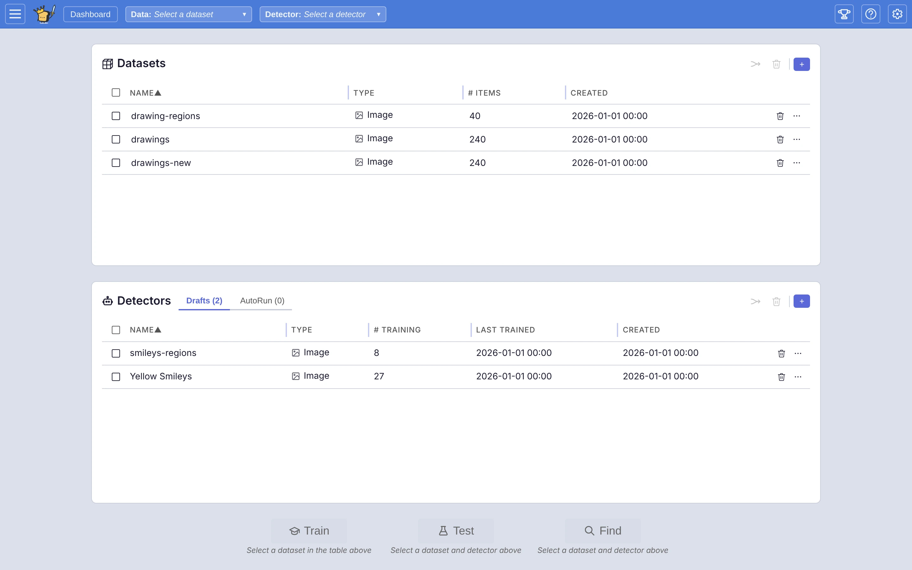
</picture>

> Every screenshot in this guide follows one example: a few hundred cartoon
> drawings - faces in every colour and mood, piles of shapes, busy little
> scenes - and a detector that learns to find the **yellow smiley faces**
> among them. VTSearch draws the pictures itself, so you can make the very
> same ones and follow along (see
> [Step by step](#step-by-step-your-first-search)). Screenshots come in light
> and dark variants and follow your theme automatically - the in-app Help
> panel shows the one matching your current theme, and on GitHub/GitLab the
> `<picture>` element above picks the variant matching your site appearance.

### Matches, the line, precision and recall

A trained detector gives every item a **score** and ranks the dataset by
it, best match first. It also draws a **line** through that ranking (the
*threshold*): items at or above the line are its **matches**, and items
below it are not. Everything that acts on "the matches" acts on exactly the
items above the line: the *Unverified Good* count in Test, **To Dataset**,
**Export**, **Browse**, and the exports an AutoFind detector sends.

Two numbers describe how good a set of matches is:

- **Precision** - of the items the detector returns, the share that really
  are what you are looking for. At 80% precision, 8 in every 10 returned
  items are right.
- **Recall** - of all the items in the dataset that really are what you are
  looking for, the share the detector returns. At 80% recall it found 8 in
  every 10 of them.

The two trade off against each other. Moving the line down the ranking
returns more items, so recall goes up, but the extra items are the ones the
detector is least sure of, so precision usually goes down. Moving the line
up does the reverse. Moving the line never changes the ranking itself: the
same items stay in the same order. Which way to lean depends on what you
will do with the results. If you will read every match, lean toward
precision; if missing one is the costly mistake, lean toward recall.

In the Test view, the Test autopilot measures both on the collection in
front of you: **Right** is the likely share of what the line keeps that is a
match, and **Found** the likely share of all the matches it keeps, each from
random picks you voted on rather than from the detector's own guess (see
[Testing a detector](#testing-a-detector)).

#### How close the line got

A detector draws its line at a **Threshold**: which of the two mistakes it
leans toward. You set it at the top of the left panel, on a spectrum from
**False Positives** to **False Negatives** with three radio buttons under
it (see [Threshold](#3-threshold)). Toward False Positives the line returns
the most, with more wrong ones in it; toward False Negatives it returns only
the surest, and misses more. You pick it when you create the detector (the
New Detector form starts on your last pick, the middle radio until you have
one), and Autopilot, which has no Threshold of its own, draws the line there.
Moving it later in Manual or Test changes it for that detector only. Each
radio is a **balance** of precision and recall - how many wrong items you
will take in the results against how many right ones you will accept
missing - and the line is drawn where that balance is best: the middle radio
weighs the two mistakes equally, the False Positives radio counts a miss as
the dearer mistake, the False Negatives radio a wrong item. (For the
statisticians: the three are F-beta at 4, 1 and 1/4.)

The line is where your labels put it. VTSearch holds out each of your votes
in turn, scores it with a detector that never saw it, and learns from those
scores how high a match and how high a non-match tend to score. It then
estimates how common matches are in the collection in front of you, and
draws the line where the balance your radio asks for is best for a
collection like that. The line keeps every item above it that you haven't
voted on - as many as clear it, and on a collection with nothing like your
target, few or none. Nothing caps it at a fixed number. Because the line comes
from your labels, it travels with them: export the detector, run it on
another collection, and VTSearch draws the line the same way there.
Until you **check** the items above the line, nothing has measured how much
of them is right or how much of what is there they found, and the note under
the Threshold says so: **Top 32 kept, unchecked** (or however many it kept).

**The spot check.** In Train, click **Check 5 picks** beside the note.
VTSearch cuts the list you haven't voted on into bands from the top (the top
8, the next 8, then 16, 32, 64, and so on), draws 5 items at random from a
band, and shows them one at a time. Vote each one Good or Bad with the usual
keys: → for Good, ← for Bad, and ↓ to go back and change one. The last vote
of a round sends it, and the check moves to the next band. Test offers no
spot check: it is where you test the Threshold you set here, not where you set it.

**When your labels still overlap**, a check is worth doing now rather than
later. If the detector scores your Good and Bad answers close together, the
check button turns into the highlighted **Check 5 picks** and a note under the
Threshold says your labels still overlap. A check's picks, spread evenly down
the list, are exactly the answers that show the detector where its line falls.
Autopilot runs the check itself at that point, once it has started learning
from your answers, and asks again 25 answers later if your labels still
overlap. Measured on COCO, sessions whose labels overlap returned far fewer
wrong pictures and found more right ones for the same number of clicks.

<picture>
  <source media="(prefers-color-scheme: dark)" srcset="assets/floor-check.dark.webp" />
  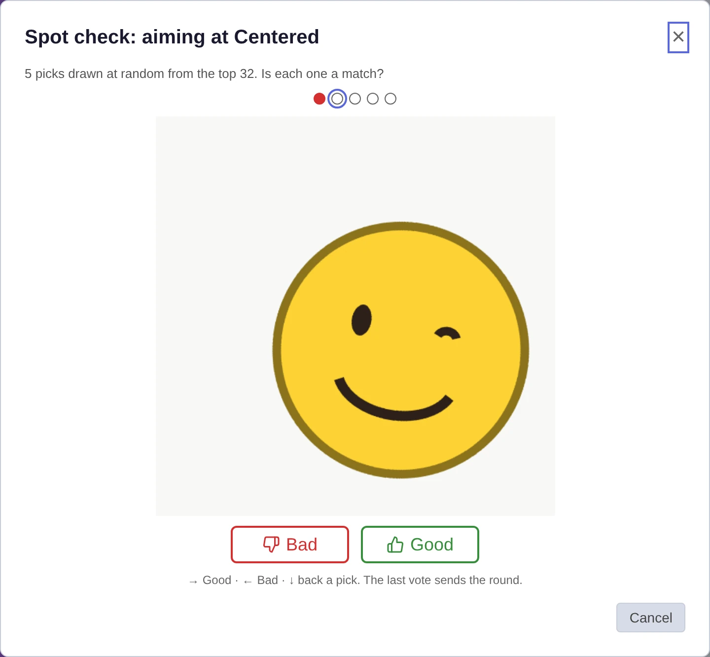
</picture>

The picks come in the order they were drawn, which is random, with no rank
and no score. They are a sample from the band, not the top of the list. A
round is 5 picks from one band, whatever the radio.

The check **walks** the list. It starts with the top bands (the top 32 on
the middle and False Negatives radios, the top 128 on False Positives), one
round each. Once those are in, it weighs the
picks by the size of their bands to estimate how many of the set are right,
reads that against the detector's own count of how many matches the whole
list holds to estimate how many it found, and scores the set on the balance
your radio asks for. While a longer list scores better, the check says
**Better so far: checking the next 32** and draws from the next band down;
the first time a longer list scores worse it says **Past the peak: checking
a shorter list** and steps back without drawing again. It ends on the set
where the balance peaked, or at either end of the list: on a long list of
good matches that can be hundreds, on a short or sparse one as few as 8.
**The check does not move the line**: it measures, and your picks become
votes that the next retrain learns from like any other, but the line stays
where your labels put it. The check's last screen says what it found -
**Checked the top 48: likely 55–80% right, about half of them found (checked
15).** and **The line keeps its 30, where your labels put it: the check
informs the line and does not move it. The ranges are what the picks say
about the top 48.** - and the note under the Threshold then shows the same
result:

- **Checked · likely 55–80% right, about half of them found (checked 15) ·
  30 kept** - the check measured the top 48, and the line keeps 30. The
  range is how much of the checked set is likely right; the phrase after it
  is how much of what the list holds that set likely found (**few of them**,
  **about a quarter**, **about half**, **about three quarters** or **nearly
  all of them**). Hovering the note says which set the check measured. The note names no cause for a poor result: a dataset with very few
  matches and a detector that can't yet tell them apart look the same from
  here.

**The likely range** says how much of the set the line keeps is probably
right. It comes from your picks alone, never from the detector's own guess:
each band's picks bound that band, and the bands are weighed by their size.
With 5 picks a band it is wide; that width is the honest answer to "how
close did we get?". The **found** phrase is the rougher of the two: it reads
the same picks against the detector's own estimate of how many matches the
list holds, which is the one thing the picks cannot measure. The check
decides where to stop on the picks' plain share, so the range says how sure
the picks are, and the count says where the balance peaked. The Test view does
not show this range: there the Test autopilot measures the line on the
collection you are testing, and its result pane draws its own ranges.

**A range measures the list as it was when you checked it.** Your check
votes are ordinary votes, so they train the detector like any other. Later
votes retrain it, and the line moves with what your labels now say, so the
items at the line change. The range stays on screen as it
was, and hovering it says it was measured before your later votes. **Check**
again for a fresh one: a check needs something to have changed since the
last, and any vote does that. A check belongs to the radio it was run on:
move to another radio and the line is unchecked there until you check it
too; move back and the earlier check shows again.

Cancelling or closing the check leaves the Threshold as it was. The rounds you
finished stay as votes.

Everything that uses the matches works on the line in every state: the
*Unverified Good* count, Test's review walk, **To Dataset**, **Export**
and **Browse** all act on the items above it. An AutoFind or command-line run
has nobody to vote, so it can't be checked: it exports the line your labels
draw for that collection and records it as unchecked, with a line in the run's log and a
`balance` entry beside the threshold in exports that carry the full results
(see [the command-line guide](../CLI.md#auto-detect-run-detectors-on-a-dataset)).

---

## Step by step: your first search

This walkthrough assumes VTSearch is already running and open in your
browser; if it isn't, see [SETUP.md](../SETUP.md) (or ask whoever runs
your server for its address).

Four steps take you from a folder of pictures to a detector that finds what
you are looking for in pictures it has never seen. The red numbers in each
screenshot show where to click, in order.

The example uses two folders of drawings: `drawings` to train the detector
on, and `drawings-new`, a second set that shares no drawing with the first,
to run the finished detector over. Any two folders of your own work the same
way, whether they hold photos, audio, text, video or documents.

**No data of your own?** The drawings come from VTSearch's own
**Synthetic Media** demo, so you can make the very same ones. In Steps 1
and 3, use the **Demo** tab of the same dialog instead of **Files**: pick
**Synthetic Media**, set **Size** to 240, and set **Seed** to 1 for the
training set (Step 1) and to 2 for the new one (Step 3). Name them `drawings`
and `drawings-new` to match the screenshots. Everything else is the same.

### Step 1: Load a training dataset

On the dashboard, click the **+** <picture><source media="(prefers-color-scheme: dark)" srcset="assets/icon-add-dataset.dark.webp" />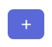</picture> at the top right of the
**Datasets** card. In the **Add Dataset** dialog:

1. Click the **Files** tab.
2. Click **Folder**.
3. Type the path of your folder on the server, or click **Browse** to find
   it. VTSearch looks inside, picks the media type it finds there (here,
   *Image*) and names the dataset after the folder.
4. Click **Import**.

<picture>
  <source media="(prefers-color-scheme: dark)" srcset="assets/step-import-train.dark.webp" />
  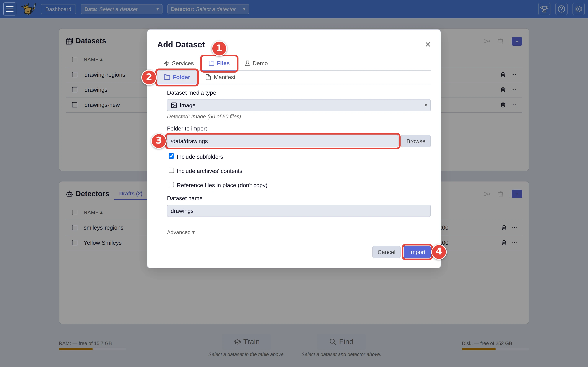
</picture>

The dataset appears on the **Datasets** card. VTSearch works out a
fingerprint for every item as it imports them, which takes a minute or two
for a few hundred pictures on an ordinary computer. For the other ways to
bring data in, including ready-made demo datasets that need no data of your
own, see [Loading a dataset](#loading-a-dataset).

### Step 2: Make a detector and train it

Click the **+** <picture><source media="(prefers-color-scheme: dark)" srcset="assets/icon-new-detector.dark.webp" /></picture> at the top right of the **Detectors** card. In
the **New Detector** dialog:

1. Describe what you are looking for, in a word or a phrase:
   `yellow smiley face`.
2. Give the detector a name: `Yellow Smileys`.
3. Click **Create**.

<picture>
  <source media="(prefers-color-scheme: dark)" srcset="assets/step-new-detector.dark.webp" />
  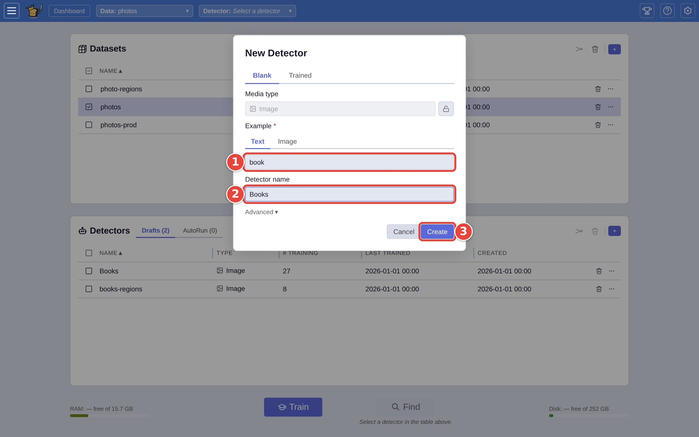
</picture>

The description only gives the detector somewhere to start:
`yellow smiley face` puts the yellow faces first, but it is not sure which
of them are smiling. From here on, your answers teach it. Back on the
dashboard:

1. Tick the training dataset (`drawings`).
2. Tick the new detector (`Yellow Smileys`).
3. Click **Train** <picture><source media="(prefers-color-scheme: dark)" srcset="assets/icon-train.dark.webp" /></picture>.

<picture>
  <source media="(prefers-color-scheme: dark)" srcset="assets/step-train.dark.webp" />
  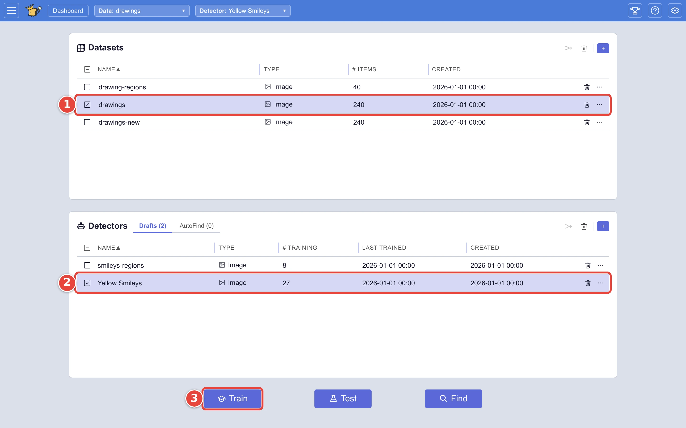
</picture>

VTSearch opens the labeling view, and Autopilot shows you one picture at a
time. For each one:

1. Click **Good** <picture><source media="(prefers-color-scheme: dark)" srcset="assets/icon-good.dark.webp" />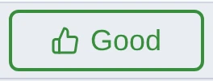</picture> (or press `→`) if it is what you are looking for.
2. Click **Bad** <picture><source media="(prefers-color-scheme: dark)" srcset="assets/icon-bad.dark.webp" />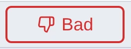</picture> (or press `←`) if it is not.
3. Your answers collect in the right panel, which starts folded to a thin
   strip: click the strip to open it (see
   [The three-panel layout](#the-three-panel-layout)). The detector retrains
   after every one, and Autopilot picks the next picture from what it has just
   learned.

<picture>
  <source media="(prefers-color-scheme: dark)" srcset="assets/step-vote.dark.webp" />
  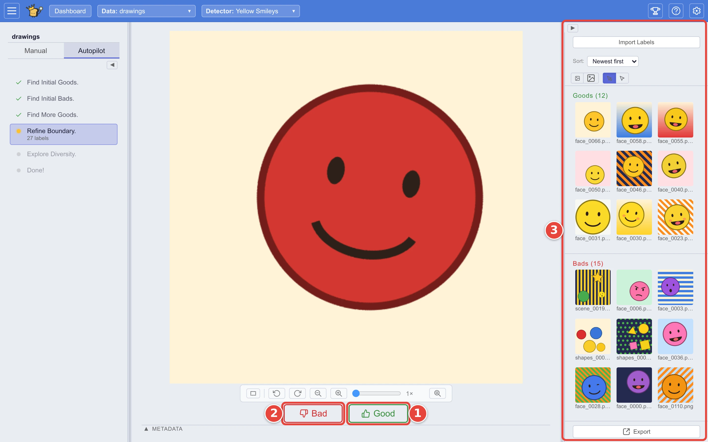
</picture>

Answer the hard cases too. A yellow face that is frowning, or an orange one
that is smiling, is exactly the kind of picture Autopilot will ask about, and
whether it counts as a yellow smiley is your call: the detector learns where
*you* draw the line. Twenty or thirty
answers is usually enough, and the phase list on the left shows how far
along you are (see [Autopilot](#autopilot-the-guided-workflow)).

### Step 3: Load a test dataset

Load the pictures you want to search the same way as in Step 1, but point
the **Folder** importer at the second folder (`drawings-new` here). The
detector never saw any of these pictures while you were training it.

<picture>
  <source media="(prefers-color-scheme: dark)" srcset="assets/step-import-test.dark.webp" />
  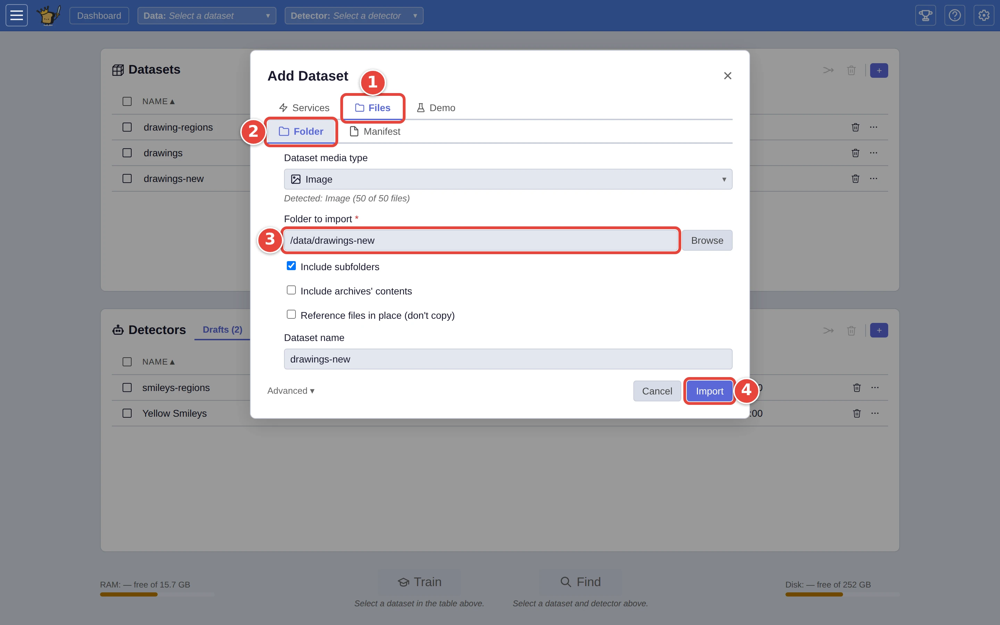
</picture>

### Step 4: Test the detector on the new dataset

Back on the dashboard:

1. Tick the new dataset (`drawings-new`).
2. Tick the trained detector (`Yellow Smileys`).
3. Click **Test** <picture><source media="(prefers-color-scheme: dark)" srcset="assets/icon-find.dark.webp" /></picture>.

<picture>
  <source media="(prefers-color-scheme: dark)" srcset="assets/step-find.dark.webp" />
  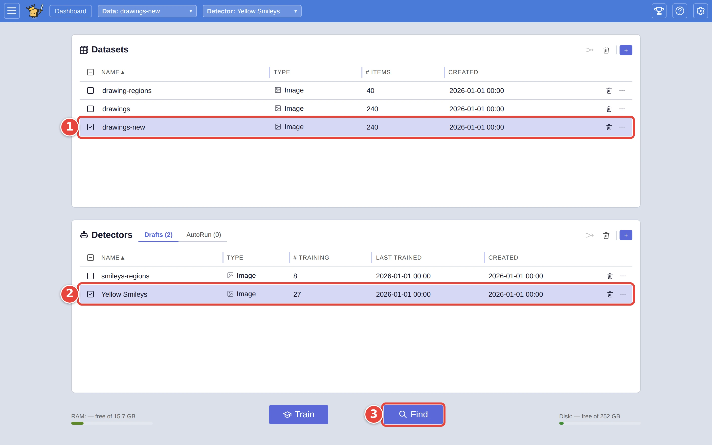
</picture>

Test scores every picture in the dataset and opens on its **Autopilot**
tab, which tests the detector's line: it shows you pictures picked at random
from either side of the line, you answer each with **Good** or **Bad**, and
the result on the right says how much of what the detector would ship is
likely right and how many of the real matches it likely found. Click until
**Done!**; a few dozen answers is usual. The result panel opens on its own
then, if you have not opened it already. Then open the **Review** tab for the
results in full:

1. The pictures, best match first. How many the detector calls a match (the
   pictures above its line), and how many it doesn't, is counted on the right
   as *Unverified Good* and *Unverified Bad*.
2. Click any picture to look at it, and confirm or correct the detector
   with **Good** or **Bad**. Checking is optional; the test's picks are
   already checked.
3. The pictures you check collect in **Verified Good** and **Verified Bad**.
4. **Export** sends the matches - checked or not - to a file, the
   clipboard, an email and more (see
   [Exporting your work](#exporting-your-work)).

<picture>
  <source media="(prefers-color-scheme: dark)" srcset="assets/step-find-results.dark.webp" />
  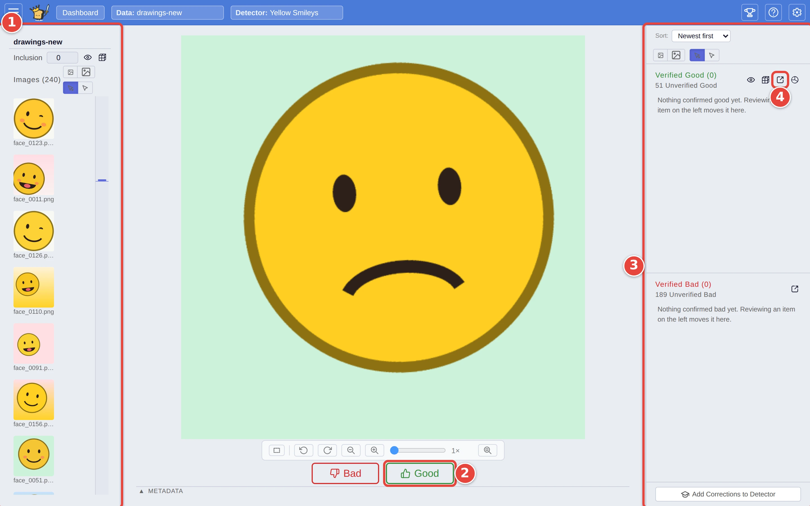
</picture>

That is the whole loop. Once you trust the detector, the **Find** button
beside **Test** runs it on new datasets without a test: tick the detectors
and the datasets, and click **Find**. Or move the detector to the
**AutoFind** tab, and it runs on every dataset you import (see
[Running AutoFind on a new dataset](#running-autofind-on-a-new-dataset)).

The [how-to guides](#how-to-guides-one-task-at-a-time) below take each next
step the same way, one task at a time; the rest of this guide covers each
part of VTSearch in more depth.

---

## How-to guides: one task at a time

Each of these pages walks through one more job, click by click, on the same
drawings and the same `Yellow Smileys` detector as
[Step by step](#step-by-step-your-first-search). Do that first: every page
picks up where it leaves off.

**Test a detector and use its matches**

- [Check and correct a detector's calls](howto/check-and-correct.md): verify
  the pictures near the line and hand your corrections back to the detector.
- [Catch the borderline matches](howto/borderline-matches.md): review the
  pictures either side of the line, and move the **Threshold** toward
  **False Positives** to let more in.
- [Decide how far to trust a detector](howto/trust-a-detector.md): read the
  test result's trust checks, which say which calls it is qualified to make.
- [Send your matches somewhere](howto/export-matches.md): export to the
  clipboard, a file or another website, or keep them as a dataset.

**Other ways to build a detector**

- [Start a detector from an example picture](howto/start-from-an-example.md):
  show it what you want instead of describing it.
- [Point at the part of the picture that matters](howto/vote-on-a-region.md):
  vote on a region of an image.
- [Get Autopilot unstuck](howto/unstick-autopilot.md): when it can't find
  matches to start from.
- [Label in Manual mode](howto/label-in-manual-mode.md): choose the sort and
  the next picture yourself.

**Reuse and automate detectors**

- [Move a detector to another VTSearch](howto/move-a-detector.md): export its
  answers and rebuild it elsewhere.
- [Add labels you already have](howto/import-labels.md): import answers from a
  CSV file.
- [Run your detectors on new pictures from the command line](howto/autofind-from-the-command-line.md):
  **AutoFind** and `--autodetect`.
- [Combine datasets or detectors](howto/combine.md): merge several into one.

**Explore and manage your data**

- [Explore a dataset with Browse](howto/explore-with-browse.md): the whole
  dataset as a map, and a tested detector's matches on it.
- [Check what's in a dataset or a detector](howto/check-a-dataset.md): their
  **Stats**.
- [Choose how a dataset is imported](howto/advanced-import.md): the
  **Advanced** import options, and watching an import run.
- [Load a ready-made demo dataset](howto/load-a-demo.md): the **Downloaded
  Media** catalogue.
- [Save and restore your settings](howto/save-your-settings.md): export them to
  a file and load them again.

---

## Loading a dataset

Click the **+** <picture><source media="(prefers-color-scheme: dark)" srcset="assets/icon-add-dataset.dark.webp" /></picture> button on the **Datasets** card to open the
**Add Dataset** dialog. Its top row of tabs is one tab per *category* of source; picking a
category shows the importers in it as a second row of tabs, and picking an
importer shows its form underneath. Both rows stay on screen, so switching
sources is always one click away.

<picture>
  <source media="(prefers-color-scheme: dark)" srcset="assets/dataset-panel.dark.webp" />
  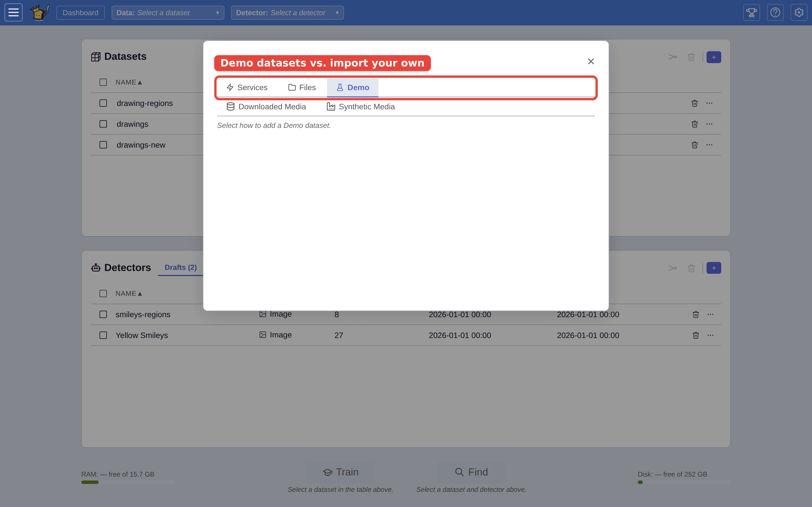
</picture>

VTSearch ships two populated categories, which boil down to two choices:

- **Demo datasets** (the **Demo** tab) - two importers, neither of which
  needs data of your own:
  - **Downloaded Media** - a catalogue of open datasets across all five
    media types (audio, image, text, video, document), narrowed by a
    **per-media-type dropdown** so you can filter to just audio, just
    images, and so on. Each demo downloads on first use (from a few MB
    to over 10 GB depending on the dataset and size; see
    [the demo catalogue](../demos.md)) and is cached, so subsequent loads
    are instant.
  - **🏭 Synthetic Media** - fabricates images, audio, or video on the
    fly. This is the quickest way to try VTSearch, since nothing is
    downloaded at all. Its images are the cartoon faces, shapes and scenes
    this guide's screenshots are taken on. **Seed** picks which set it
    makes: the same seed always makes the same media, and two seeds make two
    sets with nothing in common - one to train a detector on and one it has
    never seen.
- **Import your own** (the **Files** tab) - two importers, both reading
  from the **server's** filesystem (VTSearch has no browser-side upload
  importer; media must already be somewhere the server can see):
  - **Folder** - browse the server's filesystem and import a directory of
    media files, or an archive to unpack.
  - **Manifest** - point at a `.txt`/`.list` file of media paths. It also
    accepts a `.npz` archive of pre-computed fingerprints, so you can
    import media you have already processed offline without doing the work
    twice (see [Pre-computed embeddings (.npz)](#pre-computed-embeddings-npz)),
    and a `.npz` that references members inside tar/zip shards, which
    imports them without unpacking anything (see
    [Archive members, no extraction (WebDataset shards)](#archive-members-no-extraction-webdataset-shards)).

There is also a **Services** tab, which is an extension point rather than a
feature: it is where an installed plugin's service importers appear (a
corporate media archive, a third-party search API). Nothing in the stock
install registers one, so on a default deployment the tab reads *"No
importers in this category."* See `docs/EXTENDING-plugins.md` if you want to
add one.

The **Downloaded Media** catalogue is a table: pick a media type from the
dropdown, click the dataset you want to choose it, then click **Import**.
Each row carries a readiness badge: **Ready** (cached and analysed),
**Needs setup** (cached, but still to be analysed with the embedder you
chose) or **Needs Download**. See [Load a ready-made demo dataset](howto/load-a-demo.md).

<picture>
  <source media="(prefers-color-scheme: dark)" srcset="assets/importer-picker.dark.webp" />
  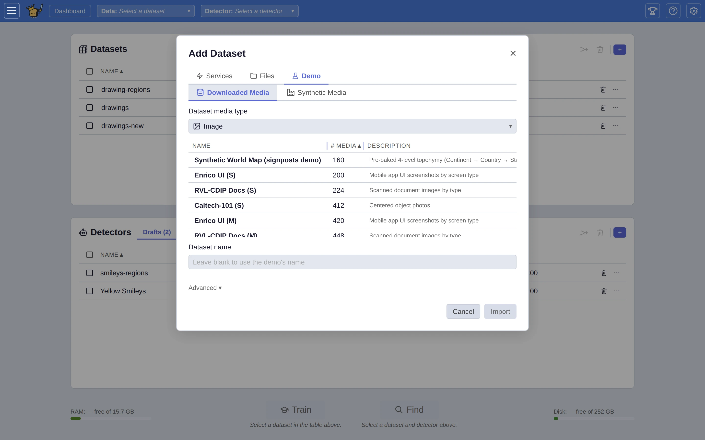
</picture>

Every other importer shows a small form for the fields it needs. The
**Folder** importer takes a path on the server, and its **Browse** button
opens a file browser on the server's disk so you can click your way to the
folder instead of typing it:

<picture>
  <source media="(prefers-color-scheme: dark)" srcset="assets/importer-form.dark.webp" />
  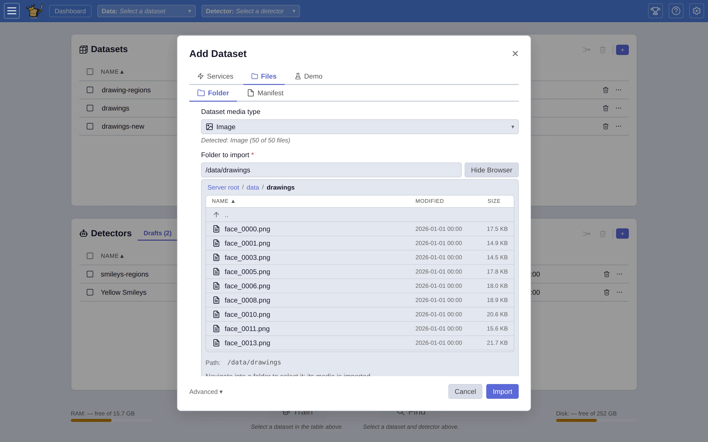
</picture>

### Advanced import options

Every importer exposes a collapsible **Advanced** section, opened by the
**Advanced ▾** toggle at the bottom left of the dialog, beside **Cancel**. It
starts collapsed and *nothing* inside it renders until you open it - not even a
control whose value differs from the default; hover the **Advanced** toggle
and its tooltip names a non-default embedder, clipper or cleanup in effect. The most important
control there is the embedder picker, which is actually a three-role picker:

- **Embedder** - the main model that powers search and matching for the
  dataset. VTSearch picks a sensible default for each media type.
- **Region embedder (optional)** - a region-aware model that lets you
  vote on parts of an image ([region voting on images](#region-voting-on-images)).
- **Instance embedder (optional)** - a pattern-matching model for
  finding a specific object or logo.

The rest of the Advanced section, and one toggle on the importer's own
form:

- **Include media** - which source media types feed the dataset. The
  dataset's own type is included directly; other types are pulled in and
  converted (images out of videos, pages out of documents).
- **Convert to** - on the **Demo** importer, whose dataset is fixed:
  which type to convert the demo's media into on load (scanned documents
  into page images, say). The equivalent choice on the other importers is
  *Include media* above.
- **Clipper** - a pre-processing pass applied before each item is
  analyzed, e.g. cutting long audio into shorter segments. On most importers
  it is the **Details ▸** button beside each media type under *Include
  media*; **Downloaded Media**, which has no *Include media*, shows it as its
  own control.
- **Cleanup** - optional passes that strip content-free regions from each
  item just before it's analyzed, so the analysis isn't spent on them.
  They're independent; tick any combination.
- **Build Browse map now** - build the spatial
  [Browse](#browse-exploring-a-dataset-spatially) map (and its region
  signposts) during import instead of the first time you open Browse.
  Costs time up front, opens instantly later.
- **Merge near-duplicates** - in addition to exact duplicates, fold in
  visually/textually near-identical copies (resizes, recompressions,
  trivial edits). VTSearch keeps the largest copy of each group, and
  exporting one member exports the whole group.
- **Reference files in place (don't copy)** - on the **Folder** and
  **Manifest** importer forms (not under Advanced): store a path reference
  to each original file on the server instead of copying its bytes in.
  Saves storage, but the dataset then depends on the source files staying
  put.

Loading a dataset does three things: downloads or reads the media,
analyzes every item with the embedder so it can be searched, and groups
similar items together so VTSearch can later suggest a broad mix.
The dialog closes when you click **Import**, and progress is shown in a row
at the top of the **Datasets** card, with a **Cancel** button, while it runs
(see [Choose how a dataset is imported](howto/advanced-import.md)).

If the model for your media type isn't downloaded yet, the first dataset
of that type triggers a one-time download (around 1 GB). Subsequent
datasets of the same type reuse the downloaded model.

### Multi-Dataset import: several datasets from one folder

A folder (or archive) often holds more than one kind of media: photos, the
PDFs that go with them, a few recordings. Each kind needs its own dataset,
and importing the folder once per kind means reading it once per kind. Tick
**Multi-Dataset**, the box above the *Dataset media type* dropdown on the
**Folder**, **Manifest**, **Local Folder** and **Local Files** importers (and
on any Services importer that lists a media type), and the dropdown gives way
to a **Datasets to make** list: one row per kind of media, each a dataset of
its own. The folder is read once; every ticked row becomes a dataset named
after the import and the kind (`holiday – Image`, `holiday – Document`), with
its own row on the Dashboard while it loads, its own **Cancel**, and its own
AutoFind run.

- Rows are pre-ticked from what the folder scan finds; tick or untick as you
  like. **Document** makes an image dataset of the rendered pages (or, under
  its **Details ▾**, extracted text); **Face** makes a dataset of the faces
  cropped out of the images, so it has no files of its own to find.
- Each ticked row's **Details ▾** opens that dataset's own Advanced settings
  (*Include media*, embedders, clipper, cleanup), in place of the dialog's
  single **Advanced ▾** toggle. *Build Browse map now* and *Merge
  near-duplicates* apply to every dataset of the import and sit once, under
  the list.
- **Dataset name** becomes the shared base name; leave it blank for the
  folder's name.

Cancelling one row while the folder is still being read stops that dataset
alone; the others carry on. The **Downloaded Media** importer has no
Multi-Dataset box: a demo is one dataset of one kind.

### Running AutoFind on a new dataset

Once you have a detector on the Dashboard's **AutoFind** tab, every
importer shows a **Run AutoFind detectors on this dataset** checkbox
(outside **Advanced**). Ticked, VTSearch runs your AutoFind detectors on
the dataset as soon as it is saved - the ones for the dataset's media
type, provided the dataset has the kind of embedder each one scores
with. The dialog remembers the box the way you left it at your last
import.

The run shows on the new dataset's Dashboard row while it works, and its
**Cancel** stops it. When it finishes, a notice tells you how many hits
it found; its **View results** button opens the **Find Results**
dialog, which lists every item each detector called Good (switch to
**Bad** or **Both** to see the rest), copies the list to the clipboard,
and **Export**s the listed rows to any exporter. If you picked a results
exporter on the Settings **AutoFind** tab, the run has already sent the
results there too. If none of your AutoFind detectors can run on the new
dataset - they are all for another media type, or were built with a kind
of embedder the dataset doesn't have - a notice says so instead.

To run AutoFind on a dataset you already have - to try a detector you
just moved to AutoFind, say - pick **Run AutoFind** from the dataset's
**⋯** menu. It loads the dataset if it isn't loaded, runs the same
detectors, and says when it is done with the same notice an import's run
gives, its **View results** button a click away. AutoFind is the
unattended path, the app's twin of the
[command line's](howto/autofind-from-the-command-line.md) run, so it opens
nothing on its own; to look through the hits as soon as they land, use
**Find** below. The item is greyed out when none of your AutoFind
detectors are for that dataset's media type.

To run detectors of your choosing instead - drafts included, without
moving them to the AutoFind tab - tick them and the datasets to run them
on, and click the big **Find** button in the Dashboard's action bar,
beside **Train** and **Test**. It is enabled once at least one dataset
and one detector are ticked, all of one media type, and every ticked
detector is trained. Unlike Test, which takes exactly one dataset and one
detector, it uses every ticked row:
each ticked dataset gets its own run with every ticked detector, loading
first if it isn't loaded, and shows on its own row. The first run to
finish opens the Find Results dialog; any that finish while the
dialog is open announce themselves with a **View results** notice
instead, so none of them is lost. The dialog's **Browse** button opens
the listed items - the Good ones, or whichever side you switched to - in
[Browse](#browse-exploring-a-dataset-spatially), laid out as a map of their own;
**&larr; Back** there brings you back to the Dashboard with the results
open again. While the dialog is open, the server starts building the map
of the Good results whenever it has nothing else to do, so Browse often
opens straight away. Like every AutoFind, the runs also go to your Settings
**AutoFind** exporter when you have picked one.

### Pre-computed embeddings (.npz)

If you have already embedded your media offline - for example with
your own script using the same model VTSearch uses - you can skip the
server-side re-embedding step by handing VTSearch a NumPy `.npz`
archive of pre-computed vectors. The **Files → Manifest** importer
accepts this: instead of a `.txt`/`.list` paths file, point the
*Paths file* field at a `.npz`. The archive holds both the media-file
paths AND their vectors; VTSearch reads the paths from disk and reuses
the supplied vectors.

VTSearch accepts two NPZ layouts:

1. **`filenames` + `vectors` arrays** - produced by
   `np.savez(path, filenames=names, vectors=vecs)` where `names` is
   a 1-D string array of length *N* and `vecs` is a 2-D float array
   of shape *(N, D)*. The i-th name maps to the i-th row of `vecs`.
2. **Per-key** - produced by
   `np.savez(path, **{name: vec for name, vec in zip(names, vecs)})`.
   Each archive key is a filename; the corresponding value is its
   vector.

The vector dimension and the embedding model must match what
VTSearch would have used (e.g. 512-d CLAP for audio, 768-d SigLIP for
images). Embedding-model selection is **not** persisted inside the
NPZ - the importer's *Embedder* setting still controls which model
is used for any file that doesn't have a pre-computed vector, and
also acts as the model identifier recorded on each media. Pick an
embedder that matches the vectors in your NPZ.

### Archive members, no extraction (WebDataset shards)

Some corpora are too large to unpack. WebDataset-style collections pack
tens of thousands of audio/video chunks inside a handful of multi-GB
`shard_*.tar` (or `.zip`) files - the multivent-raw `videos/` set alone
is **4.1 TB across 667 shards** - so extracting a second on-disk copy
is a non-starter. The **Files → Manifest** importer handles this case too:
point its *Paths file* field at a `.npz` that references members inside
tar/zip shards, and VTSearch loads a chosen subset of those chunks
**without unpacking anything**. The importer auto-detects the archive-member
shape (a manifest with a `members` array) and switches to the
no-extraction path - there is no separate tab or mode to pick. Each
imported media records only `{archive path, member name}` and streams that
single tar/zip member on demand (HTTP Range), so playing a clip transfers a
few seconds of bytes rather than the whole shard. Nothing is written to
disk, and no member data is read at import time - the importer only walks
each referenced shard's tar headers to confirm the member exists and record
its size.

Set the *Dataset media type* to the kind of media the referenced members
hold (e.g. `video` or `audio`). Because the manifest supplies the
embeddings, the import needs no GPU and skips the embed stage entirely.

**Manifest schema.** The archive-member `.npz` holds these arrays, one
entry per row:

| Array | Shape | Required | Meaning |
|-------|-------|----------|---------|
| `vectors` (or `embeddings`) | *(N, D)* float | yes | one pre-computed vector per row |
| `members` | *(N,)* string | yes | member name within its archive |
| `archives` | *(N,)* string, or a single value | yes | archive path per row; a scalar is broadcast to every row (one-shard manifests). Relative paths resolve against the manifest's own directory |
| `filenames` | *(N,)* string | no | display names (default: the member's basename) |
| `clip_start` / `clip_end` | *(N,)* float seconds | no | sub-file **clip window** extents; a blank/`NaN` extent means a whole-member row |
| `window_id` | *(N,)* | no | per-window id (default: the clip start) |
| `embedder_name` | scalar string | no | the embedder that produced the vectors |

**Clip windows.** When rows carry `clip_start` / `clip_end`, the *same*
member can appear in several rows as distinct **sub-file clip windows**
(e.g. ≈14 × 10 s CLAP windows per chunk), each becoming its own
searchable media with its own pre-computed vector. Windowed media are
**display-only**: the byte routes always serve the whole member and the
player seeks/loops within `[clip_start, clip_end]` - VTSearch never
slices an AAC/MP4 member server-side. Each window gets a content-id that
folds in the window, so de-duplication, voting, and labels stay unique
per window.

The vector dimension and embedder must match what VTSearch uses for that
media type, exactly as for the [`.npz` manifest importer](#pre-computed-embeddings-npz)
above - pick an *Embedder* (or set `embedder_name` in the manifest) that
matches the vectors you supplied.

---

## The three-panel layout

Once a dataset is loaded, VTSearch shows three panels left to right:

<picture>
  <source media="(prefers-color-scheme: dark)" srcset="assets/three-panel.dark.webp" />
  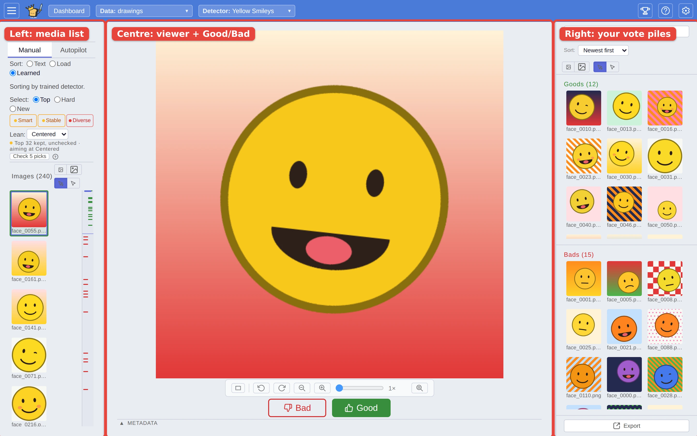
</picture>

- **Left panel** - the sort bar, your selection-strategy controls,
  the Threshold, and the **media list** (ranked by the current
  sort). This is where you pick what to look at next.
- **Centre panel** - the **media viewer**. The selected item plays
  (audio), displays (image, video, text, document page), and offers
  two big vote buttons: **Good** <picture><source media="(prefers-color-scheme: dark)" srcset="assets/icon-good.dark.webp" /></picture> (green) and **Bad** <picture><source media="(prefers-color-scheme: dark)" srcset="assets/icon-bad.dark.webp" /></picture> (red).  On
  image datasets whose embedder supports regions - a region-aware or
  pattern-matching embedder - the centre panel also supports **region
  voting** - see "Region voting on images" below.
- **Right panel** - your **vote piles**. Everything you've voted good
  or bad is stacked here, most-recent first, so you can scan your
  work, un-vote, or re-vote.

The dividers between panels can be dragged to resize them. The app
remembers your layout per media type.

Train and Test open with both side panels **folded** to a thin strip, so the
item in the middle has the room. The left one folds on the **Autopilot** tab
only (Manual and Review are driven from its list); the right one folds on
every tab. Click a strip, or drag its divider out, to open the panel, and the
small ◀ / ▶ at the top of an open panel folds it again. Each side remembers
your choice; **Hide left panel in Train and Test** and **Hide right panel in
Train and Test**, in the Settings modal's Appearance tab, set it too. A test
that reaches **Done!** opens its result panel on its own.

---

## Autopilot: the guided workflow

**Start here.** Autopilot is the recommended way to use VTSearch.
Most users should never need Manual mode.

Click the **Autopilot** tab in the left panel. Autopilot breaks
labeling into five phases and tells you what to do at each step.
You still click **Good** or **Bad** on each item shown - Autopilot
just picks *which* items to show you and *when* each phase ends.

<picture>
  <source media="(prefers-color-scheme: dark)" srcset="assets/autopilot-vote.dark.webp" />
  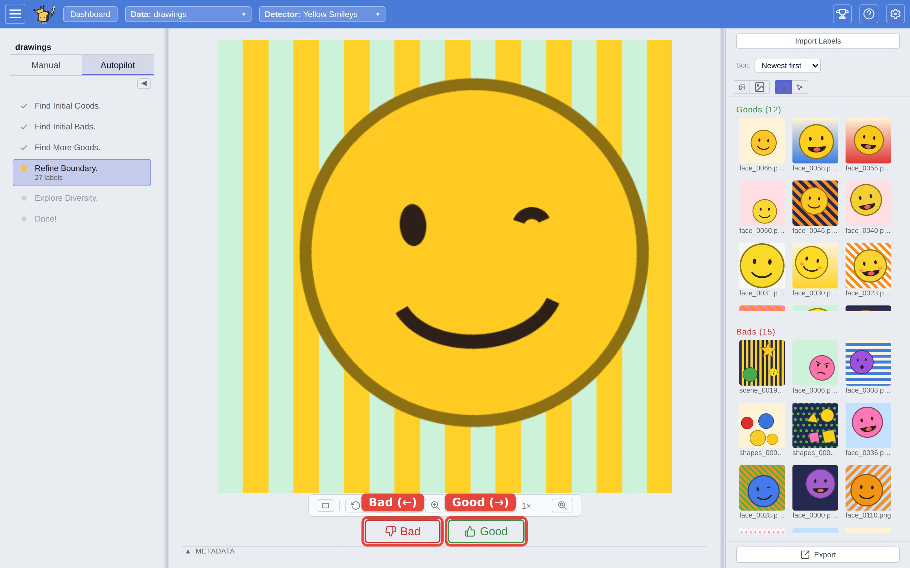
</picture>

### The five phases

The phase panel labels them, in order:

1. **Find Initial Goods.** - Vote some **good** items (default: 3).
   The detector needs good examples before it can learn anything.
   Autopilot offers strong candidates first, using the same text
   ranking the Text sort uses. If you don't see anything good,
   Autopilot eventually offers to change what it sorts by; you can also
   find a few matches yourself on the **Manual** tab (see
   [Get Autopilot unstuck](howto/unstick-autopilot.md)).
2. **Find Initial Bads.** - Vote some **bad** items (default: 4). Now
   the detector has examples of both what you want and what you don't.
   Autopilot flips to items ranked low, so finding clear bad examples
   is usually quick.
3. **Find More Goods.** - Autopilot goes back to the best text matches
   and keeps offering them while they keep turning up goods: until you
   have 20 goods, or until 16 matches in a row were not good. More goods
   early make a noticeably better detector later. While this phase runs
   the detector is still learning, so it catches up with (and then
   passes) the old, shorter opening after about 50 votes.
4. **Refine Boundary.** - Autopilot serves items the detector is
   **uncertain about** - the borderline cases it can't yet call
   confidently. Voting these teaches the detector fastest. This phase
   continues until the detector's judgments settle down (the "smart"
   and "stable" indicators in the status bar both turn green).
5. **Explore Diversity.** - Autopilot serves items from parts of the
   dataset the detector hasn't seen yet, so your votes cover a broad
   mix. This catches edge cases the previous phase missed. The phase
   ends when this coverage hits your goal (default: 40).

The current phase carries one light that shows how close it is to done.
It starts as a **red** circle, turns **yellow** once the phase is past
halfway, and becomes a **green check** when the phase is finished, at
which point Autopilot moves on to the next one; every finished phase
keeps its check. For the three Find phases, halfway is half the
vote target (2 of 3 goods, 10 of 20); for Refine Boundary the light
shows whichever of the smart and stable indicators is further behind;
for Explore Diversity it is half the coverage goal. Hover the light for
the details.

When all five phases are done, Autopilot shows **Done!** and Toasty
appears under the top bar's **Dashboard** button to say the detector is
trained: keep voting and it keeps improving (your next vote sends Toasty
away), or click **Dashboard** to export it or run it over another dataset.
Nothing happens on its own, and the hint only appears for the run that
trained the detector - coming back later to refine it further will not
raise it again. If you label every item before then, Toasty says so instead
and points you back to the Dashboard. When you open the Train view on a
detector with no labels yet, Toasty also stands over the **Good** / **Bad**
buttons until your first vote. See [Toasty's hints](#toastys-hints).

Once **Done!** is reached it stays checked, and a seventh step, **Keep
Improving.**, takes over for as long as you keep labeling. It is
optional. Its light shows whichever of the smart, stable and span
indicators is furthest behind, and its line says what Autopilot is
offering now. A new vote can knock an indicator off green for a while
as the detector takes it in; Autopilot then goes back to borderline
items (**Showing boundary items**) or a broad mix (**Showing diverse
items**) until it recovers, but the panel does not drop back to Refine
Boundary.

### Document collections stop on a dry run

On a collection of document pages, where a detector finds logos and
stamps by matching their shape, Autopilot has four phases instead of
five. After the initial goods and bads, **Find More Goods.** offers the
detector's own best matches, re-ranked after every vote, with no
20-good target. It ends when **16 of them in a row were not good**:
the top of the ranking has run dry, and the documents the detector can
find are likely found. That is **Done!**, with the same **Detector
Trained** dialog. There is no Refine Boundary or Explore Diversity
phase.

The phase's light counts that run (yellow from 8, green at 16), and a
good match starts the count again. On the Manual tab the three status
indicators give way to one readout, **Dry run n/16**: your votes in a
row since the last good one. This stop was measured on FullMarks
document sessions at 5,000 to 200,000 pages, and with a quarter of the
matches removed (issue #4488). In the largest collections some matches
rank too low for any amount of clicking to reach (issue #4493), so a
dry run there means the detector has found what it can.

### The collapsed bar

Autopilot starts collapsed to a thin strip that just shows the
phase indicators, with the current phase's light above its name
(the left panel's fold; see [The three-panel layout](#the-three-panel-layout)).
Click any active phase to re-pick the
current recommendation (useful if you voted the wrong way and
want a fresh suggestion). The ▶ at the top of the strip opens the
full phase list, and its ◀ collapses it again.

<picture>
  <source media="(prefers-color-scheme: dark)" srcset="assets/autopilot-progress.dark.webp" />
  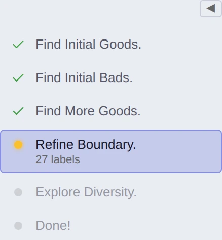
</picture>

### Configuring Autopilot

Most people never touch these, but the **Autopilot** tab in the Settings
modal (the gear <picture><source media="(prefers-color-scheme: dark)" srcset="assets/icon-settings.dark.webp" /></picture> at the top right) exposes:

- **# Good to start** - how many good votes phase 1 requires (default 3).
- **# Bad to start** - how many bad votes phase 2 requires (default 4).
- **# Start to re-sort** - how many answers Autopilot takes in phase 1
  without enough matches before it asks whether to sort by something else
  (default 10; see [Get Autopilot unstuck](howto/unstick-autopilot.md)).
- **Goal diversity** - how much of your collection phase 4 must cover
  before finishing (default 40).

Raising these numbers trains a more thorough detector at the cost of
more labelling effort.

---

## Manual mode: for power users

Manual mode gives you direct control over what the sort bar ranks
by and which unlabeled item is served next. Use it if Autopilot's
defaults don't fit your workflow, you're debugging a weird
ranking, or you want to label under an unusual regime (e.g. pure
diversity sampling with no voting).

Your server may not offer it: an administrator can set VTSearch to
**Autopilot only**, which removes the Manual tab (and Test's **Review** tab),
leaving Autopilot with no tab bar. Settings ▸ Server shows whether it is on.

The Manual tab shows three control rows above the media list.

<picture>
  <source media="(prefers-color-scheme: dark)" srcset="assets/manual-controls.dark.webp" />
  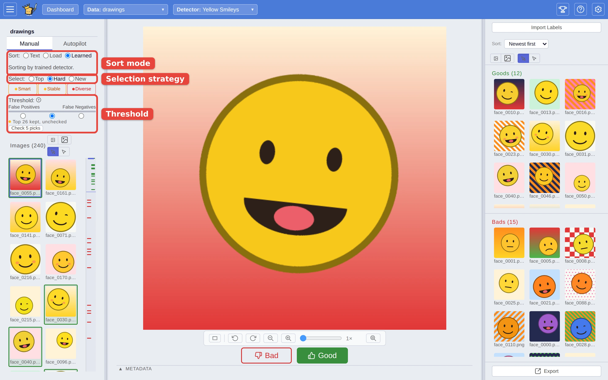
</picture>

### 1. Sort mode

Picks how the left-panel list is ordered. The sort bar offers three
modes, in order: **Text**, **Load**, **Learned**.

- **Text** - Type a natural-language query (e.g. "dog barking",
  "aerial photo of farmland"). Items are ranked by how well they
  match your query.
- **Load** - Apply a previously saved detector. Click the **+** beside
  *No sort loaded* to open the **Load Sort** window, where you can
  **Sort by Detector** (pick a saved detector with answers) or **Sort by
  Examples** (sort by similarity to one or more example media items).
- **Learned** - Trains the detector on your current good/bad
  votes and ranks items by its scores. Needs at least one
  good vote and one bad vote before it works.

You can freely switch modes - votes and the detector persist across
switches.

### 2. Selection strategy

Picks *which unlabeled item* the app highlights next.

- **Top** - Pick the highest-ranked unlabeled item. Best for
  quickly finding strong matches.
- **Hard** - Pick the most borderline item - the one the detector
  is least sure about. These uncertain cases improve the detector fastest.
- **New** - Pick an item from a part of the dataset you haven't
  covered yet. Ensures a broad mix.

Autopilot cycles through these automatically in its five phases,
but in Manual mode you choose directly.

### 3. Threshold

A spectrum from **False Positives** to **False Negatives**, with three radio
buttons under it: one under each third. Pick which way the detector's line
should lean. Each radio is a **balance** of precision and recall - how many
wrong items you will take in the results against how many right ones you
will accept missing - and the line (see
[Matches, the line, precision and recall](#matches-the-line-precision-and-recall))
is drawn where that balance is best. It keeps the top of the ranking, among
the items you haven't voted on: up to the top 128 on the False Positives
radio, and up to the top 32 on the middle and False Negatives radios, fewer
when the detector's own estimate says the balance peaks sooner. Toward False
Positives the line returns the most, and more of it may be wrong; toward
False Negatives it returns only the surest, and misses more; the middle
radio (the default) weighs the two mistakes equally. The radios carry no
numbers because what the line keeps is measured, not promised: a check says
how close it got. Hover a radio for what it does. Changing the Threshold
moves the line over the scores the detector already has; the ranking itself
does not change. The detector keeps the change: it is the Threshold Autopilot
uses from then on, and the one the next New Detector form starts on.

Once the list is ranked by the detector (a **Learned** sort, or Test), the
note under the spectrum says what the Threshold is doing to the line, in one
of two states:

- **Top 32 kept, unchecked** - nothing has measured the set yet (the count
  is 32 at most; fewer when the detector's estimate says the balance peaks
  sooner).
- **Checked · likely 55–80% right, about half of them found (checked 15) ·
  48 kept** - a check walked the list and ended where the balance peaked;
  the line keeps that set, and the note says how much of it is likely right
  and how much of what the list holds it likely found.

The range a check measured is a number. In Train, beside the note, **Check 5
picks** runs a spot check of the list: 5 random picks from each band of it,
which you vote on, walking deeper while a longer list scores better on the
balance and stopping where it peaks. See
[How close the line got](#how-close-the-line-got) for the check and its
likely range. Test shows the same note with no check beside it: there you
test the Threshold, and it is too late to label more to set it. The **?**
beside **Threshold:** explains it in two short sentences.

A Threshold toward False Positives keeps a longer list, and the lists nest:
the line always keeps the top of one ranking, so everything it keeps on the
False Negatives radio it still keeps on the False Positives radio, plus a
band of borderline items. That makes a two-pass workflow natural: work
toward False Negatives first, then move toward False Positives and review
the newly admitted band - the items just above the moved line (see
[Catch the borderline matches](howto/borderline-matches.md)).

Each detector keeps its own Threshold while VTSearch runs, and one you
haven't set yet starts from the last one you picked. Leave it on the middle
radio unless you want to lean toward catching everything (False Positives)
or toward only the surest matches (False Negatives). A Threshold set some
other way, such as from the command line, shows on the nearest of the three
radios, and moves to it.

---

## Region voting on images

When the dataset was imported with a **Region embedder** (or its main
embedder is region-aware) and the detector is a **Patch Semantic** one, you
can vote **good** on a *region* of the image instead of the whole image. This
tells the detector "this specific part is what I like", and the learned
sort uses that hint to find similar regions elsewhere in the dataset.

<picture>
  <source media="(prefers-color-scheme: dark)" srcset="assets/region-voting.dark.webp" />
  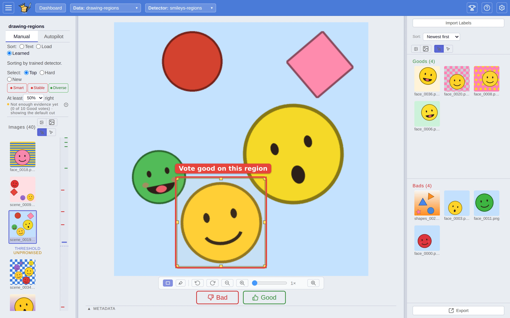
</picture>

The binary vote experience is **unchanged**: `→` is good, `←` is
bad.  Region voting is opt-in via a modifier key and never gets in
the way of fast keyboard voting.

On a dataset that also has a whole-picture embedder, a new detector is
**Semantic** unless you set **Detector Embedder Type** to **Patch Semantic**
under **Advanced** in the New Detector dialog; a Semantic detector stores the
boxes you draw but learns nothing from them. The steps are in
[Point at the part of the picture that matters](howto/vote-on-a-region.md).

### Drawing a region

There are two ways into region-draw mode:

- **Marquee button** - click the dashed-rectangle toggle in the
  image view controls (below the image, next to Rotate / Zoom).
  While the toggle is on, the cursor stays a crosshair and a normal
  left-drag draws a region.  The toggle persists across items, so
  you can annotate many in a row.  Click the button again to leave
  marquee mode and restore the default pan-on-drag behaviour.
- **`Shift`+drag** - a power-user shortcut that works whether or
  not marquee mode is on.  Hold `Shift` while the focus pane is
  showing an image: the cursor flips to a crosshair and the normal
  pan-on-drag gesture is suppressed.

Either way, **click-drag-release** to draw a rectangle over the
region you want to vote good on.  After release the rectangle shows
8 resize handles plus a draggable body, so you can adjust it.
Then **press `→`** (or click **Good**) to submit a good vote with
the region attached.

**You can start the drag outside the image.**  A region that runs
right to an edge is awkward to start from inside the picture, so a
drag begun anywhere in the centre column - the empty space beside
the image, or the band just below it holding the image controls and
the Good / Bad buttons - anchors the rectangle at the point of the
image nearest to where you pressed.

Two things are deliberately left out.  Buttons and sliders still
press: a drag started on one does what it always did, so the
controls keep working normally (including while the Marquee toggle
is on).  And the **metadata tray** at the very bottom is not part
of the draw area at all, so you can still select and drag across a
filename or an MD5 there.

The rectangle is stored in *normalised image coordinates* - it
stays anchored to the same pixels of the image even if you zoom in,
pan, or rotate before voting.  A click without dragging (a
zero-area "click") restores the previously drawn rectangle rather
than discarding it.  `Esc` clears the rectangle without voting.

### The Highlight toggle

The image controls also include a **Highlight** toggle ("Highlight:
outline the region the detector matched best"). When on, VTSearch
draws the region the current detector keyed off of for the displayed
item, so you can see *why* it scored the way it did.

### Voting bad while a region is drawn

A `←` press while a region is drawn would normally throw the
rectangle away - and drawing a rectangle is real work, so VTSearch
**asks for confirmation**:

- The rectangle pulses red and a hint banner reads
  *"Press ← again to vote no and discard the box, or Esc to keep
  the box."*
- A second `←` confirms - the no-vote fires and the rectangle is
  discarded.
- `Esc`, clicking on the rectangle, drawing a new one, or
  navigating to the next item all cancel the confirmation and keep
  the rectangle.

There is **no timer** - the confirmation state waits as long as you
need.

### What region voting does to the detector

Region-voted good examples train the detector on the *region* you
drew instead of the full image.  Bad votes are
unaffected - VTSearch already treats every bad vote as "no region
in this image is good" regardless of whether you drew a rectangle.

Region voting is image-only.  Audio, text, video, and document
media types have no region affordance.

---

## Creating a detector

Every search starts from a detector. Click the **+** <picture><source media="(prefers-color-scheme: dark)" srcset="assets/icon-new-detector.dark.webp" /></picture> button on
the **Detectors** card on the Dashboard to open the **New Detector** modal.
It has two tabs:

<picture>
  <source media="(prefers-color-scheme: dark)" srcset="assets/new-detector.dark.webp" />
  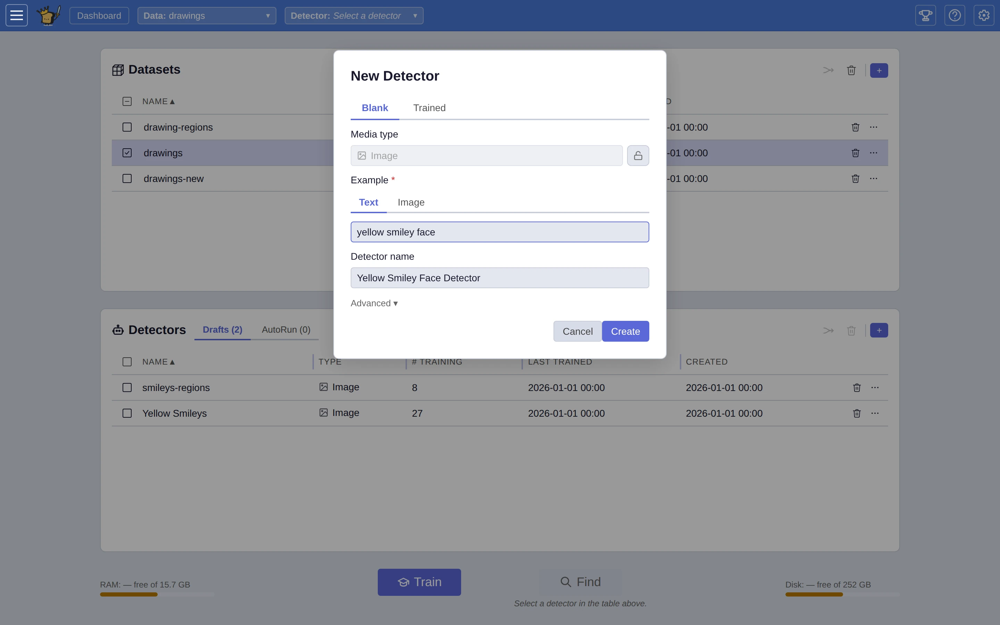
</picture>

- **Blank** - start a fresh detector that learns from your votes as you
  label. Pick its **Media type** (locked to the active dataset's type
  when you have one selected; hidden entirely on a solo-media-type
  server), give it a **Detector name**, and seed it under **Example**
  one of two ways: the **Text** tab takes a short description ("e.g.
  large books"), and the media tab next to it (named for the media
  type, e.g. **Image**) takes one or more **media examples**. A typed
  description also fills in the name: your words as typed, with the first
  letter capitalised and "detector" on the end ("large books" becomes
  **Large books detector**), until you type a name of your own; pressing
  Enter in the name field clicks **Create**. The
  quickest way to supply the first one is the drop zone
  right there on the tab - drag a file from your computer onto it, or
  click it to browse; it asks **Use This Example?** and offers to crop it
  first. For anything else, the **Browse Images…** button
  (it's named for the dataset's media type) opens a picker with the same
  two-row tab bar as the Add Dataset dialog, offering three sources out of
  the box: **Downloaded Media** (the path of a file inside a downloaded demo
  dataset), **Server File** (the path of one file on the server), and
  **URL** (VTSearch downloads the file for you). The last two are *datasource importers* -
  single-item fetchers that render as a small form, and the extension
  point where a plugin can add another place to fetch one example from.
  Picked examples stack vertically, each with its own **Remove**
  button; use **+ Add** below the stack to append another (from the picker's
  sources; only the first example can come from your own computer). An
  example picture also names the detector after its file until you type a
  name. With several
  examples, Autopilot's first sort ranks the dataset against their
  *average* - it surfaces items resembling what the examples have in
  common, and each example is seeded as a Good vote when the detector
  loads. When the active dataset offers more than one kind of embedder, a
  **Detector Embedder Type** picker sits under **Advanced ▾** (the toggle at
  the bottom left, beside **Cancel**; collapsed by default) so you can
  choose which one this detector uses: **Semantic**, **Patch Semantic**, or **Structural**.
  That choice fixes what the detector is compatible with later. If the
  dataset's embedder can't search by text, a text description has nothing to
  rank by there, so **Create** stays disabled until you add an example item.
- **Threshold** (both tabs) - which mistake this detector leans toward, the
  same three radios as the [Threshold](#3-threshold) in Manual mode. The
  detector keeps it, and Autopilot draws its line there. It starts on your
  last pick; you can change it later in Manual or Test.
- **Trained** - create a detector pre-trained on labels imported from an
  external source. It shows a label-importer picker (**Import labels
  from**); a stock install offers a JSON or CSV label file on the server
  (**Server JSON File** / **Server CSV File**), and plugins can add other
  sources. Pick one, fill its form, and VTSearch trains the detector on
  the imported labels (the button reads **Create & Import**). It takes files
  exported from VTSearch, which record where each item came from (see
  [Move a detector to another VTSearch](howto/move-a-detector.md)); to add
  labels made elsewhere, use **Import Labels** on an existing detector
  ([Add labels you already have](howto/import-labels.md)).

You can also reach the Blank flow with an item pre-selected as the
example via the right-click media context menu's **Use as detector
seed** option (see [Tips and shortcuts](#tips-and-shortcuts)). The steps are
in [Start a detector from an example picture](howto/start-from-an-example.md).

---

## Testing a detector

**Test** scores an entire dataset with a detector and drops you into a
dedicated **three-pane view** to test the detector's line on it, and to
confirm or correct its calls before exporting. Start it from the Dashboard:
select a dataset row and a detector row, then click **Test** <picture><source media="(prefers-color-scheme: dark)" srcset="assets/icon-find.dark.webp" /></picture> in
the action bar (VTSearch scores every item, showing progress while it
runs). The left pane then carries two tabs, the Train view's Autopilot /
Manual split applied to testing:

- **Autopilot** - the Test autopilot, which measures the line: the guided
  flow, and the tab Test opens on.
- **Review** - the ranked list under the line, the boundary walk, and the
  **Verified Good** / **Verified Bad** piles: every result, a tab away, with
  the test's picks already in the piles. A user who wants the list without
  testing clicks **Review** once scoring ends; the test waits on its tab, and
  the Threshold stays frozen until it reaches **Done!**.

On a server set to **Autopilot only**, Test shows the Autopilot alone, with
no tab bar and no Review tab.

Test is where you decide whether to trust a detector. To run detectors you
already trust and collect what they match, with no view to work through, use
the Dashboard's **Find** button instead (see
[Running AutoFind on a new dataset](#running-autofind-on-a-new-dataset)).

**A detector with too few labels is tested as the Goods' centroid.** Until it
has 3 Goods and 4 Bads, VTSearch does not train a detector from its labels:
Test, Find and AutoFind rank everything by how close it is to the average of
its Goods instead, and draw the line where those scores split. One Good is
enough to test it. The Test view says so under its tabs, with how many more
Goods and Bads a trained detector needs, and the Threshold does not move that
line. A detector with no Good at all can't be tested.

<picture>
  <source media="(prefers-color-scheme: dark)" srcset="assets/find-view.dark.webp" />
  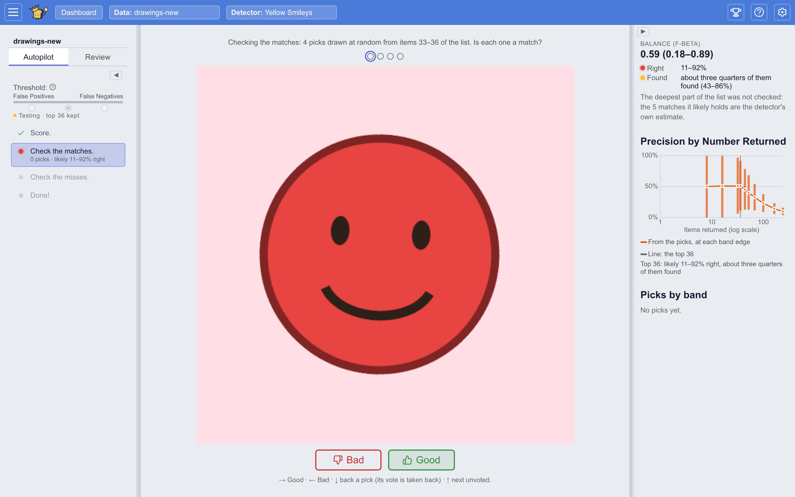
</picture>

### The Test autopilot

The question the Test autopilot answers is the one AutoFind needs answered: *if
this detector shipped the matches it finds in a future dataset like this one,
unchecked, what share would be right, and what share of the real matches
would it ship?* The answer comes from **random picks** rather than from the
top of the list or the detector's own guess: the ranked list is cut into
bands on either side of the line, and each round deals five pictures drawn at
random from one band. A pick carries no rank and no score (that would be the
ranking talking, not the sample), and the dots above it count only how many
of the round are left. Vote each one **Good** <picture><source media="(prefers-color-scheme: dark)" srcset="assets/icon-good.dark.webp" /></picture> or **Bad** <picture><source media="(prefers-color-scheme: dark)" srcset="assets/icon-bad.dark.webp" /></picture> (or `→` / `←`); `↓` goes back a pick and takes its vote back.

The phases, each with a light that climbs red, yellow, green as it nears its
end, as Train's do:

1. **Score.** The detector scores every item and the Threshold draws its
   line. The light is the pass's progress.
2. **Check the matches.** Picks from above the line, the band holding the
   line first (where the detector is least sure and the set is largest), then
   whichever band would narrow the answer most. The light tracks how narrow
   the likely range for the share right has got.
3. **Check the misses.** Picks from below the line, the band just under it
   first, then one band deeper a round until the step has spent its picks,
   so the answer rests on picks from deep in the list and not only on the
   detector's own count of what is there. A detector with no class model (a
   document or structural one) stops instead at the first band that turns
   up nothing. The light tracks the range for the share of all the matches
   found.
4. **Done!** The ranges have stopped moving usefully. You click until Done,
   not until the dataset runs out: forty picks a side is the most a phase
   asks for.

**Nothing to test** replaces the phases when the line keeps fewer than one
round of pictures on this collection: move the **Threshold** toward **False
Positives** to keep more, or train the detector further.

The **Threshold** sits above the phases, as in Train. It is live between
phases and frozen while one runs, because moving the line would move the
bands under the picks. The note under it reads this collection's result
(*Tested · likely 70-85% right, about half of them found (checked 32) · 64
kept*), or *Untested*; it never shows the check Train ran, which measured the
training collection and would read as this one's.

### The result

The right pane shows the result as it forms, and the verdict at Done:

- **Balance (F-beta)** - the one number that weighs the two kinds of mistake
  the way the Threshold does, with its likely range.
- **Right** - of what the line keeps, the likely share that is a match: a
  number, from the picks above the line.
- **Found** - of all the matches in the collection, the share the line keeps,
  in words, with the range beside it. The deepest part of the list is never
  checked; the matches it holds are the detector's own estimate, and the pane
  says so. A detector with no class model has no such estimate, so Found is
  given in words only and the pane says it is unmeasured below the bands the
  picks reached.
- **Precision by Number Returned** - how right the top N likely are, at every
  band edge, from the picks alone, with the line marked: the clearest way to
  see how much you give up in precision for each extra match. Point at the
  chart to read it at any band edge. The count axis is logarithmic, so the top
  of the ranking, where precision changes fastest, gets as much room as the
  long tail.
- **Picks by band** - where the picks came from and what each band said.

At **Done!** the verdict reads the ranges in a sentence, and offers three
ways out, as Toasty does when Autopilot finishes in Train:

- **Move to AutoFind** - the reason the test exists. The detector joins your
  AutoFind list, and you land on the Dashboard. It is offered whatever the
  ranges say; the verdict sits beside the button.
- **Lean the Threshold** - the same picks read at the line each balance would
  draw on this collection: how many each keeps, the likely share right, and
  the share found. Pick one to move the Threshold there; nothing is re-scored,
  and the result reads *tested at another line* until you test again.
- **Add Corrections and retrain** - the failed-the-test exit: hand the picks
  you disagreed with (and anything you corrected in Review) to the detector.
  The result is then *out of date*, since the detector has seen the test set;
  running Test again retrains and re-scores, and every item you verified
  keeps the call *you* made. See
  [Check and correct a detector's calls](howto/check-and-correct.md).

**The verdict is kept on the detector.** Reaching Done saves it with the
detector, one verdict per collection it was tested on (testing the same
collection again replaces it): the ranges, the balance, the date, and the
picks with what you said about each, never a score. The detector's **Stats**
lists it under *Tested on*, and an AutoFind detector shows its latest under its
name on the Dashboard. Once the detector is retrained (more votes in Train,
**Add Corrections**, imported labels), the ranking those picks were drawn
from no longer exists, so the verdict is marked *out of date*; it stays, so
you can see what the detector used to ship. Open Test on a collection you
tested before, with the detector and its ranking unchanged, and the test
picks up where it left off: the kept picks come back, already in the Review
tab's piles, and the result says when you took them, so there is nothing to
vote again.

Under the verdict, **Your checks** sets the detector's calls against the
answers the collection has now (the test's picks and anything you verified in
Review): matches you both agree on, wrong matches you took out, matches the
detector missed and you rescued, and the agreement rate over the whole
collection.

<picture>
  <source media="(prefers-color-scheme: dark)" srcset="assets/find-stats.dark.webp" />
  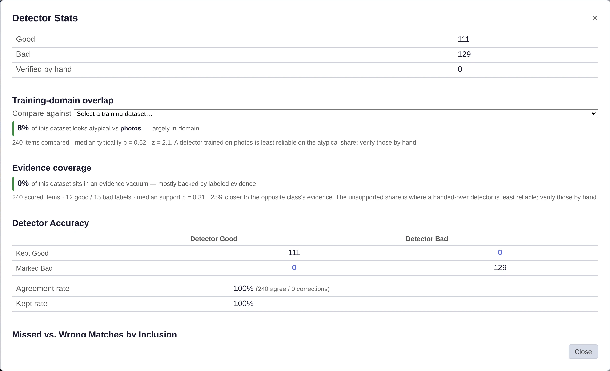
</picture>

### Review

The **Review** tab holds the whole result:

- **Left pane** - the **work queue** of items the detector hasn't been
  confirmed on yet, ranked by score, under the same
  [Threshold](#3-threshold). The line through it is the Threshold's line
  drawn from your labels for this collection (it estimates how common matches
  are here), so a collection with nothing like your target shows few or none
  above it.
- **Centre pane** - the **viewer** with Good / Bad buttons, so you verify the
  current item just like you vote during training. Review serves the item
  nearest the line, taking turns between just above it and just below it.
- **Right pane** - the **Verified Good** and **Verified Bad** piles, where
  confirmed items accumulate; the test's picks are already there.

The action buttons let you act on the result:

- **To Dataset** - promote the full good set (verified + unverified)
  into its own new dataset.
- **Add Corrections to Detector** - the same exit as the verdict's: fold the
  items you changed from the detector's call back into the detector's
  examples. Nothing is re-scored straight away (the test result is marked out
  of date); running Test again retrains the detector and re-scores the
  dataset with it.
- **Export** <picture><source media="(prefers-color-scheme: dark)" srcset="assets/icon-export.dark.webp" /></picture> - send the good set to clipboard, a file, email, a webhook,
  or another website (see [Exporting your work](#exporting-your-work)).
- **Browse** - open the positive items in the spatial
  [Browse](#browse-exploring-a-dataset-spatially) view.

### How far to trust the score

The result pane also answers a question the ranges can't: *which of these
calls is the detector actually qualified to make, and will the next
collection look like this one?* Two trust checks under the verdict flag the
items to verify by hand, each reported as a percentage chip with a one-line
verdict and a line of supporting numbers:

- **Training-domain overlap** - how much of *this* dataset looks unlike
  the dataset the detector was trained on. VTSearch can't infer which
  dataset that was (a detector handed to you may not travel with its
  haystack), so you pick it from the **Compare against** dropdown, which
  lists every *other* loaded dataset sharing this one's embedder - the
  section is hidden entirely when there is no such candidate. A high
  atypical share means domain shift: the detector is scoring media unlike
  anything it ever saw, and that share is the part to check yourself.
- **Evidence coverage** - how much of the dataset the detector is calling
  with no labeled example like it behind the call. This one is measured
  from the detector's own votes, so it works even when the training data
  isn't loaded at all. Items in that "evidence vacuum" are where a
  handed-over detector is least reliable.

If either share is large, the fastest fix is usually to label a few items
from the flagged region and retrain, rather than to move the Threshold.

---

## View options

The controls above the media list are an inline toolbar (no "View"
button and no separate view-settings modal). It carries just two
controls, remembered per media type:

<picture>
  <source media="(prefers-color-scheme: dark)" srcset="assets/view-options.dark.webp" />
  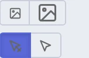
</picture>

- **Thumbnail size** - the two image icons shrink or grow the
  thumbnails. Larger thumbnails = fewer per screen but more readable.
  After training, the list ranks the thumbnails by the detector's score,
  with a threshold line marking the good/bad cut (where it sits, and what a
  check found on the set it keeps, is in
  [How close the line got](#how-close-the-line-got)):

  <picture>
    <source media="(prefers-color-scheme: dark)" srcset="assets/results-grid.dark.webp" />
    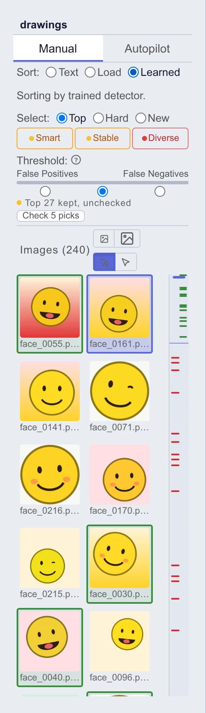
  </picture>
- **Focus mode** - Click-focus means you select an item by
  clicking it. Hover-focus means just moving your cursor over
  an item selects it (faster for scanning, more mis-clicks).

### Solo media type: streamline for one media type

If everyone on a server only ever works with one kind of media (e.g.
they exclusively search images, optionally pulled in from videos and
documents via the built-in converters), an operator can restrict the
whole instance to that type. This is an **admin setting, not a user
preference**: it's set when the server starts and shown read-only on the
Settings modal's **Server** tab. Once set:

<picture>
  <source media="(prefers-color-scheme: dark)" srcset="assets/settings-appearance.dark.webp" />
  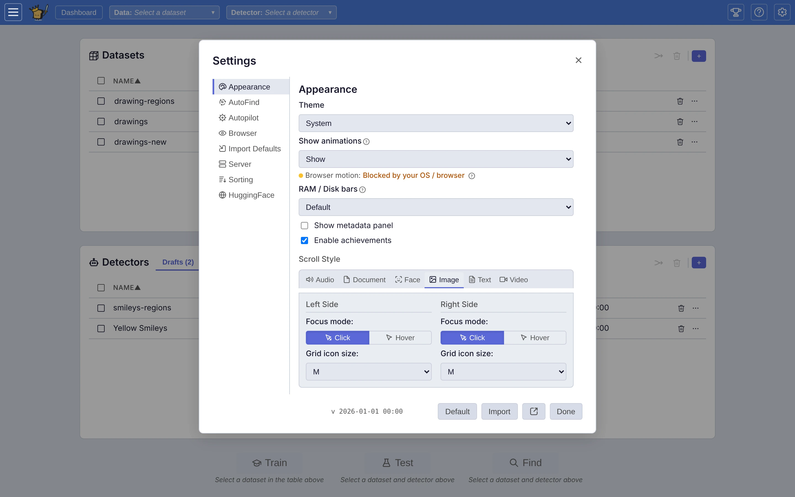
</picture>

- The dataset importer and new-detector dialogs stop asking which
  media type you want - they lock to your chosen type.
- Converter offerings filter to those that produce your type
  (so picking "image" still lets you import videos-as-frames and
  documents-as-pages, just not raw audio).
- The chosen type's default embedder is warmed at startup so the
  first detector run is fast.

Operators set it by passing `--solo-media-type image` (or any type id)
on the command line, or by writing `"solo_media_type": "image"` into
`data/settings.json`. It applies to every user, and there is no
per-user override.

---

## Settings tabs

The Settings modal (the gear <picture><source media="(prefers-color-scheme: dark)" srcset="assets/icon-settings.dark.webp" /></picture> at the top right) is organised into
eight tabs:

- **Appearance** - theme, animations, the Dashboard's **RAM / Disk
  bars** (**Default** shows each one only when its free space is getting
  low, meaning it would hold fewer than three more datasets the size of your
  largest; **View** and **Hide** show them always or never), the metadata
  panel, the **Enable achievements** toggle, **Hide All** / **Show All** for
  [Toasty's hints](#toastys-hints), and per-media-type Scroll Style (focus
  mode and thumbnail size).
- **AutoFind** - what exporter to send AutoFind results to, and whether
  a command-line run deletes the dataset it imported once AutoFind has run
  (see [Run your detectors from the command line](howto/autofind-from-the-command-line.md)).
  (Which detectors run is chosen on the Dashboard's **AutoFind** tab; see
  [Running AutoFind on a new dataset](#running-autofind-on-a-new-dataset).)
- **Autopilot** - the guided-workflow knobs described under
  [Configuring Autopilot](#configuring-autopilot).
- **Browser** - per-media-type look of the spatial Browse view
  (signposts, signpost text, colormap, cell size, thumbnail border,
  popup thumbnail size, mouse-zooms per level; the tile shape is chosen
  automatically from the media type — squares for browsable thumbnails,
  hexagons for audio and text — and is not a setting), plus a
  **Graphics** control that applies to every media type. Leave Graphics
  on **Auto** and VTSearch picks for you: browsers without hardware
  acceleration get the cheaper
  animations automatically. Choose **Reduced** if panning or zooming the
  map still feels laggy - every animation keeps playing, but the costly
  effects (image smoothing during motion, drop shadows) are dropped.
  **Full** always uses the richest animations.
- **HuggingFace** - sign in with HuggingFace to download gated demo
  datasets and gated AI models.
- **Import Defaults** - default embedder, clipper, and converters per
  media type.
- **Server** - read-only settings fixed when the server started and
  shared by everyone, including the **Solo media type** restriction.
- **Sorting** - options that control how the trained ranking behaves.

---

## Dashboard: managing datasets and detectors

The Dashboard is your inventory view. Two tables stacked vertically
with bulk-action and per-card controls.

<picture>
  <source media="(prefers-color-scheme: dark)" srcset="assets/dashboard-manage.dark.webp" />
  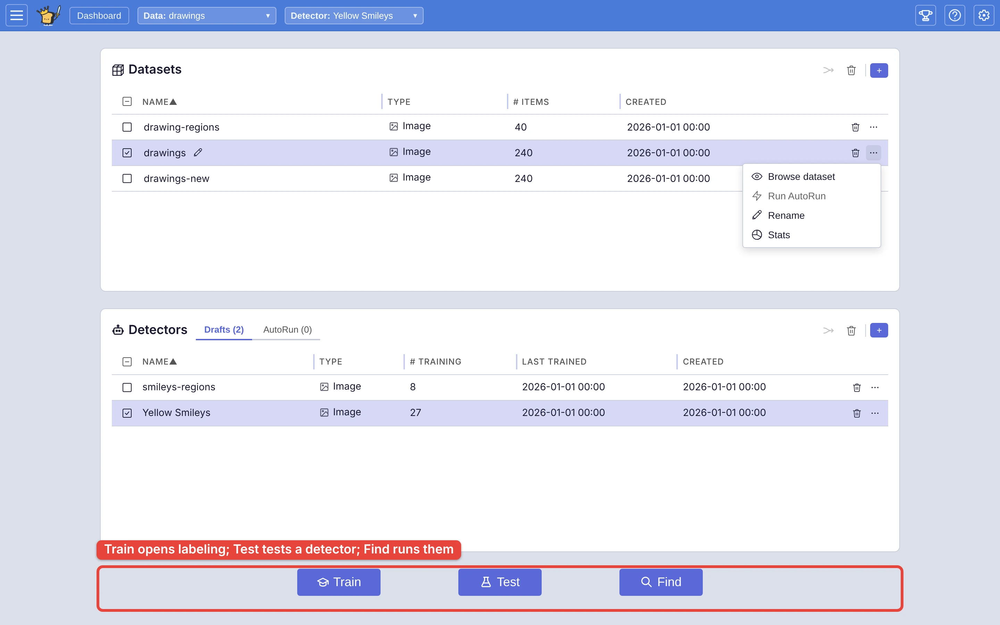
</picture>

- **Datasets** - every dataset on the server. Each row shows
  **Type**, **# Items**, **Created**, **Age-Off**, **Creator**, and
  **Readers**. A row that isn't in memory shows an inline **Load**
  button, which disappears once the dataset is loaded. The name has a
  pencil for **Rename**, **Delete** is an inline button, and the
  remaining actions (**Browse dataset**, **Run AutoFind**, **Stats**, and -
  on multi-user deployments - access controls) live behind a **⋯** <picture><source media="(prefers-color-scheme: dark)" srcset="assets/icon-overflow.dark.webp" /></picture> overflow
  menu.
- **Detectors** - every saved detector, split across two tabs:
  - **Drafts** holds detectors you're still building or evaluating.
    Like datasets, the name carries a **Rename** pencil and **Delete**
    is inline; the **⋯** overflow menu holds the rest, including
    **Import Labels** (import labels into this detector), **Export
    labels** (see [Exporting your work](#exporting-your-work)), and
    **Move to AutoFind**.
  - **AutoFind** holds finalized detectors. They run automatically
    against every dataset you import (see
    [Running AutoFind on a new dataset](#running-autofind-on-a-new-dataset))
    and during CLI autodetect, and they are *frozen*: no rename, delete,
    retrain, or label import until you pick **Move to Drafts** from the
    **⋯** menu to unfreeze them. Read-only actions (**Load**, **Browse
    positives**, **Stats**, **Export labels**) stay available, and
    **Test** and **Find** work as usual. Under each name is the latest
    [test verdict](#the-result) the detector keeps (*Tested on
    drawings-new: likely 70-85% right, about half of them found (34
    picks, 2026-10-05)*), marked *Out of date* if it was retrained
    since, or *Untested*: an AutoFind detector ships its matches
    unchecked, and this is what it was measured to ship.

  A detector lives on exactly one tab at a time, and every user
  curates their own AutoFind list. The typical loop: build and test a
  detector in **Drafts**, move it to **AutoFind** once you trust it,
  and move it back to Drafts later if it needs more tuning. Until you
  have a detector at all, both tabs are dimmed and the grid stays on
  Drafts, where a new detector lands.

  Only detectors on the tab you're looking at can be selected, so
  **Train**, **Test** and **Find** always act on rows you can see. Switching
  tabs clears the detector selection, and picking a detector from the
  top bar switches to its tab.

The **+** button on each card creates a new dataset (the Add Dataset
dialog) or a new detector (the [New Detector](#creating-a-detector)
modal).

**Bulk actions.** Each table has a header **select-all** checkbox, and the
**Combine selected datasets** / **Combine selected detectors** and **Delete
selected** buttons at the top of each card act on the ticked rows (they stay
greyed out until the selection suits them) - so you can merge or clean up
several at once. See
[Combining datasets and detectors](#combining-datasets-and-detectors).

**Starting a labeling session:** click a dataset row and a detector
row to select them (a detector you just made, with no labels yet, gets one
of [Toasty's hints](#toastys-hints) pointing at **Train**), then click the **Train** <picture><source media="(prefers-color-scheme: dark)" srcset="assets/icon-train.dark.webp" /></picture> button in the action
bar below the two tables. That opens the three-panel labeling view
against your selection.

**Testing a detector:** select a dataset and a detector, then click
**Test** in the action bar to open the test view (see
[Testing a detector](#testing-a-detector)).

**Finding with detectors of your choice:** select any number of datasets
and detectors of one media type, then click **Find** in the action bar.
It opens no view: each selected dataset gets a background run of every
selected detector, shown on its row, and the results open in the
**Find Results** dialog as the runs finish (see
[Running AutoFind on a new dataset](#running-autofind-on-a-new-dataset)).

You can keep multiple datasets and multiple detectors loaded at once.
Loading just pulls them into memory; the Train / Test / Find buttons
work on whichever rows you currently have selected.

### Toasty's hints

King Toasty (the toast with the magnifying glass in the logo) stands beside
the next thing to click, with a speech bubble that says what to do and why.
On the Dashboard he shows one step at a time:

- the **Datasets** card's **+** while you have no datasets, or a nudge to
  select one when you have some but none is selected;
- a warning (he looks surprised) when the selected datasets hold different
  kinds of media;
- the **Detectors** card's **+** once a dataset is in, or a nudge to select a
  detector when you have some but none is selected;
- a warning when the selected dataset and detector are for different kinds of
  media;
- **Train** once a new detector with no labels is selected beside a matching
  dataset, and **Test** or **Find** once the selected detector is trained.

In the Train view he asks for your first vote over **Good** / **Bad** while
Autopilot runs on a detector with no labels, explains the **Update Sort
Example?** prompt from just below it (see [Get Autopilot
unstuck](howto/unstick-autopilot.md)), and when Autopilot finishes he
stands under the top bar's **Dashboard** button (see [Autopilot: the guided
workflow](#autopilot-the-guided-workflow)).

Each hint goes away as soon as you take its step. Tick **Hide this hint** in a
bubble to stop seeing that one, or **Hide all hints** to stop seeing any;
**Settings → Appearance → Toasty's hints** has **Hide All** and **Show All**,
which brings back every hint, including ones you hid one at a time. Toasty
also turns up on the notifications at the top of the screen: happy on good
news, surprised on a warning, sad on an error.

### Combining datasets and detectors

Selecting two or more rows of the same media type and clicking **Combine
selected datasets** merges them into a single new dataset, keeping one copy
of any item that is in more than one; **Combine selected detectors**
likewise merges detectors (pooling their votes, and dropping any item they
disagree about). The originals are kept. This is handy for stitching
together work that started out split across several imports; see
[Combine datasets or detectors](howto/combine.md).

---

## Browse: exploring a dataset spatially

Open Browse from a dataset row's **⋯** overflow menu (**Browse
dataset**) to get a bird's-eye map of the whole collection. VTSearch
arranges every item on a two-dimensional map - similar items land near
each other - and renders it as a pannable, zoomable density map.

<picture>
  <source media="(prefers-color-scheme: dark)" srcset="assets/browse-view.dark.webp" />
  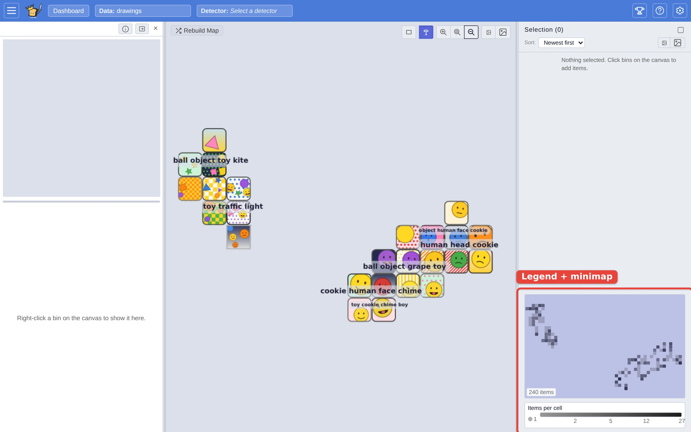
</picture>

Browse is a way to *see
the shape* of a dataset - where the clusters are, how big they are, what
sits between them - without training anything. It never votes, trains, or
scores; it's a pure explorer.

The first time you browse a dataset, VTSearch builds the map (a
progress bar shows the work). The layout is cached on the dataset, so
later visits open instantly.

### Reading the map

Each tile aggregates the items that landed in that part of the
map, and its **colour encodes how many** items are there - denser
regions are brighter. The **legend** on the right decodes the colour
scale; the **minimap** above it shows where your current view sits within
the whole map.

Hovering a tile previews a representative item from that region:

- **Audio** clips play on a loop while you hover (browsers need one
  click anywhere on the page first to unlock audio playback).
- **Images, video, and documents** enlarge the tile's thumbnail on the map.
- **Text** shows a snippet in a popup anchored to your cursor.

### Signposts: named regions

A density map tells you *where* the clusters are but not *what* they are.
**Signposts** letter the map like street signs: a broad name over each big
region when you're zoomed out, finer names inside it as you zoom in. They
turn "there's a dense blob at the top-left" into "that blob is dogs
barking."

Some names come with a visible hedge: `~ Foraging birds`, in italics and
without the slight shadow the other names carry. That marks the broadest
couple of zoom bands, where a region covers so much ground that no single
name really describes it - measured across 2832 regions, roughly half the
regions at those bands have no majority category at all. The name is still
the best short answer to "what is over here", and it is still worth
steering by; the `~` is there so you read it as a direction rather than a
label. Names at the finer bands, and names lettered from a dataset's own
category paths, never carry it.

The signpost toggle sits in the control cluster at the top right of the map,
next to Region select, and is greyed out on a map that has no names to show. Naming
happens when the map is built, so a freshly built map may letter itself a
moment after it appears; if the naming settings change, VTSearch re-runs
the naming in the background the next time you browse rather than making
you rebuild.

Settings → **Browser** controls them per media type:

- **Signposts** - show or hide the lettering (the same thing the canvas
  toggle does, but remembered as your default).
- **Signpost text** - how the names are generated. **Tags** names each
  region from a fixed vocabulary; it is fast and downloads nothing.
  **Captions** runs a generative model to describe each item instead,
  which is sharper on fine-grained collections but downloads a multi-GB
  model and runs at map-build time. Not every media type offers the
  choice; the control only appears where it applies.

A server operator can replace the tag vocabulary with their own term list;
when they have, the Settings → **Server** tab shows it read-only under
**Custom signpost tags**. Datasets whose items carry a hierarchical
category path (`Europe/France/Paris`) skip the naming pipeline entirely
and are lettered straight from that taxonomy, so they light up the moment
you browse them - which also means they're the one case that works on an
install without the optional naming dependency.

### Navigating

The control cluster at the top right of the canvas gives you:

- **Zoom in / Zoom to fit / Zoom out** - or drag to pan and scroll to
  zoom directly on the canvas.
- **Thumbnail size** - smaller or bigger tiles.
- **Region select** - the dashed-rectangle toggle (or `Shift`+drag) lets
  you drag a box to select every item inside it.
- **Signposts** - the signpost toggle described above, disabled when the
  map has no names.

The tiles are **squares** for media with browsable thumbnails (images,
video, documents) so the thumbnails pack edge-to-edge, and **hexagons**
for audio and text, where the tile is a density cell rather than a
picture. The shape is chosen automatically from the dataset's media type -
there's nothing to set.

Top-left, **Rebuild Map** shuffles the items into a fresh layout
(handy when a cluster lands somewhere awkward). To return to the
inventory, use the **Dashboard** button in the top bar.

### Looking inside a tile

Hovering shows you one representative item; **right-click a tile** to see
everything in it. That fills the **bin details** panel, docked on the left
of the map:

- A **grid of every item in the tile**, with a running count at the top.
  It scrolls, so a dense tile holding thousands of items is fine, and its
  own thumbnail smaller/larger buttons size the grid independently of the
  map.
- A **large preview** of the item you're pointing at in that grid (a
  waveform that plays for audio), with its own size buttons.
- An optional **metadata column** - name, media type, MD5, and whatever
  custom fields the dataset carries - toggled by the ⓘ button. Each value
  has a copy button next to it.
- **Selection controls**: clicking any thumbnail (or the big preview)
  selects that item, and a **select-all** checkbox takes the whole tile at
  once. These feed the same Selection panel described below.

The panel's pop-out button turns it into a floating window anchored where
you clicked, which can be dragged around by its header; the window's **dock**
button in its top-left corner puts it back at the side - the better place when
you're working through many tiles in a row. Docked, the dividers inside it
resize the metadata column and the panel itself. VTSearch remembers
docked-or-floating per media type.

### Selecting items

Click a tile to add its items to the **Selection** panel on the right, and
click it again to take them out; dragging a region adds every tile inside it.
The panel lists what you've picked - sortable by recency, name, or ID - and
clicking any entry drops it from the selection. The checkbox at the top of
the panel selects everything in view, or clears the whole selection. This is
how you carve a region of interest out of a large collection by eye; on a
whole dataset the selection is for looking, and is gone when you leave
Browse.

Browse can also open **scoped to a Test result**: after scoring a dataset
you can map just the matched items and use **Verified Good** /
**Verified Bad** to lasso and prune wrong matches before exporting.
(See [Testing a detector](#testing-a-detector), and
[Explore a dataset with Browse](howto/explore-with-browse.md).)

---

## Exporting your work

In the labeling view, the right panel's **Export** button saves your current
labels. In Test, the **Export** icons at the top of the **Verified Good** and
**Verified Bad** piles send each set (checked or not), and the one beside
the Threshold sends only the matches you haven't checked (see
[Send your matches somewhere](howto/export-matches.md)). Both open the same
window with the same destinations, and its title says what is leaving:
**Export Detector Labels** for your answers (the thing that rebuilds the
detector), **Export Results** for what the detector matched in Test (**Export Unverified
Good** from the Threshold's button). Formats (by their display names):

<picture>
  <source media="(prefers-color-scheme: dark)" srcset="assets/export-picker.dark.webp" />
  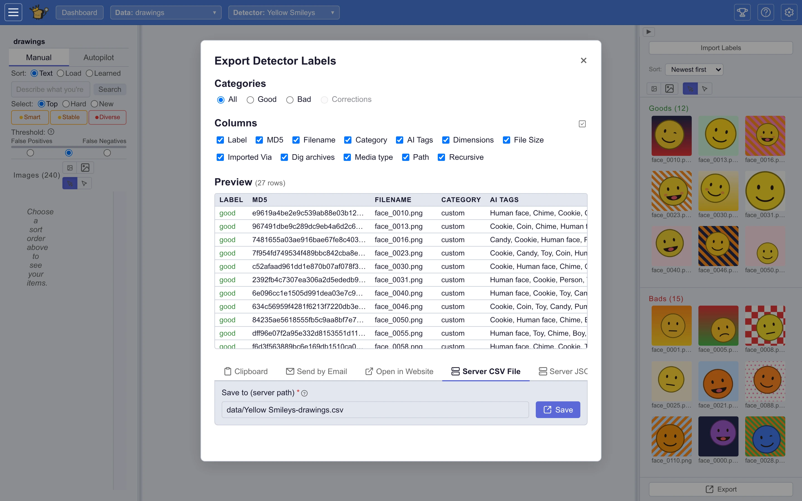
</picture>

- **Server JSON File** - saves a JSON file on the server.
- **Server CSV File** - same, but CSV.
- **Webhook (HTTP POST)** - POSTs the result to a URL you configure.
- **Send by Email** - emails the result if SMTP is configured.
- **Open in Website** - for the review tool that has no ingest API but
  *does* take identifiers in its URL. You give it a URL template such as
  `https://example.com/review?ids={ids}`; VTSearch fills `{ids}` with the
  exported items' identifiers (`{count}` works too, and you choose which
  field to use as the identifier, the separator, and how many to include),
  then opens the finished URL in a new browser tab. Nothing is sent from
  the server - the only request is the one your own browser makes - but
  everything you put in the template is visible to the destination site
  and lands in your browser history, so keep it to identifiers. Only
  `http://` and `https://` URLs are accepted, and a formatted URL longer
  than about 2000 characters is reported as an error rather than
  truncated (lower **Max items** if you hit it).

The exporter also offers a **Clipboard** copy. It copies a
column-selected, delimited table (a header row plus one line per item),
not a raw JSON list. Every column starts ticked - **Label**, **MD5**,
**Filename** and **Category** first, then any the dataset's items carry -
and you can pick which columns and which delimiter to use.

The **Categories** filter at the top of the window picks which items go:
**All**, **Good**, **Bad**, or **Corrections** (only the items whose label
was changed from the detector's call; greyed out when there are none).

### Exporting a detector

The Detectors dashboard's **⋯** overflow menu offers **Export labels**:
the same exporter modal described above, scoped to that detector. This
is how you move a detector to another VTSearch instance. A detector *is*
its labels - VTSearch re-derives the trained ranker from them every time
it loads - so exporting the labels and making a detector from them there
(New Detector's **Trained** tab) reconstructs it; see
[Move a detector to another VTSearch](howto/move-a-detector.md).

Opened this way the modal's **Categories** filter starts on **All**,
which is what you want: the negatives are half of what the ranker learns
from, and a good-only or bad-only file can't rebuild the detector at the
other end (a good-only one gives only the Goods' centroid, below, and a
bad-only one nothing). Narrowing to **Good** or **Bad** is still available - it's a
useful way to get just the hits as a list - and the modal says what
you're giving up when you do.

#### Portable ONNX bundles (advanced)

There is a second, quite different thing you can export: a **portable,
standalone scoring bundle**. It is a zip holding `detector.onnx` (the
trained ranker, which runs anywhere ONNX does), `manifest.json` (which
embedder to use and where the good/bad cutoff sits), and a `README.md`
with a copy-paste scoring snippet. Where **Export labels** moves a
detector *between VTSearch instances*, this hands a frozen scorer to
someone who doesn't run VTSearch at all.

It is deliberately **not** a menu item - most people never need it, and
sitting beside **Export labels** it read as a confusing second "export".
Reach it directly instead, either way round:

- **From the API**, against a loaded dataset:
  `POST /api/detectors/{detector_id}/portable-bundle` (see
  [`docs/api/detectors.md`](../api/detectors.md#export-portable-bundle)),
  which streams the zip back.
- **From the CLI**, as part of an autodetect run: the
  `portable_detector` exporter, which writes one bundle per detector the
  run trained (see
  [`docs/CLI.md`](../CLI.md#auto-detect-run-detectors-on-a-dataset)).

Both paths behave the same way. This is the one place VTSearch writes a
trained ranker to disk - it normally keeps them in memory only. The
bundle contains **no media and no fingerprints**, just the small trained
ranker, but a trained ranker can still reveal something about the data it
was trained on, so share it only with people you'd trust with the labels
themselves. A compatible dataset must be loaded, since the ranker is
trained against that dataset's embedder. Pattern-matching (structural)
detectors can't be exported this way - their second verification stage
has no ONNX equivalent - and region (patch) detectors export in a
whole-item-only scoring mode.

---

## Importing pre-trained detectors

Two ways to bring in existing work:

<picture>
  <source media="(prefers-color-scheme: dark)" srcset="assets/import-detector.dark.webp" />
  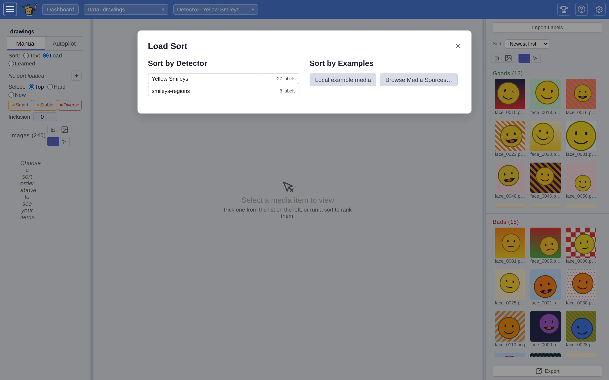
</picture>

- **Labels** - the right panel's **Import Labels** button opens a
  label-importer picker - a server-driven list of import sources, each with
  its own small form - that populates your vote piles from the chosen
  source. The detector card's **Import Labels** overflow item uses the same
  sources but adds the labels to that detector directly, whether or not it
  is open. Useful for continuing labelling across sessions or merging work
  from multiple labellers; see [Add labels you already have](howto/import-labels.md).
  New Detector's **Trained** tab makes a new detector from a file of labels
  exported from VTSearch.
- **Detectors** - the **Load** sort mode's **Sort by Detector** option
  lists the saved detectors already in the registry, so you can score a
  fresh dataset with one without retraining. (There is no separate
  detector-file upload step in the labeling UI; detectors come in via the
  registry and via [Test](#testing-a-detector).)

---

## Achievements

VTSearch has an optional light gamification layer. When **Enable
achievements** is on (Settings → Appearance), a **trophy button** <picture><source media="(prefers-color-scheme: dark)" srcset="assets/icon-achievements.dark.webp" /></picture>
appears; click it to open the **Achievements** panel, which lists the
achievements and your tier progress on each. As you use the app, hitting
a milestone fires a small **unlock toast**.

<picture>
  <source media="(prefers-color-scheme: dark)" srcset="assets/achievements.dark.webp" />
  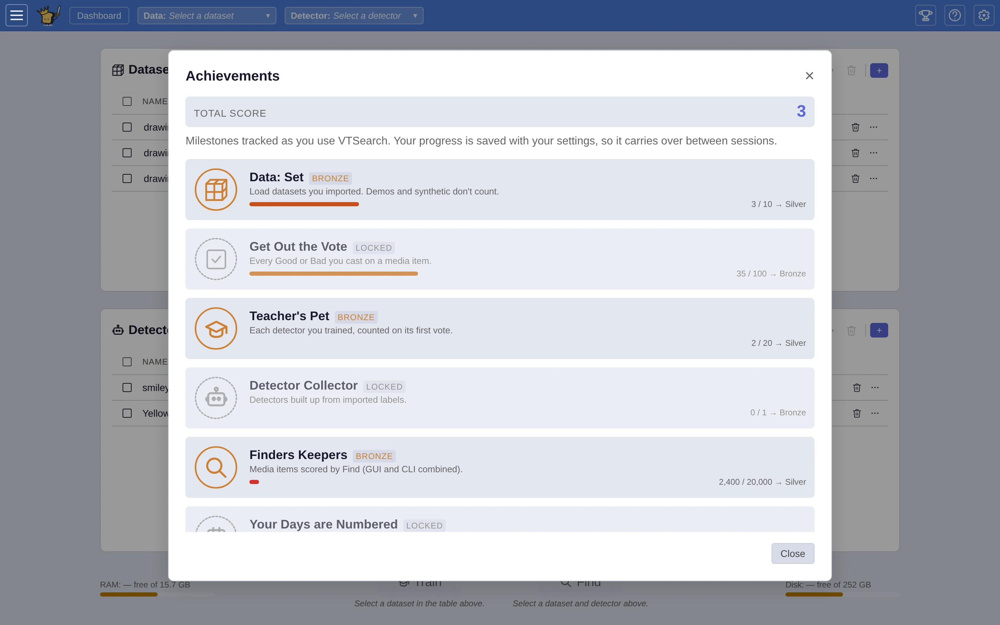
</picture>

A few achievements unlock via a **code phrase** rather than usage: docs
(like this guide) hide a phrase, and pasting it into the panel's code box
("Paste a code phrase") and clicking **Submit** unlocks the matching
achievement. The footer line of this guide is one such phrase.

Turning **Enable achievements** off zeros all counters and tier progress
and hides the trophy button and unlock pop-ups until you turn it back on.

---

## Tips and shortcuts

- **Top-bar dataset/detector pulldowns.** The pulldowns in the top bar
  let you switch the active dataset or detector without going back to the
  Dashboard, and offer an "Add New" shortcut to create one.
- **Keyboard shortcuts and the in-app guide.** Press **`?`** any time, or
  click the **?** <picture><source media="(prefers-color-scheme: dark)" srcset="assets/icon-help.dark.webp" /></picture> at the top right, to open the help sheet. It has two tabs: a **Keyboard shortcuts**
  reference and a **User guide** that renders this document inside the
  app (matching your theme). If whoever runs your server has written docs of
  their own (for the plugins they added, say), they are listed at the bottom
  under **Docs for this server**, and each opens in a new tab.
- **Step back and forward through the queue.** `→` and `←` cast the
  vote; `↓` and `↑` move you around it without casting one. **`↓`**
  returns you to the item you just voted on - press it again to step
  further back through the ones before it - so you can take a second
  look or change the vote with `→` / `←`. **`↑`** is the way out
  again: it puts you back on the item you were looking at when you
  first pressed `↓`, so `↓` then `↑` returns you to where you were.
  If you have moved on since - cast a vote, or picked another item -
  `↑` instead drops you on the next unlabeled item, wherever the
  current selection strategy says that is. Because the arrows carry this, **volume moved to
  `Shift`+`↑` / `Shift`+`↓`**.
- **Double-click the image to zoom in.** In Train / Test, a double-click
  on the image zooms in on the spot you clicked - the quick way to check a
  detail before voting without leaving the keyboard rhythm. Double-click
  again to go deeper; the viewer stops at 5x, and a double-click there
  returns you to the fitted view. Any rotation you set is kept. While the
  **Marquee** toggle is on (or `Shift` is held) the gesture belongs to the
  region draw instead, so it does not zoom.
- **Right-click a media item** for a context menu: **Sort by similarity
  to this**, **Crop, then sort by similarity…** (audio/image), **Use as
  detector seed**, and **Crop, then use as detector seed…**. The crop
  options open the **crop modal**, where you trim an image region or
  audio span before using the item as a sort example or detector seed.
- **The Autopilot resort prompt.** While Autopilot is looking for
  positives by sorting on an example, VTSearch periodically stops to say
  how that sort is going (**Update Sort Example?**): one line of
  read-only fields gives how many items you have labelled with it
  (**Clicked**), how many were positive (**Positives**) and the sort
  itself (**Sort**), and Toasty, below the dialog, says how many
  positives Autopilot needs before it trains. On the left, **Continue**
  (under **Keep clicking:**) carries on with the same sort for a set
  number of labels (the interval grows each time you keep it); on the
  right, **Supply a different sort:** swaps in a new example. A new example
  can be typed as text, uploaded from your computer (**Upload File…**), or
  picked with **Browse Media…**, which offers the same single-item sources
  as the New Detector modal - a path on the server, a URL, a file inside a
  demo dataset, or whatever a plugin adds (see
  [Creating a detector](#creating-a-detector) and
  [Get Autopilot unstuck](howto/unstick-autopilot.md)).
- **Drag-and-drop upload.** The New Detector modal's media-example field
  is a drop zone - drag a file from your computer onto it instead of
  clicking to browse.
- **Login-gated deployments.** Some servers ask for your name on first
  load before you can start.
- **Offline banner.** If the app can't reach the server, a banner reads
  "Can't reach the server. Background updates are paused." with a
  **Retry** button.
- **Toasts.** Transient confirmations and errors appear as toast
  notifications in the corner.

---

*Readme Reader code phrase:* `label like nobody's watching`
