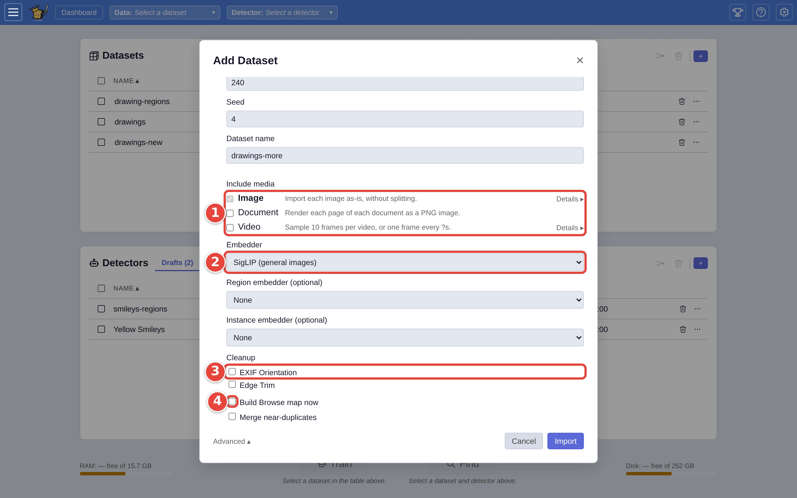
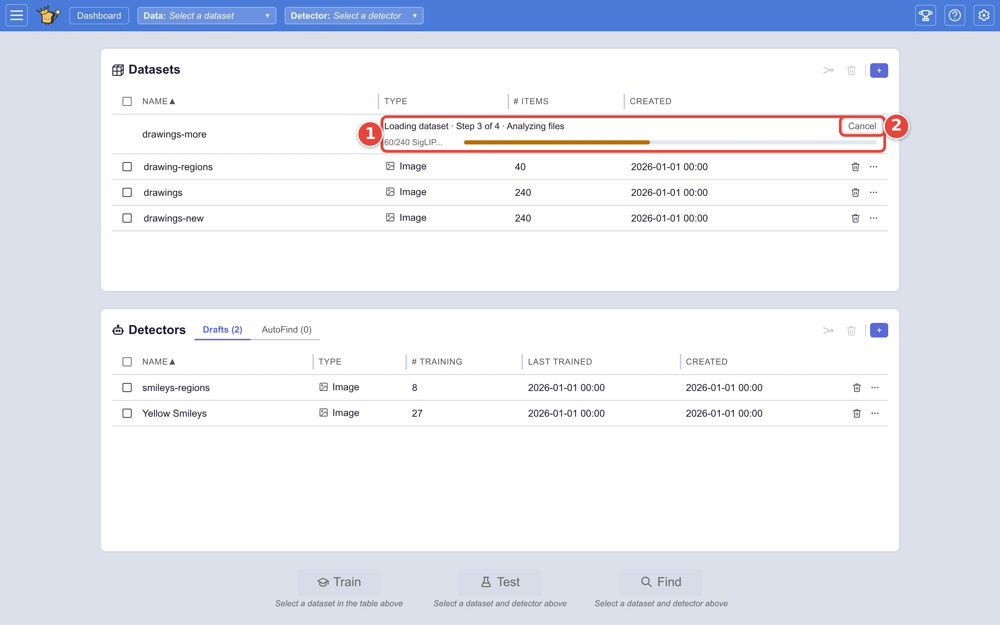

# Choose how a dataset is imported

Importing with the defaults works for most collections. The **Advanced**
section of **Add Dataset** is for when it doesn't: pictures that come inside
videos or documents, long recordings to cut into pieces, scans with blank
borders, or a collection full of near-copies. These choices are made once,
when the dataset is imported.

This page imports another pile of the drawings from [Step by step: your first search](../USER_GUIDE.md#step-by-step-your-first-search)
through the **Synthetic Media** demo. Every importer has the same **Advanced**
section. The red numbers in each screenshot show where to click, in order.

## Step 1: Open the Advanced section

Click the **+** <picture><source media="(prefers-color-scheme: dark)" srcset="../assets/icon-add-dataset.dark.webp" /></picture> on the **Datasets** card, then **Demo** and **Synthetic Media**
(or **Files** and **Folder** for pictures of your own), fill in the importer's
form, and click **Advanced ▾**, at the bottom left beside **Cancel**; its
options open at the foot of the form. Nothing in the section shows until you
open it; pointing at **Advanced** names a changed embedder, clipper or cleanup.

## Step 2: Choose

1. **Include media** says which kinds of file go in. The dataset's own kind
   is always ticked. Tick **Video** to take pictures from the frames of any
   videos in the folder, or **Document** to take a picture of each page.
   **Details ▸** beside a kind chooses how each file of that kind is cut up
   before it is analysed: frames from a video, say, or clips from a long
   recording.
2. **Embedder** is the model that makes each picture searchable. The default
   suits most collections. **Region embedder** adds a second model for
   voting on parts of a picture ([Point at the part of the picture that
   matters](vote-on-a-region.md)), and **Instance embedder** one for finding
   one particular object or logo.
3. **Cleanup** tidies each picture before it is analysed: **EXIF
   Orientation** turns photos the right way up, and **Edge Trim** cuts off
   plain borders.
4. **Build Browse map now** makes the [Browse](explore-with-browse.md) map
   during the import, so it opens straight away later. **Merge
   near-duplicates** keeps one picture of each group of near-copies (resized
   or re-saved versions of the same picture), and exporting it exports the
   whole group.

<picture>
  <source media="(prefers-color-scheme: dark)" srcset="../assets/import-advanced.dark.webp" />
  
</picture>

The **Folder** importer's own form (not under **Advanced**) also has
**Reference files in place (don't copy)**: VTSearch reads the pictures where
they are instead of keeping its own copy. That saves space, but the dataset
then breaks if the files are moved or deleted.

## Step 3: Import and watch it load

Click **Import**. The window closes, and the import runs in a row at the top
of the **Datasets** card:

1. What it is doing, with a progress bar and an estimate of the time left.
2. **Cancel** stops the import.

<picture>
  <source media="(prefers-color-scheme: dark)" srcset="../assets/import-progress.dark.webp" />
  
</picture>

Importing reads each picture, analyses it with the embedder so it can be
searched, and groups similar pictures. A few hundred pictures take a minute or
two on an ordinary computer. The first dataset set up with a given embedder
also downloads that model, once.

Defaults for all of this, per kind of media, are under **Import Defaults** in
Settings <picture><source media="(prefers-color-scheme: dark)" srcset="../assets/icon-settings.dark.webp" /></picture>.

## Where next

- [Advanced import options](../USER_GUIDE.md#advanced-import-options), in the
  user guide, including importing pictures you have already analysed.
