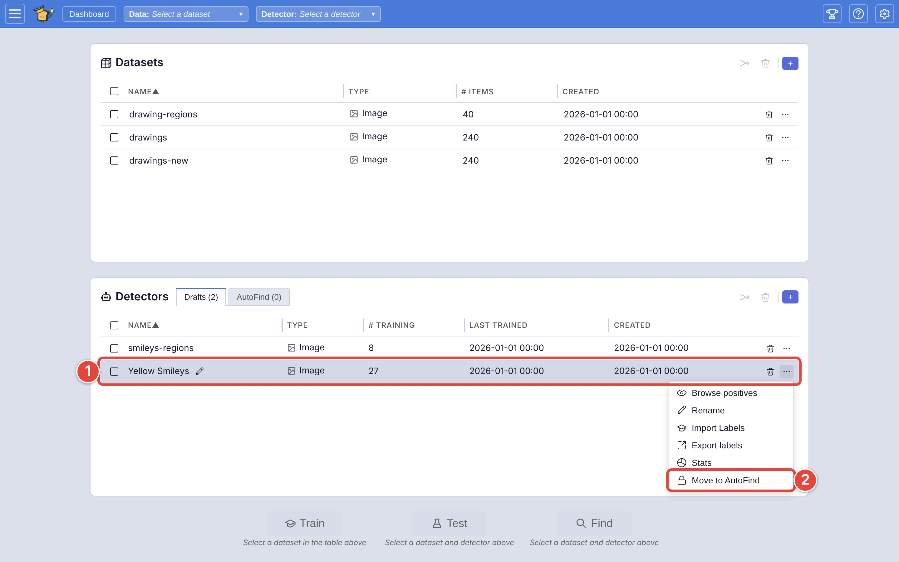
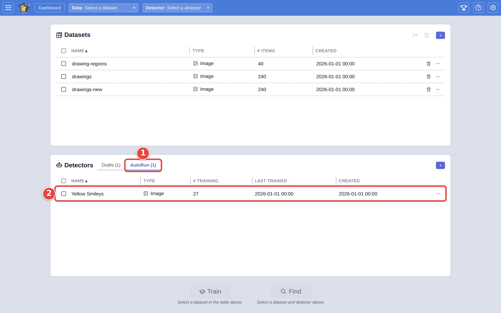
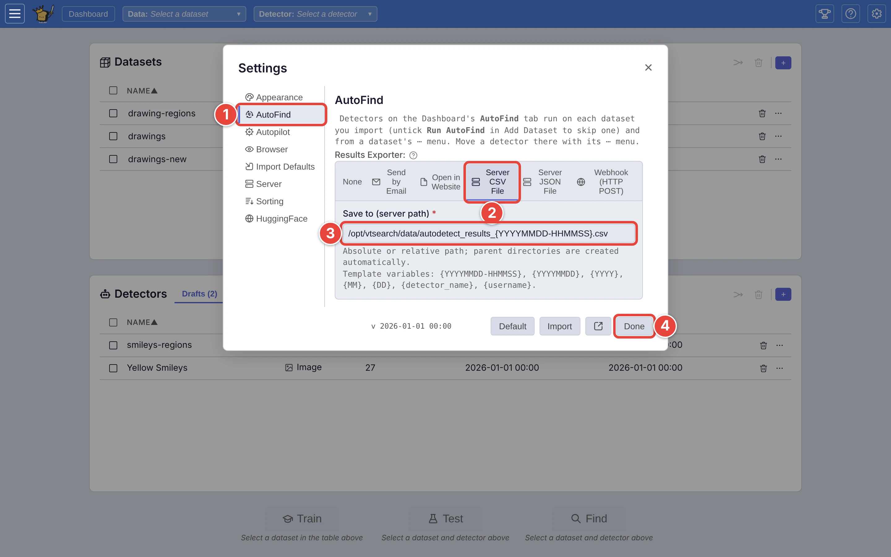

# Run your detectors on new pictures from the command line

Once you trust a detector, you may want it run over every new batch of
pictures without opening VTSearch at all: a nightly job over the day's
uploads, say. Put the detector on the **AutoFind** tab, and one command scores
a folder with every AutoFind detector and saves the matches to a file.

This page uses the `Yellow Smileys` detector and the `drawings-new` folder
from [Step by step: your first search](../USER_GUIDE.md#step-by-step-your-first-search).
The command runs on the server VTSearch is installed on. The red numbers in
each screenshot show where to click, in order.

## Step 1: Move the detector to AutoFind

On the dashboard:

1. Click the **⋯** <picture><source media="(prefers-color-scheme: dark)" srcset="../assets/icon-overflow.dark.webp" /></picture> at the end of the detector's row (`Yellow Smileys`).
2. Click **Move to AutoFind**.

<picture>
  <source media="(prefers-color-scheme: dark)" srcset="../assets/autofind-menu.dark.webp" />
  
</picture>

The detector moves from the **Drafts** tab of the **Detectors** card to the
**AutoFind** tab:

1. Click **AutoFind** to see it. The number beside the tab counts the
   detectors on it.
2. The detector's row is there, without the rename pencil and **Delete**.

<picture>
  <source media="(prefers-color-scheme: dark)" srcset="../assets/autofind-tab.dark.webp" />
  
</picture>

An AutoFind detector is *frozen*: it can't be renamed, deleted, trained or
given more labels, so what runs unattended is exactly what you tested. It can
still be tested with **Test** and run with **Find**, and its **⋯** menu keeps
**Browse positives**, **Export labels** and **Stats**. To change it, choose
**Move to Drafts** from the same menu, change it, and move it back.

Each person on a shared server has their own AutoFind list.

## Step 2: Choose where results go (optional)

The command can name a destination for its results itself (Step 3). To set
one it uses when it doesn't, click Settings <picture><source media="(prefers-color-scheme: dark)" srcset="../assets/icon-settings.dark.webp" /></picture>, then:

1. Click **AutoFind**.
2. Under **Results Exporter**, pick a destination: here **Server CSV File**.
3. Fill in its form: here, the path of the file on the server.
4. Click **Done**. Settings save as you change them.

<picture>
  <source media="(prefers-color-scheme: dark)" srcset="../assets/autofind-settings.dark.webp" />
  
</picture>

## Step 3: Run the command

On the server, from the folder VTSearch is installed in:

```bash
python app.py --autodetect --importer server_folder --path /data/drawings-new \
  --media-type image --exporter server_csv_file --filepath hits.csv
```

- `--importer server_folder --path …` is the folder of pictures to score, as
  the **Folder** importer would read it. `--media-type image` says what kind
  of media it holds; the command does not work it out for itself.
- `--exporter server_csv_file --filepath hits.csv` is where the matches go.
  Leave both out to use the destination from Step 2; with neither, the
  matches are printed.
- Every detector on the **AutoFind** tab that works on images is run. On a
  server where people log in, add `--user` and `--api-key` to run a
  particular person's list; without them, the command runs the list of the
  built-in default user, which is the one you edit on a server without
  logins.

When it finishes, it says where the matches went:

```text
Saved 46 hit(s) across 1 detector(s) to /opt/vtsearch/hits.csv.
```

The file has a row per match per detector, with the detector's name, its
cutoff, the picture's file name and score, and where the picture came from:

```text
detector,threshold,filename,category,score,origin,origin_name
Yellow Smileys,0.4891,face_0123.png,custom,0.6496,,face_0123.png
Yellow Smileys,0.4891,face_0011.png,custom,0.6433,,face_0011.png
```

The folder is also saved as a dataset, so it is on the **Datasets** card the
next time you open VTSearch. Add `--tempimport` to score it without keeping
it. The rest of the command's options are in `docs/CLI.md`.

## Where next

- [Running AutoFind on a new dataset](../USER_GUIDE.md#running-autofind-on-a-new-dataset),
  in the user guide, for the same detectors inside VTSearch: they run on each
  dataset you import, and a dataset's **⋯** menu has **Run AutoFind**.
- [Dashboard: managing datasets and detectors](../USER_GUIDE.md#dashboard-managing-datasets-and-detectors),
  in the user guide, on the **Drafts** and **AutoFind** tabs.
