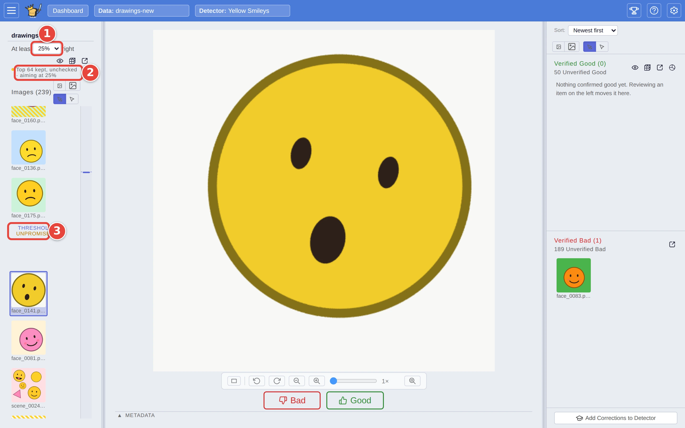
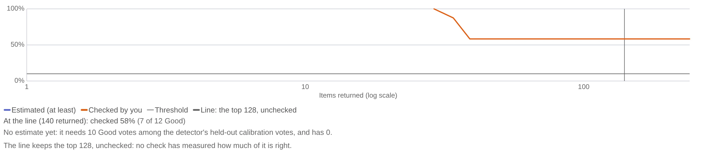

# Catch the borderline matches

Every detector draws a line: pictures above it are matches, pictures below
are not. Some real matches always land just under the line. Test already
shows you pictures from both sides of it, and moving the **Threshold**
toward **False Positives** moves the line down to let the next band of
pictures in. This page shows how to review the pictures near the line, move
the Threshold, and see what that costs you.

It picks up where [Step by step: your first search](../USER_GUIDE.md#step-by-step-your-first-search)
ends: the `Yellow Smileys` detector, trained on `drawings`, has just been run
over `drawings-new` with **Test**. The red numbers in each screenshot show
where to click, in order.

## How the Threshold moves the line

The **Threshold** sits at the top of the left-hand panel: a spectrum from
**False Positives** to **False Negatives**, with three radio buttons under
it. Each radio is a **balance** of precision and recall - how many wrong
pictures you will take in the results against how many real matches you will
accept missing - and the line is drawn where that balance is best. Toward
False Negatives it returns only the pictures most likely to be matches, and
misses more; toward False Positives it returns the most, with more wrong ones
among them; the middle radio weighs the two mistakes equally. The line keeps
the top of the ranking, and how far down it reaches is no fixed count: it is
worked out from your labels and from how common matches look in this
collection. In the example the middle radio keeps the top 36 and the False
Positives radio the top 65. So moving toward False Positives moves the line
down by a band of borderline pictures, and everything the line kept before it
still keeps.

The note under the spectrum says what the line keeps, and what the test on
the **Autopilot** tab found on it:

- **Untested · top 32 kept** - nothing has measured the line on this
  collection yet. A Threshold that keeps a different count moves the line
  straight away.
- **Tested · likely 55–80% right, about half of them found (checked 32) ·
  48 kept** - the Test autopilot has measured it with random picks from
  either side of the line, and the note says how much of what it keeps is
  likely right and how much of what the collection holds it likely found;
  see [Testing a detector](../USER_GUIDE.md#testing-a-detector).
  Moving the Threshold after a test reads *tested at another line* until you
  test again. The check Train ran measured the training collection, so it is
  not shown here.

The Threshold is frozen while a test phase runs: moving the line would move
the picks' bands under them. Test starts its test as soon as it has scored,
so answer the picks until **Done!**, as the guide's first search does, and
the Threshold is yours again.

Moving the Threshold never re-scores anything and never changes the order of
the pictures. Only the line moves. The user guide explains the line itself in
[Matches, the line, precision and recall](../USER_GUIDE.md#matches-the-line-precision-and-recall).

## Step 1: Check the pictures either side of the line

On the **Review** tab, check the pictures near the line first, as in
[Check and correct a detector's calls](check-and-correct.md). Review serves
them from both sides, alternating above and below the line, so the real
matches just under it come up wherever the Threshold sits. Every one you mark
**Good** joins **Verified Good**, and counts as a match from then on.

## Step 2: Move the Threshold toward False Positives

At the top of the left-hand panel:

1. Click the radio under the **False Positives** end of the spectrum: from
   the middle radio, that is the one to its left.
2. Read the note under it. It ends with how many the line keeps now (**65
   kept** in the example): the line has moved down, so more pictures sit
   above it and the count of **Unverified Good** on the right grows by the
   pictures it has just let in. It begins *Tested at another line*: the
   ranges it quotes are the test's, measured at the line as it was.
3. Find the line in the list: the pictures just above it are the ones the
   move let in.

Checking the pictures in the band, as Step 3 does, is one way to learn how
much of that longer list is right here; testing the new line on the
**Autopilot** tab is the other, and the one that gives a range.

<picture>
  <source media="(prefers-color-scheme: dark)" srcset="../assets/borderline-floor.dark.webp" />
  
</picture>

## Step 3: Review the pictures it let in

When the line has moved, carry on checking with **Good** and **Bad** as
before. Review now starts from the bottom of the band it just let in, the
lowest-scoring picture still above the new line, and works outwards from
there. Nothing on screen marks which pictures are new: they are the ones just
above the line, and every one you check moves to the right-hand panel.

Stop when the pictures above the line stop being matches. If you see only
misses, go back to the radio you had. If you are still finding real matches,
there is no further step toward False Positives: the line already keeps the
most it can.

## Step 4: See the trade-off

1. Click **Autopilot** at the top of the left-hand panel. If the line was
   tested before you moved the Threshold, the result reads *tested at another
   line*: click **Test this line** and answer the picks to **Done!**.
2. Read **Precision by Number Returned** in the result pane. It reads down
   the ranked list: for the top N pictures, how many of them are likely real
   matches, at every band edge, from the picks alone. Returning more (to the
   right) catches more matches, but the share that are right falls. The
   upright line is where your **Line** is now, and the legend under the chart
   says what it keeps (**Line: the top 48**). Moving the Threshold toward
   False Positives moves the Line to the right.

<picture>
  <source media="(prefers-color-scheme: dark)" srcset="../assets/borderline-chart.dark.webp" />
  
</picture>

Each band edge carries a bar: the likely range for how much of the list up to
there is right. The chart makes no guess from the pictures the detector chose
to show you; the random picks are its only source, which is why it reads the
same whether you checked near the line or not.

Point at the chart to read the curve at any band edge; with the pointer off
it, the line under the chart reads it at the Line. **Lean the Threshold**,
under the verdict, puts the same reading in a table: what each balance would
keep, the share right and the share found, and a click on one moves the
Threshold there.

## Where the setting goes

The detector keeps its Threshold (it is saved with the detector), and the
Threshold decides where the line sits the next time you run this detector, on
this dataset or any other. The line decides which unchecked pictures count as matches when
you **Export** or use **To Dataset**
([Send your matches somewhere](export-matches.md)).

Pictures that crossed the line when it moved count as *corrections* (the
detector called them one way, and the line now calls them the other). If you
then click **Add Corrections to Detector**, they are handed to the detector
along with the ones you checked by hand.

## Where next

- [Decide how far to trust a detector](trust-a-detector.md): the rest of the
  result pane.
- [Manual mode](../USER_GUIDE.md#3-threshold), in the user guide,
  describes the same Threshold while you train, and the spot check that
  measures it.
