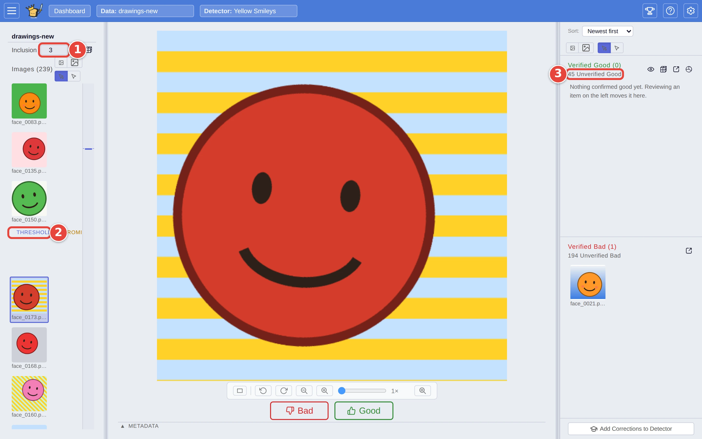

# Catch the borderline matches

Every detector draws a line: pictures above it are matches, pictures below
are not. Some real matches always land just under the line. **Inclusion**
moves the line, so you can look at the pictures just below it without
guessing where to stop. This page shows how to loosen the line, review the
pictures it lets in, and see what that costs you.

It picks up where [Step by step: your first search](../USER_GUIDE.md#step-by-step-your-first-search)
ends: the `Yellow Smileys` detector, trained on `drawings`, has just been run
over `drawings-new` with **Find**. The red numbers in each screenshot show
where to click, in order.

## How Inclusion works

**Inclusion** runs from **-10** (strict) to **+10** (lenient) and starts at
**0**. The steps *nest*: everything a match at Inclusion 1 is still a match at
Inclusion 3, along with a band of extra borderline pictures. How far one step
moves the line depends on the detector and the dataset, so the same setting
can return quite different numbers of matches on two detectors.

Moving it never re-scores anything and never changes the order of the
pictures. Only the line moves. (A detector with fewer than two **Good** and
two **Bad** answers has nothing for Inclusion to move, and its line stays
where training put it.) The user guide explains the line itself in
[Matches, the line, precision and recall](../USER_GUIDE.md#matches-the-line-precision-and-recall).

## Step 1: Check the matches at the default setting

Check the pictures near the line first, as in
[Check and correct a detector's calls](check-and-correct.md). With Inclusion
at 0, those are the calls the detector is least sure of either way.

## Step 2: Loosen the line

At the top of the left-hand panel:

1. Raise **Inclusion**: type `3`, or click the up arrow three times.
2. The line in the list of pictures moves down, so more pictures sit above
   it.
3. The count of **Unverified Good** on the right grows by the pictures the
   line has just let in.

<picture>
  <source media="(prefers-color-scheme: dark)" srcset="../assets/borderline-inclusion.dark.webp" />
  
</picture>

## Step 3: Review the pictures it let in

Carry on checking with **Good** and **Bad** as before. Find now starts from
the bottom of the band it just let in, the lowest-scoring picture still above
the new line, and works outwards from there. Nothing on screen marks which
pictures are new: they are the ones just above the line, and every one you
check moves to the right-hand panel.

Stop when the pictures above the line stop being matches. If you see only
misses, go back to the setting you had. If you are still finding real
matches, raise Inclusion another step and keep going.

## Step 4: See the trade-off

1. Click **Stats** <picture><source media="(prefers-color-scheme: dark)" srcset="../assets/icon-stats.dark.webp" /></picture>, the pie-chart button at the top of the **Verified Good** pile.
2. Scroll to **Precision by Number Returned**. It reads down the ranked list:
   for the top N pictures, how many of them are real matches. Returning more
   (to the right) catches more matches, but the share that are right falls.
   The dashed **Current cut** is where your line is now, and raising
   Inclusion moves it to the right.

<picture>
  <source media="(prefers-color-scheme: dark)" srcset="../assets/borderline-chart.dark.webp" />
  
</picture>

The chart has two lines:

- **Estimated (at least)** is VTSearch's cautious estimate, worked out from the
  detector's own answers. It needs enough **Good** answers to test itself on;
  until then the line is missing, and the chart says how many more it needs.
- **Checked by you** counts only the pictures you have checked. You check the
  ones near the line, where the detector is least sure, so it can read lower
  than the matches as a whole.

Point at the chart to read both at any count; with the pointer off it, the
line under the chart reads them at the current cut. The chart is drawn when
the Stats window opens, so close it and open it again after you move
Inclusion.

## Where the setting goes

Inclusion is saved with the detector. It is where the line sits the next time
you run Find with this detector, on this dataset or any other, and it decides
which unchecked pictures count as matches when you **Export** or use **To
Dataset** ([Send your matches somewhere](export-matches.md)).

Pictures that crossed the line when you moved it count as *corrections* (the
detector called them one way, and your setting now calls them the other). If
you then click **Add Corrections to Detector**, they are handed to the
detector along with the ones you checked by hand.

## Where next

- [Decide how far to trust a detector](trust-a-detector.md): the rest of the
  **Stats** window.
- [Manual mode](../USER_GUIDE.md#3-inclusion-stepper), in the user guide,
  describes the same setting while you train.
