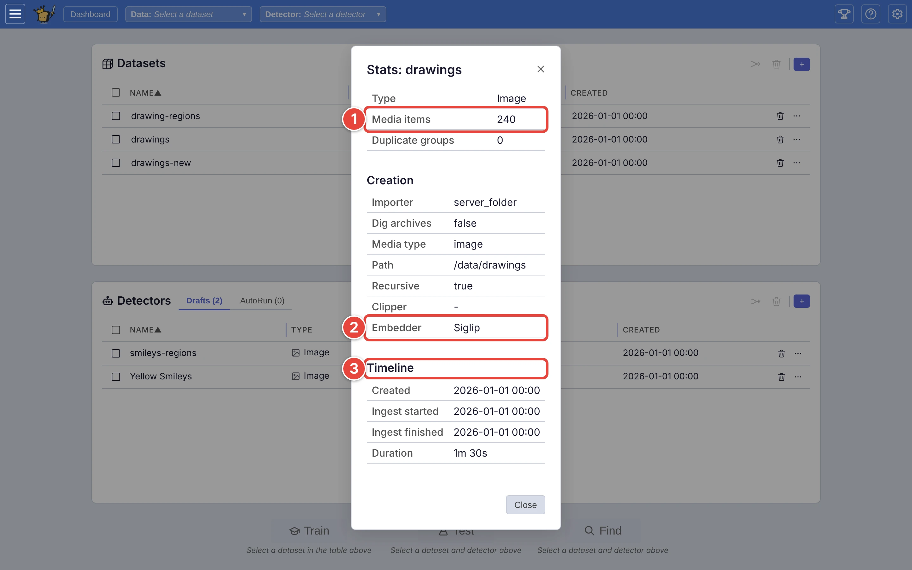
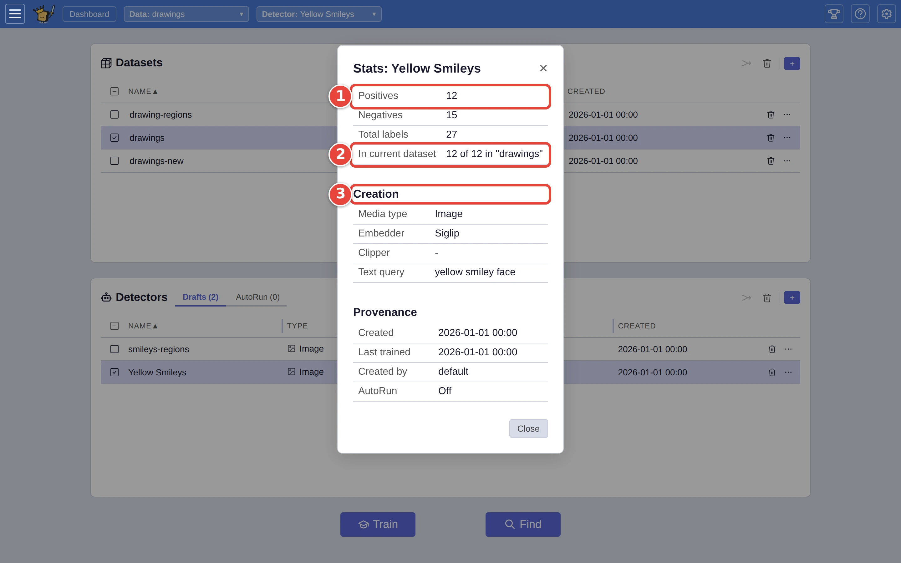

# Check what's in a dataset or a detector

Each dataset and detector keeps a record of what it holds and how it was
made. Look it up when you come back to one after a while, when someone else
made it, or before you trust a detector with new pictures.

This page uses the `drawings` dataset and the `Yellow Smileys` detector from
[Step by step: your first search](../USER_GUIDE.md#step-by-step-your-first-search).
The red numbers in each screenshot show where to click, in order.

## A dataset's stats

On the dashboard, click the **⋯** <picture><source media="(prefers-color-scheme: dark)" srcset="../assets/icon-overflow.dark.webp" /></picture> at the end of the dataset's row
(`drawings`) and choose **Stats**. The **Stats: drawings** window shows:

1. **Media items**: how many pictures it holds. **Duplicate groups** counts
   sets of pictures that are the same file under different names, which
   VTSearch keeps once each.
2. **Creation**: how it was made, including the **Importer** and its settings
   (for a folder, its path) and the **Embedder**. A detector only works on
   datasets made with a compatible embedder.
3. **Timeline** and **File Types**: when it was imported and how long that
   took, and the kinds of file it holds.

<picture>
  <source media="(prefers-color-scheme: dark)" srcset="../assets/dataset-stats.dark.webp" />
  
</picture>

When **Duplicate groups** is more than 0, a **View** button beside it lists
them: each set of copies, numbered, with where each copy came from. **Copy**
puts the list on the clipboard, and **← Back** returns to the stats.

On a server where people log in, an **Access** section also shows who made
the dataset and who else can see it.

## A detector's stats

Click the **⋯** at the end of the detector's row (`Yellow Smileys`) and
choose **Stats**. The **Stats: Yellow Smileys** window shows:

1. **Positives**, **Negatives** and **Total labels**: how many **Good** and
   **Bad** answers it has learned from.
2. **In current dataset**: how many of its answers are about pictures in
   the dataset currently open, out of all of them.
3. **Creation** and **Provenance**: its kind of media, embedder and
   description, when it was made and last trained, by whom, and whether it is
   on the **AutoRun** tab.

<picture>
  <source media="(prefers-color-scheme: dark)" srcset="../assets/detector-stats.dark.webp" />
  
</picture>

Between the counts and **Creation**, **Tested on** lists what a test in Find
measured the detector to ship, one line per dataset it was tested on: *drawings-new:
likely 70–85% right, about half of them found (34 picks, 2026-10-05)*. A line
marked *out of date* is from before the detector was last retrained; *Untested*
means no test has finished yet (see
[Decide how far to trust a detector](trust-a-detector.md)).

A detector with few answers of one kind is worth more training before you rely
on it; one whose answers are mostly about pictures elsewhere was trained on a
different collection (see [Decide how far to trust a detector](trust-a-detector.md)).

## Where next

- [Explore a dataset with Browse](explore-with-browse.md): look at the
  pictures themselves.
- [Dashboard: managing datasets and detectors](../USER_GUIDE.md#dashboard-managing-datasets-and-detectors),
  in the user guide.
