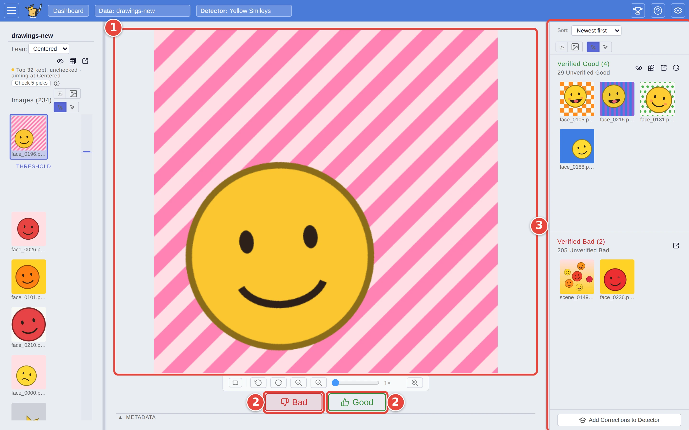
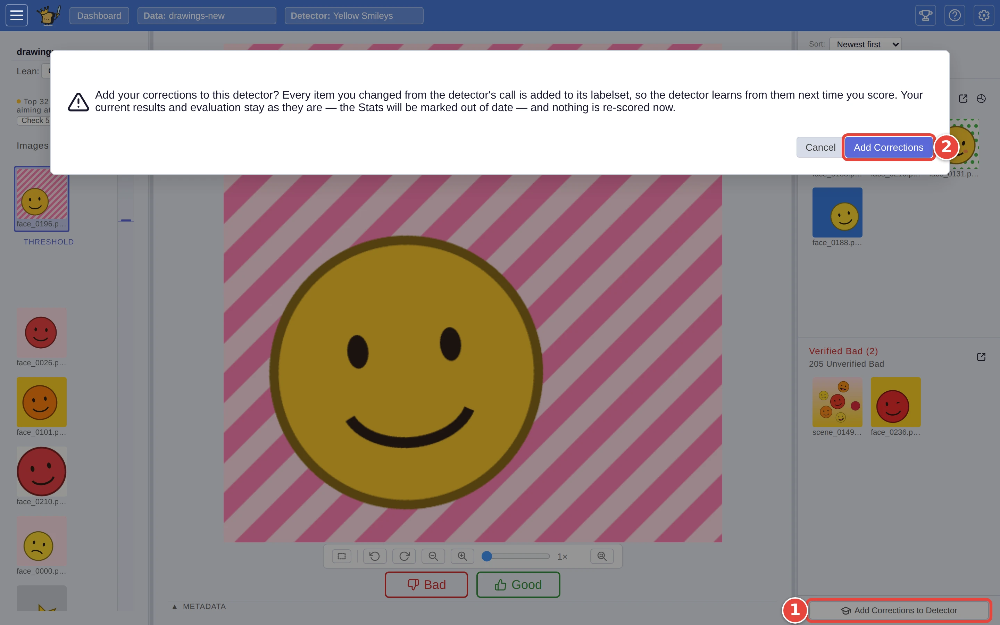

# Check and correct a detector's calls

Find marks every picture in a dataset as a match or not, but it is only as
right as the detector behind it. This page walks through checking its calls,
correcting the ones it got wrong, and handing your corrections back to the
detector, so the next run gets them right.

It picks up where [Step by step: your first search](../USER_GUIDE.md#step-by-step-your-first-search)
ends: the `Yellow Smileys` detector, trained on `drawings`, has just been run
over `drawings-new` with **Find**. The red numbers in each screenshot show
where to click, in order.

## Step 1: Check the pictures the detector is least sure of

Find opens on its **Autopilot** tab, which tests the line with random picks
(see [Find: testing and reviewing](../USER_GUIDE.md#find-testing-and-reviewing)).
Every pick you answer there is a check too, and lands in the piles below. To
check the pictures *you* choose, click **Review** at the top of the left-hand
panel: the ranked list appears, and Find brings up the picture it finds
hardest to call, the one right on its line between *match* and *not a match*.
For each picture:

1. Look at it in the middle of the screen. To check a different one, click it
   in the list on the left.
2. Click **Good** <picture><source media="(prefers-color-scheme: dark)" srcset="../assets/icon-good.dark.webp" /></picture> (or press `→`) if it is what you are looking for, **Bad** <picture><source media="(prefers-color-scheme: dark)" srcset="../assets/icon-bad.dark.webp" /></picture>
   (or press `←`) if it is not.
3. The picture moves to **Verified Good** or **Verified Bad** on the right,
   and Find brings up the next one closest to the line, taking turns between
   just above it and just below it.

<picture>
  <source media="(prefers-color-scheme: dark)" srcset="../assets/correct-verify.dark.webp" />
  
</picture>

Start at the line and work outwards: that is where the detector's mistakes
are. A yellow face that is frowning, sitting just above the line, is a
mistake to mark **Bad**; an orange face that is smiling is your call, and the
detector learns whichever way you make it. Pictures far above the line are
almost always right, so checking a dozen or two near it is usually enough.

Changed your mind? Click the picture in the pile on the right and click the
same button again: the answer is taken back, and the picture returns to the
list on the left.

## Step 2: Hand your corrections to the detector

A *correction* is any picture whose answer now differs from the detector's
original call, whether you answered it as a pick on the Autopilot tab or
here. To teach the detector those:

1. Click **Add Corrections to Detector**, at the bottom of the right-hand
   panel (the verdict on the Autopilot tab offers the same under **Add
   Corrections and retrain**).
2. Click **Add Corrections** in the dialog that asks you to confirm.

<picture>
  <source media="(prefers-color-scheme: dark)" srcset="../assets/correct-add.dark.webp" />
  
</picture>

A message in the corner says how many corrections were added. Nothing is
re-scored yet: the pictures on screen keep the calls they already had, and
the test result on the Autopilot tab is marked *out of date* until you run
Find again, since the detector has now seen the pictures it was tested on.
If every picture you checked agreed with the detector, the message says there
was nothing to add.

A correction counts whether you made it by clicking **Good** or **Bad**, or by
moving the **Threshold** so that a picture crossed the line (see
[Catch the borderline matches](borderline-matches.md)). Set the Threshold
where you want it before adding corrections.

## Step 3: Run Find again

Click **Dashboard** at the top of the screen, then, as in Step 4 of the first
search:

1. Tick the dataset (`drawings-new`).
2. Tick the detector (`Yellow Smileys`).
3. Click **Find** <picture><source media="(prefers-color-scheme: dark)" srcset="../assets/icon-find.dark.webp" /></picture>.

<picture>
  <source media="(prefers-color-scheme: dark)" srcset="../assets/step-find.dark.webp" />
  
</picture>

The detector learns from your corrections and scores the dataset again, and
the Autopilot tab tests the new line afresh. Every picture you checked keeps
the answer *you* gave it, so running Find again never undoes your work; the
rest are called afresh, and the pictures near the new line are the ones worth
checking next.

Your checked pictures stay with this dataset only while you keep working on
it: opening the detector on a different dataset (with **Train** or **Find**)
starts the next Find over from scratch. Hand them to the detector with Step 2
before you move on.

## Where next

- [Catch the borderline matches](borderline-matches.md): review the pictures
  either side of the line, and move the **Threshold** toward **False
  Positives** to let more in.
- [Decide how far to trust a detector](trust-a-detector.md): the test result
  behind these calls.
- [Send your matches somewhere](export-matches.md): export the matches, checked
  or not.
- [Find: testing and reviewing](../USER_GUIDE.md#find-testing-and-reviewing),
  in the user guide, describes every part of the Find screen.
