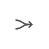
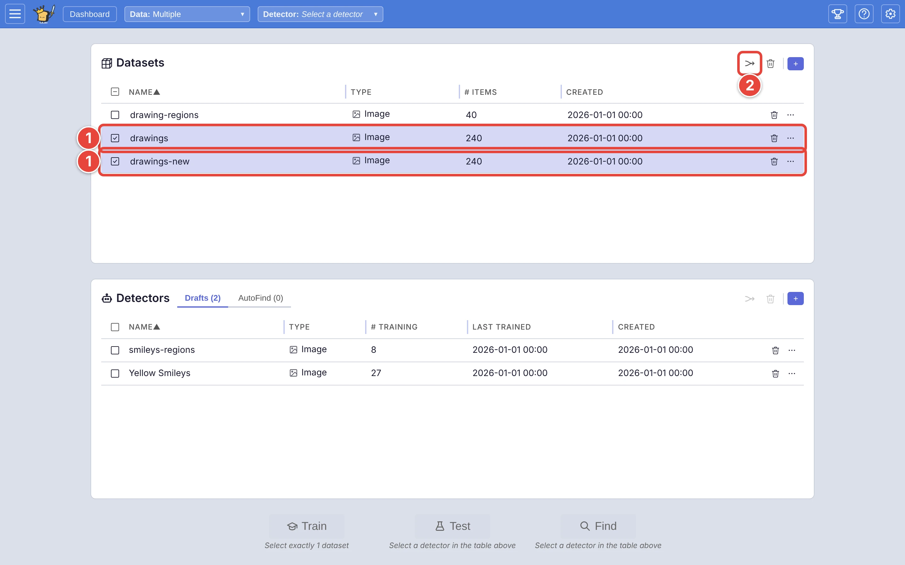
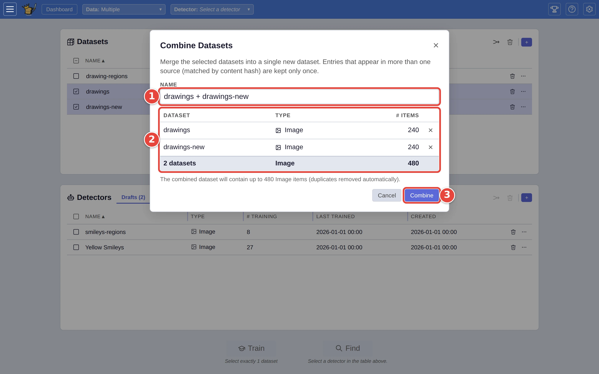
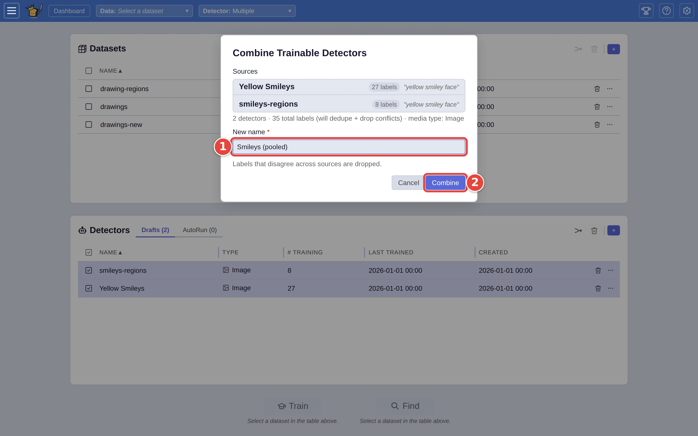

# Combine datasets or detectors

Work often starts out in pieces: pictures imported in two batches, or two
people training their own detector for the same thing. **Combine** puts the
pieces together into one new dataset, or one new detector, and leaves the
originals as they were.

This page uses the datasets and the detector from [Step by step: your first search](../USER_GUIDE.md#step-by-step-your-first-search).
The red numbers in each screenshot show where to click, in order.

## Combine datasets

On the dashboard:

1. Tick the datasets to combine (`drawings` and `drawings-new`). They must
   hold the same kind of media.
2. Click **Combine selected datasets** <picture><source media="(prefers-color-scheme: dark)" srcset="../assets/icon-combine-datasets.dark.webp" /></picture> at the top of the
   **Datasets** card. It stays greyed out until two or more are ticked.

<picture>
  <source media="(prefers-color-scheme: dark)" srcset="../assets/combine-datasets-tick.dark.webp" />
  
</picture>

In the **Combine Datasets** window:

1. **Name** starts as the datasets' names joined with `+`; change it if you
   like.
2. The list shows what goes in, with a total. The **×** on a row leaves that
   dataset out.
3. Click **Combine**.

<picture>
  <source media="(prefers-color-scheme: dark)" srcset="../assets/combine-datasets-dialog.dark.webp" />
  
</picture>

The new dataset appears on the **Datasets** card when it is ready, and a
message says how many pictures it kept. A picture in more than one of the
datasets (the same file contents, whatever its name) goes in once.

If the datasets were set up with different embedders, the window shows an
**Embedder conflicts** section: pick, for each kind, which one the combined
dataset uses.

## Combine detectors

Pooling detectors pools their answers: the new detector has every answer
from each of them. On the dashboard, on the **Drafts** tab of the **Detectors**
card:

1. Tick the detectors to combine. They must be for the same kind of media.
2. Click **Combine selected detectors**, the same button at the top of the
   **Detectors** card.

In the **Combine Trainable Detectors** window:

1. Type a **New name**.
2. Click **Combine**.

<picture>
  <source media="(prefers-color-scheme: dark)" srcset="../assets/combine-detectors-dialog.dark.webp" />
  
</picture>

Where the detectors disagree about a picture (one said **Good**, the other
**Bad**), that picture is left out of the new detector, as the window says.
The new detector lands on the **Drafts** tab, ready to train or run.

Detectors on the **AutoFind** tab can't be combined; move them to **Drafts**
first (their **⋯** menu, **Move to Drafts**).

## Where next

- [Dashboard: managing datasets and detectors](../USER_GUIDE.md#dashboard-managing-datasets-and-detectors),
  in the user guide.
