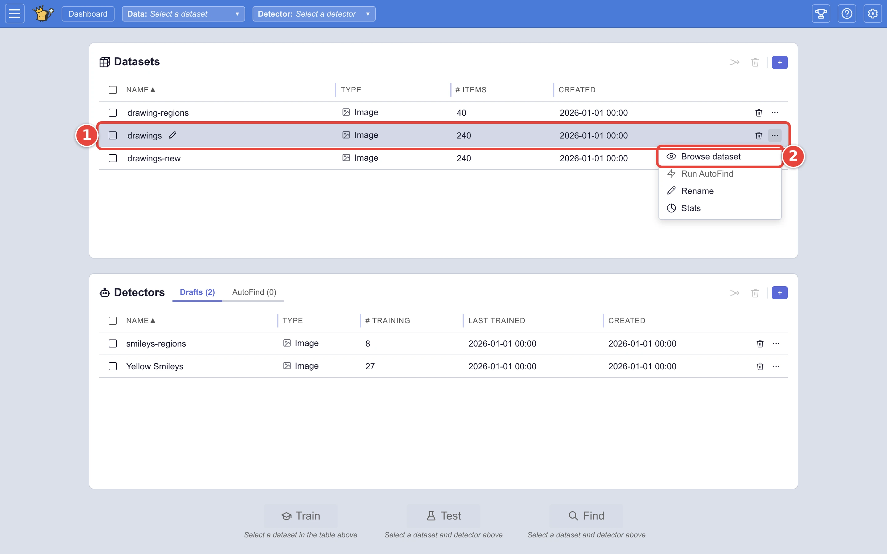
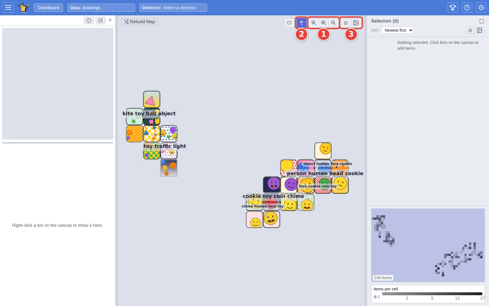
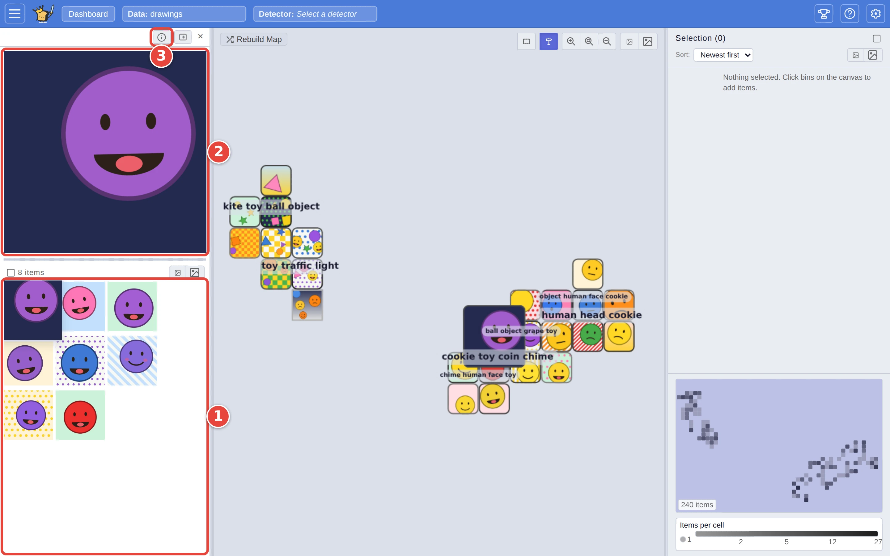
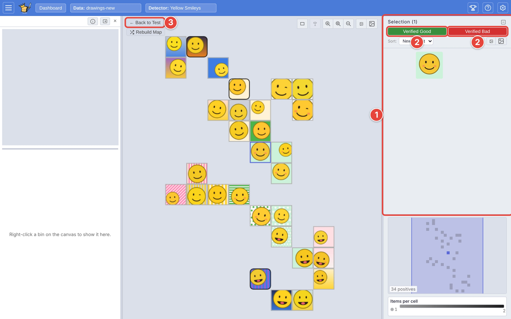

# Explore a dataset with Browse

Before you train anything, it helps to see what a dataset holds: which kinds
of picture there are, how many of each, and what sits between them. **Browse**
lays the whole dataset out as a map, with similar pictures near each other, so
you can look it over by eye. Opened from Test, the same map lets you check the
matches a screenful at a time.

This page uses the datasets and the detector from [Step by step: your first search](../USER_GUIDE.md#step-by-step-your-first-search).
The red numbers in each screenshot show where to click, in order.

## Step 1: Open the map

On the dashboard:

1. Click the **⋯** <picture><source media="(prefers-color-scheme: dark)" srcset="../assets/icon-overflow.dark.webp" /></picture> at the end of the dataset's row (`drawings`).
2. Click **Browse dataset**.

<picture>
  <source media="(prefers-color-scheme: dark)" srcset="../assets/browse-menu.dark.webp" />
  
</picture>

The first time, VTSearch builds the map: the dataset's row shows the progress,
and the map opens when it is done. After that it opens straight away. (To
build it while importing instead, see
[Choose how a dataset is imported](advanced-import.md).)

## Step 2: Find your way around

Drag the map to move around it, and scroll to zoom. The buttons at the top
right of the map:

1. **Zoom in**, **Zoom to fit** and **Zoom out**.
2. **Signposts** puts names over the regions of the map: broad names when you
   are zoomed out, finer ones as you zoom in. A name in italics with a `~`
   in front covers a region too mixed for one name to describe; read it as a
   direction rather than a label.
3. **Smaller thumbnails** and **Bigger thumbnails**.

<picture>
  <source media="(prefers-color-scheme: dark)" srcset="../assets/browse-toolbar.dark.webp" />
  
</picture>

Each tile gathers the pictures that landed in that part of the map, and its
colour says how many; the **legend** on the right reads the colours off, and
the **minimap** above it shows where you are. Pointing at a tile enlarges its
picture. The arrow keys move the map too, and `+` and `-` zoom.

**Rebuild Map**, at the top left, lays the pictures out afresh, for when a
cluster has landed somewhere awkward.

## Step 3: Look inside a tile

Right-click a tile. Its pictures fill the panel on the left:

1. A grid of every picture in the tile, with a count at the top.
2. A large view of the picture you point at.
3. **ⓘ** shows each picture's details (name, MD5 and any the dataset
   carries), each with a copy button.

<picture>
  <source media="(prefers-color-scheme: dark)" srcset="../assets/browse-bin.dark.webp" />
  
</picture>

The panel's pop-out button turns it into a window you can move over the map;
the window's dock button puts it back.

## Step 4: Select pictures

Click a tile to add its pictures to the **Selection** panel on the right, and
click it again to take them out. The **Region select** button (the dashed
rectangle at the top right), or `Shift` and a drag, selects every tile inside
the box you draw. Click a picture in the **Selection** list to take it out
again; the checkbox at the top selects everything in view, or clears the
selection.

On a whole dataset the selection is for looking: it collects the pictures you
want to compare side by side, and is gone when you leave Browse. Opened from
Test, it does more.

## Browse the matches from Test

In Test's **Review** tab, the eye button at the top of the **Verified Good** pile opens Browse
on just the matches, checked or not. (The eye beside the **Threshold** on
the left opens only the ones you haven't checked.) Wrong matches tend to sit together
on the map, which makes them quick to clear out:

1. Select the tiles that are wrong, or right.
2. Click **Verified Bad** (or **Verified Good**). The pictures are marked that
   way, as if you had checked each one in Test, and leave the map.
3. Click **← Back to Test**. Your checks are in the piles on the right.

<picture>
  <source media="(prefers-color-scheme: dark)" srcset="../assets/browse-find.dark.webp" />
  
</picture>

## Where next

- [Check and correct a detector's calls](check-and-correct.md): the same
  checking, one picture at a time.
- [Browse: exploring a dataset spatially](../USER_GUIDE.md#browse-exploring-a-dataset-spatially),
  in the user guide.
