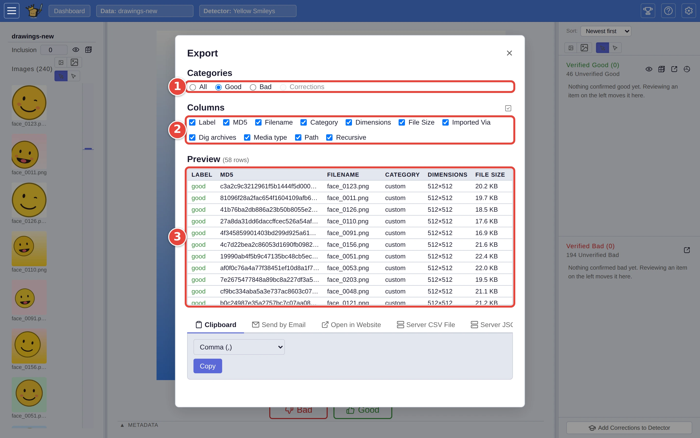
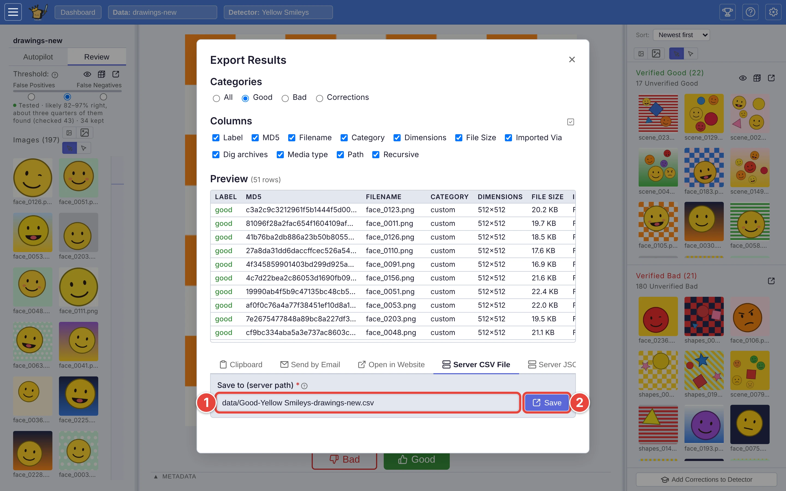
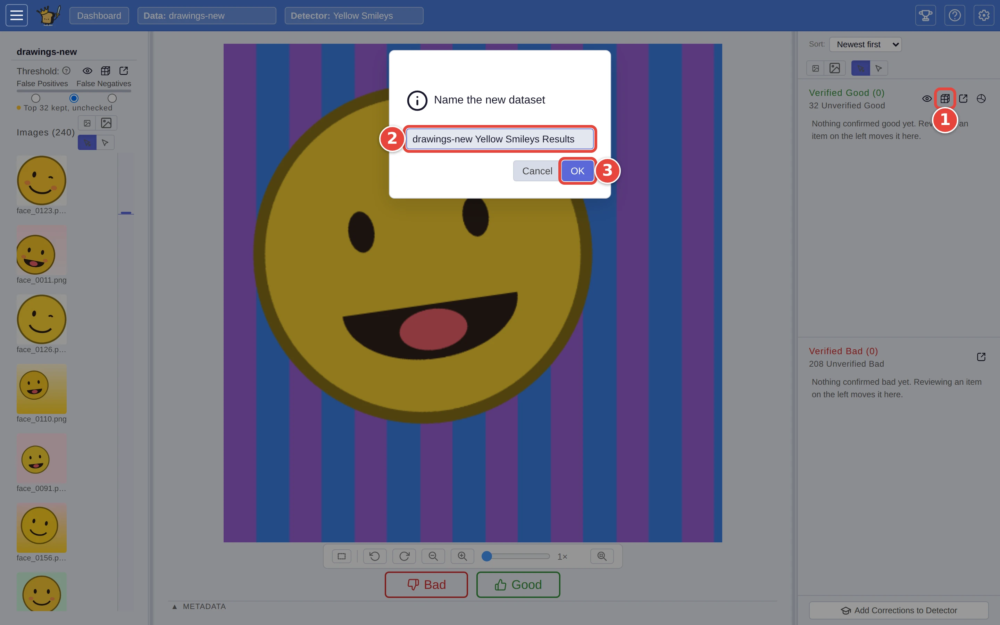

# Send your matches somewhere

Once Find has marked the matches, you will usually want them somewhere else:
pasted into a spreadsheet, saved as a file, opened in another tool, or kept
as a dataset of their own. This page walks through each.

It picks up where [Step by step: your first search](../USER_GUIDE.md#step-by-step-your-first-search)
ends: the `Yellow Smileys` detector, trained on `drawings`, has just been run
over `drawings-new` with **Find**. The red numbers in each screenshot show
where to click, in order.

## What gets sent

The *good set* is every picture you checked and marked **Good**, plus every
picture you haven't checked that sits above the detector's line. Checking
pictures is optional; if the line moves with the **precision floor**
([Catch the borderline matches](borderline-matches.md)), the good set moves
with it.

Three small buttons at the top of the **Verified Good** pile act on the good
set: **To Dataset** <picture><source media="(prefers-color-scheme: dark)" srcset="../assets/icon-to-dataset.dark.webp" /></picture>, **Export** <picture><source media="(prefers-color-scheme: dark)" srcset="../assets/icon-export.dark.webp" /></picture> and **Browse** (the eye). The
**Export** button at the top of **Verified Bad** does the same for the
pictures that did not match, and the three buttons next to the precision
floor on the left act on only the matches you haven't checked yet.

## Step 1: Choose what to send

Click **Export** at the top of the **Verified Good** pile. In the **Export
Results** window:

1. **Categories**: keep **Good** for the matches. **All** sends the
   non-matches as well, labelled; **Corrections** sends only the pictures
   whose answer you changed from the detector's call.
2. **Columns**: untick any you don't want. **Label**, **MD5**, **Filename**
   and **Category** come first, followed by any details the dataset carries.
3. **Preview** shows exactly the rows that will be sent.

<picture>
  <source media="(prefers-color-scheme: dark)" srcset="../assets/export-choose.dark.webp" />
  
</picture>

## Step 2: Send it

The tabs below the preview are the places it can go.

**To paste it somewhere,** stay on **Clipboard**:

1. Pick a delimiter: **Comma** for a CSV, **Tab** to paste straight into a
   spreadsheet.
2. Click **Copy**. The button flashes *Copied!*; paste wherever you like.

**To save it as a file on the server,** click **Server CSV File** (or **Server
JSON File**):

1. **Save to (server path)** starts as `data/Good-Yellow Smileys-drawings-new.csv`;
   change it if you want the file somewhere else.
2. Click **Save**. The window closes and a message says where the file went.

<picture>
  <source media="(prefers-color-scheme: dark)" srcset="../assets/export-server-csv.dark.webp" />
  
</picture>

The file lands on the **server** running VTSearch, not on your own computer.
To get it onto your computer, use **Clipboard**, or ask whoever runs the
server.

**The other tabs:**

- **Open in Website** is for a tool that takes a list of identifiers in its
  address. Give it a **URL Template** such as
  `https://example.com/review?ids={ids}`; VTSearch puts the matches'
  identifiers in place of `{ids}` and opens the address in a new browser tab.
  **Identifier** picks which column they come from, and **Max items** caps
  how many (a very long address is refused rather than cut short). Nothing is
  sent from the server, but the destination sees everything in the address.
- **Send by Email** emails the list, if the server is set up to send email.
- **Webhook (HTTP POST)** sends the list to an address you give it, for
  another program to pick up.

## Or: keep the matches as a dataset

1. Click **To Dataset** <picture><source media="(prefers-color-scheme: dark)" srcset="../assets/icon-to-dataset.dark.webp" /></picture> at the top of the **Verified Good** pile.
2. Name the new dataset. It starts as `drawings-new Yellow Smileys Results`.
3. Click **OK**.

<picture>
  <source media="(prefers-color-scheme: dark)" srcset="../assets/export-to-dataset.dark.webp" />
  
</picture>

The new dataset is made in the background while you carry on in Find, and a
message says when it is on the **Datasets** card. It holds only the matches,
so you can search inside them with a second detector: find the yellow smileys
first, say, then just the winking ones among them.

## Where next

- [Exporting your work](../USER_GUIDE.md#exporting-your-work), in the user
  guide, covers every export format.
- [Move a detector to another VTSearch](move-a-detector.md): export the
  detector itself, rather than its matches.
