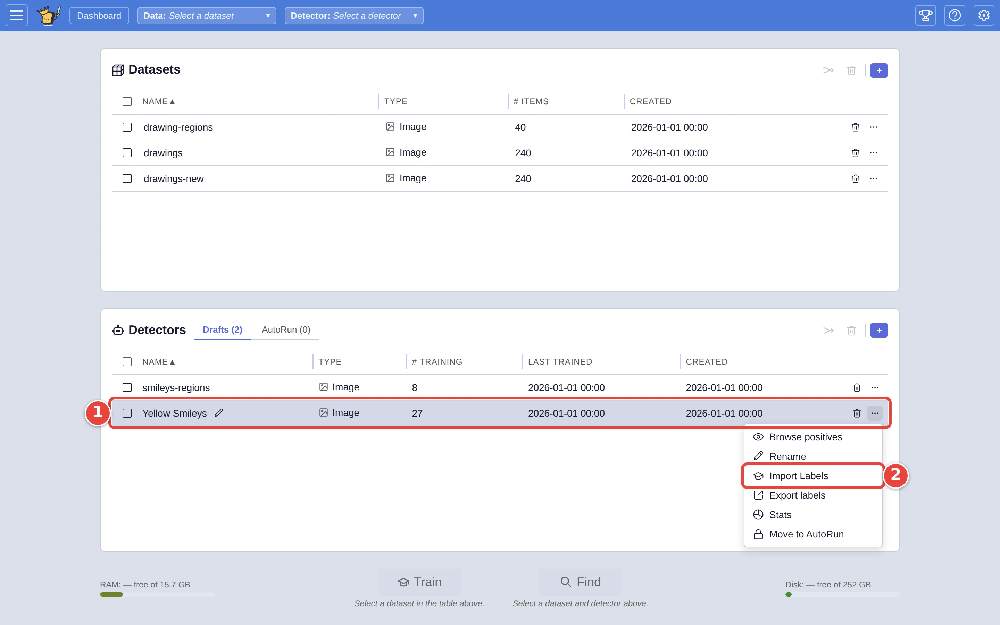
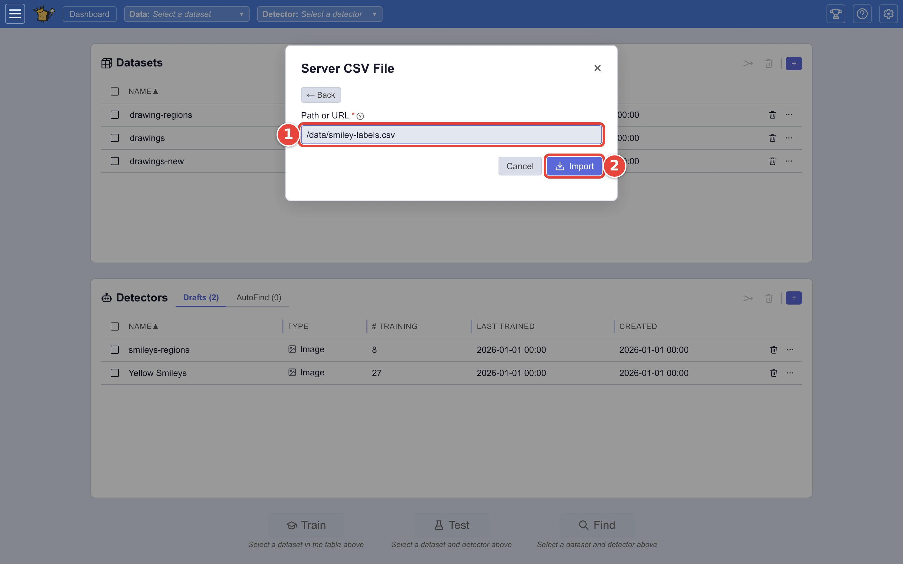

# Add labels you already have

If someone has already sorted some of your pictures (in a spreadsheet, or in
another tool), those answers can teach a detector without anyone clicking
through them again. Put them in a CSV file, and VTSearch adds them to a
detector as if you had answered them yourself.

This page adds answers to the `Yellow Smileys` detector from [Step by step: your first search](../USER_GUIDE.md#step-by-step-your-first-search).
The red numbers in each screenshot show where to click, in order.

## Step 1: Write the file

A CSV file with a header row and one row per picture. Two columns are needed:

- `md5`: the picture's MD5, a fingerprint of the file's contents. VTSearch
  matches each row to a picture by it, so it still matches if the file has
  been renamed or moved.
- `label`: `good` or `bad`.

```text
md5,label
5d41402abc4b2a76b9719d911017c592,good
7d793037a0760186574b0282f2f435e1,bad
```

`filename` and `category` columns are kept if present, which makes the file
easier to read, but the matching is done by `md5`. Rows whose label is neither
`good` nor `bad` are skipped.

To get the MD5s, run `md5sum` over the folder on the server, or export them
from VTSearch: the **Export** window's **Clipboard** tab includes an **MD5**
column (see [Send your matches somewhere](export-matches.md)). Save the
file somewhere on the server VTSearch runs on.

## Step 2: Open Import Labels on the detector

On the dashboard:

1. Click the **⋯** <picture><source media="(prefers-color-scheme: dark)" srcset="../assets/icon-overflow.dark.webp" /></picture> at the end of the detector's row (`Yellow Smileys`).
2. Click **Import Labels**.

<picture>
  <source media="(prefers-color-scheme: dark)" srcset="../assets/labels-menu.dark.webp" />
  
</picture>

For a detector that doesn't exist yet, make one first: describe what it looks
for, as in Step 2 of the first search, and add the file to it.

## Step 3: Import the file

The window is titled **Import Labels into Yellow Smileys**. Click **Server CSV
File**, then:

1. Under **Path or URL**, type the file's path on the server.
2. Click **Import**.

<picture>
  <source media="(prefers-color-scheme: dark)" srcset="../assets/labels-import-form.dark.webp" />
  
</picture>

A line in the window reports how many answers were added and how many were
skipped. A row is skipped when its label isn't `good` or `bad`, or when the
detector already has the same answer for that picture. An answer that
disagrees with one the detector already has replaces it.

The answers apply to the pictures with those MD5s in whichever dataset you
train or search with the detector. A row whose picture isn't in any dataset
you have loaded is kept, and applies once one is.

## Where next

- [Move a detector to another VTSearch](move-a-detector.md): the same idea,
  for a whole detector exported from VTSearch.
- [Importing pre-trained detectors](../USER_GUIDE.md#importing-pre-trained-detectors),
  in the user guide.
