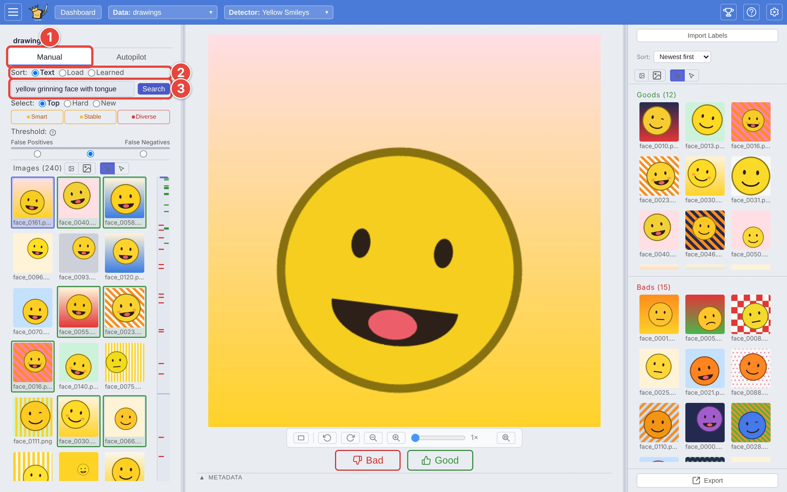
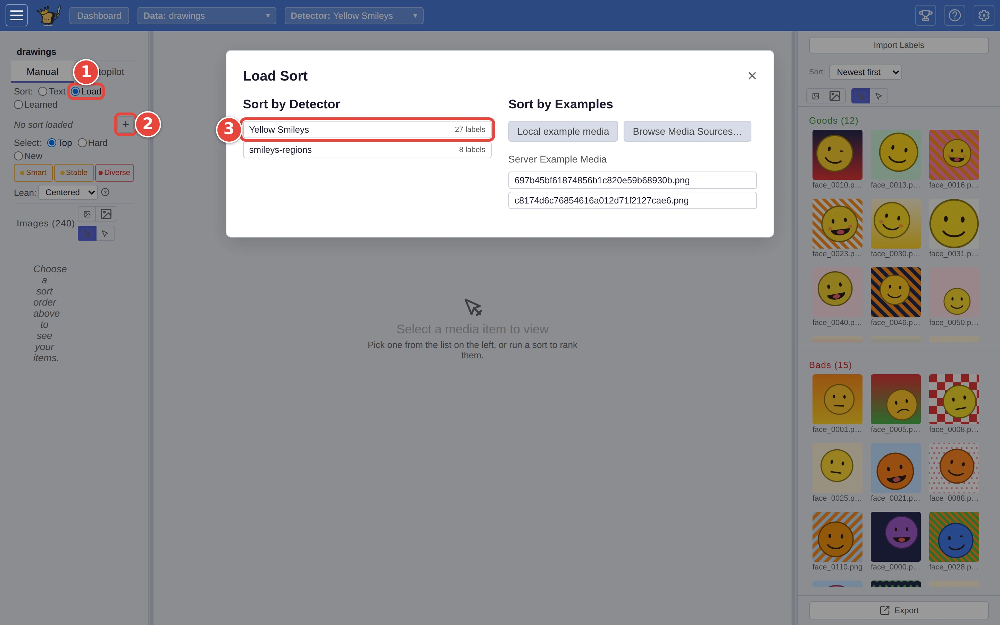

# Label in Manual mode

Autopilot decides which picture to show you next. **Manual** mode hands that
decision to you: you choose how the list is sorted, and which picture from it
comes up next. Use it to search the dataset in your own words, to rank it by
another detector, or to go after one particular kind of picture.

This page picks up from Step 2 of [Step by step: your first search](../USER_GUIDE.md#step-by-step-your-first-search):
training `Yellow Smileys` on `drawings`, in the labeling view. The red numbers
in each screenshot show where to click, in order.

## Step 1: Switch to Manual and sort the list

1. Click the **Manual** tab at the top of the left-hand panel. Autopilot
   pauses, and the controls start out matching the phase it was in.
2. Next to **Sort**, pick how the list is ranked. **Text** ranks it by a
   description.
3. Type the description, such as `yellow grinning face with tongue`, and
   click **Search** (or press `Enter`). The list re-ranks, best match first.

<picture>
  <source media="(prefers-color-scheme: dark)" srcset="../assets/manual-text-sort.dark.webp" />
  
</picture>

The other two sorts:

- **Learned** ranks by the detector you are training, retraining it after
  every answer. It needs at least one **Good** and one **Bad** answer first.
  This is what Autopilot uses once it has enough answers.
- **Load** ranks by something else. Click the **+** beside *No sort loaded*
  to choose: **Sort by Detector** ranks by any saved detector that has
  answers, and **Sort by Examples** ranks by how closely each picture
  resembles one you pick.

<picture>
  <source media="(prefers-color-scheme: dark)" srcset="../assets/manual-load-sort.dark.webp" />
  
</picture>

To rank by one picture already in the list, right-click it and choose **Sort by
similarity to this** (or **Crop, then sort by similarity…** to use only part of
it).

## Step 2: Choose which picture comes next

Next to **Select**:

- **Top**: the best-ranked picture you haven't answered. The quickest way to
  collect matches.
- **Hard**: the picture closest to the detector's line between match and not.
  Answering these teaches the detector fastest.
- **New**: a picture from a part of the dataset your answers haven't covered
  yet, to catch the kinds of picture you haven't seen.

## Step 3: Answer

Click **Good** or **Bad** (or press `→` or `←`) as always. Every answer brings
up the next picture that **Sort** and **Select** point to, so a run of answers
needs no clicking in the list. You can still click any picture in the list to
answer it out of turn.

Below **Select**, the **precision floor** (**Lean: Centered**) sets whether
the detector leans toward returning every match it can (**Complete**) or only
the ones most likely right (**Correct**), which moves its line between match
and not a match without changing the order of the list. The
note under it says whether the line can keep that promise yet (see
[Catch the borderline matches](borderline-matches.md)).

## Step 4: Hand back to Autopilot

Click the **Autopilot** tab. Autopilot counts the answers you gave in Manual
mode and carries on in whichever phase they have earned. A handful of **Good**
answers found by a Manual search is the usual way to give a stuck Autopilot
its start (see [Get Autopilot unstuck](unstick-autopilot.md)).

## Where next

- [Manual mode: for power users](../USER_GUIDE.md#manual-mode-for-power-users),
  in the user guide.
