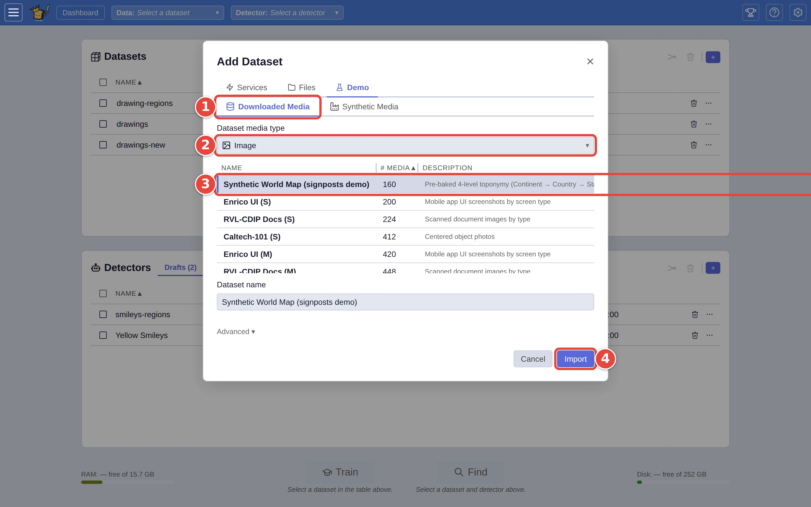

# Load a ready-made demo dataset

No pictures of your own to hand? VTSearch has two kinds of demo dataset. The
**Synthetic Media** demo draws its pictures itself, like the drawings in
[Step by step: your first search](../USER_GUIDE.md#step-by-step-your-first-search).
**Downloaded Media** is a catalogue of open collections of real media (photos,
sounds, text, video and documents) that VTSearch downloads for you. This page
loads one of those. The red numbers in each screenshot show where to click, in
order.

## Step 1: Pick a collection

Click the **+** <picture><source media="(prefers-color-scheme: dark)" srcset="../assets/icon-add-dataset.dark.webp" /></picture> on the **Datasets** card, then **Demo**. Then:

1. Click **Downloaded Media**.
2. Under **Dataset media type**, pick the kind of media: here **Image**.
3. Click a collection in the table to choose it. The **Readiness** column
   says what loading it involves.
4. Click **Import**.

<picture>
  <source media="(prefers-color-scheme: dark)" srcset="../assets/demo-catalogue.dark.webp" />
  
</picture>

**Readiness** is one of:

- **Ready**: already downloaded and analysed; it loads straight away.
- **Needs setup**: already downloaded, but it has to be analysed with the
  embedder you have chosen before it can be searched.
- **Needs Download**: it has to be downloaded first, from a few MB to many
  GB depending on the collection (the full list, with sizes, is in
  `docs/demos.md`).

Several collections come in more than one size: **(S)**, **(M)** and **(L)**
are separate rows. Start small.

Clicking a row only chooses it, and fills in **Dataset name**; nothing
downloads until you click **Import**. Downloads are kept, so loading the same
collection again is quick.

## Step 2: Watch it load

The window closes, and the download and import run in a row at the top of the
**Datasets** card, with a **Cancel** button (see [Choose how a dataset is
imported](advanced-import.md#step-3-import-and-watch-it-load)). The dataset
appears on the card when it is ready.

## Gated collections

A few collections are published on HuggingFace behind a sign-in. To load one,
click Settings <picture><source media="(prefers-color-scheme: dark)" srcset="../assets/icon-settings.dark.webp" /></picture>, then **HuggingFace**, then **Sign in with
HuggingFace**, and accept the collection's terms on HuggingFace when it asks.
If a load fails for this reason, its row on the **Datasets** card offers the
same **Sign in with HuggingFace** button. The sign-in has to be set up on the
server first; if it isn't, the **HuggingFace** tab says what the person who
runs it needs to do.

## Where next

- [Choose how a dataset is imported](advanced-import.md): the **Advanced**
  section works for demo collections too, including **Convert to**, which
  turns a demo into another kind of media (scanned documents into page
  images, say).
- [Loading a dataset](../USER_GUIDE.md#loading-a-dataset), in the user guide.
