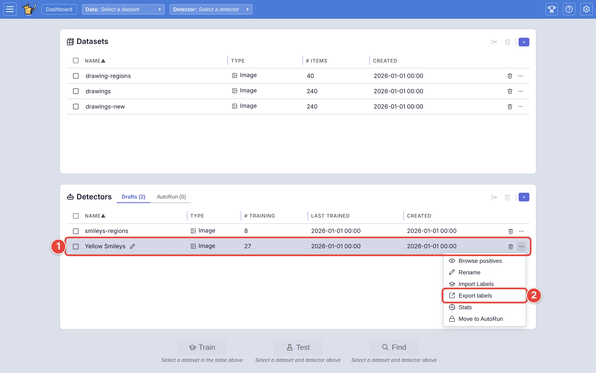
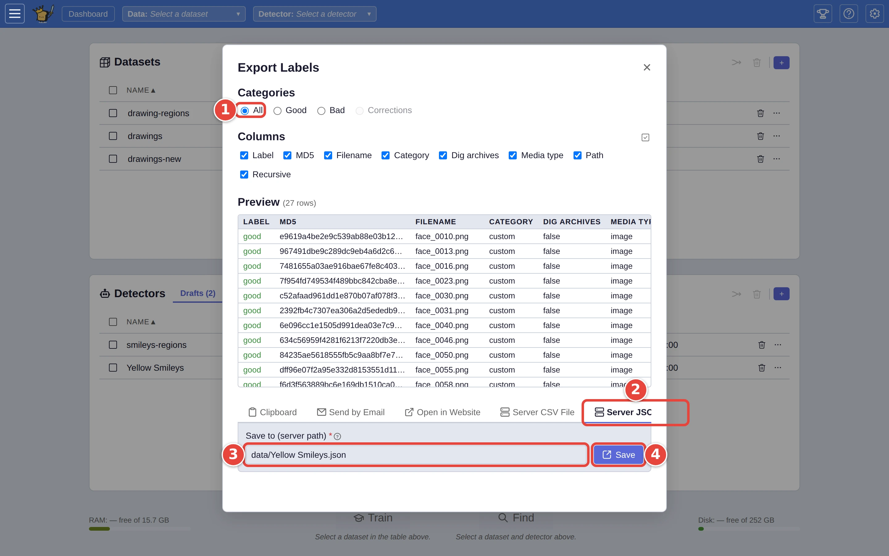
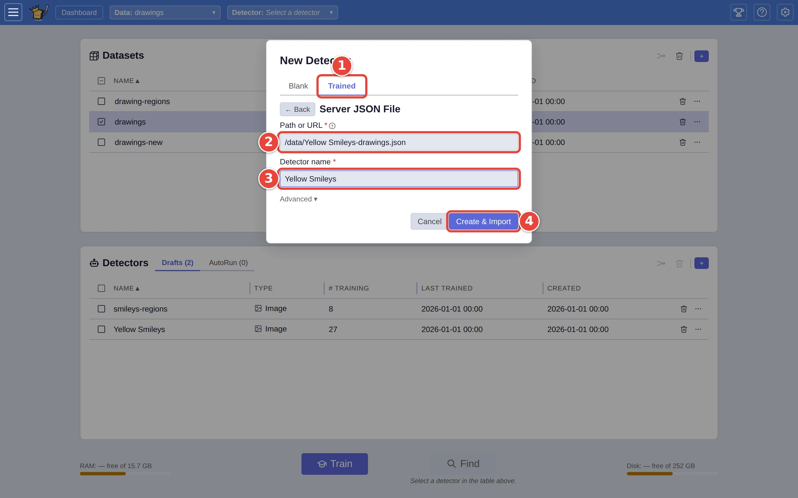

# Move a detector to another VTSearch

A detector is its answers: every picture you marked **Good** or **Bad**,
and where each one came from. VTSearch rebuilds the detector from those
answers whenever it loads it. So moving a detector to another VTSearch server
(a colleague's, or a new install of your own) means exporting its answers to
a file and making a detector from that file at the other end.

This page moves the `Yellow Smileys` detector from [Step by step: your first search](../USER_GUIDE.md#step-by-step-your-first-search).
The red numbers in each screenshot show where to click, in order.

## Step 1: Export the detector's answers

On the dashboard of the VTSearch you are moving from:

1. Click the **⋯** <picture><source media="(prefers-color-scheme: dark)" srcset="../assets/icon-overflow.dark.webp" /></picture> at the end of the detector's row (`Yellow Smileys`).
2. Click **Export labels**.

<picture>
  <source media="(prefers-color-scheme: dark)" srcset="../assets/move-export-menu.dark.webp" />
  
</picture>

## Step 2: Save them to a file

In the **Export Labels** window:

1. Leave **Categories** on **All**. The detector learns from its **Bad**
   answers as much as its **Good** ones, and the other end can't rebuild it
   from only one kind.
2. Click **Server JSON File**.
3. **Save to (server path)** starts as `data/Yellow Smileys-drawings.json`;
   change it if you want the file somewhere else.
4. Click **Save**.

<picture>
  <source media="(prefers-color-scheme: dark)" srcset="../assets/move-export-save.dark.webp" />
  
</picture>

The file lands on the server running VTSearch. Copy it to the other server
however you usually move files between them.

## Step 3: Make a detector from the file

On the dashboard of the VTSearch you are moving to, tick a dataset of the same
kind of media, then click the **+** <picture><source media="(prefers-color-scheme: dark)" srcset="../assets/icon-new-detector.dark.webp" /></picture> on the **Detectors** card:

1. Click the **Trained** tab, then **Server JSON File** under **Import labels
   from**.
2. Under **Path or URL**, type the file's path on that server.
3. Name the detector (**Detector name**).
4. Click **Create & Import**.

<picture>
  <source media="(prefers-color-scheme: dark)" srcset="../assets/move-trained-tab.dark.webp" />
  
</picture>

Despite its name, **Path or URL** takes a path on the server; a web address
is not fetched.

The new detector appears on the **Drafts** tab. Each answer in the file names
the picture it is about, by where it came from and by its MD5 (a fingerprint
of the file's contents). Pictures already in the dataset you ticked are
matched by MD5; the rest are fetched from where they came from, if that
server can reach them, and added to that dataset. Answers whose pictures it
can reach neither way are kept, but play no part until a dataset holding
those pictures is loaded.

**Trained** takes files exported from VTSearch, which record where each picture
came from. To bring in answers made some other way, see
[Add labels you already have](import-labels.md).

## Where next

- [Send your matches somewhere](export-matches.md): export a detector's
  *matches* rather than the detector.
- [Exporting a detector](../USER_GUIDE.md#exporting-a-detector), in the user
  guide, including the standalone scoring bundle for people without VTSearch.
