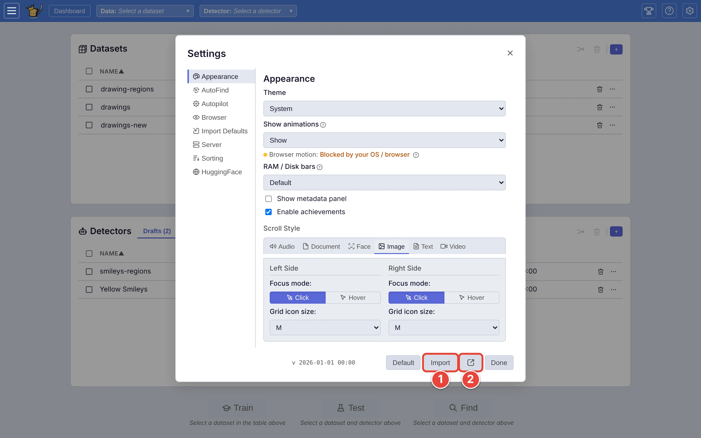
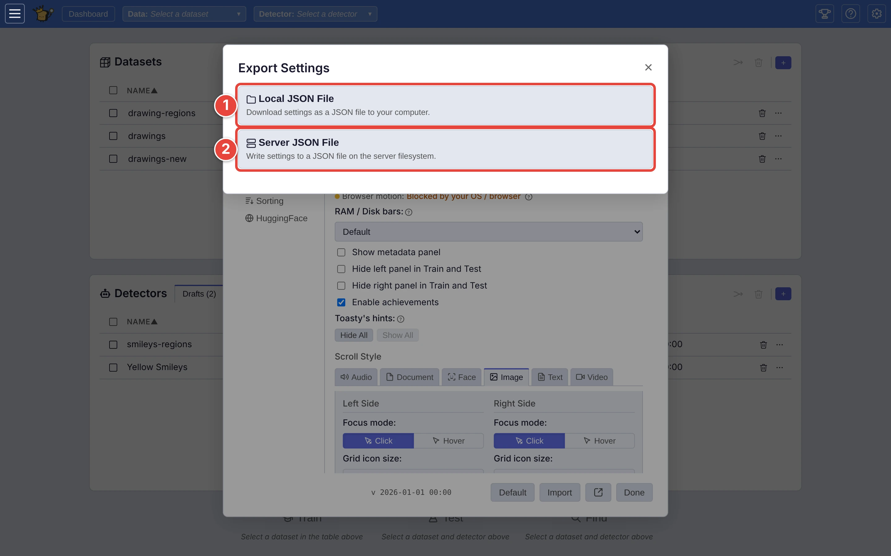

# Save and restore your settings

Your settings (theme, Autopilot's numbers, import defaults, your **AutoFind**
list and more) can be saved to a file and loaded again: to keep a copy before
you experiment, to set up a second server the way you like it, or to hand a
colleague your setup.

The red numbers in each screenshot show where to click, in order.

## Step 1: Open the settings footer

Click Settings <picture><source media="(prefers-color-scheme: dark)" srcset="../assets/icon-settings.dark.webp" /></picture> at the top right. At the bottom of the window:

1. **Import** loads settings from a file.
2. **Export** (the box-with-an-arrow button) saves them to one.

<picture>
  <source media="(prefers-color-scheme: dark)" srcset="../assets/settings-footer.dark.webp" />
  
</picture>

Settings save themselves as you change them (the *✓ saved* beside the
buttons); export is for keeping a copy elsewhere.

## Step 2: Export them

Click **Export**. In **Export Settings**:

1. **Local JSON File** downloads `settings.json` to your computer straight
   away.
2. **Server JSON File** saves it on the server instead: give the path under
   **Save to (server path)** (it starts as `data/settings_backup.json`) and
   click **Export**.

<picture>
  <source media="(prefers-color-scheme: dark)" srcset="../assets/settings-export.dark.webp" />
  
</picture>

## Step 3: Import them

Click **Import**. In **Import Settings**, pick **Local JSON File** and choose
the file under **Upload a file**, or **Server JSON File** and type its path.
Then click **Import**. A line says how many settings were loaded, then the
window closes and your settings reload.

Only settings VTSearch recognises are loaded; anything else in the file is
ignored. Importing replaces your **AutoFind** list if the file has one.

## What is in the file

Your own settings: everything under **Appearance**, **Autopilot**,
**Browser**, **Import Defaults**, **Sorting** and **AutoFind**, your
**AutoFind** list, and remembered layout such as panel widths.

Not in it: the **Server** tab's settings, which belong to the server and
everyone on it, and your HuggingFace sign-in.

**Default**, beside **Import**, puts every setting back to how VTSearch ships;
it offers **Export first…** so you can keep a copy before it does.

## Where next

- [Settings tabs](../USER_GUIDE.md#settings-tabs), in the user guide.
