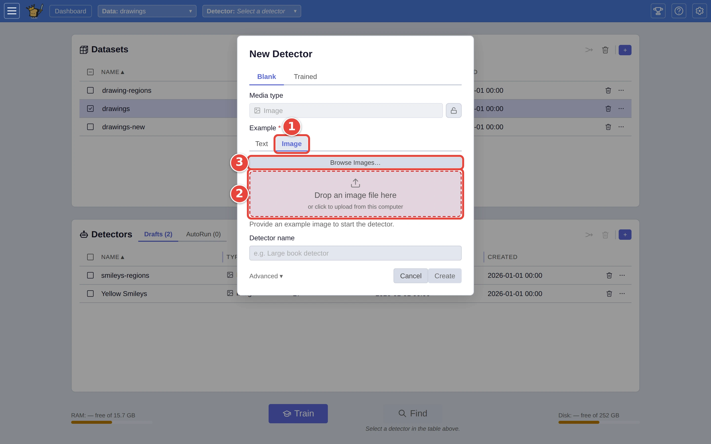
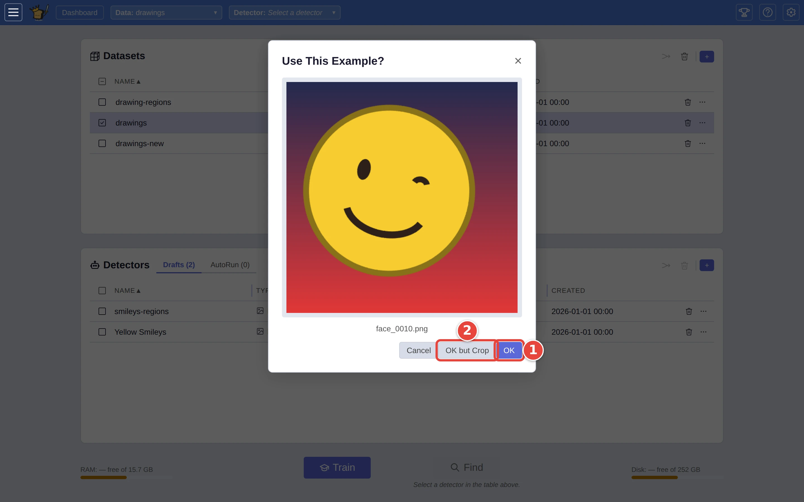
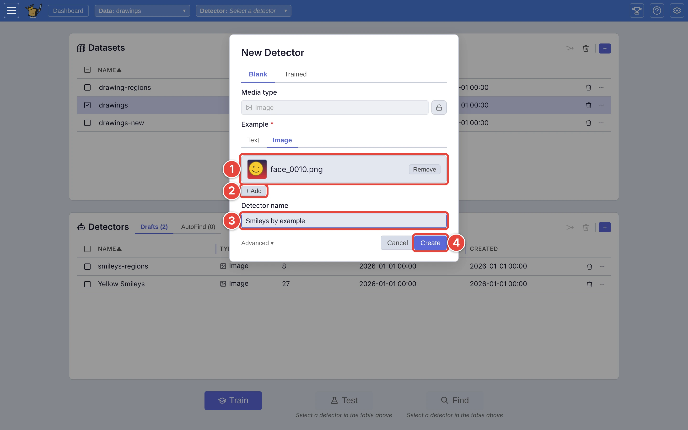
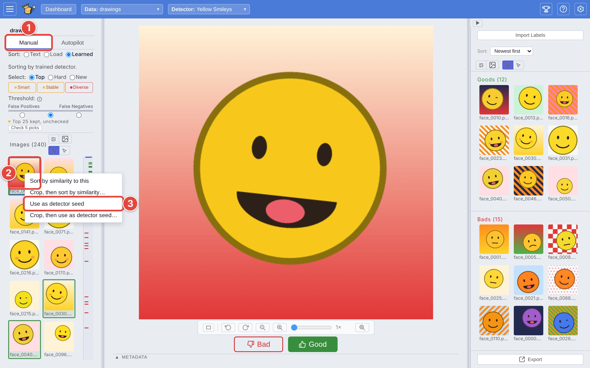

# Start a detector from an example picture

Some things are easier to show than to describe. Instead of typing what you
are looking for, you can hand a new detector a picture of it. The picture
gives the detector its starting point and counts as its first **Good**
answer.

This page uses the drawings from [Step by step: your first search](../USER_GUIDE.md#step-by-step-your-first-search):
the `drawings` dataset, and one yellow smiley from it to start from. The red
numbers in each screenshot show where to click, in order.

## Step 1: Open New Detector on the example's tab

On the dashboard, tick the dataset you will train on (`drawings`), then click
the **+** <picture><source media="(prefers-color-scheme: dark)" srcset="../assets/icon-new-detector.dark.webp" /></picture> at the top right of the **Detectors** card. In the **New
Detector** dialog:

1. Under **Example**, click **Image**, the tab next to **Text**. It is named
   for the dataset's kind of media.
2. Drag a picture from your computer onto the box that reads *Drop an image
   file here*, or click the box to pick one.
3. Or click **Browse Images…** to take one from somewhere else: a file on the
   server, an address on the web, or a demo dataset.

<picture>
  <source media="(prefers-color-scheme: dark)" srcset="../assets/example-image-tab.dark.webp" />
  
</picture>

## Step 2: Confirm the picture

VTSearch shows the picture and asks **Use This Example?**

1. Click **OK** to use the whole picture.
2. Or click **OK but Crop** to draw a box round just the part that matters,
   then **Apply crop**.

<picture>
  <source media="(prefers-color-scheme: dark)" srcset="../assets/example-confirm.dark.webp" />
  
</picture>

Crop when the picture holds more than the thing you are after: a yellow smiley
in a busy scene, say. Otherwise the detector also learns from everything
around it.

## Step 3: Add more examples, name it, create it

1. The picture joins the list of examples. **Remove** takes one out again.
2. **+ Add** adds another. Several examples work better than one: the
   detector starts from what they have in common.
3. The **Detector name** starts as the picture's file name; give it a name
   that says what it finds, such as `Smileys by example`.
4. Click **Create**.

<picture>
  <source media="(prefers-color-scheme: dark)" srcset="../assets/example-stack.dark.webp" />
  
</picture>

Only the first example can come from your own computer. **+ Add** offers the
other places: a file on the server, an address on the web, or a file inside a
demo dataset.

A detector starts from words *or* from pictures, not both: typing a
description on the **Text** tab clears the pictures, and adding a picture
clears the description.

## Step 4: Train it

Tick the dataset and the new detector and click **Train** <picture><source media="(prefers-color-scheme: dark)" srcset="../assets/icon-train.dark.webp" /></picture>, as in
Step 2 of the first search. Autopilot sorts the dataset by how closely each
picture resembles your examples, and each example already counts as a
**Good** answer: with three or more, Autopilot skips straight to asking for
**Bad** ones.

## Or: start from a picture already in the dataset

While training any detector, you can turn a picture you are looking at into
the seed of a new one:

1. In the labeling view, click the **Manual** tab on the left.
2. Right-click a picture in the list.
3. Click **Use as detector seed**, or **Crop, then use as detector seed…** to
   trim it first.

<picture>
  <source media="(prefers-color-scheme: dark)" srcset="../assets/example-seed-menu.dark.webp" />
  
</picture>

The **New Detector** dialog opens with the picture already added. Carry on from
Step 3.

The right-click menu is only on the **Manual** tab's list. If your list is set
to *hover* focus (see [View options](../USER_GUIDE.md#view-options)), a
right-click votes **Good** instead of opening the menu.

## Where next

- [Point at the part of the picture that matters](vote-on-a-region.md): teach
  the detector *where* in a picture the match is.
- [Creating a detector](../USER_GUIDE.md#creating-a-detector), in the user
  guide.
