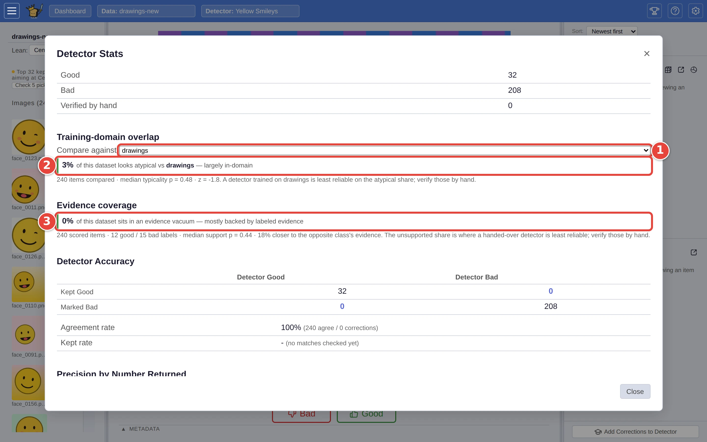

# Decide how far to trust a detector

A detector is only as good as the examples it learned from. Point it at
pictures unlike any of them and it still gives an answer for every one; it
just has nothing to base it on. The result pane in Find answers two
questions before you rely on it: how right its line is on *this* collection,
measured on pictures you answered yourself, and how often it is calling
pictures it has never seen the like of, so you know which calls to check by
hand.

This page picks up where [Step by step: your first search](../USER_GUIDE.md#step-by-step-your-first-search)
ends: the `Yellow Smileys` detector, trained on `drawings`, has just been run
over `drawings-new` with **Find**. It is at its most useful for a detector
someone *else* trained, since you don't know what that one has seen. The red
numbers in each screenshot show where to click, in order.

## Step 1: Test the line

Find opens on its **Autopilot** tab, which shows you pictures picked at random
from either side of the line, a round of five at a time. Answer each with
**Good** <picture><source media="(prefers-color-scheme: dark)" srcset="../assets/icon-good.dark.webp" /></picture> or **Bad** <picture><source media="(prefers-color-scheme: dark)" srcset="../assets/icon-bad.dark.webp" /></picture> (or `→` / `←`) until the
phases on the left read **Done!**: first **Check the matches** (pictures
above the line), then **Check the misses** (below it). A few dozen answers
is usual. The ranges on the right narrow as you go.

## Step 2: Read the two trust checks

With the verdict up, two checks below it say how far the result carries:

1. **Compare against**: pick the dataset the detector was trained on
   (`drawings` here). VTSearch can't tell which one that was, so it asks.
2. **Training-domain overlap** says how much of *this* dataset looks unlike
   the one you picked: here "**3%** of this dataset looks atypical vs
   **drawings** — largely in-domain".
3. **Evidence coverage** says how much of the dataset the detector is calling
   with no labelled example anything like it behind the call: here "**0%** of
   this dataset sits in an evidence vacuum — mostly backed by labeled
   evidence".

<picture>
  <source media="(prefers-color-scheme: dark)" srcset="../assets/trust-stats.dark.webp" />
  
</picture>

The two checks answer the same question from different ends:

- **Training-domain overlap** compares the *pictures*. It needs the training
  dataset loaded, and it only lists datasets set up with the same embedder as
  this one; if there are none, the section is not shown. A large share means
  the detector is being asked about a different kind of picture from the
  ones it was trained on (domain shift).
- **Evidence coverage** compares the *detector's own examples* with this
  dataset, so it works even when you don't have the training data. A large
  share means many calls are guesses.

The verdict after each figure (*largely in-domain* or *likely domain shift*;
*mostly backed by labeled evidence* or *often calling without support*) is
VTSearch's reading of it. The line under each gives the numbers behind it.

## Step 3: Read what the picks said

Above the trust checks, the result reads the picks:

- **Right**: of the pictures the line keeps, the likely share that are
  matches, as a range; the picks above the line measured it.
- **Found**: of all the matches in the collection, the share the line keeps,
  in words; the picks below the line measured it, read against the
  detector's own estimate of what the deepest part of the list holds.
- **Balance (F-beta)**: the two weighed the way your Threshold weighs them.
- **Your checks** sets the detector's calls against your answers: matches you
  both agree on, wrong matches you took out, matches the detector missed and
  you rescued, and the agreement rate over the whole collection.

The ranges come from the random picks alone, never from the pictures the
detector chose to show you, which is what makes them honest about the
collection as a whole.

## Step 4: Act on it

- **Both shares small, the ranges high**: trust the unchecked calls. **Move
  to AutoRun** puts the detector on your AutoRun list, to ship its matches
  from every dataset like this one; or send these matches on
  ([Send your matches somewhere](export-matches.md)).
- **A range too low for what you will do with the matches**: **Lean the
  Threshold** shows what each balance would ship on this collection, from the
  same picks; pick one, and test again.
- **A large share atypical, or in an evidence vacuum**: the detector needs
  examples from this kind of picture. **Add Corrections and retrain** hands it
  the picks you disagreed with, and the pictures you check by hand on the
  **Review** tab; then run Find again
  ([Check and correct a detector's calls](check-and-correct.md)). That
  teaches it more than moving the Threshold would.

Whichever you pick, the verdict stays with the detector: its **Stats** list it
under *Tested on*, and the Dashboard's AutoRun tab shows the latest under its
name, marked *out of date* once it is retrained. Test the same collection again
later, with nothing retrained, and the test resumes from the picks you already
took.

There is no way to list just the flagged pictures: the figures are a count,
not a selection. The pictures nearest the detector's line are the ones to
check first.

## Where next

- [Catch the borderline matches](borderline-matches.md): the precision chart
  in the same pane.
- [How far to trust the score](../USER_GUIDE.md#how-far-to-trust-the-score),
  in the user guide.
