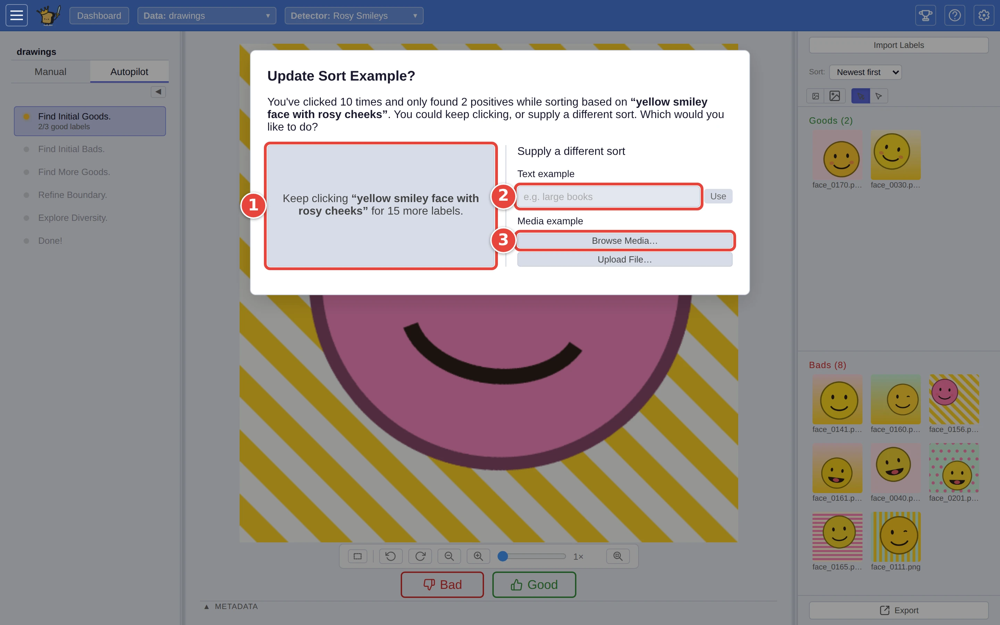

# Get Autopilot unstuck

Autopilot's first job is finding a few matches to learn from. It starts from
your description, and usually that works. When the thing you want is rare, or
your words fit a lot of near-misses too, the pictures it offers keep being
wrong. After a while it stops and asks whether to carry on or try another way
in. This page walks through both answers, and a way to steer it yourself.

The example is a detail in the drawings from
[Step by step: your first search](../USER_GUIDE.md#step-by-step-your-first-search):
only the yellow smileys with *rosy cheeks*. There are 8 among the 240
`drawings`. A new detector described as `yellow smiley face with rosy cheeks`
finds yellow smileys easily, but its first ten picks include only two with
the cheeks, so most of what Autopilot shows is **Bad**. The red numbers in each
screenshot show where to click, in order.

## When Autopilot asks

While Autopilot is in its first phase, **Find Initial Goods**, it counts your
answers. After ten without enough matches (three, by default), it shows
**Update Sort Example?**. One line reads out where the sort stands: how many
pictures you have answered (**Clicked**), how many were matches
(**Positives**), and what it has been sorting by (**Sort**). Toasty, below the
dialog, says how many matches Autopilot needs before it trains, and what you
can do about it.

1. **Continue**, under **Keep clicking:**, carries on with the same sort for a
   while longer. Pick it if the matches are there but few, and you would rather
   keep going.
2. **Supply a different sort:** type a new description under **Text
   example** and click **Use**,
3. or pick a picture that looks like what you want, with **Browse Media…**
   (from a file on the server, an address on the web, or a demo dataset) or
   **Upload File…** (from your computer).

<picture>
  <source media="(prefers-color-scheme: dark)" srcset="../assets/unstick-prompt.dark.webp" />
  
</picture>

A new description or picture re-sorts the dataset straight away, and
Autopilot carries on from it. It lasts for this session only: the
detector's own description stays as it was. If you keep clicking, Autopilot
waits half as long again before asking a second time.

When words aren't getting there, try a picture: a rosy-cheeked smiley as the
example shows the detail instead of naming it.

## Steer it yourself

You can't type into Autopilot, but you can step out, find a few matches your
own way, and step back in:

1. Click the **Manual** tab on the left. Autopilot pauses.
2. Find some matches: pick **Text** and search with other words, or right-click
   a picture that is close and choose **Sort by similarity to this**. See
   [Label in Manual mode](label-in-manual-mode.md).
3. Answer **Good** on a few real matches (three is enough to move on).
4. Click the **Autopilot** tab. It counts the answers you gave and picks up in
   the phase they have earned.

The number of answers before the prompt appears is **# Start to re-sort**,
under **Autopilot** in Settings <picture><source media="(prefers-color-scheme: dark)" srcset="../assets/icon-settings.dark.webp" /></picture>. The prompt only appears for a new
detector: one that already has both **Good** and **Bad** answers is being
refined, not started.

## Where next

- [Start a detector from an example picture](start-from-an-example.md):
  begin from a picture in the first place.
- [Autopilot: the guided workflow](../USER_GUIDE.md#autopilot-the-guided-workflow),
  in the user guide.
