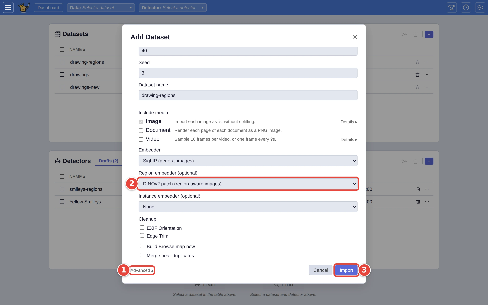
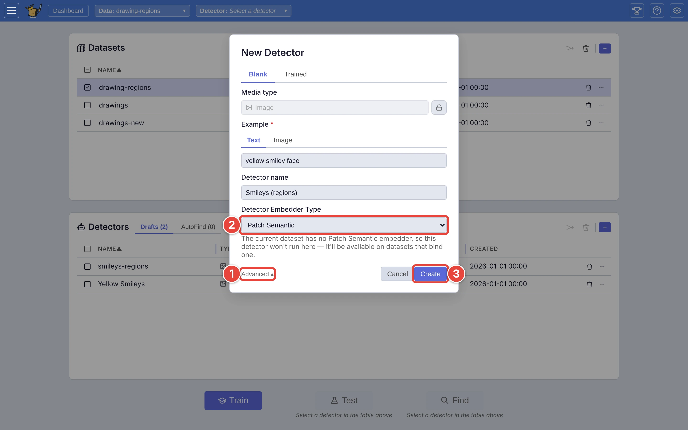
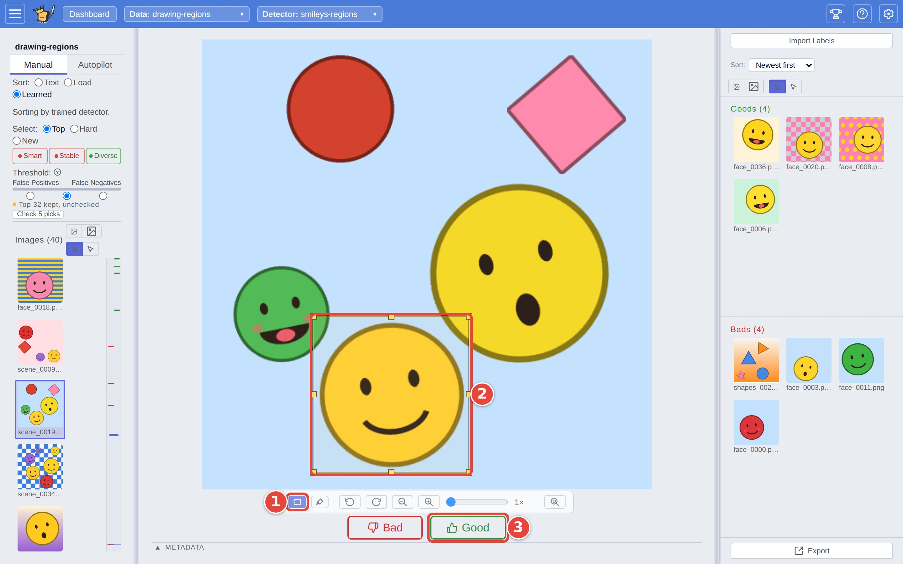

# Point at the part of the picture that matters

A plain **Good** tells the detector "this picture is a match", but not which
part of the picture made it one. When what you are after is a small part of a
busy picture, such as one yellow smiley in a scene full of faces and shapes,
you can draw a box round it as you vote. The detector then learns from what is
inside the box, and looks for the same thing anywhere in other pictures.

Region voting works on image datasets set up for it, with a detector that uses
regions. This page sets up both, on a small pile of the drawings from
[Step by step: your first search](../USER_GUIDE.md#step-by-step-your-first-search).
The red numbers in each screenshot show where to click, in order.

## Step 1: Make a dataset that can see regions

Click the **+** <picture><source media="(prefers-color-scheme: dark)" srcset="../assets/icon-add-dataset.dark.webp" /></picture> on the **Datasets** card. In **Add Dataset**, click
**Demo**, then **Synthetic Media**, and set **Size** to 40, **Seed** to 3 and
**Dataset name** to `drawing-regions`. (For pictures of your own, use
**Files** and **Folder** as in the first search; the rest is the same.) Then:

1. Click **Advanced ▾**, at the bottom left beside **Cancel**.
2. Set **Region embedder (optional)** to **DINOv2 patch (region-aware
   images)**.
3. Click **Import**.

<picture>
  <source media="(prefers-color-scheme: dark)" srcset="../assets/region-import.dark.webp" />
  
</picture>

The region embedder is a second model that looks at each part of a picture
separately. It is set when a dataset is made and can't be added later, so
choose it now if you might want region voting. The first import with it
downloads the model once.

## Step 2: Make a detector that uses regions

Tick `drawing-regions` on the dashboard and click the **+** <picture><source media="(prefers-color-scheme: dark)" srcset="../assets/icon-new-detector.dark.webp" /></picture> on the
**Detectors** card. Describe what you are looking for (`yellow smiley face`)
and name the detector (`Smileys (regions)`), then:

1. Click **Advanced ▾**, at the bottom left beside **Cancel**.
2. Set **Detector Embedder Type** to **Patch Semantic**.
3. Click **Create**.

<picture>
  <source media="(prefers-color-scheme: dark)" srcset="../assets/region-new-detector.dark.webp" />
  
</picture>

**Patch Semantic** is the part people miss. A dataset with a region embedder
offers more than one kind of detector, and the one you get if you leave this
alone is **Semantic**, which looks at whole pictures only: it stores your
boxes but learns nothing from them. The choice is fixed once the detector is
made.

## Step 3: Draw a box and vote

Tick the dataset and the new detector and click **Train** <picture><source media="(prefers-color-scheme: dark)" srcset="../assets/icon-train.dark.webp" /></picture>. When a
picture with a match in it comes up:

1. Click the **Marquee** button (the dashed rectangle) in the controls under
   the picture. It stays on from picture to picture until you click it again.
2. Drag a box round the match. Drag its handles or its middle to adjust it.
3. Click **Good** (or press `→`). The vote carries the box.

<picture>
  <source media="(prefers-color-scheme: dark)" srcset="../assets/region-draw.dark.webp" />
  
</picture>

Holding `Shift` while you drag draws a box without turning **Marquee** on. You
can start the drag in the empty space beside the picture, which helps with a
match right at its edge. `Esc` clears the box without voting.

Pictures with no match in them get a plain **Bad**, box or no box: a Bad
means "nothing in this picture is a match". If a box is drawn when you press
`←`, VTSearch asks first, since drawing it was work: press `←` again to vote
Bad and discard the box, or `Esc` to keep the box.

## Step 4: See where the detector is looking

Once the detector has learned from a few boxes, turn on **Highlight**, next to
**Marquee** under the picture. For each picture it outlines the part the
detector matched best, which shows whether it has learned the thing you boxed
or something that tends to sit next to it. It has something to show once the
list is sorted by the detector (the **Learned** sort, which Autopilot moves
to on its own after the first few answers).

## Where next

- [Region voting on images](../USER_GUIDE.md#region-voting-on-images), in the
  user guide.
- [Start a detector from an example picture](start-from-an-example.md): crop
  the example to the part that matters.
