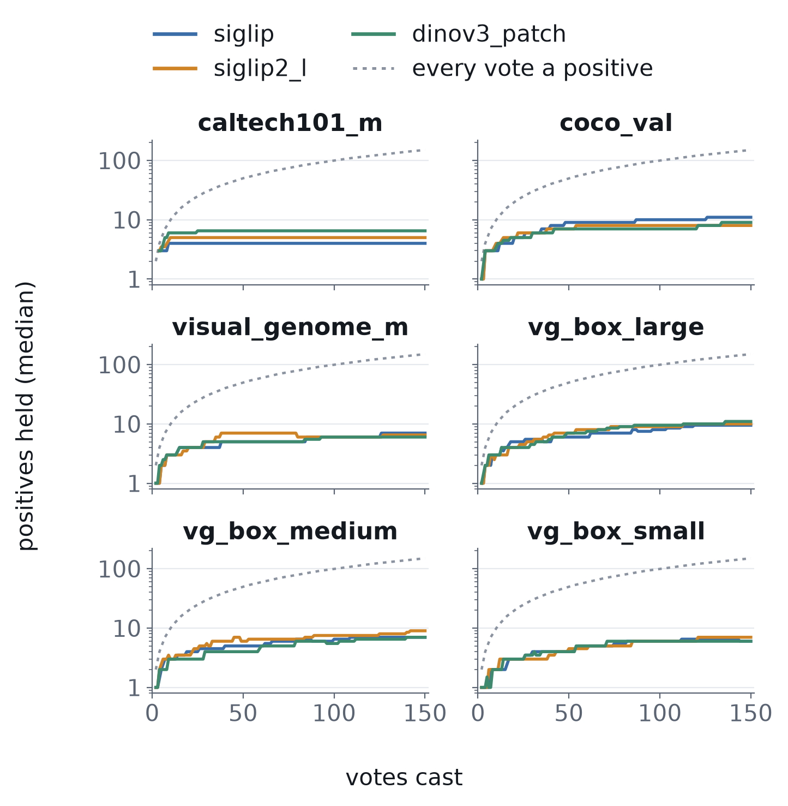
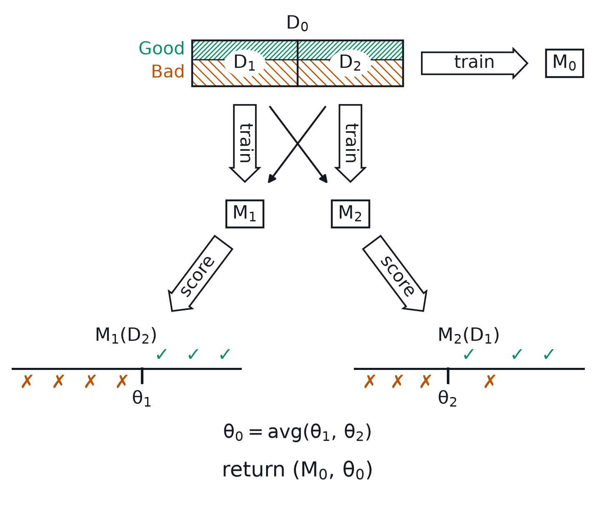

# VTSearch slide decks

Text-based slides, so git can actually version them. Slides live as individual
markdown fragments in `slides/fragments/`; a deck is a manifest in
`slides/decks/` that names fragments in order. Re-tailoring a talk for a new
audience means writing a new manifest, not copying a deck.

```
fragments/  one fragment per slide — the reusable library
decks/      *.deck manifests: front matter + an ordered list of fragments
figs/       committed PNG/SVG figures (figs/src/ holds their generators)
themes/     vtsearch.css — the Marp theme
_build/     assembled markdown (gitignored)
_out/       rendered decks (gitignored)
```

`build.py --check` runs as a `./run-tests.sh` gate, so a deck that names a
missing fragment or figure fails the suite rather than rotting quietly.

**Test a deck change with `./run-tests.sh slides`** — about four seconds, versus
three and a half minutes for the full suite. It is not a shortcut you are
trading safety for: it runs every gate that can observe a deck (ruff over
`build.py`, codespell over slide prose, `check-docs.py` over the fragments, and
the manifest preflight) and skips only checks that provably cannot see one —
nothing imports `build.py`, pyright does not read it, and no test in either tree
opens a deck. For a change confined to `slides/` it is the whole gate, and it
refuses to run once the branch touches anything else, so it cannot quietly
become one.

**Read [`STYLE.md`](STYLE.md) before writing or editing a deck.** It holds the
house rules that apply to every talk — no running footer, real subscripts,
colour reserved for meaning, the 20px type floor, and the opening outline
slide. This file is the mechanics; that one is the choices.

## Build

Needs node and python3. Nothing to install — `npx` fetches Marp on first run
(~1 min, once). Run from this directory:

```bash
./render.sh hold-the-line           # -> _out/hold-the-line.pdf
./render.sh hold-the-line html      # or html / pptx
./render.sh hold-the-line pdf --speaker  # -> _out/hold-the-line.speaker.pdf
./build.py --check                  # preflight all manifests, build nothing
./build.py --list                   # decks, slide counts, unused fragments
```

There's also a `Makefile` (`make`, `make FMT=html`, `make watch DECK=…`) but
**`make` is not installed on the laptop** — `render.sh` is the working path
here. The Makefile is for the grid or wherever make exists.

For live preview while writing:

```bash
./build.py hold-the-line
npx @marp-team/marp-cli@4 _build/hold-the-line.md \
    --theme-set themes/ --allow-local-files -w --preview
```

If Marp can't find a browser (it drives one to rasterise), point it at one:
`CHROME_PATH=/path/to/chrome ./render.sh <deck>`.

## Writing a slide

Copy `slides/fragments/_template.md`. Keep it short — if a slide needs more
than ~25 words it wants to be two slides or a figure.

Every deck opens with its own outline fragment (`fragments/outline-<deck>.md`,
`<!-- _class: outline -->`) right after the title slide; see
[`STYLE.md`](STYLE.md).

Layout is a background-image directive, which is why placement survives in
version control as a diffable line rather than a repacked binary:

```markdown


### Finding 2
## Positives are the binding constraint

- After **150 votes**: a median of only **4–11** positives
```

Figure paths are written relative to `slides/`, not to the fragment — `build.py`
repoints them when it assembles into `_build/`.

`bg right:56%` puts the figure in the right 56% of the slide; `left:` mirrors
it; plain `![bg fit]` goes full-bleed. **56% is the standard and every sidebar
figure uses it** — the generators size figures to that slot's 717x720 box and
check their type against it, so a one-off `54%` quietly changes what the check
was measuring. Classes `lead`, `statement`, `outline`, `full`, and `caveat` are
defined in the theme and set per-slide with `<!-- _class: full -->`.

Any HTML comment that isn't a Marp directive becomes a **presenter note** —
visible in `--preview` and exported into PPTX/HTML notes, not on the slide.
Write them as real speaking notes: wordier than the slide, covering what to
say, not just provenance.

PDF has no native speaker view, so there are two renderers for the same deck.
The plain build ignores the notes; the **speaker build**
(`./render.sh <deck> pdf --speaker`) produces `_out/<deck>.speaker.pdf` beside
the audience `_out/<deck>.pdf`, PowerPoint notes-page style: each page shows a
miniature of the real rendered slide (pixel-identical — it *is* a PNG of the
audience deck, rendered in a first pass) with that slide's notes beside it.
Same fragments, same manifest — the notes are authored once, as comments.

**Never put a bare `---` in a fragment**: Marp reads it as a slide break and
would silently split one slide into two. `build.py` errors on it. Use `***`
for a horizontal rule.

## Builds (progressive reveal)

PDF has no animation, so a slide that should assemble step by step is printed
as a **series of pages**. Author the fragment as the *final* slide — the
complete figure, the full bullet list — then chop it with build markers where
the reveals go:

```markdown


## Cross-calibration

<!-- build: figs/calib-xcal-flow.build1.png -->

- Split the votes in half; train a model on each half

<!-- build: figs/calib-xcal-flow.build2.png -->

- Each model scores the half it **never saw**
```

Each marker becomes one earlier page in the audience deck: the content above
the marker, with the slide's figure swapped for the marker's stage figure.
The full fragment renders last. A bare `<!-- build -->` chops without
swapping the figure (a text-only reveal); back-to-back markers advance the
figure without revealing another bullet. The whole progression shares one
page number (`_paginate: hold`), so "the slide with the mixture plot" still
names one slide, and every page of the group gets the theme's top-anchoring
`build` class — a reveal adds ink below what is already on screen, rather
than re-centring the column between pages.

The **speaker build is untouched**: one page per fragment, showing the final
stage beside the notes — the speaker narrates from the complete picture and
just keeps advancing. Markers never leak into presenter notes.

Stage figures are committed like any other figure, named
`<figure>.buildN.png` beside their final `<figure>.png`, and generated by the
same generator: draw cumulatively (stage *k* = the first *k* steps on the
same canvas) and save every stage through `slide_figure.tight_box(final)` so
all stages share the final stage's crop — otherwise each stage would be
cropped to its own ink and the drawing would jump between pages instead of
assembling in place. `xcal_flow_fig` in `slides/figs/src/make-calib-figs.py`
is the worked example. `build.py --check` verifies every marker's figure
exists, like any other figure reference.

## Variants

For a slide that needs an audience-specific cut, add a suffix rather than
branching the deck: `foo.md` and `foo.short.md` are both fragments, and each
manifest picks the one it wants — which is how one library serves a 25-minute
talk and a 5-minute one without either deck owning a slide. Comment a line out
of a manifest with `#` to park a slide without losing it.

## Figures

Commit them. That is deliberate: a re-rendered figure costs one ~150 KB blob,
and only when *that figure* changes — editing slide text touches nothing but a
few KB of markdown. This is the property a `.pptx` lacks, where every edit
rewrites the whole archive.

- **PNG for data-heavy plots.** An SVG scatter of 26 000 points is one
  `<circle>` per point — far larger than the PNG, and it diffs as a single
  enormous line anyway.
- **SVG for diagrams** with a few dozen shapes: smaller, and genuinely
  diffable.
- Iterate in the working tree and `--amend` while a figure is still ugly, so
  only the final render becomes permanent history.

A figure generated from code keeps that code beside it in `figs/src/`, so the
plot can be regenerated when the underlying numbers move —
`slides/figs/src/make-calib-figs.py` is the worked example. Save through
`slide_figure.save()` rather than `fig.savefig`: it enforces the type floor
(see [`STYLE.md`](STYLE.md)) and refuses to write a figure whose labels would
be unreadable in its slot.

**Screenshots of the app are generated too.** `figs/ui-three-panel.png` and
`figs/ui-region-voting.png` come from `figs/src/shoot-ui-figs.mjs`, which builds
a corpus of real photographs out of the Caltech-101 download, trains a detector
on cats by voting, and drives headless chromium:

```bash
cd scripts/screenshots && npm install     # once — playwright lives here
node ../../slides/figs/src/shoot-ui-figs.mjs
```

Every step is idempotent, so a re-run after a GUI change is just the captures.
It deliberately does **not** reuse the docs shots in
`docs/user/screenshots.manifest.ts`: those are taken against the synthetic
`syn-imgs` fixture because the user guide walks the reader through that dataset,
and a slide is the audience's first sight of the tool, where flat coloured
shapes make the product look like a toy. **A GUI change that moves the docs
screenshots moves these too** — reshoot both, or the deck keeps showing an app
that no longer exists.

**Never drop a report figure straight onto a slide.** It was sized for a page,
and in a slide slot its labels land around 8px. `slides/figs/src/make-bench-figs.py`
is the worked example of the alternative: it reads the plotted series back out
of the committed report SVGs (`slides/figs/src/report_svg.py`) and redraws them
at slide scale, so the slide and the report cannot disagree about a number. Generators may
import `vtscore` directly (they run from a checkout that has it), which is what
lets a mechanism figure plot the *shipped* estimator rather than a redrawing of
it. matplotlib is already a project dependency, so a normal checkout install
runs them; if a generator ever wants something more exotic, install it ad hoc
rather than adding it to `requirements/` for a figure's sake.

## Exporting to PowerPoint

`make FMT=pptx` produces one full-slide image per slide — fine for handing over
a read-only deck, not editable. Marp's `--pptx-editable` emits real shapes but
needs LibreOffice installed. If a co-presenter must edit slides in PowerPoint,
export once at the end and don't commit the result.
